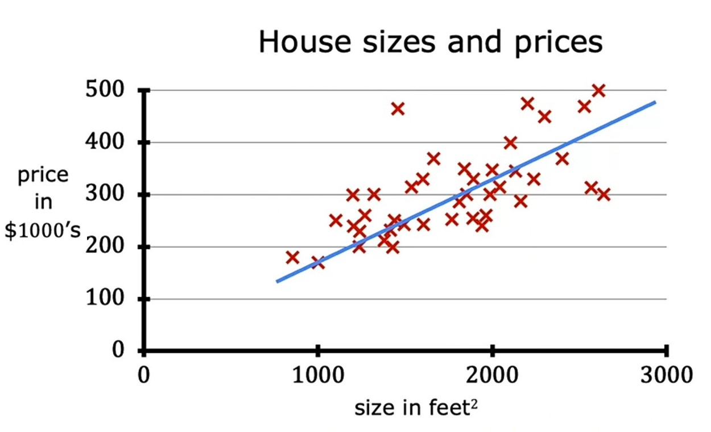
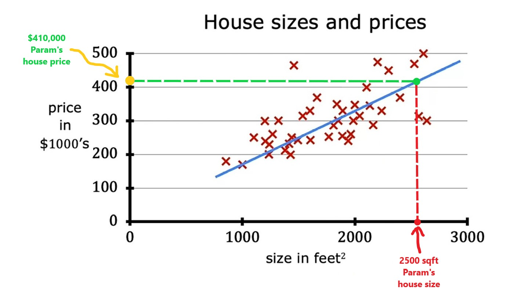
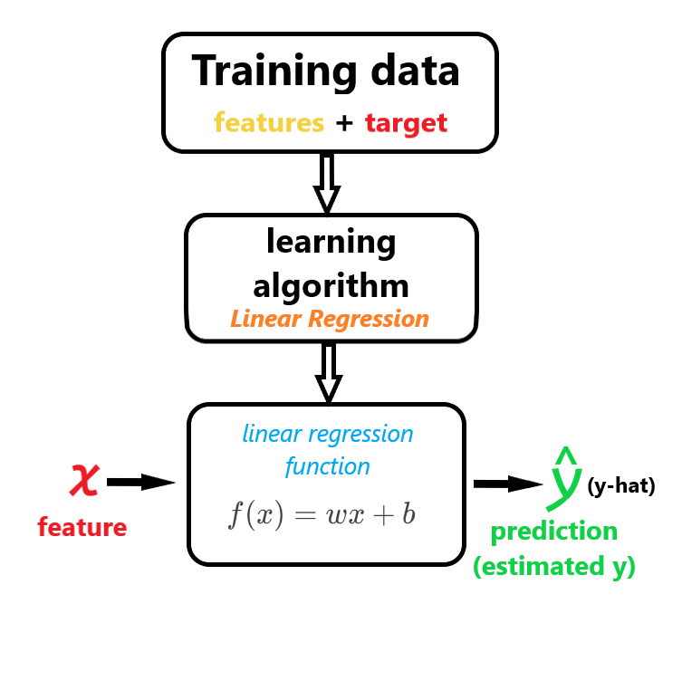
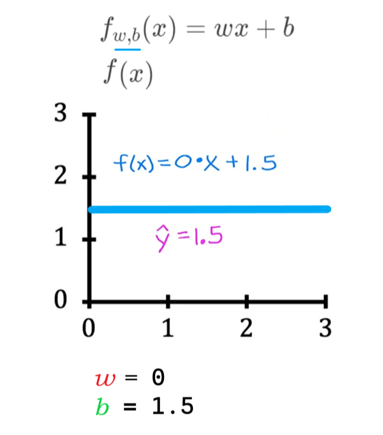
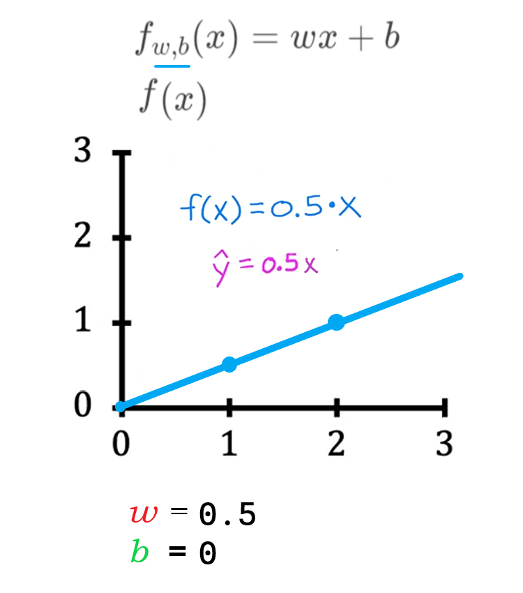
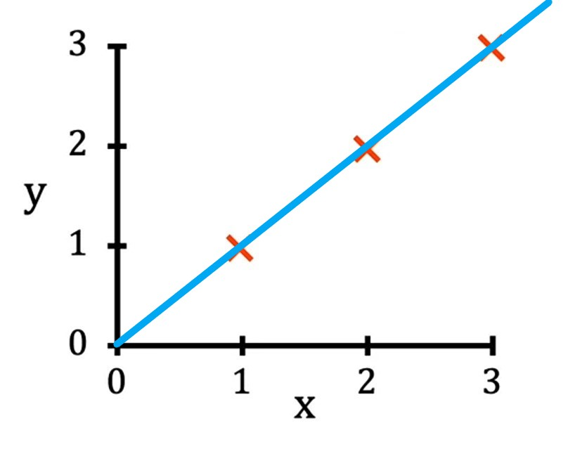
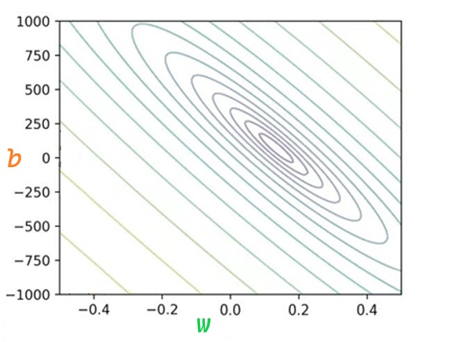
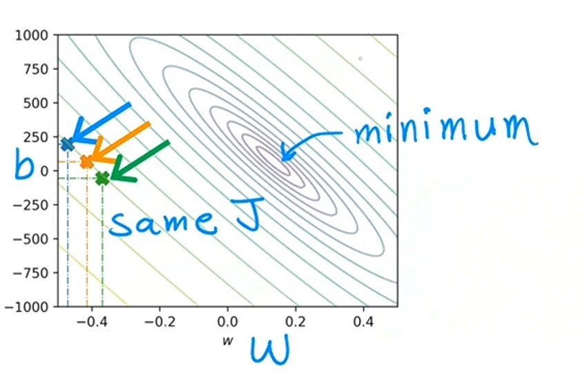
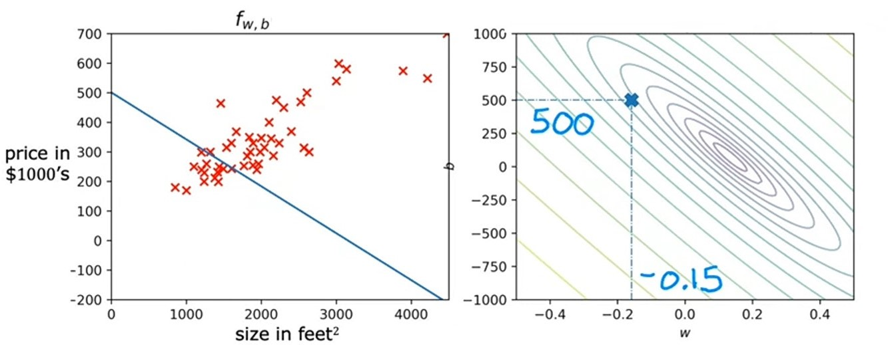

# Week 1 - Intro to Machine Learning

## Ch 3: Regression Model

### Linear Regression model

> Linear Regressor model means fitting a straight line to your data. ~ *Andrew Ng*

> Linear Regression is a **linear model**, e.g. a model that assumes a linear relationship between the input variables (`x`) and the single output variable (`y`). ~ *Jason Brownlee* ([Machine Learning Mastery](https://machinelearningmastery.com/linear-regression-for-machine-learning/#:~:text=Linear%20regression%20is%20a%20linear%20model%2C%20e.g.%20a%20model%20that%20assumes%20a%20linear%20relationship%20between%20the%20input%20variables%20(x)%20and%20the%20single%20output%20variable%20(y).))

> Linear Regression model is a particular type of supervised learning model. It's called **regression** model because it predicts numbers as the output like prices in dollars.
> 
> Any supervised learning model that predicts a number such as `238,000` or `3.68` or `-14.6` is addressing what's called a *regression problem*. ~ *Andrew Ng*

So, *Linear Regression* model is a **supervised learning** model which predicts the single output data (`y`) by fitting the input data (`x`) into a straight line in a graph.

Example:
- If we've measured the size of a house which *Param* wants to sell, and the size is `2500` square feet.
- So now, we will mark `2500` on **x-axis**, i.e. on house size in square feets.
- And draw a straight line from that mark till the *regression* line.
- Now, we will draw another straight line, this time from the point where vertical line intersects with *regression* line to the **y-axis** i.e. on house price in `$1000`.
- And mark the point where that line intersects with **y-aixs**. That point is the price of *Param*'s house i.e. 

----

### How `linear regression` works

> To Train the **model**, you feed the **training dataset**, both the input `features` and the `output` targets to your learning algorithm (*linear regression*). Then your supervised learning algorithm will produce this function.
> $$f(x) = wx + b$$
> or more precisely, this
> $$f_{w,b}(x) = wx + b$$
> Here, `f` in lowercase, stands for function.
> 
> The job of this function is to take a new input `x` and output a estimate or a prediction, which is `ŷ` (y-hat). This function is called the **model**.
> 
> `x` is the input feature in the model and output is the prediction of the model i.e. `ŷ` (y-hat). Here, `ŷ` is the estimated value of `y`. ~ *Andrew Ng*

- In above image, the **Regression line** is that function.

> This `linear regression` model has `1` feature, so we call it **Linear Regression with one variable**, where the one varible means that therere's a single input variable or feature `x`, i.e. the size of the house. ~ *Andrew Ng*
> 
> Another name for a `linear model` with `one input` variable is **Univariate linear regression**, where *uni* means *one* in latin, and *variate* means *variable*. ~ *Andrew Ng*

----

#### Jupyter Lab [optional] [🔗](./../codes/W1%20-%20L2%20-%20Model%20Representation%20%5Boptional%5D.ipynb)

----

### Cost function

$$J(w,b) = \frac{1}{2m} \sum\limits_{i = 1}^{m} (ŷ^{(i)} - y^{(i)})^2$$ 

> The **cost function** tell us how well the model is doing. ~ *Andrew Ng*

#### Why to use cost function
To determine the error(difference) in predicted value and actual value, we use cost function.

> In **linear regression** function $f_{w,b}(x) = wx + b$, the `w` and `b` are called *parameters* of the model. 
> 
> In machine learning *parameters* of the model are the *variables* you can adjust during training in order to improve the model.
> These parameters are also known as *weights* or *coefficients*. ~ *Andrew Ng*

These **weights** help us to determine the best fit of *regression line* in our **linear regression** model, so that it can predict the best value for our **target** variable.

Let's see the `regression line` with different values of `w` and `b` in *linear regression* function:
|                 | 1                    | 2                     | 3                   |
|-----------------|:--------------------:|:---------------------:|:-------------------:|
| **Weights**         |`w = 0` and `b = 1.5` | `w = 0.5` and `b = 0` | `w = 0` and `b = 1` |
| **Regression line** |  |  |  |

Now, let's examine the *training set*:

1. In *training set*, with **linear regression** we want to choose values for the parameters `w` and `b` which can fits the **regression line** on data perfectly.
2. The *regression line* is formed by the function $f_{w, b}$
3. `i` is the index / specific row of *training data*.
4. `x``(i)` on `x-axis` is the feature i.e. *house size*.
5. `y``(i)` on `y-axis` is the target variable i.e. *house price*.
6. `x` markers in the graph are `i`th training row i.e. (x(i), y(i)).
7. For a given input `x``(i)` the function $f_{w, b}$ makes a predictive value for `y` i.e. `ŷ` on `y-axis` of graph.
8. But the actual `y` value makes some difference with `ŷ` value.
9. That difference is **ERROR** in our function $f_{w, b}$

- So, to determine the best value for `w` and `b` so that it can fit the `regression line` accurately on data, we use **cost function**.

----

#### Formula of Cost function
1. First, we will subtract actual value `y` from predicted value `ŷ` (the difference is called **ERROR**) and then square the **ERROR**. 
$$(ŷ - y)^2$$
2. We will compute this error for each training example i.e. each `i``th` index.
$$(ŷ^{(i)} - y^{(i)})^2$$
3. And we will sum up the error
$$\sum(ŷ^{(i)} - y^{(i)})^2$$
4. We are starting from 1st training example, where `i = 1`
$$\sum_{i = 1}(ŷ^{(i)} - y^{(i)})^2$$
5. And, we will calculate it upto `m`, i.e. total number of training examples.
$$\sum\limits_{i = 1}^{m}(ŷ^{(i)} - y^{(i)})^2$$
6. To compute the cost function whose value doesn't get bigger automatically, we will take average of `m` by dividing it with `1`.
$$\frac{1}{2m} \sum\limits_{i = 1}^{m}(ŷ^{(i)} - y^{(i)})^2$$
7. We are dividing `1` by `2m` instead of `m` so that the cost function doesn't depend upon the number of training examples, this helps us in better comparison.
8. We will refer to this expression to $j(w, b)$ eventually, we will find out the best values for our weights `w` and `b`.
$$j(w, b) = \frac{1}{2m} \sum\limits_{i = 1}^{m}(ŷ^{(i)} - y^{(i)})^2$$
9. And we know that, `ŷ` is the predicted value of function $f_{w, b}(x)$, so will substitute it.
$$j(w, b) = \frac{1}{2m} \sum\limits_{i = 1}^{m}(f_{w, b}(x^{(i)}) - y^{(i)})^2$$
10. And, our **Cost Function** is ready and this cost function is known as **Squared error cost function**.

> So, formula of **Squared error cost function** is:
> $$j(w,b) = \frac{1}{2m} \sum\limits_{i = 1}^{m} (f_{w,b}(x^{(i)}) - y^{(i)})^2$$ 
> where 
> $$f_{w,b}(x^{(i)}) = wx^{(i)} + b$$

----
#### How cost function works

In our cost function $j(w,b) = \frac{1}{2m} \sum\limits_{i = 1}^{m} (f_{w,b}(x^{(i)}) - y^{(i)})^2$ we need to set such values of `w` and `b` which minimizes our $j(w, b)$ function $\min\limits{j(w, b)}_{w, b}$, means we need to make the error as small as possible.

- First, let's focus only on `w` parameter.
- So, now our *linear regression* function will be:
$$f_w(x) = wx$$
- And, our *Squared error cost function* will be:
$$j(w) = \frac{1}{2m} \sum\limits_{i = 1}^{m} (f_{w}(x^{(i)}) - y^{(i)})^2$$ 
- We can also substitue $f_w(x^{(i)})$ with $wx^{(i)}$
$$j(w) = \frac{1}{2m} \sum\limits_{i = 1}^{m} (wx^{(i)} - y^{(i)})^2$$ 

This is our initial graph for  $f_w(x)$ function:

- On `x-axis` we have input variable `x`, and on `y-axis` we have our target variable `y`.

Now, Let's see how our *linear regression* line and *cost function* changes with different values of `w`:

| values       | cost function | Explanation   | linear regression line $f_w(x)$ | cost function graph $j(w)$ |
|:------------:|:--------------|:--------------|:-------------------------------:|:--------------------------:|
| `w = 1`      | $=\frac{1}{2m} [0^2 + 0^2 + 0^2]$ $=\frac{0}{2m}$ $=0$                               | For each value of `i`, `x` and `y` is `1`, `2` & `3`. But `w` remain constant i.e. `1`. So, for $(wx^{(i)} - y^{(i)})^2$, each value will be $(1(x) - y)^2$, and result will be `0`.            |             |  |
| `w = 0.5`    | $=\frac{1}{2m} [0.25 + 1 + 2.25]$ $=\frac{0}{2m} [3.5]$ $=\frac{3.5}{6}$ $={0.58}$    |  For each value of `i`, `x` and `y` is `1`, `2` & `3`. But `w` remain constant i.e. `1`. So, for $(wx^{(i)} - y^{(i)})^2$, each value will be  `x=1`, $(0.5(1) - 1)^2 = (0.5 - 1)^2 = 0.25$ `x=2`,  $(0.5(2) - 2)^2 = (1 - 2)^2 = 1$ and `x=3`, $(0.5(3) - 3)^2 = (1.5 - 3)^2 = 2.25$ and result will be `0.58` approx.            |             |  |
| `w = 0`      | $=\frac{1}{2m} [(1)^2 + (2)^2 + (3)^2]$ $=\frac{0}{2m} [14]$ $=\frac{14}{6}$ $={2.3}$ | For each value of `i`, `x` and `y` is `1`, `2` & `3`. But `w` remain constant i.e. `1`. So, for $(wx^{(i)} - y^{(i)})^2$, each value will be  `x=1`, $(0(1) - 1)^2 = (1)^2$ `x=2`, $(0(2) - 2)^2=(2)^2$ and `x=3`, $(0(3) - 3)^2=(3)^2$ and result will be `2.3` approx.  And because `w=0`, so any value of `x` multiplied by `w` resulted `0`.   Hence, our *regression lin* will be made on `x-axis`.            |             |  |

> So, we have visualized the **cost function** graph with `3` different values of `w`, but if we keep doing this, for different values of `w`. We will end up with a shape like this:

> Hence, choosing `w=1` fits the *regression line* well on our data.

- Let's see how the **Cost function** graph will show with both parameters `w` and `b`.

- This is how our **Cost function** graph will look.
- This is a 3-d *contour plot*, having `3` axis, `x-axis` for `w`, `y-axis` for `b` and `z-axis` for $j(w, b)$

Imagine *contour plot* like a mountain e.g. **Mount Fuji**

- This is a *topographical map* of **Mount Fuji**, the horizontal red lines in this mountain are **contours**.
- If you see this from top, you'll see all the **contours** of same *height*.

- Now, if you cut all the *contours* of 3d-**contour plot** and place them on a single plane, then the 2-d**contour plot** will look like this:

- Here, each oval / line is the contour or the $j(w,b)$ / `z-axis`.
- And on `x-axis` we have `w` parameter, on `y-axis` we have `b` parameter.
- So, now if we choose different `w` and `b` on same oval, then our $j(w,b)$ function will be same, means *cost function* will result the same output.

Here, all these `3` markers have same *cost function* value, because they are plotted on *same height* aka same value of $j(w,b)$.

- So, if we want to minimize our *cost function* here, then the smallest oval or 1st oval in cocentric ovals has minimum value.

- Now, we know what **contour plot** is, and how it works, let's play with `w` and `b` parameters and finds the *regression line* that best fits the data.

| value                         | linear regression function | graph                                                                        |
|:-----------------------------:|:---------------------------|:----------------------------------------------------------------------------:|
| `w = 0.15` `b = 800`      | $f(x) = 0.15x + 800$       |  |
| `w = 0` `b = 360`         | $f(x) = 0x + 360$          |  |
| `w = -0.15` `b = 500`     | $f(x) = -0.15x + 500$      |  |
| `w = 0.13` `b = 71`       | $f(x) = 0.13x + 71$        |  |

- We can clearly see that with values of `w = 0.13` and `b = 71`, our **Squared error cost function** is minimized, means have less error. So, we can use these values for `w` and `b` parameters in our *linear regression* function to make our model best fit to data, and do predictions accurately.
- There are still some *erors* within our *regression line* and *actual data*

- But these are minimal errors that we can have.

----

### Notations in Machine Learning

**Note**: These are just standard names for specific data in **ML**, it is not compulsory to follow these notations.

Example House price data:

1. `Training data` is the data we use to train our model by which our model learns.
2. We use lowercase `x` to denote the input data. Example: `x` is house size.
3. We use lowercase `y` to denote the output variable / target variable. Example `y` is house price.
4. We use lowercase `m` for total number of training data. Example: `m=47`.
5. We use lowercase `x` & `y` in parenthesis or in tuple like `(x, y)` to denote a single training data. Example `(x, y) = (2500, 410)`.
6. To refer a specific training data, we use `x` & `y` same as above in parenthesis or a tuple with **superscripted** `i` to both of them, where `i` is the index to a specific row like (xi, yi). Example: (xi, yi) = (15343, 3153).

| Notation                                 | Meaning                               | Example                                       |
|-----------------------------------------:|:--------------------------------------|:---------------------------------------------:|
| Training data                            | data which our model learns           | house price data                              |
| `x`                                      | input data                            | house size                                    |
| `y`                                      | output / target variable              | house price                                   |
| `m`                                      | total number of training data         | `47`                                          |
| `(x, y)`                                 | single training data                  | `(2500, 410)`                                 |
| `i`                                      | index / row of training data          | `3`                                           |
| (xi, yi)           | `i`th training data        | (15343, 3153)           |
| $f_{w,b}(x) = wx + b$                    | linear regression equation            | -                                             |
| `w, b`                                   | weights of linear regression equation | -                                             |
| $j(w,b) = \frac{1}{2m} \sum\limits_{i = 1}^{m} (f_{w,b}(x^{(i)}) - y^{(i)})^2$ | Squared Error Cost function | -                 |

----

#### Jupyter Lab [optional] [🔗](./../codes/W1%20-%20L3%20-%20Cost%20function%20%5Boptional%5D.ipynb)

----

### Quizzes

#### Video quiz 1

    Answer to <b>video quiz 1</b>

    
If you have selected 2nd option then you are right! y is the true value for that training example, referred to as the output variable, or “target”.

#### Video quiz 2

    Answer to <b>video quiz 2</b>

    
If you have selected 1st option then you are right! w and b are parameters of the model, adjusted as the model learns from the data. They’re also referred to as “coefficients” or “weights”.

#### Video quiz 3

    Answer to <b>video quiz 3</b>

    
If you have selected 2nd option (When the cost J is at or near a minimum) then you are right! When the cost is relatively small, closer to zero, it means the model fits the data better compared to other choices for w and b.

#### Practice quiz 1

    Answer to <b>Question 1</b>

    
If you have selected 4th option (x) then you are right! The xx, the input features, are fed into the model to generate a prediction fw,b(x)

    Answer to <b>Question 2</b>

    
If you have selected 2nd option (The selected values of the parameters ww and bb cause the algorithm to fit the training set really well.) then you are right! When the cost is small, this means that the model fits the training set well.

