# Week 1 - Intro to Machine Learning

## Ch 4: Train the model with gradient descent

### Gradient Descent
#### Definition
> Gradient Descent is an algorithm that you can apply to try to minimize the cost function of the models ~ *Andrew Ng*

> Gradient Descent is an optimization algorithm used to find the values of paramter (*coefficients*) of a function (`f`) that minimizes a cost function (*cost*). ~ *Jason Brownlee* ([ML Mastery](https://machinelearningmastery.com/gradient-descent-for-machine-learning/#:~:text=Gradient%20descent%20is%20an%20optimization%20algorithm%20used%20to%20find%20the%20values%20of%20parameters%20(coefficients)%20of%20a%20function%20(f)%20that%20minimizes%20a%20cost%20function%20(cost).))

#### Explanation
> Gradient Descent can be applied to more general *cost* functions that work with models that have more than `2` parameters.
>
> For instance, if you have a cost function $J(w1, w2, w3,...b)$, your objective is to minimize `j` over the parameters `w1`, `w2` to `wn` and `b`. In other words, you want to pick vlaues for `w1` through `wn` and `b` that gives you the smalles possible value of `j`. ~ *Andrew Ng*

#### Working
> To try to minimize this cost function $j(w, b)$ i.e. $\min j(w,b)$, we will start with some initial guesses for `w` and `b`. In *linear regression*, it won't matter what the initial values are, so we can set `w=0` and `b=0`. With gradient descent algorithm, we'll keep on changing the parameters `w` and `b` a bit every time to try to reduce the *cost* $j(w, b)$, until `j` settles at or near minimum. ~ *Andrew Ng*

#### Example:
Let's look at this cost function graph.

**Note**: This is not a *linear regression* graph, rather it is graph of cost function of *neural networks*. We are just using it as an example for better learning.

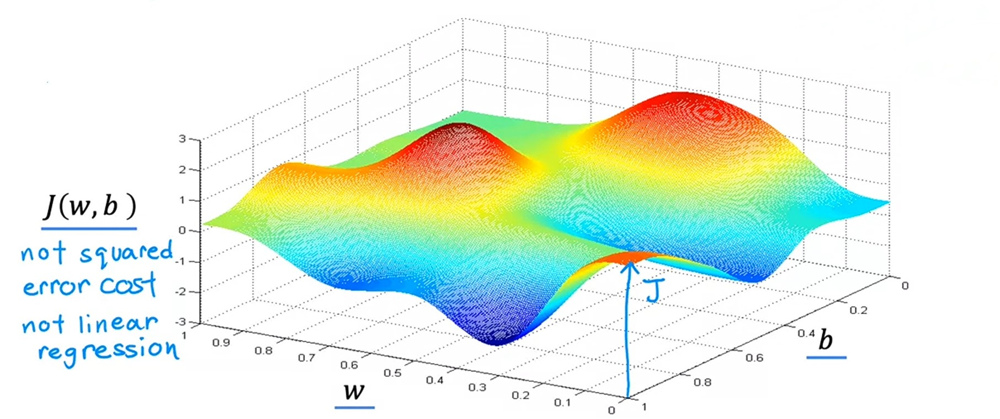

1. Imagine, you're on a top of hill, and you want to go to the one of the bottom valley's as efficiently as possible.

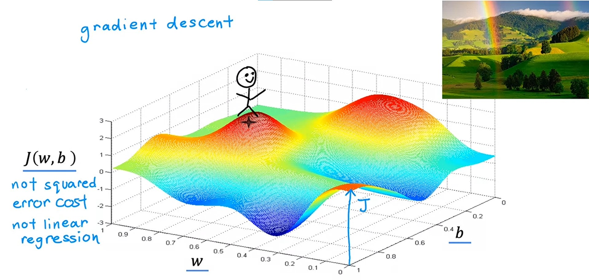

2. What *gradient descent* does it, you spin around `360` degrees and look around and finds the tiny baby step in one direction that takes you down the hill as quickly as possible.
3. Then, you go steep downhill in that direction. Mathematically, the direction of *steepest descent*.
4. Now, again after going a little bit down, you again spin `360` degrees and find small step which takes you down. And you'll go there.
5. You'll do this again and again until you reach the bottom of the hill.

This is an interesting property of *gradient descent*, that it automatically finds the efficient way to go to opposite direction (in this case, bottom of hill) from the starting values for the parameters `w` and `b` which you've chosed.

Let's try once more:

1. This time you'll choose a different starting point by choosing different values for parameters `w` and `b`.
2. If you repeat the *gradient descent* process you'll end up here, totally different valley (downside).

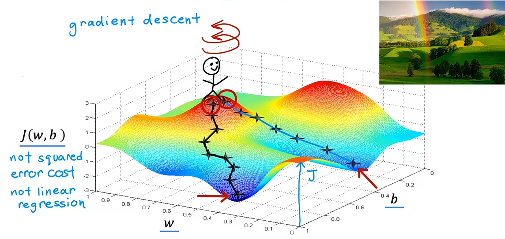

- These both bottom minimum points are called **local minima**.

> But for *linear regression*, the *Squared error cost function* doesn't and will never have multiple *local minima*.
> 
> It has a single **global minima** because of it's *bowl-shape*.
> *Squared error cost function* also known as ***Convex function***.
> 
> This is how graph of **Convex function** looks like:
> 
> 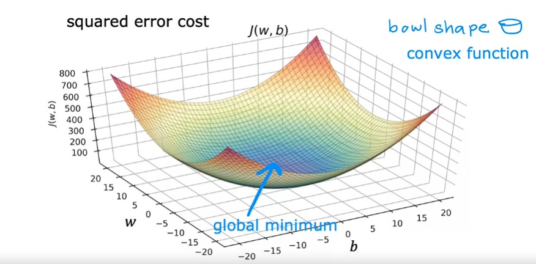
> 
> One nice property of **convex function** is that, as long as you're choosing *learning rate* properly, it will always converge to the **global minimum**. ~ *Andrew Ng*

----

#### Algorithm
> $$repeat\enspace until\enspace convergence \{ $$
> $$w = w - α \frac{dj(w,b)}{dw}$$
> $$b = b - α \frac{dj(w,b)}{db}$$
> $$ \} $$

This is the algorithm of **Gradient Descent**, where we update both the *coefficients* `w` and `b` simultaneously.

And, while updating the *coefficients*, we need to make sure that we should use old values in the formula, and assign new values after calculating new values for both *coefficients*.

| Right way ✅ | Wrong way ❌ |
|:------------:|:-------------:|
| $new\_w = w - α \frac{dj(w,b)}{dw}$ $new\_b = b - α \frac{dj(w,b)}{db}$ $w = new\_w$ $b = new\_b$           | $w = w - α \frac{dj(w,b)}{dw}$ $b = b - α \frac{d}{db} j(w,b)$ |

> α (alpha) is the *learning rate*. The learning rate is a small positive number b/w `0` and `1`. Alpha decides how big a step is. If alpha is very large like `0.9`, it corresponds to very aggressive gradient descent procedure. If alpha is very small like `0.01`, it means you're taking very small steps to find the *local minima*.
> 
> $\frac{dj(w,b)}{dw}$ and $\frac{dj(w,b)}{db}$ are the *derivative* or more precisely *partial derivative*. We use *derivative* to find whether should we increase or decrease the *coefficient*. ~ *Andrew Ng*

####  Working of Gradient Descent Algorithm

#### How *derivative* effects *coefficients*
1. Let's say we have our cost function $j(w)$ with only one parameter `w`.
$$j(w) = \frac{1}{2m}\sum\limits^m_{i=1}(f_w(x^{(i)}) - y^{(i)})^2$$

And it's graph looks something like this:

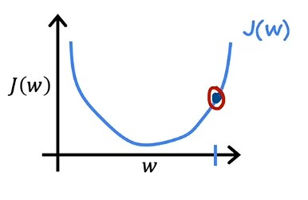

2. And we have choose `w` (marked point) on the graph.
3. First, we will draw a tangent which touches that point.
4. And we will make a triangle like this:

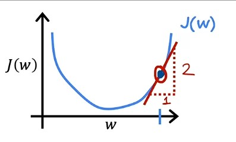

5. Now, we will find the *slope* of this tangent.
6. If, the slope is positive, i.e. $\frac{d}{dw} > 0$, then our new value of `w` parameter will be smaller than it's old value.
7. Because, we are multiplying the *slope* with *learning rate* and subtracting it from the actual value of `w`.
8. The new `w` will be smaller and hence closer to the minimum possible value.
9. And we want the minimum value of `w`

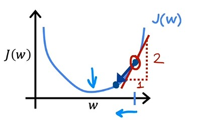

- Let's take another example:

1. If we choose a value for `w` on left hand side on graph.
2. We'll draw it's tangent like this:

3. It's *slope* will be negative, because we want the minimum possible value for `w`.
4. So, new value of `w` will be bigger than it's acutal value.
5. Because, we are multiplying the *slope* with *learning rate* and subtracting it from the actual value of `w` and subtracting a negative number means adding a positive number. (10 - (-8) == 10 + (8))
6. So, at the ending our value of `w` will increase.

---

#### How *learning rate* effects *coefficients*
1. Let's say we choose a small learning rate like `0.0001`.
2. And our $j(w)$ function graph looks like this:

3. And we choose the value of `w` parameter on the marker.
4. And we draw the tangent and find it's *slope* and multiply it by *learning rate*.
5. So, lower the learning rate, means taking a very small step.
6. Small steps takes a lot of time, to reach the minimum value of `w`.
7. So, *gradient descent* will work very slow.

Let's see what happens, if we choose a large learning rate like `0.9`.

1. At first our $j(w)$ function graph look like this:

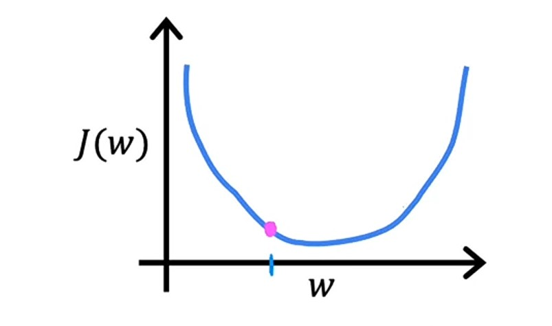

2. And we choose the value of `w` parameter closer to the minimum value.
3. If we draw the tangent and find it's *slope* an multiply it by *learning rate*.
4. We, eventually skips the minimum value and goes far from minimum value of `w`.
5. Because higher *learning rate* lead to take bigger step.
6. And we never reach the minimum value, rather go away from it.

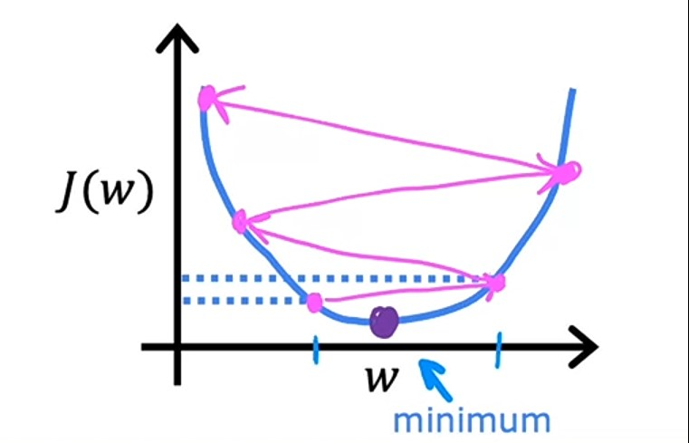

> #### If α is too large...
> Gradient descent may:
> - Overshoot, never reach minimum
> - Fail to converge, diverge    ~ *Andrew Ng*

Now, what if `w` parameter is already at local minima, but there are other local minima points too, which are away from it:

1. Now, if we draw the tangent on that point and find it's slope.
2. It will be `0`.
3. So, multiplying *learning rate* with *derivative* `0` will be `0`.
4. Means `w` parameter will be same as it is.
$$w = w - α \frac{dj(w)}{dw}$$
$$w = w - α 0$$
$$w = w - 0$$
$$w = w$$

5. So, at the end it doesn't change, if the or *derivative* i.e. *slope* is 0.
6. Because, it is already at local minimum value.

 - Hence, this means we can reach local minimum with fixed learning rate.

Means, let's say initial value of `w` is this:

1. We draw a tangent, find it's *slope* and go down.
2. Again we repeat it, but this time, it is less steeper then previous.
3. So, after repeating it for multiple times with a fixed *learning rate*, we will reach at local minimum.

> #### near a learning rate:
> - *Derivative* becomes smaller
> - Update steps becomes smaller

#### How derivatives $\frac{dj(w,b)}{dw}$ and $\frac{d}{dwb}j(w,b)$ are calculated ? [optional]
> It turns out if calculate these derivatives with respect to `w` and `b` with below formulae, it will work.
>
> For `w` *derivative*:
> $$\frac{dj(w,b)}{dw} = \frac{1}{m}\sum\limits_{i=1}^m(f_{w,b}(x^{(i)} - y^{(i)})x^{(i)}$$
> For `b` *derivative*:
> $$\frac{dj(w,b)}{db} = \frac{1}{m}\sum\limits_{i=1}^m(f_{w,b}(x^{(i)} - y^{(i)})$$
> These formulae are derived from *calculus*. ~ *Andrew Ng*

#### How formula $\frac{1}{m}\sum\limits_{i=1}^m(f_{w,b}(x^{(i)} - y^{(i)})x^{(i)}$ for `w` parameter derives:

**Note**: I don't know *calculus*, but I have derived it accordingly how *Andrew Ng* sir said.

We know that:
$$\frac{dj(w,b)}{dw}\enspace=\enspace\frac{d}{dw}\frac{1}{2m}\sum\limits_{i=1}^m(f_{w,b}(x^{(i)}) - y^{(i)})^2$$

We can also write it as:
$$\frac{dj(w,b)}{dw}\enspace=\enspace\frac{d}{dw}\frac{1}{2m}\sum\limits_{i=1}^m(wx^{(i)}+b - y^{(i)})^2$$

By rules of *calculus* this formula is equal to this:
$$\frac{d}{dw}\frac{1}{2m}\sum\limits_{i=1}^m(wx^{(i)}+b - y^{(i)})^2\enspace=\enspace\frac{1}{2m}\sum\limits_{i=1}^m(wx^{(i)}+b - y^{(i)})2x^{(i)}$$

And we cancel out `2`:
$$\frac{1}{\cancel{2}m}\sum\limits_{i=1}^m(wx^{(i)}+b - y^{(i)})\cancel{2}x^{(i)}$$

After cancelling out `2`, we got this final formula for `w` parameter:
> $$\frac{1}{m}\sum\limits_{i=1}^m(wx^{(i)}+b - y^{(i)})x^{(i)}$$

#### How formula $\frac{dj(w,b)}{dw} = \frac{1}{m}\sum\limits_{i=1}^m(f_{w,b}(x^{(i)} - y^{(i)})$ for `b` parameter derives:

Similarly, we know that:
$$\frac{dj(w,b)}{db}\enspace=\enspace\frac{d}{db}\frac{1}{2m}\sum\limits_{i=1}^m(f_{w,b}(x^{(i)}) - y^{(i)})^2$$

We can also write it as:
$$\frac{dj(w,b)}{db}\enspace=\enspace\frac{d}{db}\frac{1}{2m}\sum\limits_{i=1}^m(wx^{(i)}+b - y^{(i)})^2$$

By rules of *calculus* this formula is equal to this:
$$\frac{d}{db}\frac{1}{2m}\sum\limits_{i=1}^m(wx^{(i)}+b - y^{(i)})^2\enspace=\enspace\frac{1}{2m}\sum\limits_{i=1}^m(wx^{(i)}+b - y^{(i)})2$$

And we cancel out `2`:
$$\frac{1}{\cancel{2}m}\sum\limits_{i=1}^m(wx^{(i)}+b - y^{(i)})\cancel{2}$$

After cancelling out `2`, we got this final formula for `b` parameter:
> $$\frac{1}{m}\sum\limits_{i=1}^m(wx^{(i)}+b - y^{(i)})$$

----

### Gradient Descent in Action

| Iterations | Cost function value | graph                                                                                               |
|:----------:|:-------------------:|:---------------------------------------------------------------------------------------------------:|
| 1.         | `77,237`            |  |
| 2.         | `45,401`            | 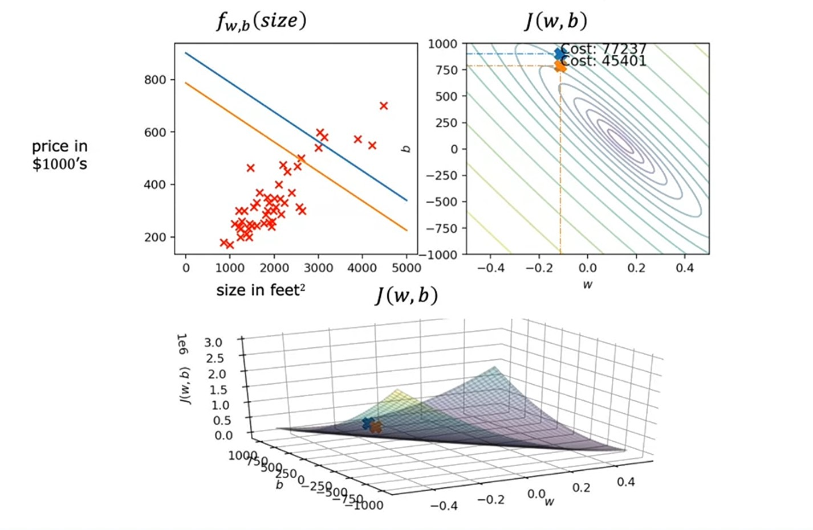 |
| 3.         | `29,109`            | 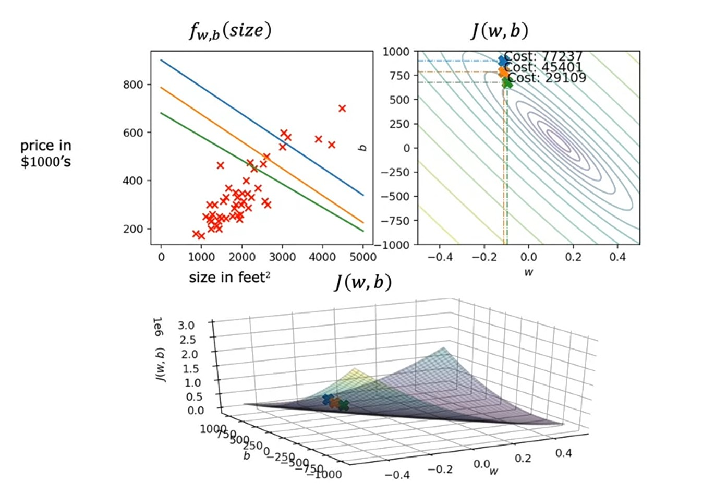 |
| 4.         | `19,076`            |  |
| 5.         | `13,318`            | 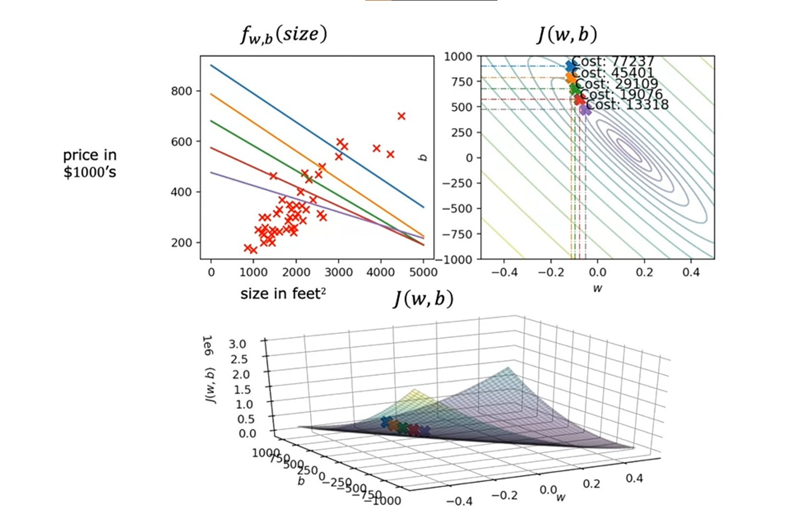 |
| 6.         | `9,460`             | 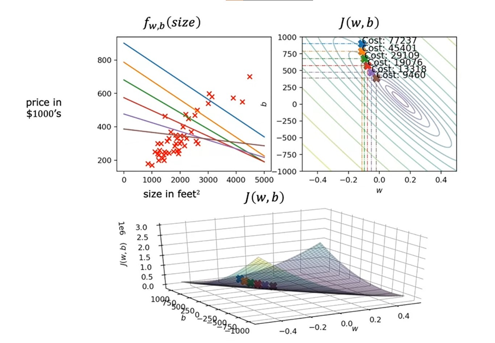 |
| 7.         | `5,729`             |  |
| 8.         | `3,559`             |  |
| 9.         | `2,311`             | 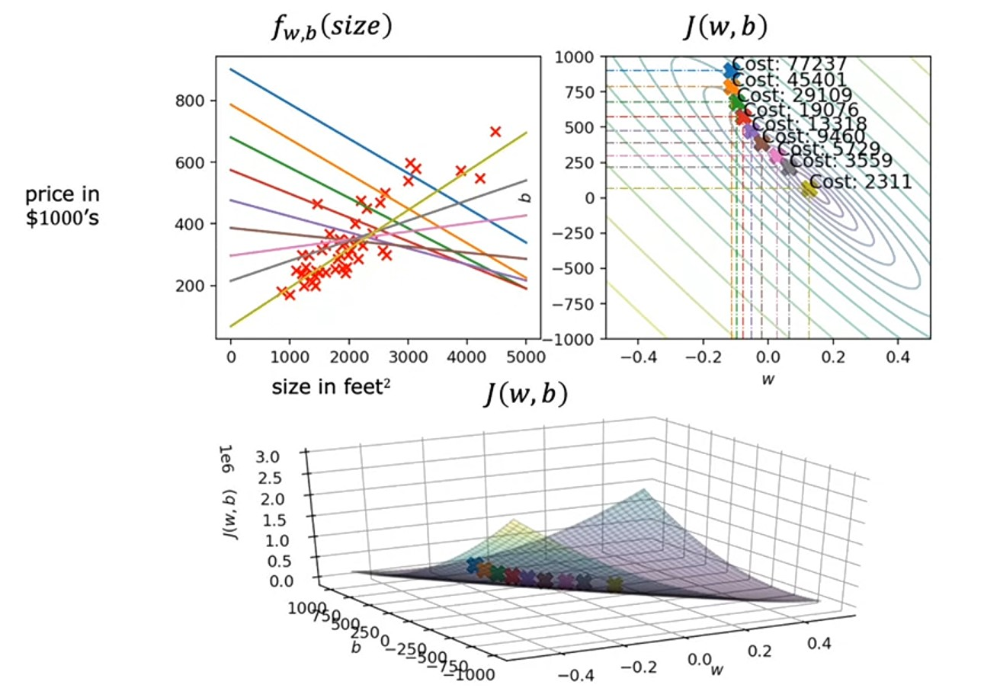 |

So, at the end, we got our *regression line* which fits our data well after `9` iterations.

> This type of *Gradient Descent* is known as ***Batch Gradient Descent***. Here, *Batch* means we are looking at all training examples.
> 
> There are other versions of *Gradient Descent* also, which doesn't use all training examples, but instead looks at smaller subsets of training data at each update step. ~ *Andrew Ng*

---- 

### Jupyter lab [optional] [🔗](../codes/W1-%20L4%20-%20Gradient%20Descent%20[optional].ipynb)

----

### Quizzes

#### Video quiz 1

    
    Answer to <b>video quiz 1</b>

If you have selected option b (Updates parameter w by a small amount) then you are right! This updates the parameter by a small amount, in order to reduce the cost J.

#### Video quiz 2

    
    Answer to <b>video quiz 2</b>

If you have selected option d (w decreases) then you are right! The learning rate α is always a positive number, so if you take W minus a positive number, you end up with a new value for W that is smaller.

#### Practice quiz 1

    
    Answer to <b>question 1</b>

If you have selected option a (w increases) then you are right! The learning rate is always a positive number, so if you take W minus a negative number, you end up with a new value for W that is larger (more positive).

    
    Answer to <b>question 2</b>

If you have selected option b then you are right!

