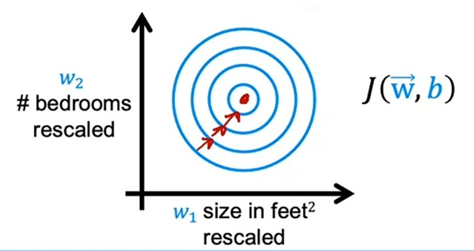
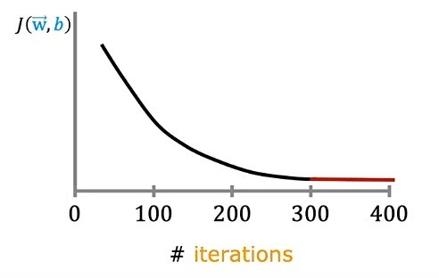
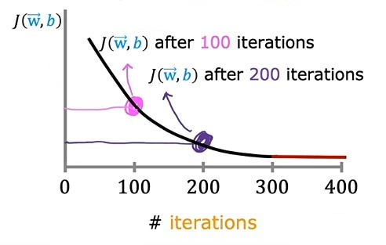
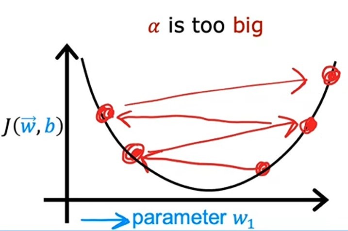
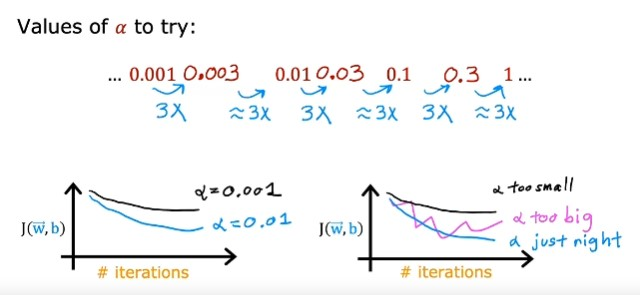
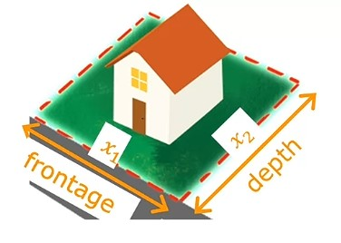
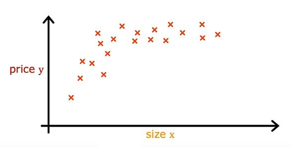
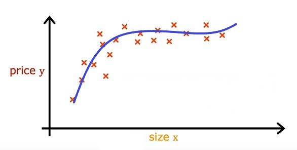
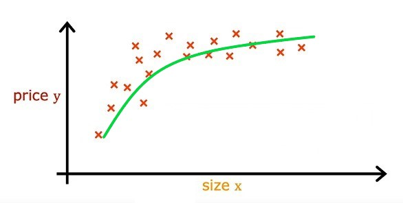

# Week 2 - Regression with multiple input variables

## Ch 2: Gradient Descent in practice

### Feature scaling

> Feature scaling is performing some transformation to data so tha features of data will range of 0 to 1, rather than different ranges. ~ _Andrew Ng_

> Feature scaling is a method used to normalize the range of independent variables or features in data. ~ [_Wikipedia_](https://www.datacamp.com/freeweek)

#### When feature scaling is to be done

> Feature scaling is done when you have different features that take on very different range of values, it can cause gradient descent to run slowly but rescaling the different features so that they all take on comparble range. ~ _Andrew Ng_

Let's see how feature scaling helps

1. Assume we have house price data with 2 features _size_ $x_1$ and _no. of bedrooms_ $x_2$. And _size_ ranges from `300` to `2000` and _no of bedrooms_ ranges from `0` to `5`.

$$ŷ = w_1x_1 + w_2x_2 + b$$

2. Let's take an example data where $x_1 = 2000$ and $x_2 = 5$ and price = `500k`.
3. Now, take a possible value of $w_1 = 50$ , $w_2 = 0.1$ and $b = 50$.
4. So, in this case, estimated price will be:
   $$ŷ = 50 * 2000 + 0.1 * 5 + 50$$
   $$ŷ = 100,000 + 0.5 + 50$$
   $$ŷ = 100,050.5k$$

5. `100,050.5k` is very large compared to actual price.
6. Let's take another set of possible values where, $w_1 = 0.1$ , $w_2 = 50$ and $b = 50$.
7. So, in this case, estimated price will be:
   $$ŷ = 0.1 * 2000 + 50 * 5 + 50$$
   $$ŷ = 200 + 250 + 50$$
   $$ŷ = 500k$$

8. Now, this estimated price is same as actual price.
9. So, here you might have notice that when a possible range of values of feature is large, like size of house, model will choose a relatively small parameter like `0.1`.
10. And, when range of values of feature is small, like no. of bedrooms, model will choose a relatively large parameter like `50`.

-   Now, let's see how these small and large range of values of features relate to _gradient descent_.

-   If you plot features of training data in a _scatter plot_, the graph will look like this:

-   And, the graph of model parameters on a _contour plot_ will look like this:

-   Now, you can see that _contour plot_ is so much stretched vertically and thin horizontally.
-   So, gradient descent may end up bouncing back and forth a long time before it reaches to the _global minimum_.

-   which means, gradient descent will take a lot of time.
-   So, to avoid this kind of situation we do _feature scaling_.
-   Now, if we scaled our both features _size of house_ and _no. of bedrooms_ in the range of values from `0` to `1`.
-   Our training data _scatter plot_ graph will look like this:

-   Now, our graph is looking like much more distributed than before.
-   So, because of _feature scaling_ our _contour plot_ will look like this:

-   It is like cocentric circles, rather than stretched ovals.
-   So, now _gradient descent_ can find the _global minimum_ easily by finding a direct path. And it also take less time to find.

---

#### Methods to do Feature scaling

| S.no. |                    Method                    |           Formula           | Explanation                                                                                                                                                    | Example                                                                                                                                                                                            |                                                   Graph                                                    |
| :---: | :------------------------------------------: | :-------------------------: | :------------------------------------------------------------------------------------------------------------------------------------------------------------- | :------------------------------------------------------------------------------------------------------------------------------------------------------------------------------------------------- | :--------------------------------------------------------------------------------------------------------: |
|  1.   |              Dividing by _max_               |       $\frac{x}{max}$       | Dividing each value by the maximum value of feature. It will mostly normalize values between `0` to `1`.                                                       | Let's say our house size is ranges from `300` to `2000`. So we will divide each value by `2000` and normalize it.   After rescaling, now house size's value will range between `0.15` and `1`. |                              |
|  2.   |             _Mean normalization_             | $\frac{x - \mu}{max - min}$ | First, we will calculate mean of the range i.e. $\mu$ and subtract it from each value and then dividing result by subtracting minimum value by maximum value.  | Let's say no. of bedrooms in a house ranges from `0` to `5`.   After applying _mean normalization_, we will get values of range `-0.46` to `0.54`.                                             |        |
|  3.   | _Z-score normalization_ or _Standardization_ |  $\frac{x - \mu}{\sigma}$   | First, we will calculate mean of the range i.e. $\mu$ and subtract it from each value and then divide result by standard deviation of the range i.e. $\sigma$. | Let's say our house size is ranges from `300` to `2000`.   After applying _z-score normalization_, it's will ranges from `-0.67` to `3.1`.                                                     |  |

---

#### Checking _gradient descent_ for convergence

While using _gradient descent_ to calculate the optimal model parameters, we need to check if the model is converged or not.

We can check this by drawing a _learning curve graph_ of cost function $j$ with respect to each iteration.

Your _learning curve graph_ should look like this:

1. See, after `100` iterations, the graph is decreasing, this shows our _gradient descent_ is working properly.

2. Now, after `200` iterations, it is also decreasing.

3. But, at `400` iterations, our graph stopped decreasing, but it became flat, which shows our _gradient descent_ is converged.

So, now at `400` iterations, our _gradient descent_ is converged. Means, we can use the parameters at `400` iteration for our model to train.

-   There is another way to decide when your model is done training is _Automatic convergence test_.
    Let's set ε (epsilon) variable to `0.001` or `10`$^{-3}$.

If the difference between the cost function $j$ at two consecutive iterations is less than ε, then our model is converged, then we should stop training.

---

#### Choosing the learning rate

Choosing an appropriate learning is important for _gradient descent_ to run faster and find _global minimum_ easily.

-   If you learning curve graph is increasing or making valleys, it means, _learning rate_ is too large.

There are `2` reasons for this:

1. Either _learning rate_ is too large.
2. Or, there is some bug in the code.

-   If your $j$ function graph with parameters look like this:

-   It means, _learning rate_ is too large, and it is skipping the _global minimum_.

-   But, if you use smaller _learning rate_, then it will take each step smaller and smaller and find _global minimum_ easily.

You can try different choices of _learning rate_ and see which is the best for your model.

You can do this by setting α (alpha) to a very small number and see if that causes the cost to decrease on each iteration or not. If even with small learning rate, cost function doesn' decrease on every single iteration, but instead sometimes increases, then there's a very much chance of bug in the code.

---

### Jupyter lab [optional] [🔗](../codes/W2%20-%20L3%20-%20Feature%20Scaling%20and%20Learning%20rate.ipynb)

---

#### Feature Engineering

> _Feature engineering_ is using intuition to design new features, by transforming or combining original features. ~ _Andrew Ng_

In _Feature engineering_, we make new features out of old features which makes the learning algorithm run faster and also makes the model more accurate.

Let's take an example of _House price_ dataset.
So, we have total 3 features:

1. Frontage
2. Depth
3. Price

And our target variable is price.

1st Approach would be, that we can learn our model based on 2 features i.e. _Frontage_ and _Depth_.
And our _linear regression_ model function will be:
$$f_{\vec{w}{b}}(x) = w_1x_1 + w_2x_2 + b$$

2nd approach would be, that we will create a new feature named _Area_ which we can get by multiplying _Frontage_ and _Depth_.

And here we need to have **domain knowledge** of the data.
So, our model function as:
$$f_{\vec{w}{b}}(x) = w_1x_1 + w_2x_2 + w_3x_3 + b$$

---

#### Polynomial Regression
Until now, we've just been using *linear regression* model which fits **straight line* to our data.

What if, our data is not linear, but it looks like a curve like this:

Here, we can't fit a straight linear line to our data.

We need some other model which makes curved linear line to our data.

There comes the **polynomial regression**, there are many methods to do this.

1. Using quadratic equation
- We can use a quadratic equation to fit a curve to our data, which contains feature $x$ and $x^2$.

$$f_{\vec{w}, b}(x) = w_1x + w_2x^2 + b$$

- But the quadratic function may eventually go down, which we don't want. As generally, house prices increases with the increase in size.

2. Using cubic equation
- We can use a cubic equation to fit a curve to our data, which contains feature $x$ and $x^2$ and $x^3$.

$$f_{\vec{w}, b}(x) = w_1x + w_2x^2 + w_3x^3 + b$$

- Here, we need to use *feature scaling*, because let's say, our house size $x$ ranges from $1$ to $10^3$, then it's square's range will be $1^2$ to $10^6$ and it's cube's range will be $1^3$ to $10^9$, which is a billion in numbers.

3. Square root
- We can use a square root equation to fit a curve to our data, which contains feature $x$ and $\sqrt{x}$.

$$f_{\vec{w}, b}(x) = w_1x + w_2\sqrt{x} + b$$

- It becomes less steep as we increase the size of house, but it will never  flatten and never goes down.

---

### Jupyter lab [optional] [🔗](../codes/W2%20-%20L4%20-%20Feature-Engineering%20and%20Polynomial-regression.ipynb)

---

### Jupyter lab [optional] [🔗](../codes/W2%20-%20L5%20-%20Sklearn%20Linear%20regression.ipynb)

---

### Programming Assignment: [Linear Regression](../codes/W2%20-%20Linear%20Regression%20assignment.ipynb)

---
### Quizzes

#### Video quiz 1

Answer to <b>video quiz 1</b>

If you have selected option a (Dividing each value by maximum of the value) then you are right! By dividing all values by the maximum, the new maximum range of the rescaled features is now 1 (and all other rescaled values are less than 1).

#### Video quiz 2

Answer to <b>video quiz 2</b>

If you have selected option d "Try a smaller value of α (say α = 0.1) then you are right! Since the cost function is increasing, we know that gradient descent is diverging, so we need a lower learning rate.

#### Video quiz 3

Answer to <b>video quiz 3</b>

If you have selected option b (length x width x height) then you are right! The volume of the swimming pool could be a useful feature to use. This is the more useful engineered feature of the two.

#### Practice quiz 1
#### Question 1

Answer to <b>practice question 1</b>

If you have selected option a (Subtract the mean from each value and then divide by the (max-min)) then you are right! This is called mean normalization.

#### Question 2

Answer to <b>practice question 2</b>

If you have selected option a (case B only) then you are right! The cost is increasing as training continues, which likely indicates that the learning rate alpha is too large.

#### Question 3

Answer to <b>practice question 3</b>

If you have selected option a (Feature scaling is helpful when one feature is much larger(or smaller) than another feature) then you are right! For example, the “house size” in square feet may be as high as 2,000, which is much larger than the feature “number of bedrooms” having a value between 1 and 5 for most houses in the modern era.

#### Question 4

Answer to <b>practice question 4</b>

If you have selected option a (For each product, calculate the no. of items sold times price per item) then you are right! This feature can be interpreted as the revenue generated for each product.

#### Question 5

Answer to <b>practice question 5</b>

If you have selected option a (True) then you are right! A polynomial function can be non-linear.  This can potentially help the model to fit the training data better.

