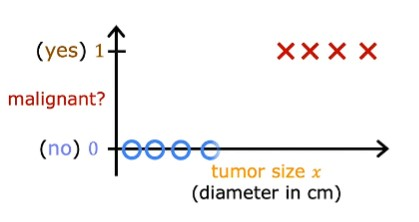
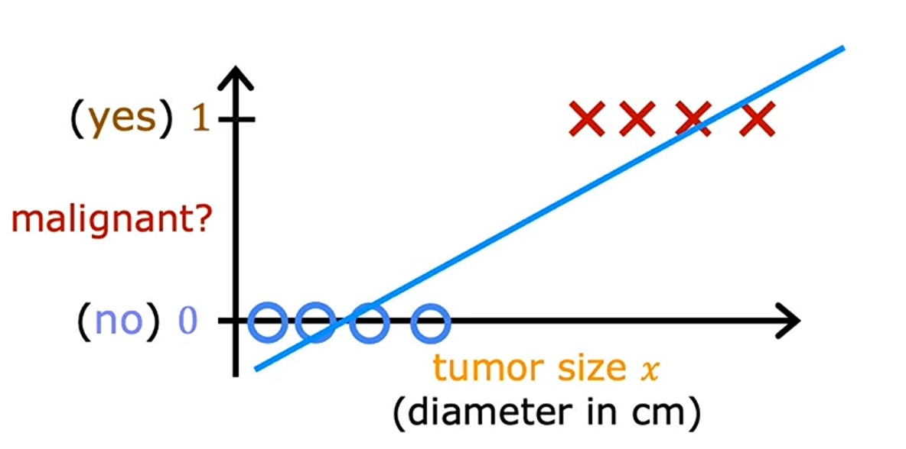
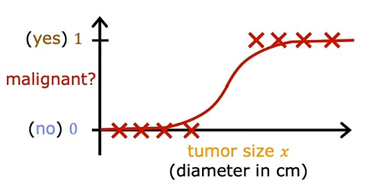
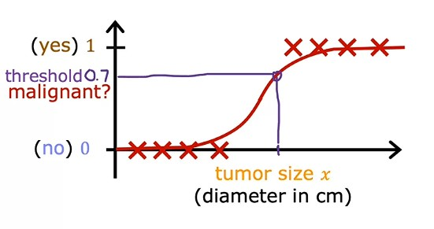
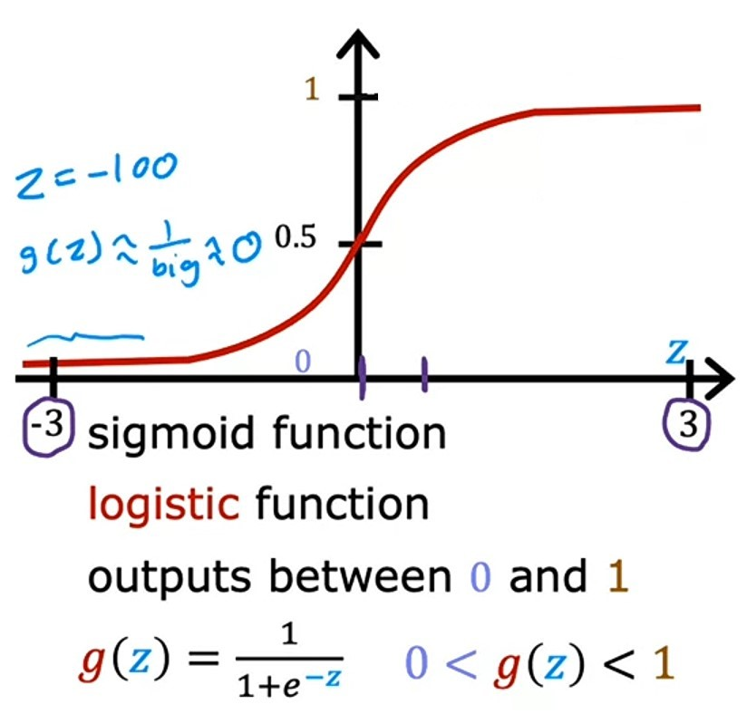
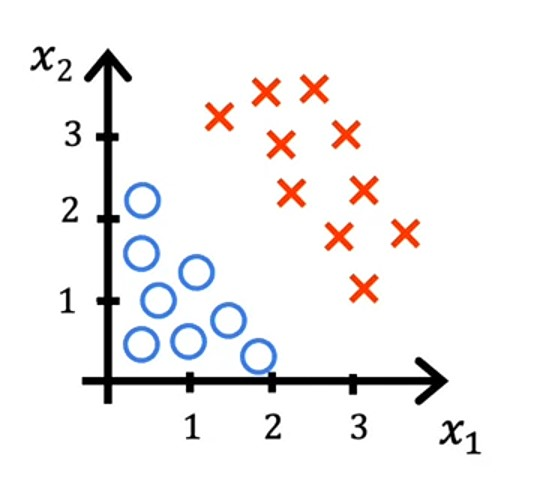
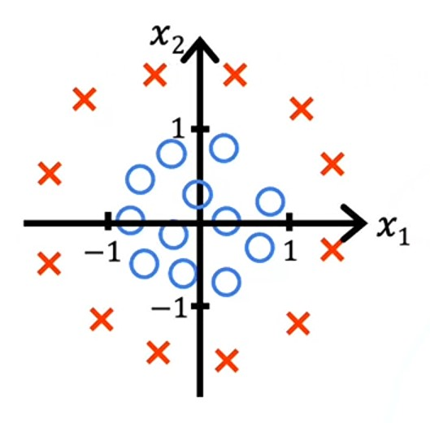
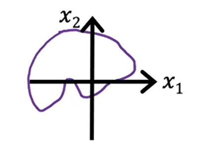

# Week 3 - Classification

**Learning Objectives:**

-   Use logistic regression for binary classification
-   Implement logistic regression for binary classification
-   Address overfitting using regularization, to improve model performance

---

## Ch 1: Classification with logistic regression

### What is Classification

> In Classification algorithm, the learning algorithm has to make a prediction of a category, all of a small set of possible outputs. Example: Cat or Dog ~ _Andrew Ng_

We use **Classification** algorithm to predict qualitative (categories/classes) data, data having different categories.

Let's look at some examples of _classification_ problem:
| Problem | Solution |
|:--------------------------------:|:--------------:|
| Is this email spam ? | _Yes_ or _No_ |
| Is the transaction fraudlent ? | _Yes_ or _No_ |
| Is the tumor malignant ? | _Yes_ or _No_ |
| Is this image is of Dog ? | _Yes_ or _No_ |

#### Binary Classification

> In each of these problems the variable that you want to predict can only be one of two possible values. _No_ or _Yes_. This type of classification problem where there are only two possible outputs is called **Binary classification**. Where the word _binary_ refers to there being only two possible _classes_ or _categories_. ~ _Andrew Ng_

Other conventions we refer to say _Yes_ or _No_:

-   _false_ or _true_
-   $0$ or $1$
-   _negative class_ or _positive class_
-   _absence_ or _presence_

Here _negative_ doesn't mean bad or _positive_ doesn't mean good, it's based on question, let's take _Email spam_ example, if email is spam, then it's _positive class_ and if email is not spam then it's _negative class_.

Similarly, _absence_ means $0$ and _presence_ means $1$ or _true_.

---

#### Example

Now, let's look at one example of _classification_ problem, i.e. A tumor is _malignant_ ?

Let's plot some data of tumor size on _x-axis_ and malignant status on _y-axis_:

Here, **O** represents not _malignant_ i.e. $0$ (no) and **X** represents _malignant_ i.e. $1$ (yes).

-   Now, if we use _linear regression_ model and plot a _regression line_ on it, it will look like this:

-   And let's make a threshold for _malignant_ i.e. $0.5$ and classify model's prediction as _malignant_ if it's greater than or equal to $ >=0.5$ and _not malignant_ if it's less than $ <0.5$.

-   Now draw a vertical line which intersects threshold and if tumor size is right on the line, it will be _malignant_ and if it's not, it will be _not malignant_.
-   This line is also known as _decision boundary_.

-   But, now let's add another training example to the data which is way ahead from the previous ones and draw _linear regression_ line again.

-   Notice, that the _linear regression_ line is also extended because of the new data.
-   And now after drawing _decision boundary_, we can clearly see that the _linear regression_ line is not accurate anymore, because some data points which are actually _malignant_ are classifying as _not malignant_, which ofcourse we don't want.
-   Hence, _linear regression_ model is not the best model for this problem.

---

### Jupyter lab: Classification [optional] [🔗](../codes/W3%20-%20L1%20-%20Classification.ipynb)

---

### Logistic Regression

> In logistic regression, the output value of the outcome will always be between $0$ and $1$. It draws a curve regression line in the graph. ~ _Andrew Ng_

Logistic regression is a linear model which predicts a binary outcome (i.e. 0 or 1).

Let's say if we input diameter of tumor on _x-axis_ and the _logistic regression_ model curve, will make threshold and output $0.7$, which suggests it is closer to $1$ means it is _manignant_.

---

### Algorithm

> To build a _logistic regression_ algorithm, we use a _mathematical_ function called _Sigmoid function_ or sometimes known as _logistic function_. ~ _Andrew Ng_

_Sigmoid function_ looks like this on graph:

Notice, that the _x-axis_ on _sigmoid function_ graph is different from _tumor size_ graph.

-   In _tumor size_ graph _x-axis_ is having all positive numbers.
-   In _sigmoid function_ graph _x-axis_ is having both positive and negative numbers.
-   But _sigmoid function_ always outputs value between $0$ and $1$.

---

### Sigmoid Function Formula

$$g(z) = \frac{1}{1 + e^{-z}}$$

Here, $e$ is a _mathmatical constant_ which has a value of $e \approx 2.7$ and $z$ is the input value.

Let's look at some different values of $z$ and how they will look like on _sigmoid function_ graph:

|      S.no.       |                                                        1                                                         |                                                         2                                                         |                                                       3                                                        |
| :--------------: | :--------------------------------------------------------------------------------------------------------------: | :---------------------------------------------------------------------------------------------------------------: | :------------------------------------------------------------------------------------------------------------: |
| **Value of $z$** |                                                    $z = 100$                                                     |                                                    $z = -100$                                                     |                                                    $z = 0$                                                     |
|    **Output**    |                                                       $1$                                                        |                                                    $3.72e-44$                                                     |                                                     $0.5$                                                      |
|    **Graph**     |  |  |  |

---

#### Making of Logistic Regression Algorithm

**Logistic Regression Algorithm** is mostly based on _linear regression function_.

Let's see how:

1. As we know that _linear regresion_ function is:
   $$f_{\vec{w},b}(\vec{x}) = \vec{w} \cdot \vec{x} + b\tag{1}$$
2. Let's store the value $\vec{w} \cdot \vec{x} + b$ in a variable named $z$.
   $$z = \vec{w} \cdot \vec{x} + b\tag{2}$$
3. Now, we will take this value of $z$ and pass in our _sigmoid function_
   $$g(z) = \frac{1}{1 + e^{-z}}\tag{3}$$
4. We know that $g(z)$ takes value of $z$ and returns a value between $0$ and $1$.
5. So, when we put all these equations $(1)$, $(2)$ and $(3)$ together, we get:
   $$f_{\vec{w},b}(\vec{x}) = g( \underbrace{\vec{w} \cdot \vec{x} + b}_z )$$
   $$g( \underbrace{\vec{w} \cdot \vec{x} + b}_z ) = \frac{1}{1 + e^{-(\vec{w} \cdot \vec{x} + b)}}$$
6. Hence, our final formula will be:
    > $$f_{\vec{w},b}(\vec{x}) = \frac{1}{1 + e^{-(\vec{w} \cdot \vec{x} + b)}}$$
7. It takes a set of input features $x$ and outputs a number between $0$ and $1$.

> **Notice**, the underlying formula of _logistic regression_ is same as _linear regression_ so, that's why it's called _logistic regression_, but it output's a number between $0$ and $1$ so it come under _classification_ category.

---

### Interpretation of Logistic Regression output

> The way I encourage you to think of _logistic regression_ output is to think of it as outputting the **probability** that the class or the label $y$ will be equalt o 1 given a certain input _x_. ~ _Andrew Ng_

Let's take an example:

-   Let's say we have $x$ as a _tumor size_ and $y$ is either $0$ or $1$.
-   If we have a patient with _tumor size_ of $x$ and based on this input $x$m the model will output a probability of $y$ being $0.7$.
-   Which means the model is predicting that there's a $70%$ chance that the patient will have a tumor, i.e. there's $70%$ chance of the value of label $y$ will be equal to $1$.

Sometimes, we will also see formula of _logision regression_ like this:
$$f_{\vec{w},b}(\vec{x}) = P(y = 1 | \vec{x};\vec{w},b)$$

The semicolon in the above equation is denoting that the parameters $\vec{w}$ and $b$ effect the computation of what is the probability of $y$ being $1$ for the given input $\vec{x}$.

---

### Jupyter lab: Sigmoid function [optional] [🔗](../codes/W3%20-%20L2%20-%20Sigmoid%20function.ipynb)

---

### Decision Boundary

The _decision boundary_ is the line that separates the two classes.

Remember that, we have our _sigmoid function_ on graph looks like this:

And, our _logistic function_ is:

$$f_{\vec{w},b}(\vec{x}) = g( \underbrace{\vec{w} \cdot \vec{x} + b}_z ) = \frac{1}{1 + e^{-z}}$$

And, we interpret the output of _logistic regression_ as the probability of the class $y = 1$ or $y = 0$ given the input $\vec{x}$ and with the parameters $\vec{w}$ and $b$.

The probaility can be $0.1$, $0.7$ or $0.9$.

So, we need a _threshold_ to decide the class of the input $\vec{x}$. If the probability is greater than or equal to $0.5$, then the class is $1$ otherwise $0$.

A common choice would be to choose _threshold_ as $0.5$.

-   So, when $f_{\vec{w},b}(\vec{x}) >=0.5$, then the prediction $ŷ = 1$ otherwise $ŷ = 0$.

-   And recall that $f_{\vec{w},b}(\vec{x}) = g(z)$, so when $g(z) >= 0.5$, the prediction $ŷ = 1$ otherwise $ŷ = 0$.

-   And when $g(z) = 0.5$ ?, when $z >= 0.5$.
-   And when $z = 0.5$ ?, when $\vec{w} \cdot \vec{x} + b >= 0.5$, then $ŷ = 1$ and when $\vec{w} \cdot \vec{x} + b < 0.5$, then $ŷ = 0$.

---

### Visualizing the decision boundary

Now, let's visulaize the _decision boundary_ and how model makes predictions.

1. Linear Decision boundary

Let's say we have data with $2$ features $x_1$ and $x_2$ and after plotting the data, it looks like this:

-   Here, the red cross $X$ corresponds to data points where $y = 1$ and the blue circle $O$ corresponds to data points where $y = 0$.

-   We have $2$ features so, our _sigmoid function_ will be:
    $$f_{\vec{w}, b}(\vec{x}) = g(z) = g(w_1x_1 + w_2x_2 + b)$$

-   let's say, we have parameters with values $w_1 = 1$, $w_2 = 1$ and $b = -3$.
-   And, we know that $z = \vec{w} \cdot \vec{x} + b = 0$ is our _decision boundary_, because that's the line where we are neutral about whether the prediction $ŷ$ is $1$ or $0$.

-   Now, let's put the values of $w_1$, $w_2$ and $b$ in _decision boundary_ equation:
    $$z = x_1 + x_2  -3$$
-   which, is equals to:
    $$z = x_1 + x_2 = 3$$
-   So, here we got our _decision boundary_, which is $3$.
-   From this line, we can say that if the prediction would be less than $< 3$, then the class is $0$ and if the prediction would be greater than or equal to $>= 3$, then the class is $1$.

---

2. Non-linear Decision boundary

Now, let's look at some data which needs a non-linear or a curved _decision boundary_.

Here, we have $2$ features $x_1$ and $x_2$ and after plotting the data, it looks like this:

-   Earlier, in _linear regression_, we have used _quadratic equations_ or _polynomial features_ to make non-linear curves.
-   Here, we will also use them.
-   So, let's make the _quadratic equation_ for $z$:
    $$f_{\vec{w}, b}(\vec{x}) = g(z) = g(w_1x^2_1 + w_2x^2_1 + b)$$
-   And, let's choose the parameters $w_1 = 1$, $w_2 = 1$ and $b = -1$.
-   After putting above values, our _decision boundary_ will be:
    $$z = x^2_1 + x^2_1 - 1 = 0$$
-   which is:
    $$z = x^2_1 + x^2_1 = 1$$
-   So, here we got our _decision boundary_, which is $1$.
-   From this line, we can say that if the prediction would be less than $< 1$, then the class is $0$ and if the prediction would be greater than or equal to $>= 1$, then the class is $1$.

---

1. Some more non-linear Decision boundaries
   With the above example, we can see that by adding different _polynomial features_ we can make our _decision boundary_ more non-linear.

Example:

-   With $2$ features $x_1$ and $x_2$, if we make our _logistic regression_ function as:
    $$f_{\vec{w}, b}(\vec{x}) = g(z) = g(w_1x_1 + w_2x_2 + w_3x^2_1 + w_4x_1x_2 + w_5x^2_2 + b)$$
-   We can have our _decision boundary_ like this **An elipise**:

-   Or, with more _polynomial terms_, we can have our _decision boundary_ like this:

> So, with _polynomial features_, we can get very complex _decision boundaries_. In other words _logistic regression_ can learn to fit prett _complex data_.
>
> Although, if you don't add _polynomial features_, you can get a _linear decision boundary_. ~ _Andrew Ng_

---

### Jupyter lab: Decision Boundary [optional] [🔗](../codes/W3%20-%20L3%20-%20Decision%20boundary.ipynb)

---

### Quizzes

### Practice quiz 1

#### Question 1

    
    Answer to <b>Question 1</b>

If you have selected option <em>a (Based on the size of each tumor, determine if each tumor is malignant (cancerous) or not)</em> then you are right! <b>Explanation:</b> This task predicts one of two classes, malignant or not malignant.

#### Question 2

    
    Answer to <b>Question 2</b>

If you have selected option <em>b (g(z) is near 1)</em> then you are right! <b>Explanation:</b> Say z = +100. So e-z is then e-100, a really small positive number. So g(z) is close to 1.

#### Question 3

    
    Answer to <b>Question 3</b>

If you have selected option <em>b (
Predict it is a cat if g(z) >= 0.5)</em> then you are right! <b>Explanation:</b> Think of g(z) as the probability that the photo is of a cat. When this number is at or above the threshold of 0.5, predict that it is a cat.

#### Question 4

    
    Answer to <b>Question 4</b>

If you have think it's <em>False</em> then you are right! <b>Explanation:</b> The decision boundary can also be non-linear, as described in the lectures.

#### Video quiz 1

    
    Answer to <b>video quiz 1</b>

If you have selected option <em>a (Decide if an animal is a cat or not cat)</em> then you are right! <b>Explanation:</b> This is an example of binary classification where there are two possible classes (True/False or Yes/No or 1/0).

#### Video quiz 2

    
    Answer to <b>video quiz 2</b>

If you have selected option <em>a (g(z) is near zero)</em> then you are right! <b>Explanation:</b> Say z = -100. e -z is then e 100, a really big positive number. So, g(z) is about 0.

#### Video quiz 3

    
    Answer to <b>video quiz 3</b>

If you have selected option <em>b (Low, say threshold of 0.2)</em> then you are right! <b>Explanation:</b> You would not want to miss a potential tumor, so you will want a low threshold. A specialist will review the output of the algorithm which reduces the possibility of a ‘false positive’. The key point of this question is to note that the threshold value does not need to be 0.5.

