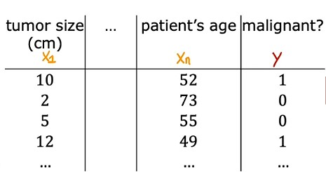
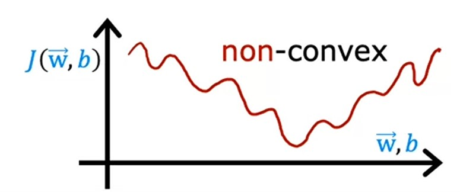
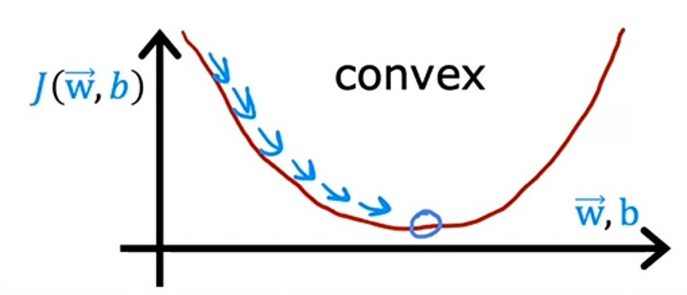
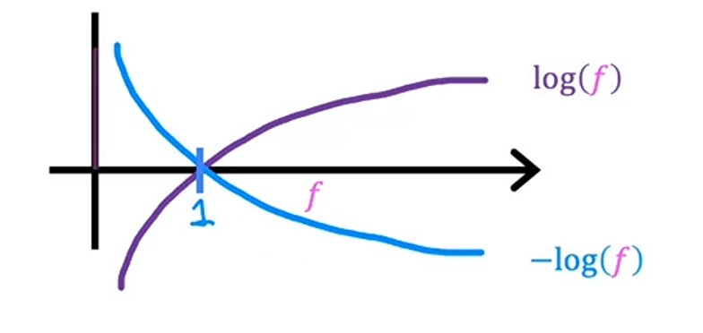
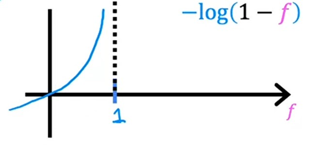
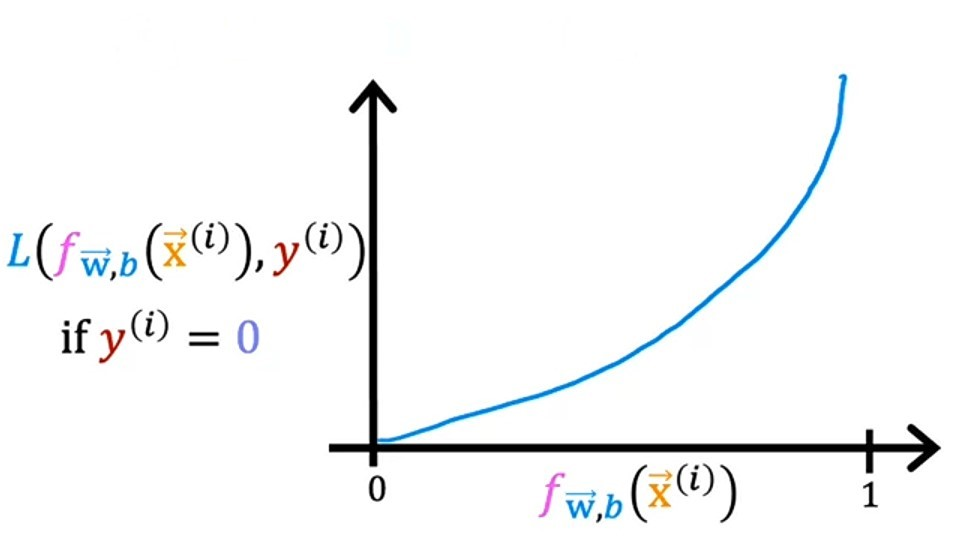

# Week 3 - Classification

## Ch 2: Cost function for logistic regression

Let's say we have a dataset with $m$ samples and $n$ features.

-   We have different features ranges from $x_1$ to $x_n$ and target variable $y$.

-   And, to predict the target variable, we have to fit a _logistic regression model_ based on these different features.

-   And to find best fit, we need best values for their respective paramters $w_1$ to $w_n$ and $b$.

-   To find best values, first, we need to find the _error_ between **actual** and **predicted** values by our _logistic regression model_ using a _Cost function_ based on the paramters $w_1$ to $w_n$ and $b$.

-   Then, we need to find the _gradient_ of the error with respect to the paramters $w_1$ to $w_n$ and $b$.

So, let's find the _Cost function_.

### _Squared error_ cost function

In linear regression, we have used _Squared Error_ cost function to find the error between the predicted and actual values, which then helps to determine the best values for parameters using _Gradient descent_.

So, here also let's try _Squared Error_ cost function, but now it's changed a bit:
$$J_{(\vec{w}, b)} = \frac{1}{m}\sum^m_{i=1}\frac{1}{2}(f_{\vec{w}, b}(\vec{x}^{(i)} - y^{(i)})^2$$

Here, we have decreasing the squared error by converting it to half $\frac{1}{2}$, rest all is same.

---

### Graph comparison

Remember, the graph of _linear regression_ $f_{\vec{w}, b}(\vec{x}) = \vec{w} \cdot \vec{x} + b$ 's _cost function_ $J_{(\vec{w}, b)}$ is like this:

Similarly, for _logistic regression_ $f_{\vec{w}, b}(\vec{x}) = \frac{1}{1 + e^{-z}}$, using our modified version of _Cost function_ $J_{(\vec{w}, b)}$, if we plot the _cost function_ graph, it will look like this:

-   **Notice** that, the _cost function_ graph of _linear regression_ is **Convex** shaped, but the _cost function_ graph of _logistic regression_ is **Non-Convex** shaped.

-   And, if we apply _gradient descent_ in _linear regression_ cost function, it will have a single _local minima_ which is also a _global minima_.

-   But, if we apply _gradient descent_ in _logistic regression_ cost function, it will have multiple _local minima_ within which we can get stuck to find _global minima_.

-   So, it turns out for _logistic regression_, _Squared Error_ cost function is not good.

---

### Loss function for logistic regression

Let's take the inner part of older cost function and call it _Logistic Cost function_ with name $L$:

$$J_{(\vec{w}, b)} = \frac{1}{m}\sum^m_{i=1}\underbrace{\boxed{\frac{1}{2}(f_{\vec{w}, b}(\vec{x}^{(i)}) - y^{(i)})^2}}_L$$

$$L(f_{\vec{w}, b}(\vec{x}^{(i)}), y^{(i)})$$

-   This $L$ _loss function_, is equal to the inner part of the _cost function_, but $L$ _loss function_ computes loss for each training example.

$$\frac{1}{2}(f_{\vec{w}, b}(\vec{x}^{(i)}) - y^{(i)})^2 = L(f_{\vec{w}, b}(\vec{x}^{(i)}) - y^{(i)})$$

-   Let's see the formula of this _loss function_.

**Remember:** this _loss function_ $L$ computes **loss** for each training example $x^{(i)}$ and **target variable** $y^{(i)}$. And then, we square it and half it and then sum it up which is the _cost function_, which measures the error for our entire training set.

---

### Formula of logistic loss function

> $$
> Loss(f_{\vec{w},b}(\vec{x}^{(i)}), y^{(i)}) = \begin{cases}
>    - \log\left(f_{\vec{w},b}\left( \vec{x}^{(i)} \right) \right) & \text{if $y^{(i)}=1$}\\
>    - \log \left( 1 - f_{\vec{w},b}\left( \vec{x}^{(i)} \right) \right) & \text{if $y^{(i)}=0$}
>  \end{cases}
> $$

#### Definition

> This _loss function_ takes each samply of actual target variable $y^{(i)}$ and it's predicted value $f_{\vec{w},b}(\vec{x}^{(i)})$ and returns the loss value.
>
> If the label $y = 1$, then the loss is $-\log(f_{\vec{w},b}(\vec{x}^{(i)}))$.
>
> If the label $y = 0$, then the loss is $-\log(1 - f_{\vec{w},b}(\vec{x}^{(i)}))$.
>
> ~ _Andrew Ng_

#### Inuition

First, let's plot the curve of $\log(f)$ and $-\log(f)$ and see how it looks:

- Notice that, both $\log(f)$ and $-\log(f)$ intersects at $x-axis$ at $1$, and $f$ is the output of *logistic regression*, thus $f$ is always in the rnage of $0$ and $1$.

#### Case $y = 1$

Let's take the case $y = 1$, and see what this function does:

The only part from the above graph which we require is this (because our output will be in range of $0$ and $1$):

- Let's examine this part:

1. If the _logistic regression_ algorithm $f_{\vec{w},b}(\vec{x}^{(i)})$ predicts $y = 1$, then loss is $0$, which is good. 🙂
2. If the _logistic regression_ algorithm $f_{\vec{w},b}(\vec{x}^{(i)})$ predicts $y = 0.5$ in the middle of the graph, then loss is bit high, but it's ok, we are handling it already. 😐
3. If the _logistic regression_ algorithm $f_{\vec{w},b}(\vec{x}^{(i)})$ predicts $y = 0.1$ in the left-most side of the graph, then loss is high, it means, the algorithm thinks there's only $10%$ chance the tumor (target variable $y = 1$) is malignant. If tumor is really malignant, then this loss is really a problem for us. 🙁

> So, When $y$ is equal to $1$, the loss function **incentivizes** or nurtures, or helps push the algorithm to make more accurate predictions because the loss is lowest $f_{\vec{w}, b}(\vec{x}^{(i)})$, when it predicts values close to true label $y$ or $1$.

#### Case $y = 0$

Let's take the case $y = 0$, and see what this function does:

When $-\log(1 - f)$ is plotted, it will look like this:

- Let's examine it:

1. If the _logistic regression_ algorithm $f_{\vec{w},b}(\vec{x}^{(i)})$ predicts $y = 0$, then loss is $0$, which is good. 🙂
2. If the _logistic regression_ algorithm $f_{\vec{w},b}(\vec{x}^{(i)})$ predicts $y = 1$ the loss is high (infinity $\infty$), it means, the algorithm thinks there's $99%$ chance the tumor is malignant (i.e. target variable $y = 1$). But, instead, if the tumor is **not** malignant, then it's a big problem. 🙁

> So, when $y$ is equal to $0$, the loss function **penalize** the algorithm with a very high loss to make more accurate predictions the loss is lowest $f_{\vec{w}, b}(\vec{x}^{(i)})$, when it predicts values close to true label $y$ or $0$.

---

### Jupyter lab: Logistic loss [optional] [🔗](../codes/W3%20-%20L4%20-%20Logistic%20loss.ipynb)

---

### Simplified logistic loss function

As we know that, our *loss function* is:

$$
Loss(f_{\vec{w},b}(\vec{x}^{(i)}), y^{(i)}) = \begin{cases}
   - \log\left(f_{\vec{w},b}\left( \vec{x}^{(i)} \right) \right) & \text{if $y^{(i)}=1$}\\
   - \log \left( 1 - f_{\vec{w},b}\left( \vec{x}^{(i)} \right) \right) & \text{if $y^{(i)}=0$}
\end{cases}
$$

It turns out, that we can simplify this *loss function* as:

$$Loss(f_{\vec{w},b}(\vec{x}^{(i)}), y^{(i)}) = - y^{(i)} logf_{\vec{w},b}(\vec{x}^{(i)})) - (1 - y^{(i)}) log(1 - f_{\vec{w},b}(\vec{x}^{(i)}))$$

Let's look at how:

#### Case $y = 1$

- let's put the value $y = 1$, into our *loss function*:

$$Loss(f_{\vec{w},b}(\vec{x}^{(i)}), 1) = - 1 logf_{\vec{w},b}(\vec{x}^{(i)})) - (1 - 1) log(1 - f_{\vec{w},b}(\vec{x}^{(i)}))$$
$$= -1 logf_{\vec{w},b}(\vec{x}^{(i)})) - (0) log(1 - f_{\vec{w},b}(\vec{x}^{(i)}))$$
- After evaluating, we can write it as:
$$Loss(f_{\vec{w},b}(\vec{x}^{(i)}), 1) = - logf_{\vec{w},b}(\vec{x}^{(i)}))$$

#### Case $y = 0$

- let's put the value $y = 0$, into our *loss function*:

$$Loss(f_{\vec{w},b}(\vec{x}^{(i)}), 0) = - 1 logf_{\vec{w},b}(\vec{x}^{(i)})) - (1 - 0) log(1 - f_{\vec{w},b}(\vec{x}^{(i)}))$$
$$= -0 logf_{\vec{w},b}(\vec{x}^{(i)})) - (1) log(1 - f_{\vec{w},b}(\vec{x}^{(i)}))$$
- After evaluating, we can write it as:
$$Loss(f_{\vec{w},b}(\vec{x}^{(i)}), 0) = -log(1 - f_{\vec{w},b}(\vec{x}^{(i)}))$$

> Hence, our **final** *loss function* is:
> 
> $$Loss(f_{\vec{w},b}(\vec{x}^{(i)}), y^{(i)}) = - y^{(i)} logf_{\vec{w},b}(\vec{x}^{(i)})) - (1 - y^{(i)}) log(1 - f_{\vec{w},b}(\vec{x}^{(i)}))$$

And, we know that, our *cost function* is:
> $$J_{(\vec{w}, b)} = \frac{1}{m}\sum^m_{i=1}\left[L(f_{\vec{w}, b}(x^{(i)}, y^{(i)})\right]$$

If we put the *loss function* into the *cost function*, we can write it as:
> $$J_{(\vec{w}, b)} = \frac{1}{m}\sum^m_{i=1}\left[- y^{(i)} logf_{\vec{w},b}(\vec{x}^{(i)})) - (1 - y^{(i)}) log(1 - f_{\vec{w},b}(\vec{x}^{(i)}))\right]$$

Or, more after simplying it (removing -ve sign):
> $$J_{(\vec{w}, b)} = -\frac{1}{m}\sum^m_{i=1}\left[y^{(i)} logf_{\vec{w},b}(\vec{x}^{(i)})) + (1 - y^{(i)}) log(1 - f_{\vec{w},b}(\vec{x}^{(i)}))\right]$$

> And, if you wonder why we have chosen this *cost function* for *logistic regression*, when there could be tons of other costs functions would have chosen ?
> 
> This particular cost function is derived from statistics using a statistical principle called maximum likelihood estimation, which is an idea from statistics on how to efficiently find parameters for different models. And this cost function has the nice property that it is convex. ~ *Andrew Ng*

---

### Jupyter lab: Cost function for logistic regression [optional] [🔗](../codes/W3%20-%20L5%20-%20Cost%20function.ipynb)

---

### Quizzes

#### Practice quiz

##### Question 1

    
    Answer to <b>question 1</b>

If you have selected option <em>a (Loss)</em> then you are right! <b>Explanation:</b> In these lectures, loss is calculated on a single training example. It is worth noting that this definition is not universal. Other lecture series may have a different definition.

##### Question 2

    
    Answer to <b>question 2</b>

If you have selected option <em>d</em> then you are right! <b>Explanation:</b> When y(i) = 0, the first term reduces to zero.

#### Video quiz 1

    
    Answer to <b>video quiz 1</b>

If you have selected option <em>a (The non linear nature of the model results in a "wiggly", non-convex cost function with many potential local minima)</em> then you are right! <b>Explanation:</b> If using the mean squared error for logistic regression, the cost function is "non-convex", so it's more difficult for gradient descent to find an optimal value for the parameters w and b.

#### Video quiz 2

    
    Answer to <b>video quiz 2</b>

If you have selected option <em>b</em> then you are right! <b>Explanation:</b> The second term of the expression is reduced to zero when the target equals 1.

