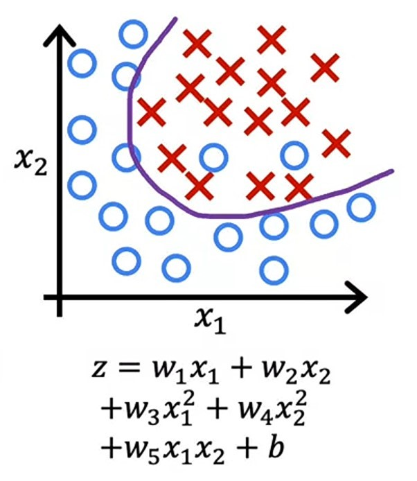
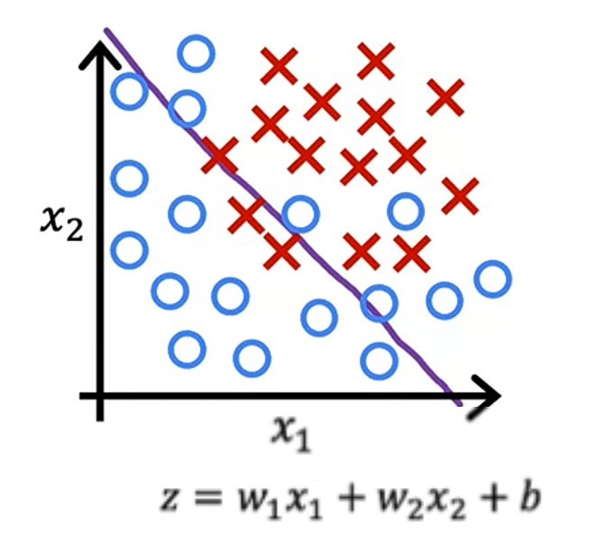
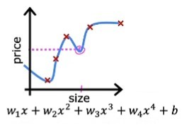
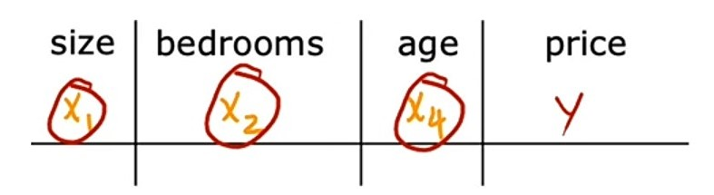

# Week 3 - Classification

## Ch 4 - The problem of overfitting

**Sometimes**,

-   ML algorithm can ran into a problem called _overfitting_, where the model fits the training data very well, but on new data it makes bad predictions.

-   ML model even doesn't fit the training data well, which means the cost function is high, this is called _underfitting_.

-   ML model fits the training data well, also do well predictions on new data, with minimal error, this is called _generalization_.

Let's look at definition of each.

### Generalization

> Generalization refers to how well the concepts learned by a machine learning model apply to specific examples not seen by model when it was learning. ~ _Jason Brownlee_ [ML mastery](https://machinelearningmastery.com/overfitting-and-underfitting-with-machine-learning-algorithms/#:~:text=Generalization%20refers%20to%20how%20well%20the%20concepts%20learned%20by%20a%20machine%20learning%20model%20apply%20to%20specific%20examples%20not%20seen%20by%20the%20model%20when%20it%20was%20learning.)

The goal of machine learning model is to generalize (fit) well from the training data so that on new data it can make good predictions with minimal error.

#### Example:

#### Regression problem (house price)

Let's say we have our _house price data_, after plotting which looks like this:

After, fitting the model, the _regression line_ will be like this:

Here, we can see the _regression line_ is curve and fits the data well, not best, but it performs on new data well. Because we have added _polynomial features_ in algorithm. So, we can say that our model is _generalized_ well.

#### Classification problem (Tumor classification)

Let's say we have our _tumor classification data_, after plotting which looks like this:

After fitting the model, the _decision boundary_ will be like this:

Here, we can see the _decision boundary_ is curve and fits the data well, not good, but it performs on new data well. Because we have added _polynomial features_ in algorithm. So, we can say that our model is _generalized_ well.

---

### Underfitting

> Underfitting refers to a model that can neither fits the training data nor generalize to new data. ~ _Jason Brownlee_ [ML mastery](https://machinelearningmastery.com/overfitting-and-underfitting-with-machine-learning-algorithms/#:~:text=Underfitting%20refers%20to%20a%20model%20that%20can%20neither%20model%20the%20training%20data%20nor%20generalize%20to%20new%20data.)

So, an underfit model is not good model, because it doesn't fit the training data and have high error which means on new data also it can't make good predictions.

#### Example:

#### Regression problem (house price)

Let's say we have our _house price data_, after plotting which looks like this:

After, fitting the model, the _regression line_ will be like this:

Here, we can see that _regression line_ is straight, and it doesn't fit the training data well, means it has high error. So, we can say that our model is _underfit_ to data.

#### Classification problem (Tumor classification)

Let's say we have our _tumor classification data_, after plotting which looks like this:

After fitting the model, the _decision boundary_ will be like this:

Here, we can see that _decision boundary_ is almost a straight line, little curve, and it doesn't classify the data well, means doesn't fit the training data well, which also means it has high error. And on new data it can merely classify whether the tumor is malignant, if it's near the _decision boundary_. So, we can say that our model is _underfit_ to data.

---

### Overfitting

> Overfitting refers to a model that fits the training data very well.
>
> Overfitting happens when a model learns the detail in the training data to the extent that it negatively impacts the performance of the model on new data. ~ _Jason Brownlee_ [ML mastery](https://machinelearningmastery.com/overfitting-and-underfitting-with-machine-learning-algorithms/#:~:text=Overfitting%20refers%20to%20a,model%20on%20new%20data)

So, when our model learns the training data too well and fits it very well, that it can make perfect predictions, but on new data, it makes worse predictions, it is called _overfitting_.

#### Example

#### Regression problem (house price)

Let's say we have our _house price data_, after plotting which looks like this:

After, fitting the model, the _regression line_ will be like this:

Here, we can see that _regression line_ is curved and wiggly and fits the training data really well, and it has almost no error. Because we have added so many _polynomial features_ in algorithm which can cause worse predictions on new data.

Let's say we have _house size_ (pink mark) on _x-axis_, and because of _overfitting_, our model predicts _house price_ lesser than other prices, this happened because of _overfitting_.

#### Classification problem (Tumor classification)

Let's say we have our _tumor classification data_, after plotting which looks like this:

After fitting the model, the _decision boundary_ will be like this:

Here, we can see that our model mades a very twisted decision boundary, which can classify tumor perfectly on training data and have $0$ error. This is due to very high order _polynomial features_. But, in new data it can't classify tumor correctly. So, we can say that our model is _overfits_ to data.

---

### Bias

> The inability for a machine learning model to capture the true relationship is called bias. ~ [_StatQuest with Josh Stammer_](https://youtu.be/EuBBz3bI-aA?t=136)

Means, if the model doesn't even fit the training data well, and on new data, it can't make good predictions.

We can also say that the model which _overfits_ the training data has _low bias_ and the model which _underfits_ the training data has _high bias_.

---

### Variance

> In Machine learning, the difference in fits between datasets in called _Variance_. ~ [_StatQuest with Josh Stammer_](https://youtu.be/EuBBz3bI-aA?t=245)

Means, if the model fits the training data well, but on new data it makes worse predictions, then, the difference is called _Variance_.

We can also say that the model which _overfits_ the traning data has **high variance**, and the model which _underfits_ the training data has **low variance.**

> In Machine learning, the ideal algorithm has _low bias_ and can accurately make the true relationship and it has _low variance_ by producing good predictions on new data. Means, _Generalized model_ is better than _Underfitted model_ and _Overfitted model_ is better than _Underfitted model_. ~ [_StatQuest with Josh Stammer_](https://youtu.be/EuBBz3bI-aA?t=322)

---

### Addressing Overfitting

Let's say we have made a model, which _overfits_ the data and doesn't performing well on new data, and we want to fix this.

There are several ways to reduce _overfitting_, let's see how to do it.

#### 1. Collect more data

If we have less amount of data, and after fitting _regression line_, our model looks like this:

We can add more data, and fit model again, then our model will not overfit anymore and will make better predictions on new data.

---

#### 2. Feature Selection

Let's say we have to predict _house prices_, and our data has $100$ features in it.

What we can do is, we can select only some useful features, which we can think that really impact our model to predict prices.

So, now our model can generalize and make better predictions on new data.

But it has a disadvantage, let's say all $100$ features are important and have useful information for our model, then _feature selection_ wouldn't work.

But there are some ways to select useful features, which can prevent loosing useful information from our data.

---

#### 3. Regularization

Regularization is a way to prevent _overfitting_ by reducing the impact (weight $w$) of some features rather than eliminating them (feature selection).

Let's say we have a model, which is _overfitting_ the data, and has _polynomial features_ with higher _weights_ ($w$) parameter.

We can reduce the impact of _polynomial features_ by using _regularization_, means, we can choose smaller values of _weight_ ($w$) parameter which can prevent _overfitting_ and fits data well.

Now, let's look at how can we use _regularization_ to prevent _overfitting_.

---

### Jupyter lab: Overfitting [optional] [🔗](../codes/W3%20-%20L8%20-%20Overfitting.ipynb)

---

### Regularization

So, we know that _regularization_ is a way to prevent _overfitting_ by reducing the impact of weights ($w$) parameter, means reducing the value of $w$ parameter(s).

#### Intuition

When we have a very high range of _polynomial features_ let's say $x_j$ to $x^4_j$, then problem of _overfitting_, and there we can use _regularization_.

-   In above graph, we can see that we have a small _polynomial feature_, which makes our _regression line_ fits quite good.

-   But let's say we have a big range of _polynomial features_ like $x_j$ to $x^4_j$, then our _regression line_ will be _very wiggly_ and _very curved_, and it will be _overfitted_ to data.

-   Here, in above graph, we can see that this _regression line_ **overfits** the data.

So, to handle this problem, we can reduce the values of parameters $w_3$ and $w_4$ nearly $0$ which makes our _regression line_ fits well and doesn't _overfit_.

What we can do is:

1. We know that our _Mean squared error_ cost function for _linear regression_ is:
   $$J_{(\vec{w}, b)} = \frac{1}{2m}\sum^m_{i=1}\left(f_{\vec{w}, b}(\vec{x}^{(i)}) - y^{(i)}\right)^2$$

2. We can modify our _cost function_ and add _1000_ times to square of $w_3$ and $w_4$ to our cost function:
   $$J_{(\vec{w}, b)} = \frac{1}{2m}\sum^m_{i=1}\left(f_{\vec{w}, b}(\vec{x}^{(i)}) - y^{(i)}\right)^2 + 1000w^2_3 + 1000w^2_4$$

3. With this, our _cost ERROR_ will be high if values of $w_3$ and $w_4$ are high.
4. And, this let's our _gradient descent_ to find smaller values for _weights_, with which, it will end up nearly $0$.
5. So, when $w_3 = 0$ and $w_4 = 0$, the $1000w^2_3$ and $1000w^2_4$ will cut out.
6. And, finally we will get \*low values for $w$ parameter(s).
7. And, this leds to fit our _regression line_ much closer to _quadratic function_.

-   This is the idea behind regularization, if there are smaller values for parameters, it will make our _linear regression_ model much simpler to work.

So, we have seen how to reduce values of 2 weight parameters $w_3$ and $w_4$.

> Now, what if we have total of $100$ features in our dataset, and we don't know which features are important and which ones to reduce their weights for our model.
>
> So, the way _regularization_ implemented is to penalize all of the features, means penalize all the $w_j$ features and it's will usually result in fitting a smoother simpler function which is less prone to _overfitting_. ~ _Andrew Ng_

Let's take _house price_ dataset example, and consider having $100$ features, and we don't know which ones are important and which ones to penalize, so what we'll do is, we will penalize all of them.

1. So, we'll do some modification with our _Mean Squared eror_ cost function.
   $$J_{(\vec{w},b)} = \frac{1}{2m}\sum^m_{i=1}\left(f_{\vec{w},b}(\vec{x}^{(i)}) - y^{(i)}\right)^2 + \frac{\lambda}{2m}\sum^n_{j=1}{w^2_j}$$

2. Here, $\lambda$ is a _greek_ symbol, **_lambda_**.
3. Now, similar to picking a learning rate $\alpha$, we also have to pick a value for $\lambda$.
4. We are dividing $\lambda\sum{w^2_j}$ by $2m$ to make both $1^{st}$ and $2^{nd}$ term are scaled equally i.e. by $2m$.

$$J_{(\vec{w},b)} = \overbrace{\frac{1}{2m}\sum^m_{i=1}\left(f_{\vec{w},b}(\vec{x}^{(i)}) - y^{(i)}\right)^2}^1 + \overbrace{\frac{\lambda}{2m}\sum^n_{j=1}{w^2_j}}^2$$

5. If we scaled both values by same way like $2m$, it becomes a little bit easier to choose a good value for **lambda** $\lambda$.
6. And if size of our dataset grows, means if we add more training examples, then $m$ will also increase. But the same value of **lambda** $\lambda$ now also work.

7. Btw, by convention, we also penalize the value of $b$ parameter like this:
   $$J_{(\vec{w},b)} = \frac{1}{2m}\sum^m_{i=1}\left(f_{\vec{w},b}(\vec{x}^{(i)}) - y^{(i)}\right)^2 + \frac{\lambda}{2m}\sum^n_{j=1}{w^2_j} + \frac{\lambda}{2m}b^2$$

8. But, it makes a very small difference in practice, the more common convention is to penalize only weight parameters.

So, to summarize, we need to minimize our _cost function_ which has:

$$J_{(\vec{w},b)} = \overbrace{\frac{1}{2m}\sum^m_{i=1}\left(f_{\vec{w},b}(\vec{x}^{(i)}) - y^{(i)}\right)^2}^\text{mean squared error} + \overbrace{\frac{\lambda}{2m}\sum^n_{j=1}{w^2_j}}^\text{regularization term}$$

The value of **lambda** $\lambda$ which we choose is matters:

1. If we choose $\lambda = 0$, then our _regularization term_ will be $0$ and our _cost function_ will be _mean squared error_ only. Means, we'll end with same _wiggly_ regression line.

1. If we choose $\lambda = 10^{10}$ a very big value, then the weights will reduced to $0$, and thus our function $f(\vec{x}) = \vec{w}\cdot\vec{x} + b$ will become $f(\vec{x}) = b$, which means _regression line_ will be a horizontal straight line and _underfits_.

So, we want a value of **lambda** $\lambda$ which is not very high and not very low, and minimizing the _mean squared error_ with small values for weights parameters.

---

### Regularization with Linear Regression

Now we knows what _regularization_ does, let's see how _gradient descent_ of _linear regression_ model will change:

As we know:

1.  _Linear regression_ function is:
    $$f_{\vec{w}, b} = \vec{w}\cdot\vec{x} + b$$

2.  New modified _Mean Squared error_ cost function is:
    $$J_{(\vec{w},b)} = \frac{1}{2m}\sum^m_{i=1}\left(f_{\vec{w},b}(\vec{x}^{(i)}) - y^{(i)}\right)^2 + \frac{\lambda}{2m}\sum^n_{j=1}{w^2_j}$$

3.  Earlier, _gradient descent_ is:
    $$\text{repeat until convergence} \lbrace$$
    $$\enspace\enspace\enspace\enspace w_j = w_j - \alpha\frac{\partial}{\partial w}J_{(\vec{w}, b)}$$
    $$\enspace b = b - \alpha\frac{\partial}{\partial b}J_{(\vec{w}, b)}$$
    $$\rbrace$$

4.  And, $\frac{\partial}{\partial w}$ is:
    $$\frac{\partial}{\partial w} = \frac{1}{m}\sum^m_{i=1}\left(f_{\vec{w},b}(\vec{x}^{(i)}) - y^{(i)}\right)\vec{x}^{(i)}_j$$

5.  And, $\frac{\partial}{\partial b}$ is:
    $$\frac{\partial}{\partial b} = \frac{1}{m}\sum^m_{i=1}\left(f_{\vec{w},b}(\vec{x}^{(i)}) - y^{(i)}\right)$$

6.  Now, as we have added additional _regularization_ term in our _cost function_ for weight parameters, so expression for $\frac{\partial}{\partial w}$ is changed to:
    $$\frac{\partial}{\partial w} = \frac{1}{m}\sum^m_{i=1}\left(f_{\vec{w},b}(\vec{x}^{(i)}) - y^{(i)}\right)\vec{x}^{(i)}_j + \frac{\lambda}{m}w_j$$

7.  And, our expression for $\frac{\partial}{\partial b}$ stays same as it is earlier, because we haven't added any extra term in _cost function_ for $b$ parameter.

> So, final formula of **Regularized Gradient Descent** for **Linear Regression** is:
> $$\text{repeat until convergence} \lbrace \\
> \enspace\enspace\enspace\enspace w_j = w_j - \alpha\left[\frac{1}{m}\sum^m_{i=1}\left[\left(f_{\vec{w},b}(\vec{x}^{(i)}) - y^{(i)}\right)x^{(i)}_j\right] + \frac{\lambda}{m}w_j\right] \\
> \enspace b = b - \alpha\frac{1}{m}\sum^m_{i=1}\left(f_{\vec{w},b}(\vec{x}^{(i)}) - y^{(i)}\right) \\
> \rbrace$$

---

#### Derivation of Regularized Gradient Descent for Linear Regression [optional]

**Note**: This part is completely optional, and Video quiz $4$ also, so you can skip both of them if you want.

Let's look at the updated value of $w_j$ in another way:

-   $w_j$ is:
    $$w_j = w_j - \alpha\left[\frac{1}{m}\sum^m_{i=1}\left[\left(f_{\vec{w},b}(\vec{x}^{(i)}) - y^{(i)}\right)x^{(i)}_j\right] + \frac{\lambda}{m}w_j\right]$$

-   Another way to write $w_j$ is:
    $$w_j = \alpha\frac{\lambda}{m}w_j - \alpha\frac{1}{m}\sum^m_{i=1}\left(f_{\vec{w},b}(\vec{x}^{(i)}) - y^{(i)}\right)x^{(i)}_j$$
-   And we can more simply it:
    $$w_j = w_j\left(1 - \alpha\frac{\lambda}{m}\right)  - \alpha\frac{1}{m}\sum^m_{i=1}\left(f_{\vec{w},b}(\vec{x}^{(i)}) - y^{(i)}\right)x^{(i)}_j$$
-   There are $2$ parts now:
    $$w_j = \underbrace{w_j\left(1 - \alpha\frac{\lambda}{m}\right)}_\text{New Part}  - \underbrace{\alpha\frac{1}{m}\sum^m_{i=1}\left(f_{\vec{w},b}(\vec{x}^{(i)}) - y^{(i)}\right)x^{(i)}_j}_\text{Original Part}$$
-   The _Original Part_ is the old value of $\frac{\partial}{\partial w}$.
-   The _New Part_ is the new _regularized_ value of $\frac{\partial}{\partial w}$.

-   The only change we have added here is the _New Part_, which actually reduces the value of $w_j$.

1. Let's say we have $\alpha = 0.01$ , $\lambda =1$ and $m = 50$.
2. So, putting these values in _New Part_ we get:
   $$0.01\frac{1}{50} = 0.0002$$
3. A very small value, which then we subtract from $1$ we get:
   $$(1 - 0.0002) = 0.9998$$
4. This, a very small value then multiplied by $w_j$, which eventually decreases the value of $w_j$ at each iteration.

Now, let's see how we actually this derivative term:

-   By rules of Calculus, we know that, we can it as:
    $$\frac{\partial}{\partial w_j}J{(\vec{w}, b)} = \frac{1}{2m}\sum^m_{i=1}\left[\left(\vec{w}\cdot\vec{x}^{(i)} + b - y^{(i)}\right)2x^{(i)}_j\right] + \frac{\lambda}{2m}2w_j$$
-   After cancelling out $2$, we get:
    $$\frac{\partial}{\partial w_j}J{(\vec{w}, b)} = \frac{1}{m}\sum^m_{i=1}\left[\left(\vec{w}\cdot\vec{x}^{(i)} + b - y^{(i)}\right)x^{(i)}_j\right] + \frac{\lambda}{m}w_j$$

-   And, we can write $\vec{w}\cdot\vec{x}^{(i)} + b$ as function $f$:
    $$f_{\vec{w},b}(\vec{x}^{(i)}) = \vec{w}\cdot\vec{x}^{(i)} + b$$
-   Hence, our final expression for $\frac{\partial}{\partial w_j}J(\vec{w}, b)$ is:
    > $$\frac{\partial}{\partial w_j}J{(\vec{w}, b)} = \frac{1}{m}\sum^m_{i=1}\left[\left(f_{\vec{w}, b}(\vec{x}^{(i)}) - y^{(i)}\right)x^{(i)}_j\right] + \frac{\lambda}{m}w_j$$

---

### Regularization with Logistic Regression

Now we knows what _regularization_ does, let's see how _cost function_ and _gradient descent_ of _Logistic regression_ model will change:

As we know:

1. _Logistic Regression_ function is:
   $$f_{\vec{w}, b}(\vec{x}) = \frac{1}{1 + e^{-z}}$$
2. where $z$ is:
   $$z = \vec{w}\cdot\vec{x} + b$$

3. And our _cost function_ is:
   $$J(\vec{w}, b) = - \frac{1}{m}\sum^m_{i=1}\left[y^{(i)}\log\left(f_{\vec{w},b}(\vec{x}^{(i)})\right) + \left(1 - y^{(i)}\right)\log\left(1 - f_{\vec{w},b}(\vec{x}^{(i)})\right)\right]$$

4. Similar to the _regularized_ expression, which we have added in _cost function_ of _linear regression_, we'll add it up here also:
   $$J(\vec{w}, b) = - \frac{1}{m}\sum^m_{i=1}\left[y^{(i)}\log\left(f_{\vec{w},b}(\vec{x}^{(i)})\right) + \left(1 - y^{(i)}\right)\log\left(1 - f_{\vec{w},b}(\vec{x}^{(i)})\right)\right] + \frac{\lambda}{2m}\sum^n_{j=1}w^2_j$$
5. In this, we'll provide a value for **lambda** $\lambda$ which is not too small like $0$ which makes our model _overfitted_ or not too large like $10^{10}$ which makes our data _underfitted_.

6. Earlier, _gradient descent_ is:
   $$\text{repeat until convergence} \lbrace$$
   $$\enspace\enspace\enspace\enspace w_j = w_j - \alpha\frac{\partial}{\partial w}J_{(\vec{w}, b)}$$
   $$\enspace b = b - \alpha\frac{\partial}{\partial b}J_{(\vec{w}, b)}$$
   $$\rbrace$$

7. And, $\frac{\partial}{\partial w}$ is:
   $$\frac{\partial}{\partial w} = \frac{1}{m}\sum^m_{i=1}\left(f_{\vec{w},b}(\vec{x}^{(i)}) - y^{(i)}\right)\vec{x}^{(i)}_j$$

8. And, $\frac{\partial}{\partial b}$ is:
   $$\frac{\partial}{\partial b} = \frac{1}{m}\sum^m_{i=1}\left(f_{\vec{w},b}(\vec{x}^{(i)}) - y^{(i)}\right)$$

9. If you notice, the _gradient descent_ and their _derivatives_ are same as _linear regression_, but the definition of function $f$ is different for _logistic regression_.
10. And, as we have added _regularized_ term in our _cost function_ for weight parameters, we'll add here it also.
11. So expression for $\frac{\partial}{\partial w}$ is changed to:
    $$\frac{\partial}{\partial w} = \frac{1}{m}\sum^m_{i=1}\left(f_{\vec{w},b}(\vec{x}^{(i)}) - y^{(i)}\right)\vec{x}^{(i)}_j + \frac{\lambda}{m}w_j$$

12. And, our expression for $\frac{\partial}{\partial b}$ stays same as it is earlier, because we haven't added any extra term in _cost function_ for $b$ parameter.

> So, final formula of **Regularized Gradient Descent** for **Logistic Regression** is:
> $$\text{repeat until convergence} \lbrace \\
> \enspace\enspace\enspace\enspace w_j = w_j - \alpha\left[\frac{1}{m}\sum^m_{i=1}\left[\left(f_{\vec{w},b}(\vec{x}^{(i)}) - y^{(i)}\right)x^{(i)}_j\right] + \frac{\lambda}{m}w_j\right] \\
> \enspace b = b - \alpha\frac{1}{m}\sum^m_{i=1}\left(f_{\vec{w},b}(\vec{x}^{(i)}) - y^{(i)}\right) \\
> \rbrace$$

---

### Jupyter lab: Regularization [optional] [🔗](../codes/W3%20-%20L9%20-%20Regularization.ipynb)

---

### Programming Assignment: [Logistic Regression](../codes/W3%20-%20Logistic%20Regression%20assignment.ipynb)

---

### Quizzes

#### Practice Quiz: The problem of Overfitting

#### Question 1

    
    Answer to <b>question 1</b>

If you have selected option <em>2nd, 3rd and 4th</em> then you are right! <b>Explanation:</b> Regularization is used to reduce overfitting. If the model trains on the more relevant features, and not on the less useful features, it may generalize better to new examples. If the model trains on more data, it may generalize better to new examples.

#### Question 2

    
    Answer to <b>question 2</b>

If you have selected option <em>d (The model has high variance (overfit). Thus, adding data is likely to help)</em> then you are right! <b>Explanation:</b> The model has high variance (it overfits the training data). Adding data (more training examples) can help.

#### Question 3

    
    Answer to <b>question 3</b>

If you have selected option <em>a (This will reduce the size of the parameters w1, w2, w3, ..., wn</em> then you are right! <b>Explanation:</b> Regularization is used to reduce overfitting. Regularization reduces overfitting by reducing the size of the parameters w1, w2, w3, ..., wn.

#### Quiz 1

    
    Answer to <b>quiz 1</b>

If you have selected option <em>c (Overfitting (high variance))</em> then you are right! <b>Explanation:</b> This is when the model does not generalize well to new examples.

#### Quiz 2

    
    Answer to <b>quiz 2</b>

If you have selected option <em>b (Addressing overfitting (high variance)</em> then you are right! <b>Explanation:</b> These methods can help the model generalize better to new examples that are not in the training set.

#### Quiz 3

    
    Answer to <b>quiz 3</b>

If you have selected option <em>d (Decrease the size of parameters w1, w2, w3, ... wn)</em> then you are right! <b>Explanation:</b> Increasing the regularization parameter λ reduces overfitting by reducing the size of the parameters.  For some parameters that are near zero, this reduces the effect of the associated features.

#### Quiz 4 [optional]

    
    Answer to <b>quiz 4</b>

If you have selected option <em>a (The new part decreases the value of wj each iteration a little bit)</em> then you are right! <b>Explanation:</b> the new term decreases wj each iteration.

#### Quiz 5

    
    Answer to <b>quiz 5</b>

If you have selected option <em>a (They look very similar, but the f(x) is not the same)</em> then you are right! <b>Explanation:</b> For logistic regression, f(x) is the sigmoid (logistic) function, whereas for linear regression, f(x) is a linear function.

