# Week 1 - Neural Networks

**Learning Objectives**:

-   Getting familiar with the diagram and components of a neural network
-   Understand the concept of a _layer_ in a neural network
-   Understand how neural networks learn new features
-   Understand how activations are calculated at each layer
-   Learn how a neural network can perform classification on an image
-   Use a framework, TensorFlow, to build a neural network for classification of an image
-   Learn how data goes into and out of a neural network layer in TensorFlow
-   Build a neural network in regular Python code (from scratch) to make predictions.
-   (Optional): Learn how neural networks use parallel processing (vectorization) to make computations faster.

---

## Ch 1: Neural Networks Intuition

### Neurons and the brain

#### Motivation of Neural Networks

> **Neural networks** has started with the motivation of of trying to build software to mimic the brain. ~ _Andrew ng_

#### History of Neural Networks

First **Neural network** was built in $1950s$.

> In $1980s$ and early $1990s$, they gained popularity in the field of artificial intelligence and showed some tremendous applications like _handwritten digit recognition_.
>
> In $2005$, they were named as _deep learning_.
>
> And then some great applications were made like _speech recognition_ and then it started using in _computer vision_ and **NLP** - _natural language processing_ field. ~ _Andrew Ng_

> #### Computer Vision
>
> It is a field of _Artificial Intelligence_ that enables computers and systems to derive meaningful information from digital images, videos and other visual inputs and produce recommendations (output) based on that information.
>
> If _AI_ enables computers to think, _computer vision_ enables them to see, observe and understand. ~ [_IBM_](https://www.ibm.com/in-en/topics/computer-vision#:~:text=Computer%20vision%20is,observe%20and%20understand.)

> #### Natural Language Processing
>
> _Natural Language processing_ (**NLP**) refers ot the branch of _Artificial Intelligence_ which concered with giving computers the ability to understand text and spoken words in much the same way humans beings can. ~ [_IBM_](<https://www.ibm.com/cloud/learn/natural-language-processing#:~:text=Natural%20language%20processing%20(NLP)%20refers%20to%20the%20branch%20of%20computer%20science%E2%80%94and%20more%20specifically%2C%20the%20branch%20of%20artificial%20intelligence%20or%20AI%E2%80%94concerned%20with%20giving%20computers%20the%20ability%20to%20understand%20text%20and%20spoken%20words%20in%20much%20the%20same%20way%20human%20beings%20can.>)

Now, **neural networks** are used in every field like medical imaging, climate change, product recommendation, etc...

---

#### Intuition

> Even though today's **neural networks** have almost nothing to do with how the brain learns, there was the early motivation of trying to build software to mimic the brain. ~ _Andrew ng_

**Neural networks** in computer field are generally known as **Artificial Neural Networks** (**_ANN_**).

Let's see how the brain works to understand how **neural networks** work:

Below is the diagram of a _neuron_ in brain:

How a _neuron_ works is:

1. It takes some input as electrical impulses (_dendrites_) from other neurons.
2. Then it do some computation and generate some output.
3. And it sends that output to other neurons via _axom_.

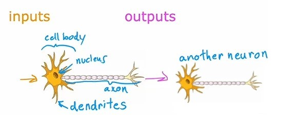

-   We don't need to understand all these biological terms of a neuron.

Now, let's see how an **Artifical neural network** works:

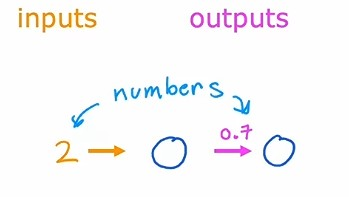

1. The circle in the above image is a _neuron_.
2. It takes some input (a number).
3. And do some computation based on that input and generates some output in numbers.
4. which then sends that output to other neuron.

Here, we have a single _neuron_ in the above image. But when we are building an _artificial neural network_ or _deep learning algorithm_, rather than building one neuron at a time, we will simulate many such neurons at the same time.

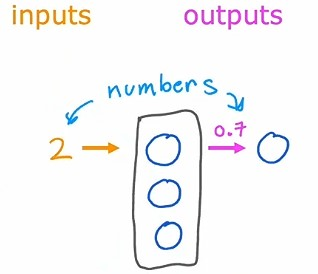

In the above image, there are $3$ neurons, which takes some numbers as input at same time, and do some computation and generate some output which is in numbers.

---

> #### Caveat (Important)
>
> We have discussed in very lay-mans way how a neural network works in brain, and in computers, but today we have no idea how actually the human brain works. Neuroscientists are making some fundamental breakthrough about how the brain works every year. ~ _Andrew Ng_

---

#### A Question

#### Why is that only in the last handful of years the neural networks have really taken off?

With the rise of internet, the digitalization of our society, the amount of data is increasing every day.

Let's see a graph of the amount of data:

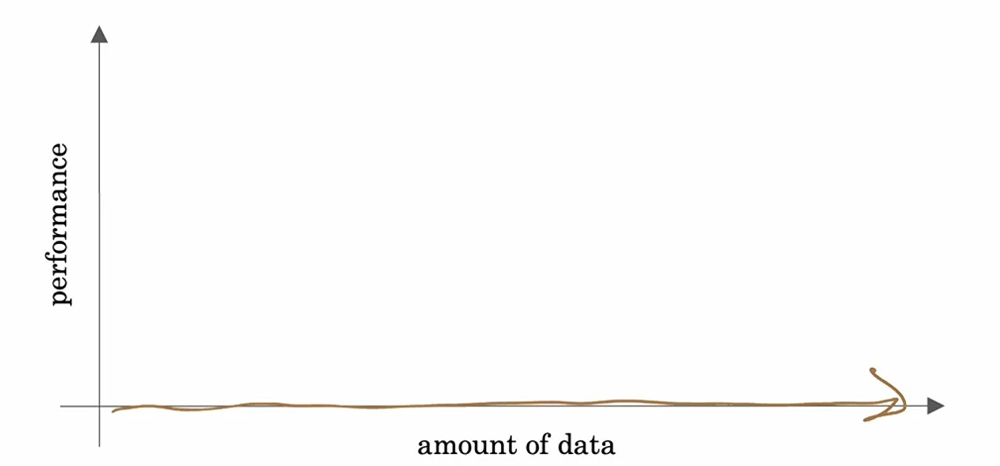

In above graph, on _x-axis_ we have _amount of data_ and on _y-axis_ we have _performance_.

The performance we are measuring is the performance of different techniques of machine learning.

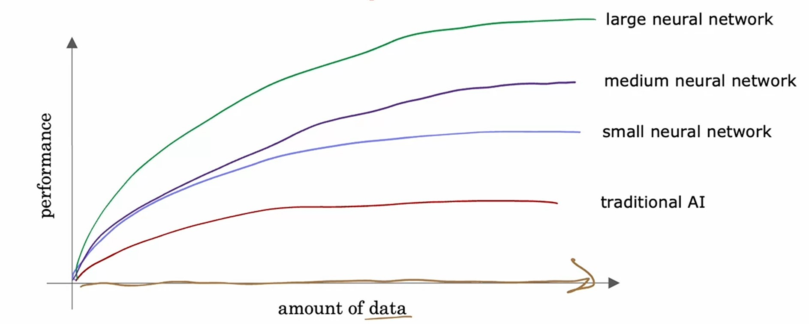

#### Observations:

1. As we are feeding up more data, the traditional machine-learning algorithms, such as _logistic regression_ and _linear regression_, are not performing good. Because they just can't able to scale with the amount of data we could feed it and they can't able to take effective advantage of all this data we had for different applications.

2. What AI researchers observe that if we were to train a small **neural network** on large amount of data, then the performance increase but not that much.
3. And if we were to train a medium-sized **neural network** on large amount of data, it's performance will increase sligtly better than a small **neural network**.
4. And if we were to train a very large **neural network**, to take advantage of that huge amount of data we have, then we could attain performance on anything ranging from _speech recognition_ to _image recognition_ to _natural language processing_ applications and many more.

So, this cause _deep learning_ to take the advantage off, and rise of faster **CPUs** and **GPUs**.

---

### How Neural Networks works

To understand how **neural networks** works, let's see an example of _Demand Prediction_ of a T-shirt.

#### Demand Prediction Example

In this example, we would like to know if a particular T-shirt will be a top seller, yes or no, based on the data we have of different t-shirts sold at different prices.

> **Application**
>
> This type of application is used by retailers today in order to plan better inventory levels as well as marketing campaings.
>
> If you know what's likely to be a top seller, you would plan, for example, to just purchase more of that stock in advance.

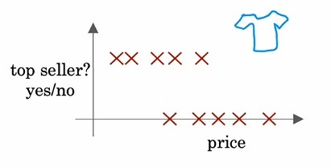

-   In the above graph, we have _price_ on _x-axis_ and _top seller_ on _y-axis_.

-   And, input feature (_x_) is _price_ and output feature a.k.a target variable (_y_) is _top seller_.

-   If we use _logistic regression_ and then _sigmoid function_ will be:

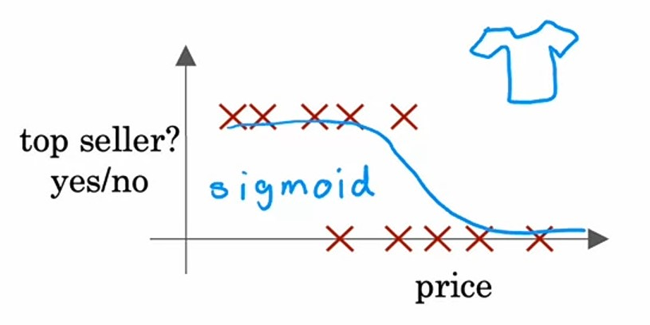

-   And output will be like this:
    $$\frac{1}{1 + e^{(-\vec{w} \cdot \vec{x} + b)}}$$

-   Here, we have assigned the output to $f(x)$, but for **neural networks**, let's call it $a$:

$$a = \frac{1}{1 + e^{(-\vec{w} \cdot \vec{x} + b)}}$$

-   The term $a$ stands for **activation** and it's actually a term from neuroscience, where it refers to how much a neuron is sending a high output to other neurons.

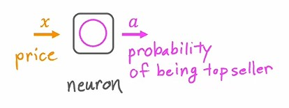

-   Here, this neuron takes _x_ as input i.e. _price_ and generates an output _a_ which is the probability of being a top seller.

-   Another way to think of a neuron is a tiny little computer which takes a number _a_ as input and do some computation which is _sigmoid function_ and outputs a number _b_.

So, now we have seen how a single neuron works. Now let's see how to create a **neural network** consists of many neurons and features.

1. Let's say in _Demand prediction_, we have $4$ features and a target variable $y$:

-   1. price
-   2. shipping cost
-   3. marketing
-   4. material
-   Top seller ($y$)

2. To become a T-shirt _top seller_, it depends upon some factors like:

-   1. Affordability
-   -   It includes the price and shipping cost of the T-shirt.
-   2. Awareness
-   -   It includes the marketing of the T-shirt.
-   3. percieved quality
-   -   It includes the material and price both, because some people think if the price is high, means T-shirt is of good quality.

3. So, these $3$ factors are depend upon $4$ features.
4. Now, let's create a single neuron for each of these factors.

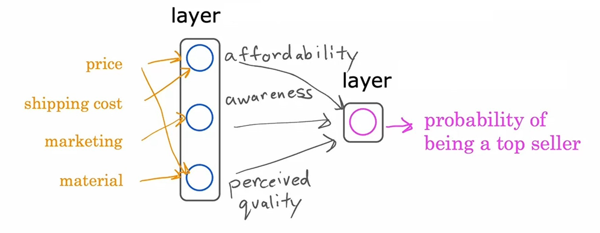

5. In the above image, you can see that we have $3$ neurons in a single line, which also known as **_layer_**.

    > A layer is a grouping of neurons which takes as input same or similar features and turn them into an output of few numbers together. ~ _Andrew Ng_

6. So, in the above image, we have total $2$ layers, $1^{st}$ is layer of factors and $2^{nd}$ is layer of output.

7. We can call the _factors_ layer as _hidden layer_ because, we only have access to the input features and output features of the data, the inner factors are computed automatically.

8. The layer which gives the output is called _output layer_, which obviously do some computation on $3$ numbers, which are provided by _hidden layer_ and gives a single output, which will be the probability of being a top seller.

9. The $3$ factors are based on $4$ features, which are the inputs for _hidden layer_ in which, some neuron takes $2$ features together and some neuron takes only single feature and doing some computation and returning $3$ outputs.

10. Let's take the input features and store them in a vector $\vec{x}$
11. The $3$ factors in are called as **activations** of _hidden layer_, because in neuroscience, it referes to the degree that the biological neuron is sending a high output value or sending some electrical impulses to other neurons.
12. The _output layer_ is also known as **activation**, because it is giving an output.
13. So, this is a **neural network**.

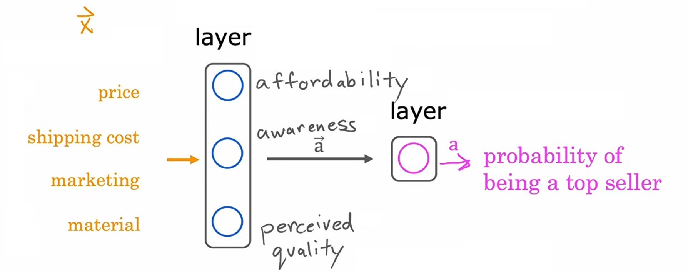

14. Which takes $4$ numbers, then the _hidden layer_ uses these $4$ numbers and do some computation and gives $3$ new numbers also called _activation values_, which send to the final _output layer_ which uses these $3$ numbers and do some computation and give us a single output.

> One way to think of this **neural network** is that, think the _hidden layers_ as input features which uses _logistic regression_ and gives some output i.e. the probability of being a top seller. ~ _Andrew Ng_

Here, we are selecting these $3$ factors explicitly, but the cool thing about **neural network** is that, it takes all the input features for each neuron and find out best features by itself, means it is doing _feature Engineering_ automatically.

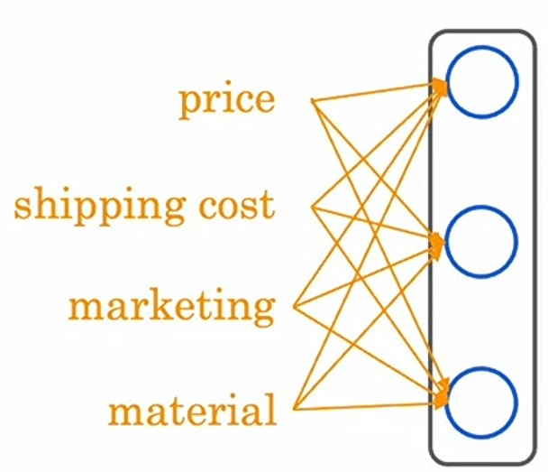

So, now we have seen a **neural network**, with a single _hidden layer_.

---

#### Multiple hidden layers

Now, let's see some examples of multiple _hidden layers_ in a **neural network**:

#### Two hidden layers

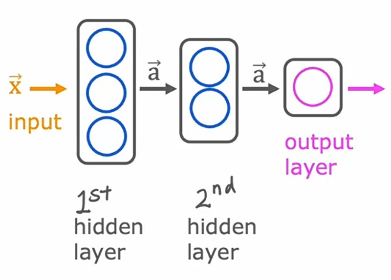

Here, you can see we have $2$ _hidden layers_ in this **neural network**

So, what it does is, it takes a vector $\vec{x}$ as input and then pass this values into $1^{st}$ _hidden layer_ which do some computation and gives $2$ numbers as output which are also called _activation values_ and then $2^{nd}$ _hidden layer_ take those numbers and do some computation with them and gives a single output _activation value_.

---

#### Three hidden layers

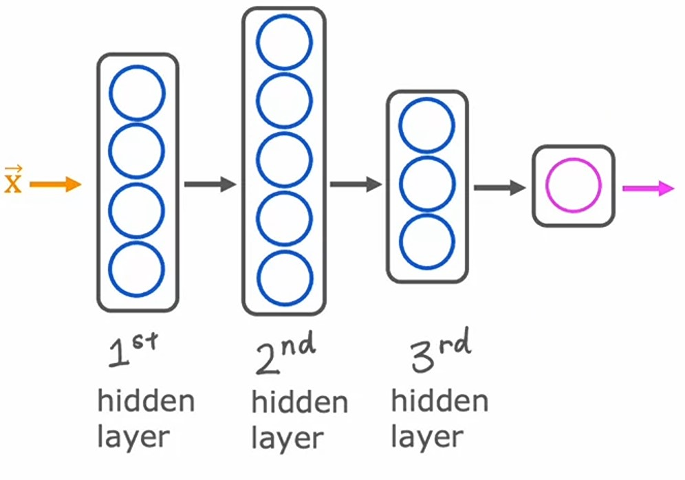

In this image, we have $3$ _hidden layers_ in the **neural network**.

So, it takes a set of input features $\vec{x}$ and pass them into $1^{st}$ _hidden layer_ which do some computation and gives $5$ numbers as output or _activation values_ and then $2^{nd}$ _hidden layer_ take those numbers and do some computation with them and gives $3$ _activation values_ and then $3^{rd}$ _hidden layer_ take those numbers and do some computation with them and gives a single output _activation value_.

> While building a **neural network**, one of the decisions we need to make is how many hidden layers do we want and how many neurons we want each layer to have. This decides the \*Architecture for a **neural network\***.
>
> And choosing the right number of hidden layers and number of hidden units per layer can have an impact on the performance of a leaerning algorithm. ~ _Andrew Ng_

---

#### Recognizing Images

Let's see how **neural network** works in **computer vision** applications like _recognizing images_.

#### Face Recognition

Let's take an example of _Face Recognition_.

1. We have this image, and we want to make a **neural network** which take this image as input and gives us a single output classifiying the person is "**ABC**".

2. This image is of $1000$ by $1000$ pixels.
3. If we see this as a grid, then we have a grid of $1000$ rows and $1000$ columns, where each cell has some pixel value.

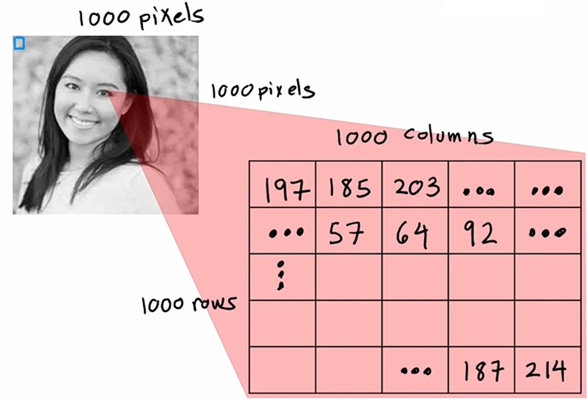

4. And if we put all the pixels in a vector $\vec{x}$, then it's shape will be $1,000,000$.

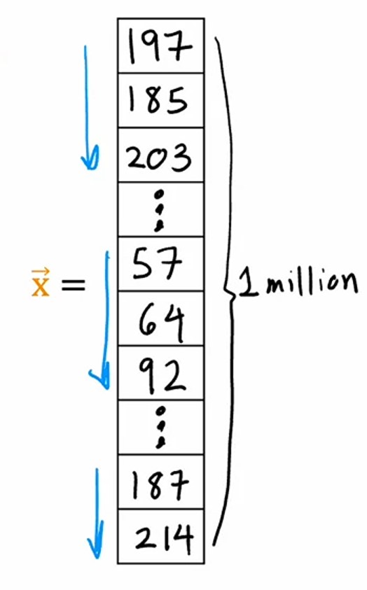

5. So, we are creating a **neural network** which takes an image as input and output it's identity.
6. This is how it's **neural network** will look like:

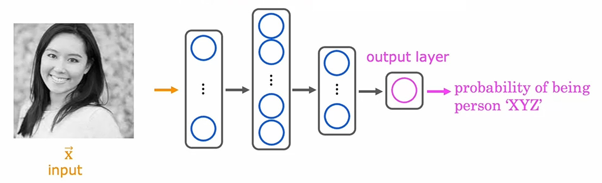

7. It has total of $4$ layers, out of which $3$ are _hidden layers_ and $1$ is _output layer_.
8. So, as we know, this image is fed into the $1^{st}$ _hidden layer_ of neurons, which then extract some features from it.
9. Then, it pass the extracted features to $2^{nd}$ _hidden layer_ of neurons, which also do some computation and extract some features out of it.
10. Then, it pass the extracted features to $3^{rd}$ _hidden layer_ of neurons, which also do the same.
11. Finally, from the extracted features of $3^{rd}$ _hidden layer_, the _output layer_ computes and estimates the probability of the face being the person "**ABC**".

Now, let's visualize what these _hidden layers_ of neurons are doing.

1. The $1^{st}$ _hidden layer_ of neurons is finding very small patches of images, like the edges in the image.

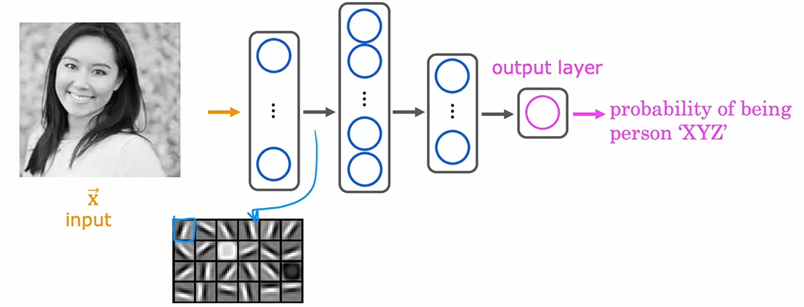

2. The $2^{nd}$ _hidden layer_ of neurons are grouping the small patches and finding patterns of different parts of image like ears, bottom of nose etc...

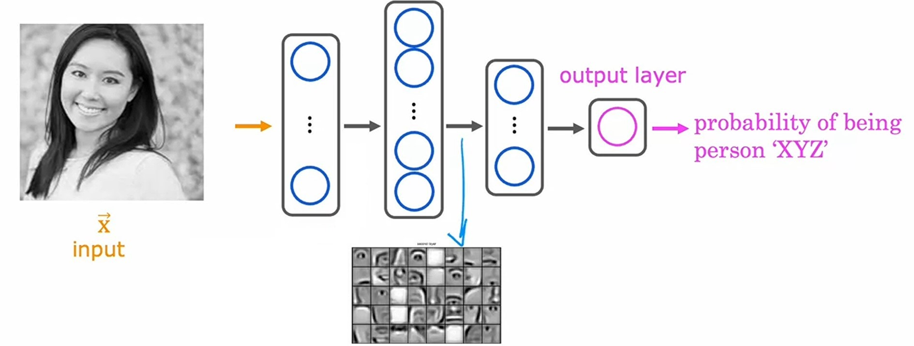

3. The $3^{rd}$ _hidden layer_ of neurons are grouping the small parts of image and finding a face in the image.

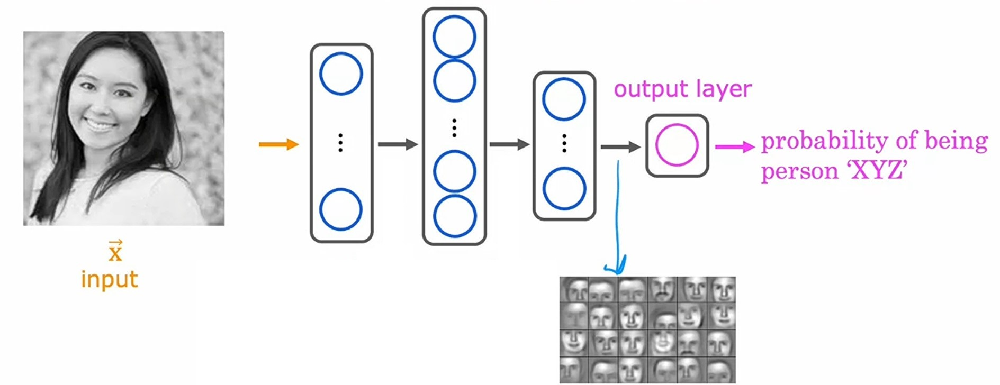

4. So, what you can see is, starting layer is looking for very tiny pixels of details, then from that, the $2^{nd}$ is looking for small parts of image and then by grouping them, the final _hidden layer_ is finding big parts of image like face, shoulders etc...

> A remarkable thing about the **neural network** is, it can learn these feature detectors at the different _hidden layers_ all by itself.
>
> In the _Face recognition_ example, we are not telling it to find edges, then ears,nose, it is atuomatically finding them. ~ _Andrew Ng_

---

#### Car Classification

Now, let's see an example of _Car Classification_, how **neural networks** are classifiying whether there is a car present or not.

1. Similar to _Face recognition_, first we have to convert this image into a grid of pixels.
2. And it's **neural network** looks like this:

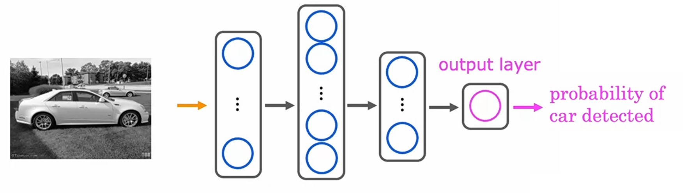

3. It also has total of $4$ layers, out of which $3$ are _hidden layers_ and $1$ is _output layer_.
4. So, $1^{st}$ _hidden layer_ will find small pixels like edges in the image.
5. Then, $2^{nd}$ _hidden layer_ will find small parts of image and group them like wheel, lights etc...
6. Then, $3^{rd}$ _hidden layer_ will find big parts of image and group them like leftmost view of car, doors etc...
7. Finally, the _output layer_ will estimate the probability of the car is present in the image.

---

### Quizzes

#### Practice Quiz: The problem of Overfitting

#### Question 1

    
    Answer to <b>question 1</b>

If you have selected option <em>1st, 3rd and 4th</em> then you are right! <b>Explanation:</b> Yes, a neuron is a part of a neural network. Yes, a layer is a grouping of neurons in a neural network. Yes, an activation is the number calculated by a neuron (and an activation is a vector that is output by a layer that contains multiple neurons).

#### Question 2

    
    Answer to <b>question 2</b>

If you think it's <em>True</em> then you are right! <b>Explanation:</b> Artificial neural networks use a very simplified mathematical model of what a biological neuron does.

