# Week 1 - Neural Networks

## Ch 2: Neural Network Model

### Neural Network layer

Let's see how each layer of neural networks works.

-   We are taking example of _Demand prediction_, where we have to predict whether a T-shirt is the top seller or not.
-   We have a total $4$ features $\vec{x}$ and a target variable $y$.
-   1. price
-   2. shipping cost
-   3. marketing
-   4. material
-   Top seller ($y$)

And we have a **neural network** like this:

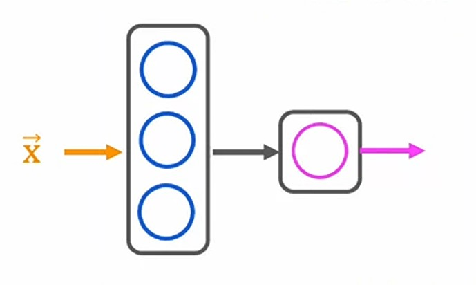

where, we input the features $\vec{x}$ and we have $1$ _hidden layer_ and an output laye which outputs the target variable $y$.

#### Layer 1: Hidden layer

Let's zoom in layer 1 _Hidden layer_.

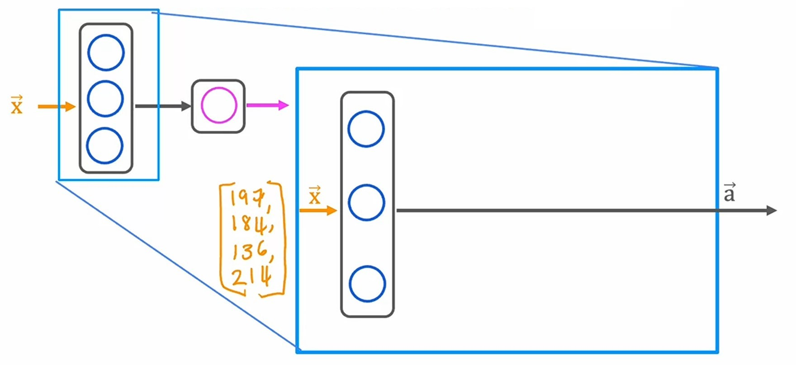

1. We have input features $\vec{x} = \begin{bmatrix} 197 \\ 184 \\ 136 \\ 214 \end{bmatrix}$

2. We have total $3$ neurons in this layer, so for each layer we have an _activation function_ which is a _logistic sigmoid function_.

$$f_{\vec{w}, {b}}(\vec{x}) = \frac{1}{1 + e^{-z}}$$
$$\text{where z is}$$
$$z = \vec{w} \cdot \vec{x} + b$$

3. Each neuron will take all input features $\vec{x}$ and use _sigmoid function_ to get the output.
4. For $1^{st}$ neuron, we'll pass the parameters $\vec{w}$ and $b$ as $\vec{w}_1$ and $b_1$.
5. And it's output will be $0.3$.

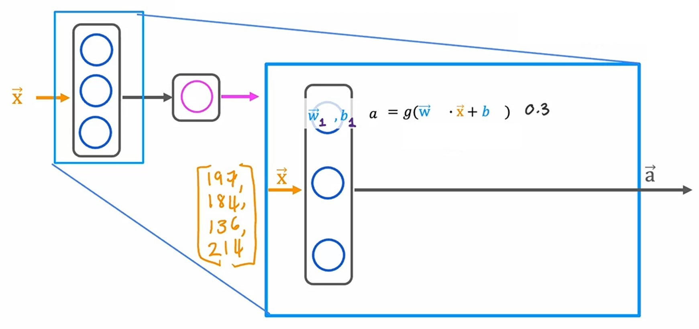

6. For $2^{nd}$ neuron, we'll pass the parameters $\vec{w}$ and $b$ as $\vec{w}_2$ and $b_2$.
7. And it's output will be $0.7$.

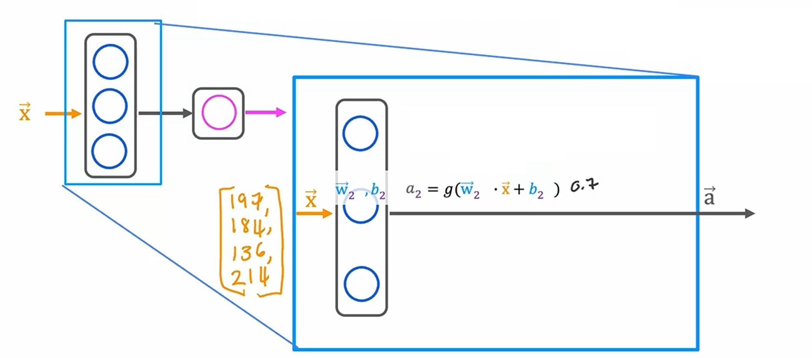

8. For $3^{rd}$ neuron, we'll pass the parameters $\vec{w}$ and $b$ as $\vec{w}_3$ and $b_3$.
9. And it's output will be $0.2$.

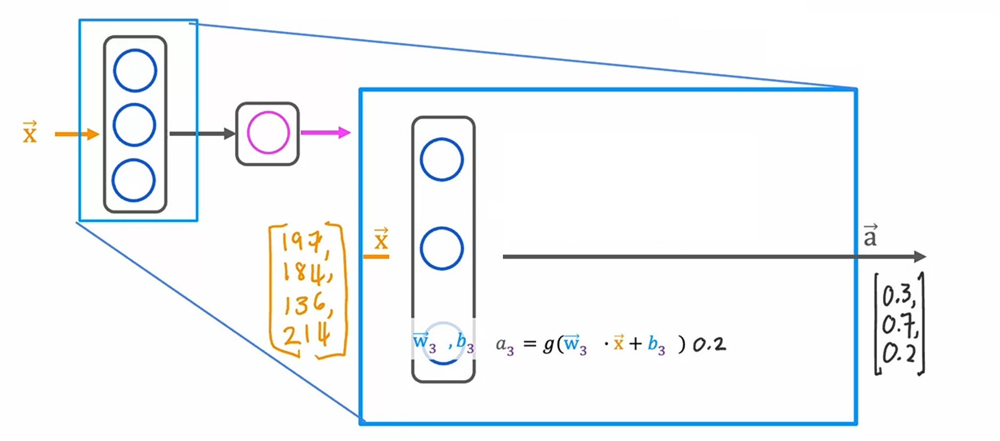

10. Let's store all these outputs in a vector $\vec{a}$.
11. So, $\vec{a} = \begin{bmatrix} 0.3 \\ 0.7 \\ 0.2 \end{bmatrix}$
12. We'll denote the parameters of layer 1 with $^{[1]}$.
13. And the output of layer 1 $\vec{a}^{[1]} = \begin{bmatrix} 0.3 \\ 0.7 \\ 0.2 \end{bmatrix}$

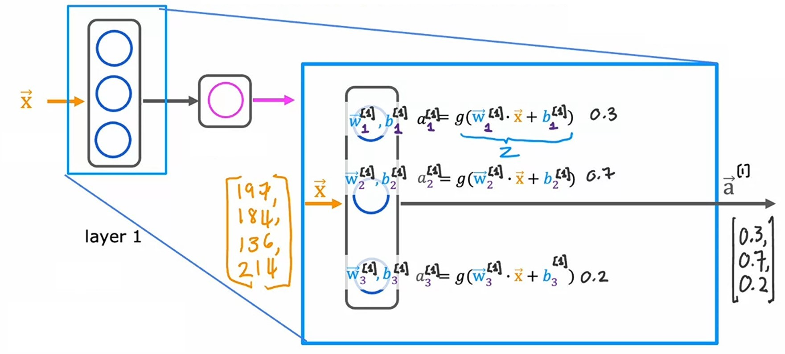

---

#### Layer 2: Output layer

Let's zoom in layer 2 _Output layer_.

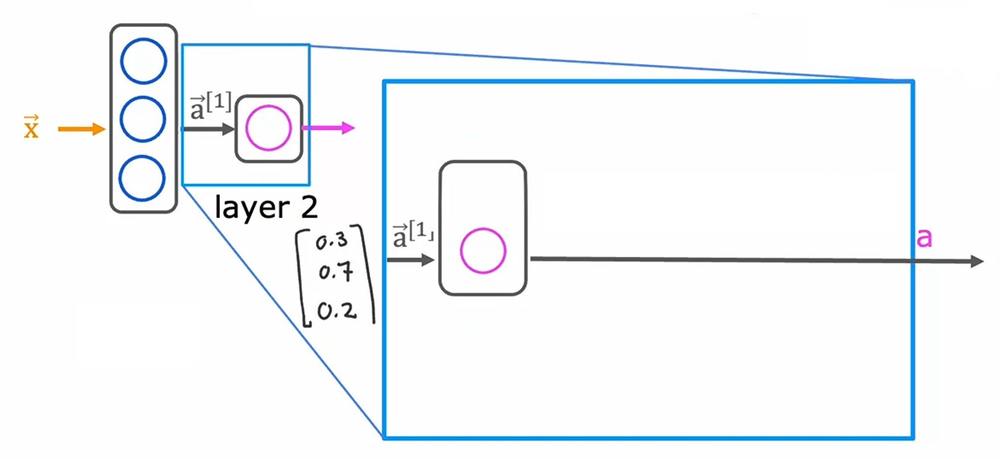

1. In _output layer_, we have $1$ neuron.
2. We have input features $\vec{a}^{[1]} = \begin{bmatrix} 0.3 \\ 0.7 \\ 0.2 \end{bmatrix}$, which is the output of layer 1.
3. Same as _hidden layer_, we also have _logistic sigmoid function_ as our _activation function_.
   $$f_{\vec{w}, {b}}(\vec{x}) = \frac{1}{1 + e^{-z}}$$
   $$\text{where z is}$$
   $$z = \vec{w} \cdot \vec{x} + b$$
4. And we'll denoe the parameters of layer 2 with $^{[2]}$.
5. It's output will be $0.84$.

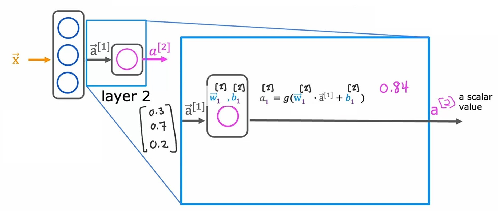

---

#### Threshold

As we do in _logistic regression_, we have a threshold of $0.5$ to separate predicted variable $\hat{y}$ between two classes i.e. $0$ and $1$, which determines whether the output will be $0$ or $1$.

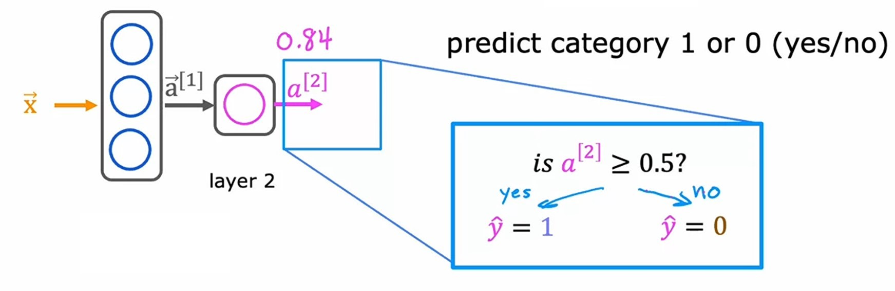

So, for _Demand prediction_ example, with the input features $\vec{x} = \begin{bmatrix} 197 \\ 184 \\ 136 \\ 214 \end{bmatrix}$, the output from the **neural network** i.e. the predicted variable $\hat{y} = 1$.

---

> By convention, when we say a **neural network** has _l_ layers, where _l_ is the number of layers, it includes all the _hidden layers_ as well as _output layer_. But it doesn't include the _input layer_. ~ _Andrew Ng_

|                              Notations                               | Description                                                                                                                                                                    |
| :------------------------------------------------------------------: | :----------------------------------------------------------------------------------------------------------------------------------------------------------------------------- |
|                                 $j$                                  | $j^{th}$ unit ($j^{th}$ neuron) of a single layer                                                                                                                              |
|                                 $l$                                  | $l^{th}$ layer of a **neural network**                                                                                                                                         |
|                         $\vec{x} = a^{[0]}$                          | input vector $\vec{x}$ is same as $a^{[0]}$                                                                                                                                    |
| $a^{[l]}_j = g(\vec{w}_j^{[l]} \cdot \vec{a}_j^{[l-1]} + b_j^{[l]})$ | $g$ is the activation function   $a^{[l]}_j$ is the $j^{th}$ activation value of $l^{th}$ layer   $\vec{a}^{[l-1]}_j$ is the activation output of previous $l-1$ layer |

---

### Making predictions (forward propagation)

Let's say we are working on _Handwritten digit recognition_. And we have to recognize whether the digit in an image is $0$ or $1$.

So, we can use _logistic regression_ for this _Binary classification_ problem.

The image we have $64$ pixels i.e. $8 \times 8$, in which all the all the pixel values $255$ represents white space, and the $0$ value pixels represent the black pixels which denotes the digit.

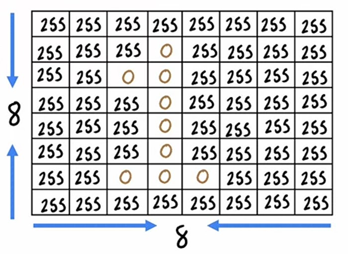

1. we have a total of $64$ features as our input $\vec{x}$.
2. And the **neural network** is this:

3. In this **neural network**, we have total $3$ layers, out of which $2$ are _hidden layers_ and $1$ is _output layer_.
4. In $1^{st}$ layer, we have total $25$ neurons.
5. So, the computation of $1^{st}$ layer goes from $j = 1$ to $j = 25$.
6. And, our formula will be:
$$\vec{a}^{[1]} = \begin{bmatrix} g\left(\vec{w}^{[1]}_1 \cdot \vec{x} + b^{[1]}_1\right) \\ \vdots \\ g\left(\vec{w}^{[1]}_{25} \cdot \vec{x} + b^{[1]}_{25}\right) \end{bmatrix}$$

7. In $2^{nd}$ layer, we have total $15$ neurons.
8. So, the computation of $2^{nd}$ layer goes from $j = 1$ to $j = 15$.
9. And, our formula will be:
$$\vec{a}^{[2]} = \begin{bmatrix} g\left(\vec{w}^{[2]}_1 \cdot \vec{a}^{[1]} + b^{[2]}_1\right) \\ \vdots \\ g\left(\vec{w}^{[2]}_{15} \cdot \vec{a}^{[1]} + b^{[2]}_{15}\right) \end{bmatrix}$$

10. In $3^{rd}$ layer which is an _output layer_, we have total $1$ neuron.
11. The otuput of this **neural network** will be the probability of a _handwritten digit_ being $1$.
12. And our formula will be:
    $$\vec{a}^{[3]} = g\left(\vec{w}^{[3]}_1 \cdot \vec{a}^{[2]} + b^{[3]}_1\right)$$
13. Then, we will apply _threshold_ of $0.5$ to $\vec{a}^{[3]}$ to get the output as $0$ or $1$.

> #### Forward propagation
>
> In the above **neural network**, we are computing from left to right, where we start from $a^{[1]}$ to $a^{[3]}$, so this type of algorithm is known as _forward propagation_ algorithm. Because we are propagting the activations of neurons from left to right. ~ _Andrew Ng_
>
> 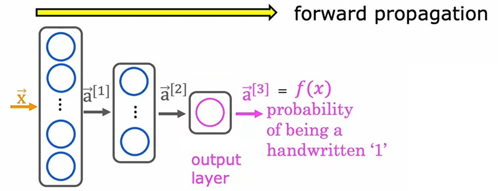

---

### Jupyter lab: Neurons and layers [🔗](../codes/W1%20-%20L1%20-%20Neurons%20and%20Layers.ipynb)

---

### Quizzes

#### Practice Quiz: Neural Network Model

#### Question 1

    
    Answer to <b>question 1</b>

If you have selected option <em>a</em> then you are right! <b>Explanation:</b> Yes! The superscript [2] refers to layer 2. The subscript 3 refers to the neuron in that layer. The input to layer 2 is the activation vector from layer 1.

#### Question 2

    
    Answer to <b>question 2</b>

If you selected option <em>d (The estimated probability that the input image is of a number 1, a number that ranges from 0 to 1.)</em> then you are right! <b>Explanation:</b> Yes! The neural network outputs a single number between 0 and 1.

#### Video Quiz 1

    
    Answer to <b>video quiz 1</b>

If you have selected option <em>a</em> then you are right!

