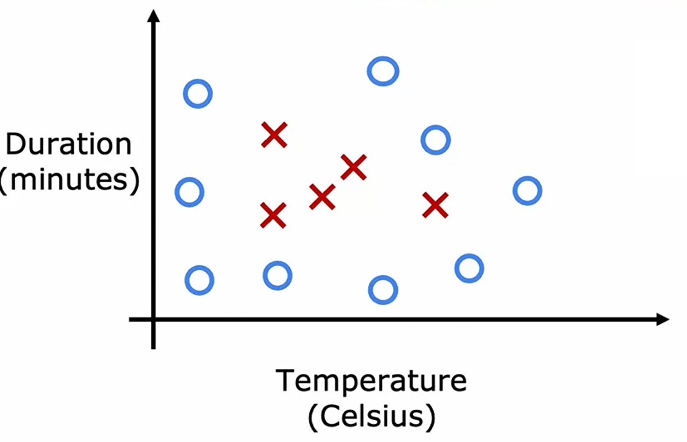
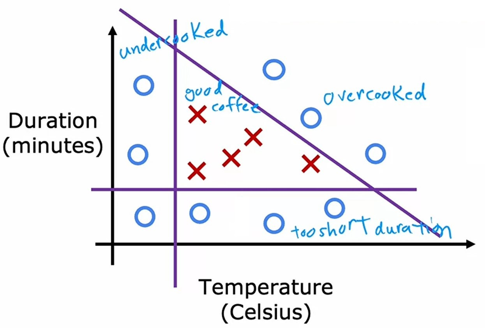
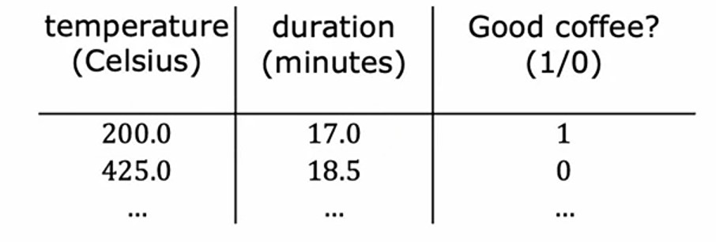
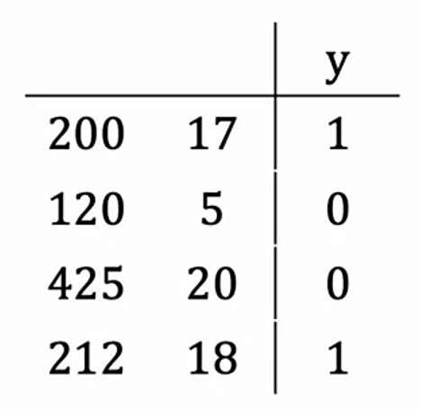

# Week 1 - Neural Networks

## Ch 3: Tensorflow Implementation

### Inferencing in Code

Let's see how can we implement a **neural network** in code using _tensorflow_ library.

> #### Tensorflow
>
> _Tensorflow_ is a library in _Python_ which is widely used to make **ML** and **DL** models.

#### Coffee Roasting Example

Let's take an example of **coffee roasting** process.

While _roasting_ the _coffee_ we need to take care of $2$ paramters:

1. _Temperature_
2. _Duration_

Let's say we have roasted our _coffee_ for different _durations_ with different _temperatures_. And the graph of _roasted coffee_ looks like this:



Here,

1. red ❌ cross signfies $1$ i.e. _coffee_ is roasted perfectly.
2. blue <font size="4" color="#00CCFF">○</font> circle signfies $0$ i.e. _coffee_ is not roasted properly.



In the graph, we can see that:

1. If we roast the _coffee_ with too less _temperature_, then the _coffee_ will not be roasted. It will be **undercooked**.
2. If we roast the _coffee_ with vey high _temperature_, and for less minutes, then also the _coffee_ will not be roasted. Because of **less duration**.
3. If we roast the coffe with high _temperature_ and for a long time, then also the _coffee_ will note be roasted. It will be **overcooked**.
4. If we roast the coffee with average _temperature_ and for few _minutes_, then the _coffee_ will be roasted perfectly. We can see the _triangle_ in the graph, where ❌ is present.

So, the task is we are given the _temperature_ and _duration_ of the _coffee_ and we need to predict whether the _coffee_ is roasted perfectly or not.

1. Say we have a **neural network** with the following architecture:


2. In this **neural network**, we have total $2$ layers.
3. In $1^{st}$ _hidden_ layer $\vec{a}^{[1]}$, we have $3$ neurons.
4. In $2^{nd}$ _output_ layer $\vec{a}^{[2]}$, we have $1$ neuron, which results the probability of the _coffee_ being roasted perfectly.
5. Then, we can apply _threshold_ of $0.5$ to the output of the _output_ layer $\vec{a}^{[2]}$ and see the result in $1$ or $0$.
6. First, let's write the **starter code** to import _tensorflow_ and _numpy_ library.

```python
import numpy as np
from tensorflow.keras.layers import Dense
```

7. If we input $\vec{x} = \begin{bmatrix} 200 \\ 17 \end{bmatrix}$, where the _temperature_ is $200\degree$ celsius and the _duration_ is $17$ minutes, the code will be:

```python
x = np.array([[200.0, 17.0]])
```

8. Here, `np.array()` is a function of _numpy_ library which is used to create a _numpy_ array.
9. And to create the $1^{st}$ _hidden_ layer $\vec{a}^{[1]}$, the code will be:

```python
layer_1 = Dense(units=3, activation="sigmoid")
a1 = layer_1(x)
```

10. `Dense` is a function of _tensorflow_ library which is used to create a layer.
11. `a1 = layer_1(x)` means that we are applying the _layer_1_ to the _x_ array, which is also the input of this **neural network**.
12. `units=3` means we have total $3$ neurons and `activation="sigmoid"` means we are using **sigmoid** function as the _activation function_ in the first _hidden_ layer $\vec{a}^{[1]}$.
13. Let's say output of `a1` is $\vec{a}^{[1]} = \begin{bmatrix} 0.2 \\ 0.7 \\ 0.8 \end{bmatrix}$
14. Now, let's create a $2^{nd}$ _output_ layer $\vec{a}^{[2]}$, the code will be:

```python
layer_2 = Dense(units=1, activation="sigmoid")
a2 = layer_2(a1)
```

15. Again we are using `Dense` function to create a layer and in `a2 = layer_2(a1)` we are applying the _layer_2_ to the _a1_ array, which is the output of the first _hidden_ layer $\vec{a}^{[1]}$.
16. `units=1` means we have total $1$ neuron and `activation="sigmoid"` means we are using **sigmoid** function as the _activation function_ in the second _output_ layer $\vec{a}^{[2]}$, and we are passing the output of the first _hidden_ layer $\vec{a}^{[1]}$ to the second _output_ layer $\vec{a}^{[2]}$.
17. Let's say `a2` outputs $\vec{a}^{[2]} = \begin{bmatrix} 0.8 \end{bmatrix}$
18. Then we'll apply _threshold_ and see the $\hat{y}$ as $1$ or $0$.

```python
yhat = 1 if a2 > 0.5 else 0
```

19. In this case, our `a2 = 0.8` so we will get $1$ as the output, which means our _coffee_ is roasted perfectly.

---

#### Handwritten Digit Recognition Example

Let's see another example of **Handwritten digit recognition**.

Our task is to take an image of a **handwritten digit** and predict whether the digit is $1$ or $0$.

We have an image like this:


-   The image we have $64$ pixels i.e. $8 \times 8$, in which all the all the pixel values $255$ represents white space, and the $0$ value pixels represent the black pixels which denotes the digit.

1. Say we have a **neural network** with the following architecture:


2. In this **neural network**, we have total $3$ layers.
3. In $1^{st}$ _hidden_ layer $\vec{a}^{[1]}$, we have $25$ neurons.
4. In $2^{nd}$ _hidden_ layer $\vec{a}^{[2]}$, we have $15$ neurons.
5. In $3^{rd}$ _output_ layer $\vec{a}^{[3]}$, we have $1$ neuron, which results the probability of the handwritten digit being $1$ or $0$.
6. Then, we can apply _threshold_ of $0.5$ to the output of the _output_ layer $\vec{a}^{[3]}$ and see the result in $1$ or $0$.
7. First, let's write the **starter code** to import _tensorflow_ and _numpy_ library.

```python
import numpy as np
from tensorflow.keras.layers import Dense
```

1. If we input $\vec{x} = \begin{bmatrix} 0.0 \\ \vdots \\ 245.0 \\ \vdots \\ 240.0 \\ \vdots \\ 0.0 \end{bmatrix}$, where we have total $64$ pixel values, the code will be:

```python
x = np.array([[0.0, ... 245.0, ... 240.0, ... 0.0]])
```

8. Here, `np.array()` is a function of _numpy_ library which is used to create a _numpy_ array.
9. And to create the $1^{st}$ _hidden_ layer $\vec{a}^{[1]}$, the code will be:

```python
layer_1 = Dense(units=25, activation="sigmoid")
a1 = layer_1(x)
```

10. `Dense` is a function of _tensorflow_ library which is used to create a layer.
11. `a1 = layer_1(x)` means that we are applying the _layer_1_ to the _x_ array, which is also the input of this **neural network**.
12. `units=25` means we have total $25$ neurons and `activation="sigmoid"` means we are using **sigmoid** function as the _activation function_ in the first _hidden_ layer $\vec{a}^{[1]}$.
13. Now, let's create a $2^{nd}$ _hidden_ layer $\vec{a}^{[2]}$, the code will be:

```python
layer_2 = Dense(units=15, activation="sigmoid")
a2 = layer_2(a1)
```

14. Again we are using `Dense` function to create a layer and in `a2 = layer_2(a1)` we are applying the _layer_2_ to the _a1_ array, which is the output of the first _hidden_ layer $\vec{a}^{[1]}$.
15. `units=15` means we have total $1$ neuron and `activation="sigmoid"` means we are using **sigmoid** function as the _activation function_ in the second _hidden_ layer $\vec{a}^{[2]}$, and we are passing the output of the first _hidden_ layer $\vec{a}^{[1]}$ to the second _hidden_ layer $\vec{a}^{[2]}$.
16. Now, let's create a $3^{rd}$ _output_ layer $\vec{a}^{[3]}$, the code will be:

```python
layer_3 = Dense(units=1, activation="sigmoid")
a3 = layer_3(a2)
```

17. Again we are using `Dense` function to create a layer and in `a3 = layer_3(a2)` we are applying the _layer_3_ to the _a3_ array, which is the output of the second _hidden_ layer $\vec{a}^{[2]}$.
18. `units=1` means we have total $1$ neuron and `activation="sigmoid"` means we are using **sigmoid** function as the _activation function_ in third _output_ layer $\vec{a}^{[3]}$, and we are passing the output of second _hidden_ layer $\vec{a}^{[1]}$ to the third _output_ layer $\vec{a}^{[3]}$.
19. Then we'll apply _threshold_ to output `a3` and see the $\hat{y}$ as $1$ or $0$.

```python
yhat = 1 if a2 > 0.5 else 0
```

---

### How data stored in Tensorflow ?
In Tensorflow, data is stored in **tensors**.

> #### Tensors
> A *tensor* is a multi-dimensional array of numbers, like a *matrix*.

When you are working with *Tensorflow*, you always need to work with *matrix* type of data, which by *tensorflow* converted to *tensor*.

#### Example

Let's take the example of *Coffee Roasting* problem.

And it's features are:



So, $\bold{X}$ will be:

$$\bold{X} = \begin{bmatrix}200 & 17.0 \\ 425 & 18.5 \\ \cdots & \cdots \end{bmatrix}$$

Whereas, in code it will written as:
```python
import numpy as np
import tensorflow as tf
```
#### A **numpy** array:
```python
# Input array
X = np.array([[200, 17], [425, 18.5]])
print(X)
```
**Output**
```python
array([[200. ,  17. ],
       [425. ,  18.5]])
```
#### A **tensor**:
```python
X = tf.constant([[200, 17], [425, 18.5]])
print(X)
```
**Output**
```python
tf.Tensor(
[[200.   17. ]
 [425.   18.5]], shape=(2, 2), dtype=float32)
```

---

### Building a Neural Network

So, now we've seen how we can write the *layers* in *tensorflow* to make a **neural network**.

But, now let's simplify the code, so that we don't need to pass the activation values on different layers again and again.

#### Coffe Roasting Problem Example

Let's take the example of *Coffee Roasting* problem.

Say, we have this data:



where, the first two columns are input features stored in $\vec{x}$ and the last column is the target variable stored in $\vec{y}$.

And the **neural network** is like this:


Let's write the starter code:
```python
import numpy as np
from tensorflow.keras import Sequential
from tensorflow.keras.layers import Dense
```

1. So far, we've written each *layer* of the **neural network** separately, and computes the input and pass the activation's values manually.
2. Now, let's see how we can combine all these *layers* together.

```python
layer_1 = Dense(units=3, activation="sigmoid")
layer_2 = Dense(units=2, activation="sigmoid")
model = Sequential([layer_1, layer_2])
```
3. In above code, we have `layer_1` and `layer_2` same as before, and now we are also using `Sequential` function in which we are passing a **list** of *layers* and assigning it to `model` variable.
4. `Sequential` function is used to create a **neural network** by sequentially string together the *layers* which we just passed in as **list**.
5. So, now we have created our **neural network** *model*.
6. To train this *model*, we need to call `model.compile()` function by passing some *parameters* to it.
```python
model.compile(...)
```
7. We know our training data's input features are in a matrix $\bold{X}$ and target variable is in a matrix $\bold{y}$.
```python
X = np.array([
       [200.0, 17.0],
       [120.0,  5.0],
       [425.0, 20.0],
       [212.0, 18.0]
       ])
y = np.array([1, 0, 0, 1])
```
8. To train our model on the data, we need to call `model.fit()` function by passing the input features and target variable.
```python
model.fit(X, y)
```
9. `model.fit()` will do automatically train the model with both the layers sequentially.
10. Let's say, we have some new data to predict the target variable stored in `X_new`. 
11. To predict the target variable, we need to call `model.predict()` function by passing the input features.
```python
model.predict(X_new)
```
12. `model.predict()` will predict the target variable for the input features `X_new` and returns the predicted target variable.

- By convention, we don't write *layers* separately in different variables, we just use `Dense` in the `Sequential` function directly like this:
```python
model = Sequential([
       Dense(units=3, activation="sigmoid"), 
       Dense(units=2, activation="sigmoid")
       ])
```

---

#### Handwritten Digit Recognition Example

Same as above code, we can write the *layers* in *tensorflow* using `Sequential` function to make a **neural network** like this:
```python
model = Sequential([
       Dense(units=25, activation="sigmoid"), 
       Dense(units=15, activation="sigmoid")
       Dense(units=1,  activation="sigmoid")
       ])
```
- To train the model, we'll call `model.compile()` and to learn the model with data we'll call `model.fit(X, y)` and to predict the target variable we'll call `model.predict(X_new)`.

---

### Jupyter lab: Coffee Roasting in Tensorflow [🔗](../codes/W1%20-%20L2%20-%20Coffee%20Roasting%20in%20Tensorflow.ipynb)

---

### Quizzes

#### Practice Quiz: Tensorflow Implementation

#### Question 1


<details>
<summary>    
    <font size='3' color='#00FF00'>Answer to <b>question 1</b></font>
</summary>
<p>If you have selected option <em>a (4)</em> then you are right!<br/><b>Explanation:</b><br/>Yes! Each call to the "Dense" function defines a layer of the neural network.</p>
</details>

#### Question 2


<details>
<summary>    
    <font size='3' color='#00FF00'>Answer to <b>question 2</b></font>
</summary>
<p>If you selected option <em>b ( Dense(units=4, activation='sigmoid'))</em> then you are right!<br/><b>Explanation:</b><br/>Yes! This will have 4 neurons and a sigmoid activation.</p>
</details>

#### Question 3


<details>
<summary>    
    <font size='3' color='#00FF00'>Answer to <b>question 3</b></font>
</summary>
<p>If you selected option <em>c (x = np.array[[200.0, 17.0]])</em> then you are right!<br/><b>Explanation:</b><br/>Yes! A row contains all the features of a training example. Each column is a feature.</p>
</details>
