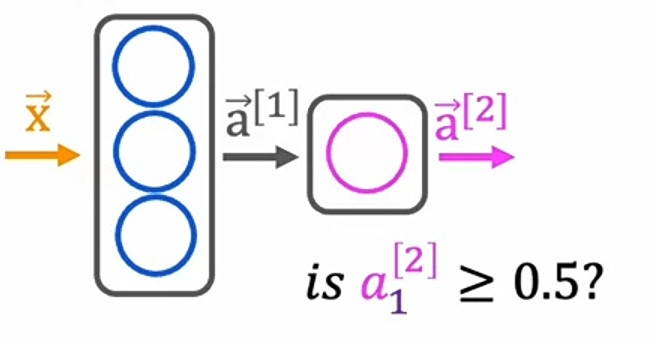
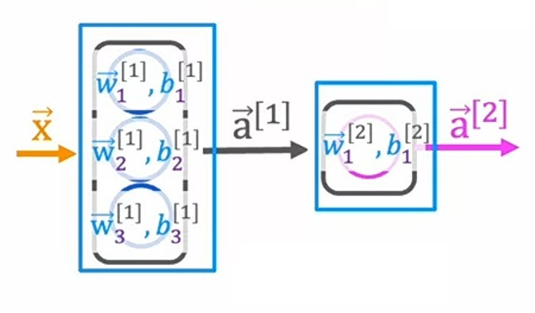

# Week 1: Neural Networks

## Ch 4: Neural Network Implementation in Python

In previous chapter, we implemented a **neural network** using the tensorflow library, just by writing $4-5$ lines of code.

Someone, may tell you just by writing $4-5$ lines of code, you can create a **neural network**.

> But I don't really want you to just call five lines of code and not really also know what the code is actually doing underneath the hood.
>
> Most machine learning engineers don't actually implement forward propagation in python that often we just use libraries like tensorflow and pytorch, but because I want you to understand how these algorithms work yourself so that if something goes wrong, you can think through for yourself, what you might need to change, what's likely to work, what's less likely to work.
>
> Let's also go through what it would take for you to implement for propagation from scratch because that way, even when you're calling a library and having it run efficiently and do great things in your application, I want you in the back of your mind to also have that deeper understanding of what your code is actually doing. ~ _Andrew Ng_

It's better to know the underlying implementation of the **neural network**, and so that if we encounter any kind of bug/error we can easily configure it out where the bug/error must be.

---

### Forward propagation in a single layer

Let's take the _Coffee Roasting_ example:

So, we have **neural network** like this:



And, for _neuron_ in each _layer_ we are using _sigmoid_ function as an _activation function_.



1. Let's say we have our input data is $X = \begin{bmatrix} 200 & 17 \end{bmatrix}$. In code it looks like this:

```python
import numpy as np
X = np.array([200, 17])
```

2. Let's focus on $1^{st}$ layer, we have $3$ _neurons_ $a^{[1]}_1$, $a^{[1]}_2$ and $a^{[1]}_3$.
3. For each _neuron_ we'll use _sigmoid function_.
4. Let's denote $a^{[2]}_1$ as `a2_1` in code.
5. For, $1^{st}$ neuron $a^{[1]}_1$, we have it's _sigmoid function_ as:
   $$a^{[1]}_1 = g\left(\vec{w}^{[1]}_1 \cdot \vec{x} + b^{[1]}_1\right)$$
6. Let's assign `w` and `b` with some random values, It's code will be:

```python
w1_1 = np.array([1, 2])
b1_1 = np.array([-1])
z1_1 = X @ w1_1 + b
a1_1 = sigmoid(z1_1)
```

7. Here, `sigmoid()` is a function which computes the sigmoid of $z$.
8. Similarly, for $2^{nd}$ neuron $a^{[1]}_2$, we have it's _sigmoid function_ and code will be:
   $$a^{[1]}_2 = g\left(\vec{w}^{[1]}_2 \cdot \vec{x} + b^{[1]}_2\right)$$

```python
w1_2 = np.array([-3, 4])
b1_2 = np.array([1])
z1_2 = X @ w1_2 + b
a1_2 = sigmoid(z1_2)
```

9. And for $3^{rd}$ neuron $a^{[1]}_3$, we have it's _sigmoid function_ and code will be:
   $$a^{[1]}_3 = g\left(\vec{w}^{[1]}_3 \cdot \vec{x} + b^{[1]}_3\right)$$

```python
w1_3 = np.array([5, -6])
b1_3 = np.array([2])
z1_3 = X @ w1_3 + b
a1_3 = sigmoid(z1_3)
```

10. Finally, we'll create a vector $a^{[1]}$ which consists of all the sigmoid values of neurons in $1^{st}$ layer.

```python
a1 = np.array([a1_1, a1_2, a1_3])
```

12. For $2^{nd}$ layer, we have $1$ _neuron_ $a^{[2]}_1$, it's _sigmoid function_ and code will be:
    $$a^{[2]}_1 = g\left(\vec{w}^{[2]}_1 \cdot \vec{a}^{[1]} + b^{[2]}_1\right)$$

```python
w2_1 = np.array([-7, 8])
b2_1 = np.array([3])
z2_1 = a1 @ w2_1 + b2_1
a2_1 = sigmoid(z2_1)
```

---

### Neural Network from Scratch

So, we have seen how to create _neurons_ for a single layer.

Let's simplify it and create `Dense` function which will create all _neurons_ for a single layer and return it's _activation_ values.

```python
def dense(a_in, W, b, g):
   units = W.shape[1]
   a_out = np.zeros(units)
   for j in range(units):
      w = W[:, j]
      z = (a_in @ w) + b[j]
      a_out[j] = g(z)
   return a_out
```

In above code,

1. We are creating a `dense` function which is computing `acitvation` values for all _neurons_ in a single layer.
2. We are passing `a_in` as input data,
3. `W` as weights in a matrix where each column is each neuron's weight, `b` as biases.
4. `g` is an activation function, example: `sigmoid`.

Let's create a neural network by creating a `Sequential` function for $4$ layers.

```python
def sequential(X):
   a1 = dense(X, w1, b1, sigmoid)
   a2 = dense(a1, w2, b2, sigmoid)
   a3 = dense(a2, w3, b3, sigmoid)
   a4 = dense(a3, w4, b4, sigmoid)
   return a4
```

In above code,

1. We are creating a `Sequential` function which is using `dense` function to create a layer of neurons.
2. In $1^{st}$ `dense` function call, we are passing `X` as input data.
3. But in other $3$ layers, we are passing _activation_ values computed by previous layers.
4. Finally, returning the activation values of last layer.

So, with this we have an idea how the underlying code is working in a **neural network**.

---

### Jupyter lab: Coffee Roasting Numpy [🔗](../codes/W1%20-%20L3%20-%20Coffee%20Roasting%20Numpy.ipynb)

---

### Quizzes

#### Practice Quiz: Neural Network Implementation in Python

#### Question 1


<details>
<summary>    
    <font size='3' color='#00FF00'>Answer to <b>question 1</b></font>
</summary>
<p>If you have selected option <em>c</em> then you are right!<br/><b>Explanation:</b><br/>Use the numpy.dot function to take the dot product. The sigmoid function shown in lecture can be a function that you write yourself (see course 1, week 3 of this specialization), and that will be provided to you in this course.</p>
</details>

#### Question 2


<details>
<summary>    
    <font size='3' color='#00FF00'>Answer to <b>question 2</b></font>
</summary>
<p>If you selected option <em>b (In the columns of W)</em> then you are right!<br/><b>Explanation:</b><br/>The w parameters of neuron 1 are in column 1. The w parameters of neuron 2 are in column 2, and so on.</p>
</details>

#### Question 3


<details>
<summary>    
    <font size='3' color='#00FF00'>Answer to <b>question 3</b></font>
</summary>
<p>If you selected option <em>a (3 times)</em> then you are right!<br/><b>Explanation:</b><br/>Yes! For each neuron in the layer, there is one column in the numpy array W. The for loop calculates the activation value for each neuron. So if there are 5 columns in W, there are 5 neurons in the dense layer, and therefore the for loop goes through 5 iterations (one for each neuron).</p>
</details>
