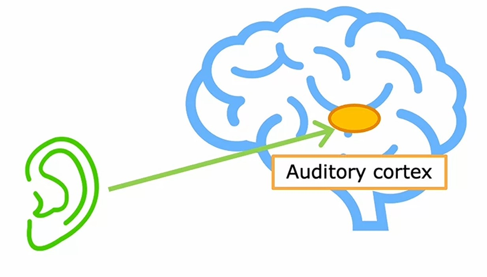
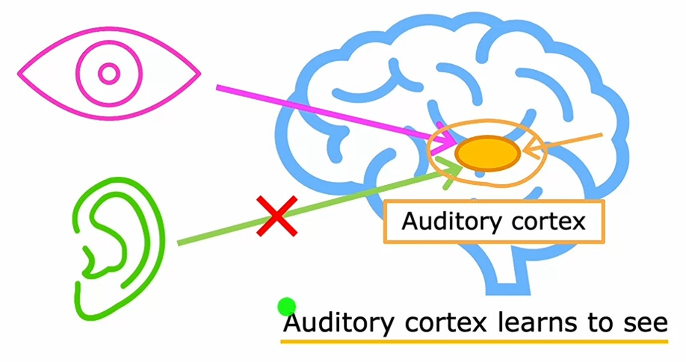
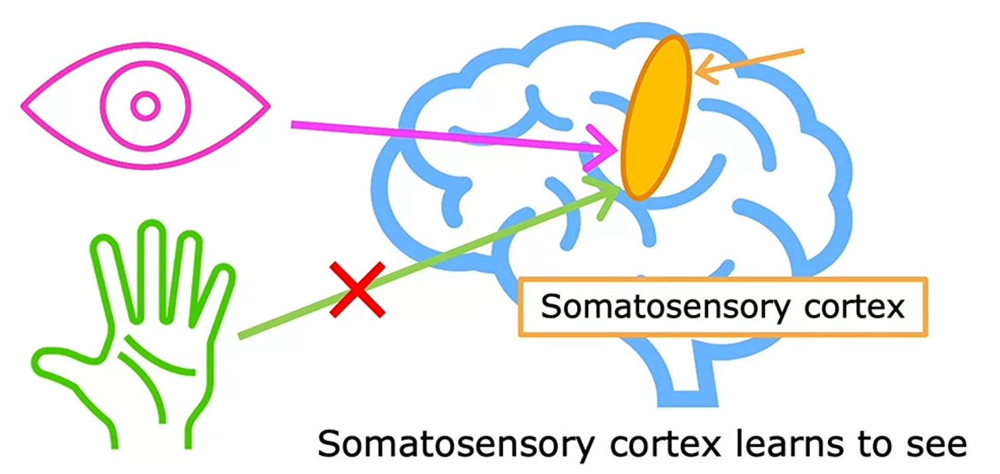
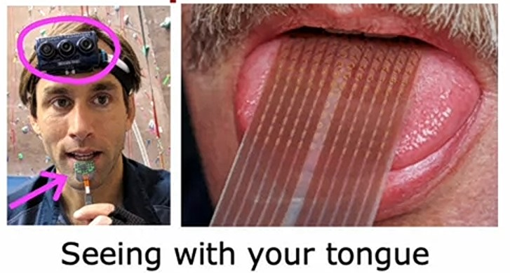
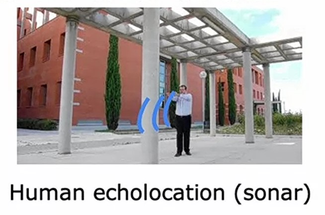
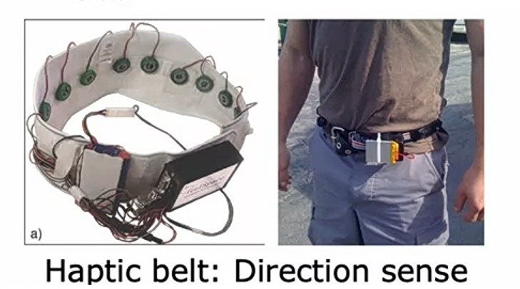

# Week 1: Neural Networks

## Ch 5: Speculations on Artificial General Intelligence (AGI)

### Types of AI

Generally, we know **Artificial Intelligence** as **AI**.

But there are $2$ different types of **AI**:

#### 1. ANI: Artificial Narrow Intelligence

**ANI** focuses on doing one specific task, a narrow task, sometimes it can be really valuable like _self-driving vehicles_, _web search_ or **AI** applied in _farming_ or _factories_.

#### 2. AGI: Artificial General Intelligence

**AGI** is doing anything what a human can do.

---

### Comparison of Neural Networks in _Brain_ and _Artificial_ Neural Networks

> With the rise of modern deep learning, we started to simulate neurons and with faster and faster computers and even GPUs we can simulate even more neurons.
>
> I think there was a big hope many years ago, that if we only could simulate the human brain or something like a human brain, then we've really intelligent systems. But it's not simple as that. ~ _Andrew Ng_

Because of $2$ reasons:

#### 1. Our Algorithms are much simpler than the biological neuron

> If we look at the _Artificial_ **Neural Networks**, we're building, they are so simple that a _logistic regression_ unit is really nothing like what any biological neuron is doing. ~ _Andrew Ng_

##### 2. No Idea how the brain works

> Even today, I think we have almost no idea how the brain works. There are still fundamental questions about how exactly does a neuron map from inputs to outputs that we just don't know. Trying to simulate that in a computer, much less a single logistic function is just so far from an accurate model of what the human brain actually does. ~ _Andrew Ng_

---

### The _One learning Algorithm_ hypothesis

> There have been some fascinating experiments done on animals that shows or strongly suggests that the same piece of biological brain tissue can do a surprisingly wide range of tasks. This has led to the one learning algorithm hypothesis that maybe a lot of intelligence could be due to one or a small handful of learning algorithms. If only we could figure out what that one or small handful of algorithms are, we may be able to implement that in a computer someday. ~ _Andrew Ng_

#### 1. Rewiring Auditory cortex

The yellow part in below image is the image of _Auditory Cortex_. Our brain is wired to feed signales from ears in the form of electrical impulses, depend on the sound our ear detects to that _Auditory Cortex_.

If we rewire the brain, and somehow connect the _Auditory Cortex_ to our eye, then the _Auditory Cortex_ learns to see.

#### 2. Rewiring Somastosensory cortex

The yellow part in below image is _Somastosensory Cortex_. The _Somastosensory Cortex_ is a part of the brain that is responsible for the sensing the touch.

Similarly, as above, if we rewire it and connect it to eye and feed in images, then the _Somastosensory cortex_ learns to see.

---

### Experiments

> There's been a sequence of experiments like this, showing that many different parts of the brain, just depending on what data is given can learn to see, or learn to feel, or learn to hear as if there was maybe one algorithm that just depending on what data or this given, learns to process that inputs accordingly. ~ _Andrew Ng_

#### 1. Visualize with Tongue

> There happens systems build which take a camera mounted on forehead and maps it to a pattern of voltages in a grid on someone's tongue. By mapping a grayscale image to a patter of voltages on your tongue, this can help people that are not cited line individuals learn to see with your tongue. ~ _Andrew Ng_

#### 2. Human Echolocation (Sonar)

> Thare are some fascinating experiments with human echolocation or humans sonar, so animals like dolphins and bats uses sonar to see, and researchers have found that if you train humans to make clicking sounds and listen to how that bounces off sorroundings, humans can sometimes learn some degree of human echolocation.

#### 3. Haptic belt (Direction sense)

> A haptic belt is, if you mount a ring of buzzes around your waist and program it using a magnetic compass so that say, the buzzers to the North most directions are always vibrating slowly, then you somehow gain a direction sens, which some animals have, but humans don't. Then it just feels like you're walking around and you just know where North is, it doesn't feel like that part of my waist is buzzing. ~ _Andrew Ng_

