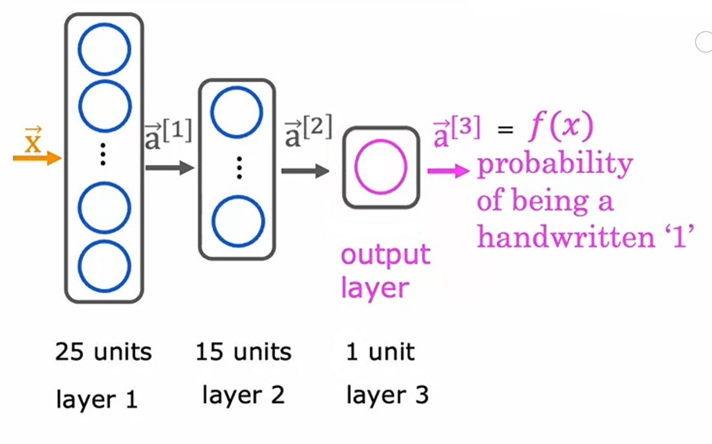
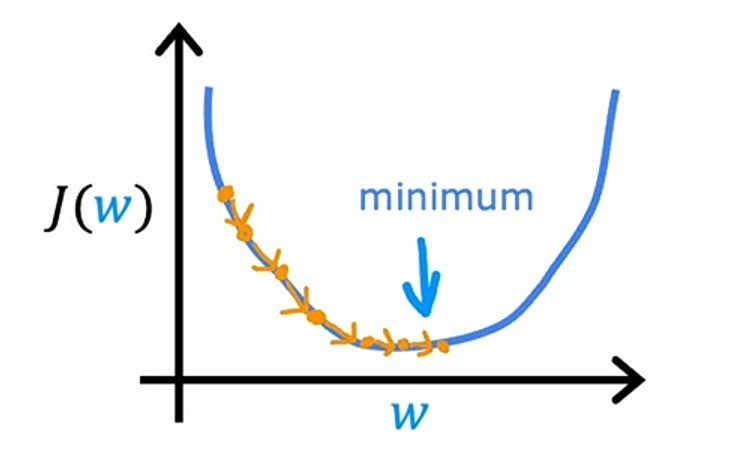
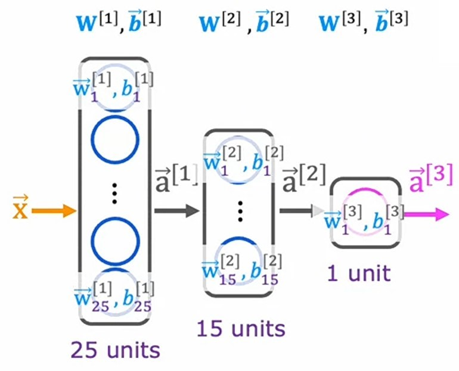
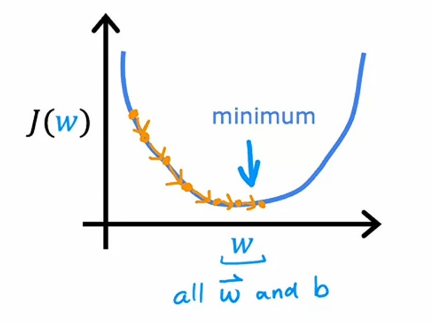

# Week 2: Neural Network Training

**Overview**:

-   Train a neural network on data using TensorFlow
-   Understand the difference between various activation functions (sigmoid, ReLU, and linear)
-   Understand which activation functions to use for which type of layer
-   Understand why we need non-linear activation functions
-   Understand multiclass classification
-   Calculate the softmax activation for implementing multiclass classification
-   Use the categorical cross entropy loss function for multiclass classification
-   Use the recommended method for implementing multiclass classification in code
-   (Optional): Explain the difference between multi-label and multiclass classification

---

## Ch 1: Neural Network Training

### Tensorflow Implementation

So, now we know how to create a **Neural Network** in _Python_ using _Tensorflow_. Let's see how we can train a **neural network** using _Tensorflow_.

We'll use _Hand-written Digit Recognition_ example.

It's **neural network** architecture is:



-   Here, we have
-   -   total $3$ layers
-   -   In $1^{st}$ layer we have $25$ neurons
-   -   In $2^{nd}$ layer we have $15$ neurons
-   -   In $3^{rd}$ _output_ layer, we have $1$ neuron.

#### Step 1: Creating Neural Network

```python
from tensorflow.keras import Sequential, layers.Dense

model = Sequential([
    layers.Dense(25, activation='sigmoid'),
    layers.Dense(15, activation='sigmoid'),
    layers.Dense(10, activation='sigmoid')
])
```

-   We are creating it's **neural network**.

#### Step 2: Compiling Neural Network

```python
from tensorflow.keras.losses import BinaryCrossentropy

model.compile(loss=BinaryCrossentropy())
```

-   We are compiling our **neural network**.
-   Compiling the model means to specify the loss function which are going to use, here we are using `BinaryCrossentropy` loss function.

#### Step 3: Training Neural Network

```python
model.fit(X, Y, epochs=100)
```

-   We are using `model.fit` to train our **neural network** model.
-   `epoch` is same as the number of iterations in _gradient descent_.

---

### Training Details

Let's see how a **neural network** is trained actually in _Tensorflow_.

But, first let's recap how we train a model in _Logistic Regression_.

### Training in Logistic Regression

#### Step 1: Defining the model

$1^{st}$ step is to define our model, specifying how to compute _output_ for given _input_ $X$ and parameters $w$ and $b$.

In _logistic regression_, we use the following formula:
$$f_{\vec{w}, b}(\vec{x}) = g(z)$$
where:
$$z = \vec{w} \cdot \vec{x} + b$$
$$g(z) = \frac{1}{1 + e^{-z}}$$

So, in code it is:

```python
def sigmoid(z):
    return 1 / (1 + np.exp(-z))

def logistic_regression(X, w, b):
    z = np.dot(X, w) + b
    return sigmoid(z)
```

#### Step 2: Finding Error

$2^{nd}$ step is to find the error between the actual values $y$ and the predicted values $\hat(y)$.

In _logistic regression_, we use _Logistic loss_ function to compute _loss_ for each value and then sum it up and average the result using _cost function_.

-   _Logistic loss_ function formula:
    $$L(f_{\vec{w}, b}(\vec{x}^{(i)}), y^{(i)}) = - y^{(i)} logf_{\vec{w},b}(\vec{x}^{(i)})) - (1 - y^{(i)}) log(1 - f_{\vec{w},b}(\vec{x}^{(i)}))$$

-   _Cost function_ formula:
    $$J(\vec{w}, b) = \frac{1}{m}\sum^m_{i=1} L \left(f_{\vec{w}, b}(\vec{x}^{(i)}), y^{(i)}\right)$$

-   In Code it is:

```python
def logistic_loss(y, y_hat):
    return -y * np.log(y_hat) - (1 - y) * np.log(1 - y_hat)

def cost(y, y_hat):
    m = len(y)
    return np.sum(logistic_loss(y, y_hat)) / m
```

#### Step 3: Minimizing the Error



$3^{rd}$ step is to minimize the error using _gradient descent_.

We'll use _gradient descent_ to minimize the error and find _global minima_ for parameters $\vec{w}$ and $b$. We will calculate the derivative of each parameter and update it using the formula:
$$w = w - \alpha \frac{\partial}{\partial w}$$
$$b = b - \alpha \frac{\partial}{\partial b}$$

In code it is:

```python
w = w - alpha * dj_dw
b = b - alpha * dj_db
```

---

### Training in Neural Network

Now, let's see how we train our **neural network**.

Steps are same as _logistic regression_, but here we will use _Tensorflow_.

let's take the example of _Hand-written Digit Recognition_ example.

It's **neural network** architecture is:


-   Here, we have
-   -   total $3$ layers
-   -   In $1^{st}$ layer we have $25$ neurons
-   -   In $2^{nd}$ layer we have $15$ neurons
-   -   In $3^{rd}$ _output_ layer, we have $1$ neuron.

#### Step 1: Defining the model

$1^{st}$ step is to define our model.

In _neural network_, we do:

```python
from tensorflow.keras import Sequential, layers.Dense

model = Sequential([
    layers.Dense(units=25, activation='sigmoid'),
    layers.Dense(units=15, activation='sigmoid'),
    layers.Dense(units=1, activation='sigmoid')
])
```

-   We are using `Sequential` class to create a **neural network**.
-   `Dense` function to create a layer.
-   `units` parameter is the number of neurons in the layer.
-   `activation` is the _activation function_ which computes the output for each neuron in the layer.

Based on the code, we know that what parameters $W$ and $B$ are to passed in each layer. Like $w^{[1]}$ and $b^{[1]}$ for $1^{st}$ layer and so on...



#### Step 2: Finding Error

In $2^{nd}$ step, we need to find error between the actual values $y$ and the predicted values $\hat(y)$.

In _neural network_, we use `BinaryCrossnetropy` loss function which is another name of _Logistic loss_ function.

> #### BinaryCrossentropy
>
> In _Tensorflow_, it is called `BinaryCrossentropy` loss function, because in _statistics_, this function is called _cross-entropy_ loss function and _binary_ means that it is used for binary classification problem.

_Tensorflow_ will automatically compute the error for us based on the provided cost function.

It's code is:

```python
from tensorflow.keras.losses import BinaryCrossentropy
model.compile(loss=BinaryCrossentropy())
```

#### Mean Squared Error
If we want to solve a Regression problem, then we can use *Mean Squared Error* as loss function.
```python
from tensorflow.keras.losses import MeanSquaredError
model.compile(loss=MeanSquaredError())
```

#### Step 3: Minimizing the Error


$3^{rd}$ step is to minimize the error using _gradient descent_.

If we are using *Gradient Descent* to minimize the error, then we need to calculate the derivative of each parameter of each neuron $j$ in each layer $l$ and update it using the formula:

$$\text{repeat} \{$$
$$w^{[i]}_j = w^{[i]}_j - a\frac{\partial}{\partial w_j} J(\vec{w}, b)$$
$$b^{[i]}_j = b^{[i]}_j - a\frac{\partial}{\partial b_j} J(\vec{w}, b)$$

In code it is:
```python
model.fit(X, y, epochs=100)
```

- While training the model, fitting the data it will use *gradient descent* automatically.
- `epochs` is the number of iterations.

To find best parameters, **neural networks** use an algorithm called *back propagation* in order to compute derivative terms. 

*Tensorflow* will do all of this for us. It implements backpropagation all within this function called fit. All we have to do is call `model.fit`, `X`, `y` as our training set, and tell it to do so for $100$ iterations or $100$ epochs. 

---

### Quizzes

#### Practice Quiz: Tensorflow Implementation

#### Question 1


<details>
<summary>    
    <font size='3' color='#00FF00'>Answer to <b>question 1</b></font>
</summary>
<p>If you have selected option <em>d (binary classification (classification with exactly 2 classes)</em> then you are right!<br/><b>Explanation:</b><br/>Yes! Binary cross entropy, which we've also referred to as logistic loss, is used for classifying between two classes (two categories). </p>
</details>

#### Question 2


<details>
<summary>    
    <font size='3' color='#00FF00'>Answer to <b>question 2</b></font>
</summary>
<p>If you selected option <em>d (model.fit(X, y, epochs=100)</em> then you are right!<br/><b>Explanation:</b><br/>Yes! The third step of model training is to train the model on data in order to minimize the loss (and the cost)</p>
</details>

