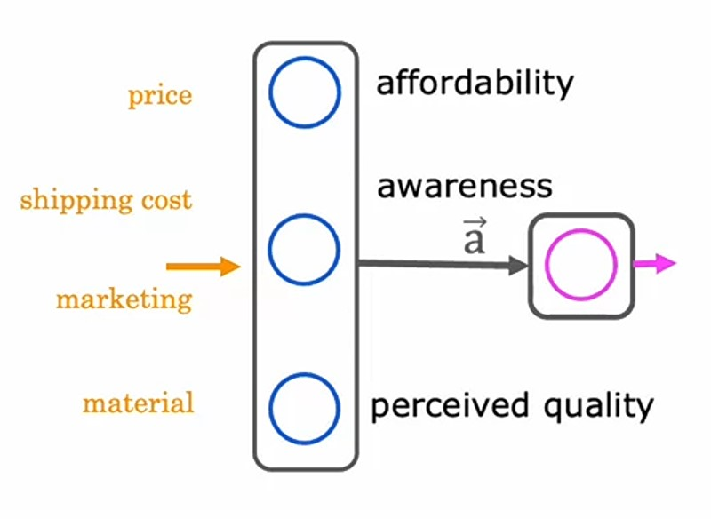
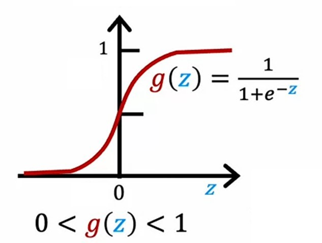
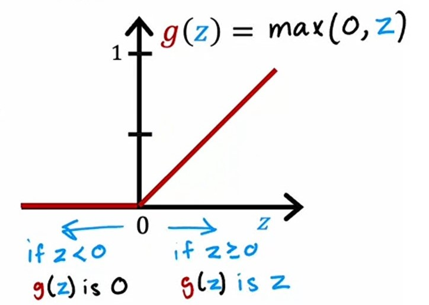
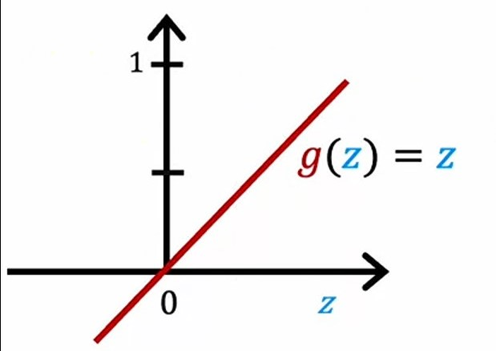
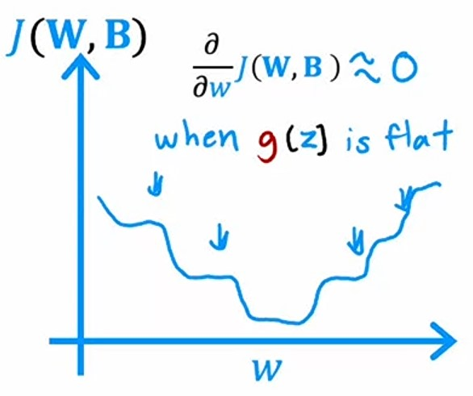
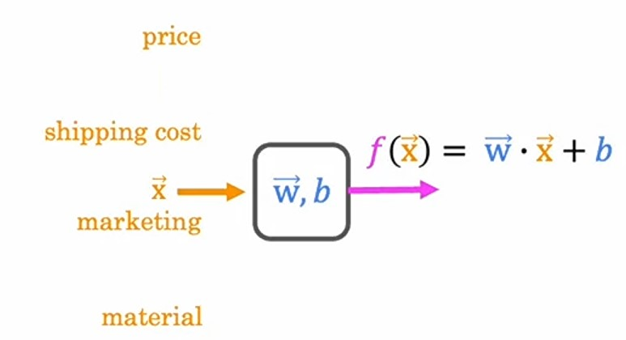
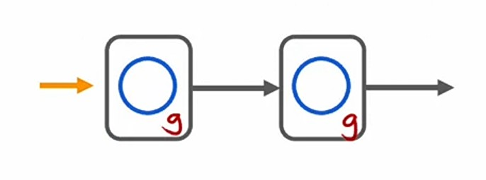
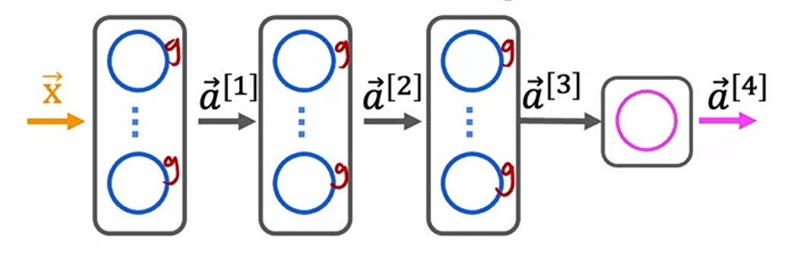

# Week 2: Neural Network Training

# Ch 2: Activation Functions

Till now, we've been using _sigmoid_ function as our _activation function_ in **neural networks** for each unit.

But _sigmoid_ function is not suitable for every feature.

### T-shirt Demand prediction

Let's take an example of _T-shirt Demand prediction_.

where, we have $4$ features and $1$ target:

-   $x_1$ price
-   $x_2$ shipping cost
-   $x_3$ marketing
-   $x_4$ material
-   $y$ whether t-shirt is in demand $1$ or not $0$.

And, it's **neural network** architecture is:

where, we have:

-   $1$ hidden layer with $3$ neurons
-   -   $1^{st}$ neuron computes _affordability_ of t-shirt
-   -   $2^{nd}$ neuron computes _awareness_ of t-shirt
-   -   $3^{rd}$ neuron computes _perceived quality_ of t-shirt
-   $1$ output neuron computes _prediction_ of t-shirt demand

We can use _sigmoid_ function as activation function for _affordability_ and _perceived quality_, because either t-shirt is affordable or not, and it's upto their quality or not.

But in _awareness_, the user maybe not aware, or some aware or they knows about t-shirt very well. So, here _sigmoid_ function is not suitable, because it just results either $0$ or $1$, but it can be in a big range of values from $0$ to maybe $10$ or a much bigger number.

So, let's see some alteranatives of _sigmoid_ function.

---

### Alternatives to the Sigmoid activation function

We know that our _sigmoid function_ gives probability of target and after applying threshold, we can get either $0$ or $1$.

where:

-   $z$ is dot product of input and weights and added bias or _linear regression_ function
    $$z = \vec{w} \cdot \vec{x} + b$$
-   g(z) is the _sigmoid_ function
    $$g(z) = \frac{1}{1 + e^{-z}}$$
-   If $g(z)$ is less than $0.5$, then $\hat{y} = 0$
-   If $g(z)$ is equal to or greater than $0.5$, then $\hat{y} = 1$.

---

#### Rectified Linear Unit (ReLU)

We can use _ReLU_ function as _activation_ function which gives the output from $0$ to a very large positive number.

where:

-   $z$ is same as in _sigmoid function_
    $$z = \vec{w} \cdot \vec{x} + b$$
-   Rather than using _sigmoid_ function as $g(z)$, we will find max of $0$ and $z$, whichever is max, is the output.
    $$g(z) = \max(0, z)$$
-   If $z$ is negative, then $g(z)$ is $0$.
-   If $z$ is $0$ or positive, then $g(z)$ is $z$.

#### Linear Activation function

There is another _activation_ function known as _Linear activation_ function.

Which is just $z$,
where:

-   $z$ is same as in _sigmoid function_
    $$z = \vec{w} \cdot \vec{x} + b$$
-   Rather than applying some formula to $z$, it just outputs $z$, that's why it results in single straight line, with an angle of $45\degree$
    $$g(z) = z$$

-   Sometimes, we often call it as **no** _activation_ function, because it's just resulting $z$.
-   So, whenever we hear that _no activation_ function is used, means we are using _linear activation function_ which just returns $z$.

---

### Choosing Activation Functions

So, now we know about $3$ _activation_ functions, _linear_, _sigmoid_ & _ReLU_.

Let's see when to use which one of the _activation_ function.

### Output layer

Depending on the type of output of _target_ variable $y$, we need to choose appropriate activation function.

We know $3$ types of _activation_ functions:

-   _Linear_ function
-   _sigmoid_ function
-   _ReLU_ function

Let's see when to use which one of the _activation_ function.

#### Binary Classification problem

When we have to predict the target $y$ as $0$ or $1$, then we'll use _sigmoid_ activation function.

**Example**:

-   We have some input features _cholesterol level_, _blood pressure_ and _blood sugar_ based on them, we need to predict whether a person has _Heart Disease_ $1$ or not $0$.

#### Regression problem

#### Positive output

When we have to predict the target $y$ as **continuous** values, but only _positive_ values, then we'll use _ReLU_ activation function.

**Example**:

-   We have some input features _house size_, _no. of rooms_, _no. of floors_ and _house type_ based on them, we need ot predict the _price_ of the house, which can never be _negative_, it either be $0$ or _positive_.

#### Positive and negative output

When we have to predict the target $y$ as **continuous** values both positive and negative, then we'll use _linear_ activation function.

**Example**:

-   We have some input features _opening_, _closing_ and _high_ and _low_ prices, based on them, we need to predict whether a _stock price_ will go up or down.

---

### Hidden layers

#### Sigmoid activation function

When we have to predict the target $y$ as $0$ or $1$, then we'll use _sigmoid_ activation function.

**Example**:

-   We have some input features _cholesterol level_, _blood pressure_ and _blood sugar_ based on them, we need to predict whether a person has _Heart Disease_ $1$ or not $0$.

#### ReLU activation function

For _hidden_ layers, most common choice is use _ReLU_ activation function.

Because of $2$ reasons:

1. **ReLU** function is faster than _sigmoid_ function. In _ReLU_, we just need to compute the _maximum_ of $z$ and $0$. In contrast, in _sigmoid_ function, we need to compute $e^{-z}$ which is not efficient as _ReLU_.
2. In the graph, if we visualize **ReLU**, it only gets _flat_ when $z$ is negative. But _sigmoid_ function gets _flat_ in $2$ places, when it reaches near to $0$ or $1$.

And if we visualize the _gradient descent_ graph, it will also get _flat_ sometimes, because value of _sigmoid_ function is used to compute the _cost_ and it is used to compute the _gradient descent_.

---

### Need of Activation Functions in Neural Networks

If we don't use any _activation_ function, or _linear activation_ function (by defauly), then we will get a _linear regression_ model, which makes the purpose of **neural network** meaningless.

Let's see some examples why no _activation_ functions makes **neural network** useless:

#### Single layer neural network

If we have a single neuron **neural network**, which has a single _hidden_ layer with a single neuron and an _output_ layer.

-   If we have a single feature $x$, which we pass in $1^{st}$ layer, it's _activation_ value $a^{(1)}$ will be:
    $$a^{[1]} = w^{[1]}_1x + b^{[1]}_1\tag1$$

-   And _output_ layer's _activation_ value $a^{[2]}$ will be:
    $$a^{[2]} = w^{[2]}_1a^{[1]}+ b^{[2]}_1\tag2$$

-   If we substitute $a^{[1]}$ in $eq2$, we get:
    $$a^{[2]} = w^{[2]}_1\left(w^{[1]}_1x + b^{[1]}_1\right)+ b^{[2]}_1\tag3$$
    $$a^{[2]} = \left(w^{[2]}_1w^{[1]}_1\right)x + w^{[2]}_1 b^{[1]}_1 + b^{[2]}_1$$
-   And if we set:
    $$a^{[2]} = \underbrace{\left(w^{[2]}_1w^{[1]}_1\right)}_wx + \underbrace{w^{[2]}_1 b^{[1]}_1 + b^{[2]}_1}_b$$

-   Then, we will get a _linear regression_ equation:
    $$a^{[2]} = w x + b$$

-   where, $w$ is just the _linear_ function of input $x$.

> Rather than using a neural network with one hidden layer and one output layer, we might as well have just used a linear regression model.
>
> In _linear algebra_, a linear function of a linear function is itself a linear function.  ~ _Andrew Ng_

---

#### Multi layer neural network

Now, if we use *linear activation* function for all layers in multi-layer **neural network**, then also the output will result same as *linear regression* function, which just make **neural network** meaningless.

$$\vec{a}^{[4]} = \vec{w}^{[4]}_1 \cdot \vec{a}^{[3]} + b^{[4]}_1$$

**Also,**
- If we use *sigmoid activation* function for *output* layer and *linear activation* function for all *hidden* layers in the **neural network**, then the output will result same as *logistic regression* function, which also makes **neural network** meaningless.

$$\vec{a}^{[4]} = \frac{1}{1 + e^{-z}}$$

where:
$$z = \vec{w}^{[4]}_1 \cdot \vec{a}^{[3]} + b^{[4]}_1$$

---

### Jupyter lab: ReLU activation [🔗](../codes/W2%20-%20L1%20-%20ReLU%20activation.ipynb)

---

### Quizzes

#### Practice Quiz: Activation Functions

#### Question 1

    
    Answer to <b>question 1</b>

If you have selected option <em>c (ReLU (recitified linear unit)</em> then you are right! <b>Explanation:</b> Yes! A ReLU is most often used because it is faster to train compared to the sigmoid. This is because the ReLU is only flat on one side (the left side) whereas the sigmoid goes flat (horizontal, slope approaching zero) on both sides of the curve.

#### Question 2

    
    Answer to <b>question 2</b>

If you selected options <em>a (ReLU) and c (linear)</em> then you are right! <b>Explanation:</b> Yes! ReLU outputs values 0 or greater, and housing prices are positive values. Yes! A linear activation function can be used for a regression task where the output can be both negative and positive, but it's also possible to use it for a task where the output is 0 or greater (like with house prices).

#### Question 3

    
    Answer to <b>question 3</b>

If you think it's <em>False</em> then you are right! <b>Explanation:</b> Yes! A neural network with many layers but no activation function is not effective. A linear activation is the same as "no activation function".

