# Week 2: Neural Network Training

## Ch 3: Multiclass Classification

### What is Multiclass Classification?

> _Multiclass classification_ refers to the **classification** problems where you can have more than just two possible output labels so not just $0$ or $1$. ~ _Andrew Ng_

In _Multiclass classification_ problem, we have to classify the _target_ variable $y$ into multiple classes (more than $2$), whereas in _Binary classification_, we classify the target variable $y$ into two classes ($0$ or $1$).

If the target variable $y$ has $n$ no. of discrete values (where $n\not ={2}$), then we can use _Multiclass classification_.

---

#### Hand-written digit recognition

Earlier, in _Hand-written digit recognition_, we are classifying the target variable $y$ into $2$ classes $0$ or $1$, whether the digit is a zero or a one, which is considered as _Binary classification_ problem.

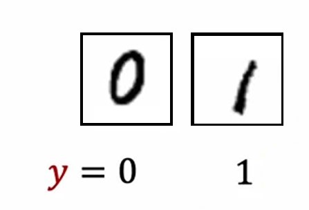

Now, we will classify the _Hand-written digit_ into $10$ classes $0$ to $9$, which is _Multiclass classification_ problem.

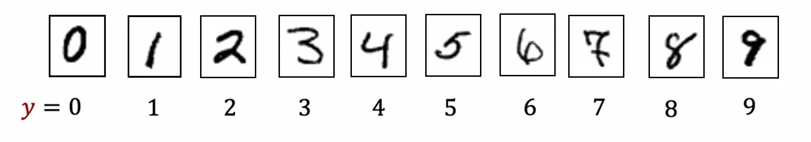

---

#### Graph Illustration

#### Binary Classification

In _Binary classification_ with $2$ _input_ features, graph looks like this:

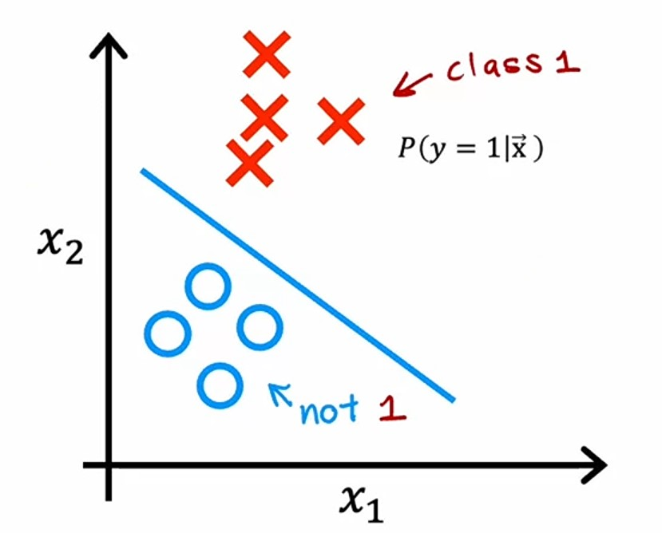

Where we need to find the probability of the target variable $y$ being $1$ i.e. $P\left(y=1|\vec{x}\right)$.

#### Multiclass Classification

In **Multiclass classification** with $2$ _input_ features, graph looks like this:

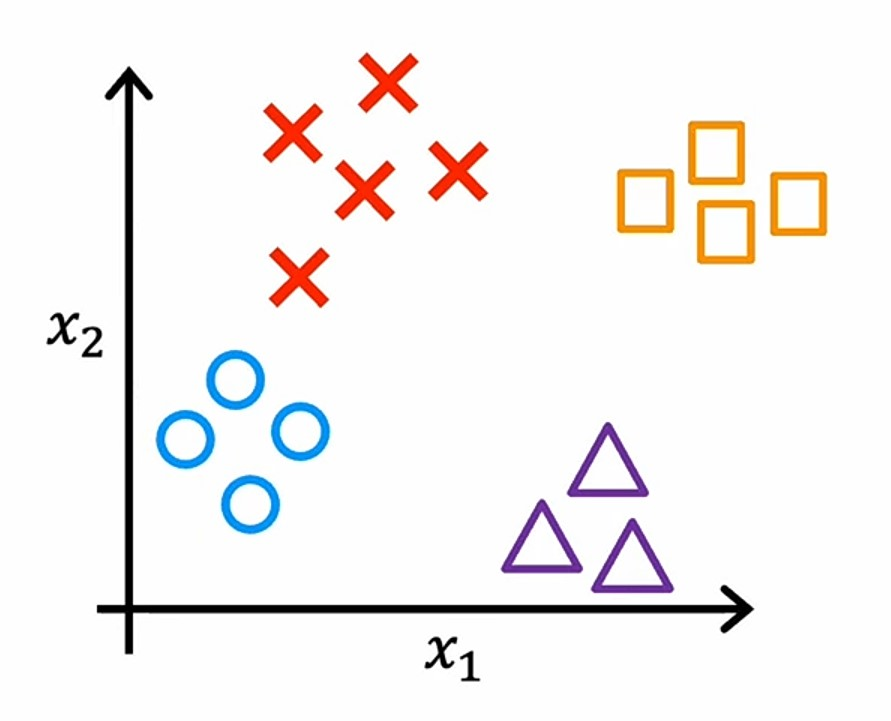

Where we need to find probability of target variable $y$ being $1$, $2$, $3$ or $4$, i.e. $P\left(y=1|\vec{x}\right)$, $P\left(y=2|\vec{x}\right)$, $P\left(y=3|\vec{x}\right)$ and $P\left(y=4|\vec{x}\right)$.

And in the above graph, _decision boundary_ will look like this:

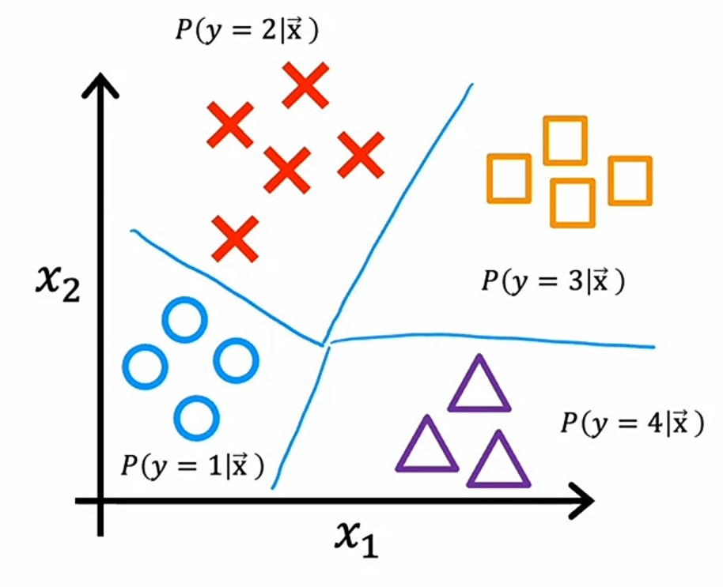

---

### Softmax Regression

> The _softmax regression_ is a generalization of _logistic regression_, which extends it from _binary classification_ to _multiclass classification_. ~ _Andrew Ng_

To understand how _softmax regression_ is _generalized version_ of _logistic regression_, let's see how _logistic regression_ works.

---

#### Logsitc Regression Interpretation

In _Logistic Regression_, we classify the target variable $y$ into $2$ classes $0$ or $1$, which is by applying the threshold of $0.5$ to the output of _sigmoid_ function.

1. First, we have to compute the value of $z$.
   $$z = \vec{w} \cdot \vec{x} + b$$

2. And, then calculate the value of $sigmoid(z)$, which gives us the probability of $y$ being $1$ for the given _input_ features $x$.
   $$a = g(z) = \frac{1}{1 + e^{-z}} \qquad P\left(y=1 | \vec{x}\right)$$
3. We know that the sum of all the probabilities is equal to $1$.
4. So, we can also say that the probability of $y$ being $0$ is $1 - a$ for the given _input_ features $x$.
   $$a_2 = 1 - a_1 \qquad P\left(y=0 | \vec{x}\right)$$

---

#### Softmax Regression Interpretation

In _Softmax Regression_, we classify the target variable $y$ into $n$ classes.

Let's say $n=4$, means that we have $4$ classes, i.e. $y=1$, $y=2$, $y=3$ and $y=4$.

For each value of $y$, _softmax regression_ will compute the probability of $y$ being $1$, $2$, $3$ or $4$.

1. First, it will compute all the $4$ values of $z$ for the given _input_ features $x$, with different parameters $w$ and $b$ for each class.
   $$z_1 = \vec{w}_1 \cdot \vec{x} + b_1\tag1$$
   $$z_2 = \vec{w}_2 \cdot \vec{x} + b_2\tag2$$
   $$z_3 = \vec{w}_3 \cdot \vec{x} + b_3\tag3$$
   $$z_4 = \vec{w}_4 \cdot \vec{x} + b_4\tag4$$

2. For each value of $z$, it will compute the values of $a$ for the given _input_ features $x$.
   $$a_1 = \frac{e^{z_1}}{e^{z_1} + e^{z_2} + e^{z_3} + e^{z_4}}\tag1$$
   $$a_2 = \frac{e^{z_2}}{e^{z_1} + e^{z_2} + e^{z_3} + e^{z_4}}\tag2$$
   $$a_3 = \frac{e^{z_3}}{e^{z_1} + e^{z_2} + e^{z_3} + e^{z_4}}\tag3$$
   $$a_4 = \frac{e^{z_4}}{e^{z_1} + e^{z_2} + e^{z_3} + e^{z_4}}\tag4$$
3. Where, each $a$ is the probability of $y$ being $1$, $2$, $3$ or $4$ for the given _input_ features $x$.
   $$a_1 = P\left(y=1 | \vec{x}\right)\tag1$$
   $$a_2 = P\left(y=2 | \vec{x}\right)\tag2$$
   $$a_3 = P\left(y=3 | \vec{x}\right)\tag3$$
   $$a_4 = P\left(y=4 | \vec{x}\right)\tag4$$

---

### Softmax regression formula

So, we've seen how _softmax regression_ works for $4$ classes, i.e. $4$ values of the _target_ variable $y$.

Now, let's see the formula for _softmax regression_ for $N$ classes, i.e. $N$ values of the _target_ variable $y$.

1. For each value of $y$, _softmax regression_ will compute the value of $z$.
   $$z_j = \vec{w}_j \cdot \vec{x} + b_j$$
   $$where \quad j = 1 ... N$$

2. And, for each value of $z_j$, we have different values of parameters $w_j$ and $b_j$.

3. Finally, it computes the value of $a_j$.
   $$a_j = \frac{e^{z_j}}{\sum_{k=1}^{N}e^{z_k}} \quad= P\left(y=j|\vec{x}\right)$$

4. Where, $k$ is the index of each value of $e^{z_k}$ for the summation, because $j$ is fixed.

---

### Softmax Regression as a generalization of Logistic Regression

> if we apply _softmax regression_ with $n$ equals $2$, so there are only two possible output classes then _softmax regression_ ends up computing basically the same thing as _logistic regression_. The parameters end up being a little bit different, but it ends up reducing to _logistic regression_ model. But that's why the _softmax regression_ model is the generalization of _logistic regression_. ~ _Andrew Ng_

---

### Cost Function

#### Logistic Cost function

In _Logistic Regression_'s, the _loss function_ is:
$$Loss = - y \log(a_1) - (1 - y) \log(\overbrace{1 - a_1}^{a_2})$$

We know that $a_2 = 1 - a_1$, which is the probability of $y$ being $0$.

$$Loss = - y \log(a_1) - (1 - y) log(a_2)$$

Where, $-y\log(a_1)$ will result when $y=1$, and $-y\log(a_2)$ will result when $y=0$.
$$Loss = \underbrace{- y \log(a_1)}_{y=1} - (1 \underbrace{- y) log(a_2)}_{y=0}$$

The _loss_ will be calculated for each value of $y$ and it's _cost function_ will be calculated by calculating the average of all the loss values.

---

#### Softmax Cost function

The _loss function_ for _softmax regression_ is:
$$loss(a_1,...a_n) = \begin{cases} - \log a_1\quad\text{if } y = 1 \\ -\log a_2\quad\text{if }y = 2 \\ \qquad\qquad\vdots \\ - \log a_N\quad\text{if } y = N\end{cases}$$

In the _loss function_, $y$ can take up any value till $N$ which is denoted by $j$, so is $a_j$.

If $y=N$, then it's loss will be $-\log a_N$.

It's graph looks like this:

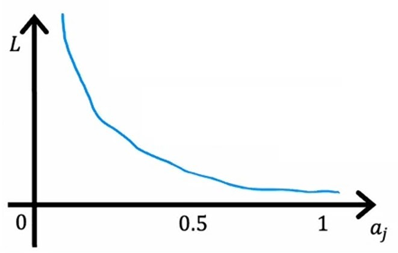

-   If $a_j$ is very close to $j$, i.e. $a_1 \approx 1$, then the loss $L$ will be close to $0$ (very less).
-   If $a_j$ is $0.5$, then the loss $L$ will be in the mid.

So, smaller the value of $a_j$, the more the loss will be.

---

### Neural Network with _Softmax_ activation function

Let's take the _Hand-written Digit Recognition_ example.


Here we have $10$ classes, i.e. $0, 1, 2, 3, 4, 5, 6, 7, 8, 9$ for each digit.

So, we want a **neural network** which outputs the probability of each class being correct. And, it's _output_ layer must have $10$ neurons and _softmax_ function as an _activation_ function.

So, we need a **neural network** like this:

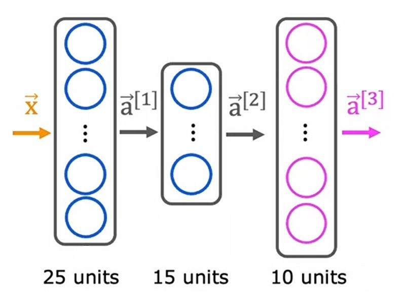

Here, we have:

-   $3$ layers; $2$ _hidden_ and $1$ output layer.
-   _Output_ layer has $10$ neurons.

In _output_ layer, each _neuron_ computes the value $z$
$$z^{[3]}_j = \vec{w}^{[3]}_j \cdot \vec{a}^{[2]} + b^{[3]}_1$$

And, find the value of $a_j$
$$a^{[3]}_j = \frac{e^{z^{[3]}_1}}{e^{z^{[3]}_1} + \cdots + e^{z^{[3]}_{10}}}$$

Here, one thing is different, i.e. in other _activation_ functions, we have a single _activation_ value $a_i$ for each _input_ value $x_i$, but in _softmax_ function, we have $a_j$ which contains the probability of each _input_ $x_i$ being the class $j$.

In _logistic regression_, we use a single $z$ value for computing an _activation_ value:
$$a^{[3]}_j = g\left(z^{[3]}_j\right)$$

But, in _softmax regression_, we use **all** $z$ values for computing a single _activation_ value:
$$\vec{a}^{[3]} = g\left(z^{[3]}_1, ..., z^{[3]}_N\right)$$
where $\vec{a}^{[3]}$ holds all the $a_j$ values upto $N$:
$$\vec{a}^{[3]} = \left[a^{[3]}_1, ..., a^{[3]}_N\right]$$

#### Example

We have _input_ features $x = [[200, 15], [250, 20]], in _binary classification_ or _regression_ problem, we have output like this:

**Classification**: $\hat{y} = [0, 1]$

**Regression**: $\hat{y} = [300, 170]$

But, in _multiple classification_ problem, we have _input_ features $x = [[240, ... 200], [250, ... 200]]$, so it's output will be like this:
$$\hat{y} = [[0.2, 0.5, 0.7, 0.3], [0.1, 0.8, 0.2, 0.5]]$$

where, each row is the probability of each class.

---

#### Tensorflow code with _Softmax_

We can make a **neural network** with _softmax_ activation function by using the following code:

1. Import required libraries

```python
from tensorflow.keras import Sequential
from tensorflow.keras.layers import Dense
from tensorflow.keras.losses import SparseCategoricalCrossentropy
```

2. Create a **neural network**

```python
model = Sequential([
   Dense(25, activation="relu"),
   Dense(15, activation="relu"),
   Dense(10, activation="softmax")
])
```

3. Here, we are creating $3$ layers, consists of $2$ _hidden_ with **ReLU** as their _activation_ function and $1$ _output_ with _softmax_ _activation_ function.
4. Specifying the _loss function_

```python
model.compile(loss=SparseCategoricalCrossentropy())
```

5. Here, we are using `SparseCategoricalCrossentropy` as _loss function_.

    > #### `SparseCategoryCrossentropy`
    >
    > It is a _loss_ function to compute _loss_ for _multiple classes_.
    >
    > _Categorical_ means we are classifying the _output_ $\hat{y}$ into categories. In _Hand-written Digit Recognition_ example, $10$ differen classes.
    >
    > _Sparse_ means output $\hat{y}$ can take one of the $N$ values. In _Hand-written digit recognition_, the output can be one of the $0, 1, 2, 3, 4, 5, 6, 7, 8, 9$ values.

6. Train the model

```python
model.fit(X, Y, epochs=100)
```

---

### Improved Implementation

Earlier, in _logistic regression_ and _softmax regression_, we are computing the _activation_ value $a$ and passing that value to the _loss function_.

But, we can modify it, by not computing the $a$ value before, instead computing value of $a$ inside the loss function.

Because it will make some numerical round-off errors, because computers have a limit to calculate _float_ values.

-   Example:
    Let's say we have `x` and `x2` as:

```python
x = 2 / 10000
x2 = 1 + (1 / 10000) - (1 - 1/10000)
```

Both `x` and `x2` are same, if we simplify them.

-   if we compute `x`, we'll get:
    $$x = \frac{2}{10000} = 0.0002$$

-   But, if we compute `x2`, we'll get:
    $$x2 = 1 + \left(\frac{1}{10000}\right) - \left(1 - \frac{1}{10000}\right) = 0.00019999999999997797$$

We can see that there's a slight difference in result of `x` and `x2`, this is because computers has a precision (limit) to calculate _float_ values.

So, to avoid this,

-   _TensorFlow_ can rearrange terms in this expression and come up with a more numerically accurate way to compute this _loss function_.
-   Whereas the original procedure was like insisting on computing as an intermediate value, $1 + \frac{1}{10000}$ and another intermediate value, $1 - \frac{1}{10000}$, then manipulating these two to get $\frac{2}{10,000}$.
-   This partial implementation was insisting on explicitly computing $a$ as an intermediate quantity.
-   But instead, by specifying the expression at the bottom directly as the _loss function_, it gives _TensorFlow_ more flexibility in terms of how to compute this and whether or not it wants to compute a explicitly.

Now, let's see how the expression and code changes of _logistic regression_ and _softmax regression_.

#### Logistic Regression

-   In _Logistic regression_, we can rather computing $a$ first, we'll pass the expression to the _loss function_ which will compute it for us.
    $$a = g(z) = \frac{1}{1 + e^{-z}}$$
-   **Original** _Logistic loss function_:
    $$loss = -y \log\left(a\right) - \left(1 - y\right) \log\left(1 - a\right)$$
-   **Modified** _Logistic loss function_:
    $$loss = -y \log\left(\frac{1}{1 + e^{-z}}\right) - \left(1 - y\right) \log\left(1 - \frac{1}{1 + e^{-z}}\right)$$

New, modified _loss function_ will be more accurate then previous one, because it is not using $a$ as an intermediate value, rather it is computing it inside the loss function.

-   Starter code:

```python
import tensorflow as tf
from tensorflow.keras import Sequential
from tensorflow.keras.layers import Dense
from tensorflow.keras.losses import BinaryCrossentropy
```

-   In code, we'll change the _output_ layer's _activation_ function from _sigmoid_ to _linear_.

```python
model = Sequential([
   Dense(25, activation="relu"),
   Dense(15, activation="relu"),
   Dense(2, activation="linear")
])
```

-   And, then in `BinaryCrossentropy` _loss function_, we'll set `from_logits = True`.

```python
model.compile(loss=BinaryCrossentropy(from_logits=True))
```

-   What it does is, it will take the value $z$ in the _loss function_, as in _linear activation_ function, $g(z) = z$, and then compute it in the _loss function_ itself.

-   Now, we'll fit the model

```python
model.fit(X, Y, epochs=100)
logit = model(X_test)
```

-   To predict, model will compute the value of $z$ with _linear activation_ function.
-   To get the _logistic regression_ prediction, we'll map the `logit` to _sigmoid_ function.

```python
preds = tf.nn.sigmoid(logit)
```

---

#### Softmax Regression

-   In _Softmax regression_, same as above, rather computing $a$ first, we'll pass the expression to the _loss function_ which will compute it for us.

-   **Original** _loss function_:
    $$loss(a_1,...a_n) = \begin{cases} - \log a_1\quad\text{if } y = 1 \\ -\log a_2\quad\text{if }y = 2 \\ \qquad\qquad\vdots \\ - \log a_N\quad\text{if } y = N\end{cases}$$
-   **Modified** _loss function_:
    $$loss(a_1,...a_n) = \begin{cases} - \log \frac{e^{z_1}}{\sum_{k=1}^{N}e^{z_k}}\quad\text{if } y = 1 \\ -\log \frac{e^{z_2}}{\sum_{k=1}^{N}e^{z_k}}\quad\text{if }y = 2 \\ \qquad\qquad\vdots \\ - \log \frac{e^{z_j}}{\sum_{k=1}^{N}e^{z_k}}\quad\text{if } y = N\end{cases}$$

-   In new _modified loss function_, we are computing $a$ inside the _loss function_, not computing it first.

-   Starter code:

```python
import tensorflow as tf
from tensorflow.keras import Sequential
from tensorflow.keras.layers import Dense
from tensorflow.keras.losses import SparseCategoricalCrossentropy
```

-   In code, we'll change the _output_ layer's _activation_ function from _softmax_ to _linear_.

```python
model = Sequential([
   Dense(25, activation="relu"),
   Dense(15, activation="relu"),
   Dense(10, activation="linear")
])
```

-   And, then in `SparseCategoricalCrossentropy` _loss function_, we'll set `from_logits = True`.

```python
model.compile(loss=SparseCategoricalCrossentropy(from_logits=True))
```

-   Now, _loss function_ will compute $a$ inside the _loss function_.

-   Now, we'll fit the model

```python
model.fit(X, Y, epochs=100)
logit = model(X_test)
```

-   Now, to predict, model will compute the value of $z$ with _linear activation_ function.
-   To get the _softmax regression_ prediction, we'll map the `logit` to _softmax_ function.

```python
preds = tf.nn.softmax(logit)
```

---

### Multi-label Classification

In _Multi-label classification_, we used to _classify_ different classes for different labels (_targets_).

In _Multi-class classification_, we have a single label in which we _classify_ different classes, whereas, in _Multi-label classification_, we have multiple labels (_target features_) in which we _classify_ different classes.

#### Example:

Let's say we have an image, and we want to classify whether there is/are:

-   A Car
-   A Bus
-   A Human
-   A pedestrian

| Question         |                                 Image $1$                                  |                                 Image $2$                                  |                                 Image $3$                                  |
| :--------------- | :------------------------------------------------------------------------: | :------------------------------------------------------------------------: | :------------------------------------------------------------------------: |
| **_Is there a_** | 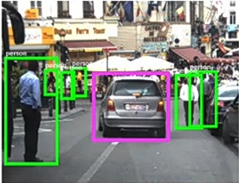 |  | 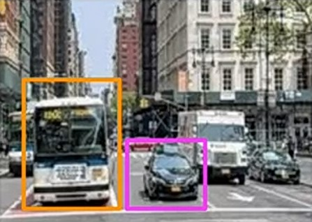 |
| **Car ?**        |                                   Yes ✅                                   |                                   No ❌                                    |                                   Yes ✅                                   |
| **Bus ?**        |                                   No ❌                                    |                                   No ❌                                    |                                   Yes ✅                                   |
| **Human ?**      |                                   Yes ✅                                   |                                   Yes ✅                                   |                                   No ❌                                    |
| **Pedestrian ?** |                                   No ❌                                    |                                   Yes ✅                                   |                                   Yes ✅                                   |

By the type of questions, we can see that all these $4$ labels are type of _Classification_ problem or mainly _Binary classification_.

So, we can interpret output $y$ of each Image as:

-   **Image 1**:
    $\quad y = \begin{bmatrix}1 \\ 0 \\ 1 \\ 0\end{bmatrix}$

-   **Image 2**:
    $\quad y = \begin{bmatrix}0 \\ 0 \\ 1 \\ 1\end{bmatrix}$

-   **Image 3**:
    $\quad y = \begin{bmatrix}1 \\ 1 \\ 0 \\ 1\end{bmatrix}$

where, $1$ is _Yes_ and $0$ is _No_.

---

### Neural Network for Multi-label Classification

#### Separate Neural Networks

$1^{st}$ way to create a **neural network** for _multi-label classification_ is creating separate **neural networks** for separate labels.

So, for each label, we'll have a separate **neural network**.

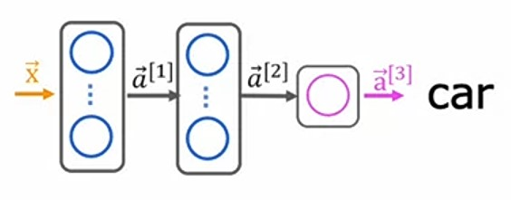
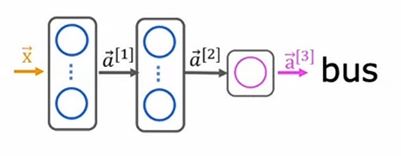
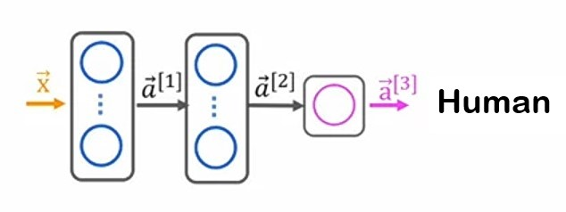


And each **neural network** will compute the output $y$ for each label.

---

#### Single Neural Network

Another way to create a **neural network** for _multi-label classification_ is creating a _single_ **neural network**, which computes all the outputs $y$ for all the labels.

So, our **neural network** architecture will look like this:

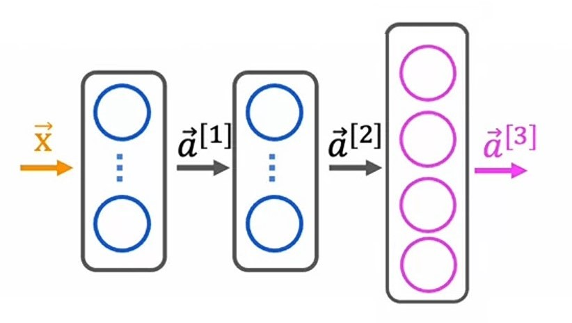

Where, in the _output_ layer, for each neuron, we are using _sigmoid_ as an _activation_ function because this is a _binary classification_ problem.

And the vector $\vec{a}^{[3]}$ consists of all the outputs $y$ of all the labels.

$$\vec{a}^{[3]} = \begin{bmatrix}a^{[3]}_1 \\ \\ a^{[3]}_2 \\ \\ a^{[3]}_3 \\ \\ a^{[3]}_4 \end{bmatrix}$$

Where:

-   $1^{st}$ _activation_ value $a^{[3]}_1$ has the output for _car_ label.
-   $2^{nd}$ _activation_ value $a^{[3]}_2$ has the output for _bus_ label.
-   $3^{rd}$ _activation_ value $a^{[3]}_3$ has the output for _human_ label.
-   $4^{th}$ _activation_ value $a^{[3]}_4$ has the output for _pedastrian_ label.

---

### Jupyter lab: Softmax [🔗](../codes/W2%20-%20L2%20-%20Softmax.ipynb)

---

### Jupyter lab: Multiclass [🔗](../codes/W2%20-%20L3%20-%20Multiclass.ipynb)

---

### Quizzes

#### Practice Quiz: Multiclass Classification

#### Question 1


<details>
<summary>    
    <font size='3' color='#00FF00'>Answer to <b>question 1</b></font>
</summary>
<p>If you have selected option <em>a (1)</em> then you are right!<br/><b>Explanation:</b><br/>Yes! The sum of all the softmax activations should add up to 1.</p>
</details>

#### Question 2


<details>
<summary>    
    <font size='3' color='#00FF00'>Answer to <b>question 2</b></font>
</summary>
<p>If you selected options <em>b (-log(a<sub>3</sub>)</em> then you are right!<br/><b>Explanation:</b><br/>Correct. When the true label is 3, then the cross entropy loss for that training example is just the negative of the log of the activation for the third neuron of the softmax. </p>
</details>

#### Question 3


<details>
<summary>    
    <font size='3' color='#00FF00'>Answer to <b>question 3</b></font>
</summary>
<p>If you have selected option <em>b (a 'linear' activation)</em> then you are right!<br/><b>Explanation:</b><br/>Yes! Set the output as linear, because the loss function handles the calculation of the softmax with a more numerically stable method.</p>
</details>

### Video quiz 1


<details>
<summary>    
    <font size='3' color='#00FF00'>Answer to <b>video quiz 1</b></font>
</summary>
<p>If you have selected option <em>a (0.35)</em> then you are right!<br/><b>Explanation:</b><br/>We know the sum of probability is 1, so 1 - (0.30 + 0.20 + 0.15) = 1 - 0.65 = 0.35.</p>
</details>
