# Week 2: Neural Network Training

## Ch 4: Additional neural networks concept

### Advanced optimization

#### Gradient Descent
Until now, we've been using *Gradient Descent* optimization algorithm to find the minimum of *cost function* or best parameters.

And the formula we're using is:
$$\text{repeat unitl convergence} \begin{cases} w_j = w_j - \alpha \frac{\partial}{\partial w_j}J(\vec{w}, b) \\ b = b - \alpha \frac{\partial}{\partial b}J(\vec{w}, b)\end{cases} $$

where:
- $\alpha$ is the *learning rate*
- $\frac{\partial}{\partial w_j} and \frac{\partial}{\partial b}$ are the *derivatives* of the *cost function*
- And, we are decreasing the parameters $w_j$ and $b$ by the *learning rate* $\alpha$ times the *derivatives* of the *cost function*.

It's graph look like this:

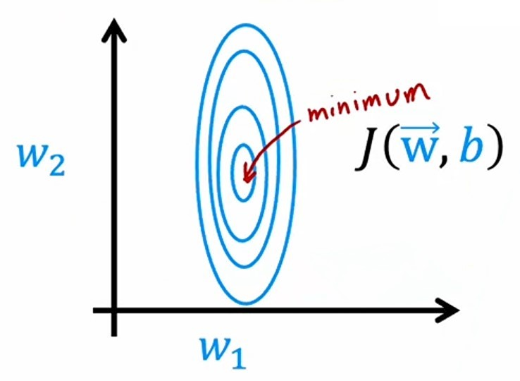

- We can see that **global minima** of this graph is the center of all the co-centric circles.

- If we start from bottom-center.
- To reach **global minima**, *learning rate* will take small steps

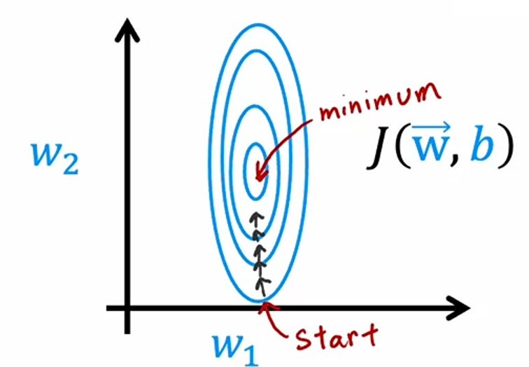

- Here, we can our *learning rate* is small, that's why it is taking very small steps to reach **global minima** and it is going in the same direction everytime.
- So, what we can do is to increase the *learning rate* so that it takes larger steps and lesser time to reach **global minima**.

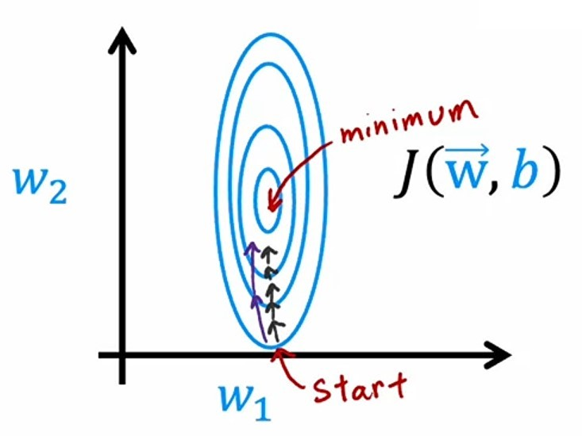

Or, say if we start with a larger *learning rate*:

- Then, it will take *larger steps* to reach **global minima** but may overshoot it.

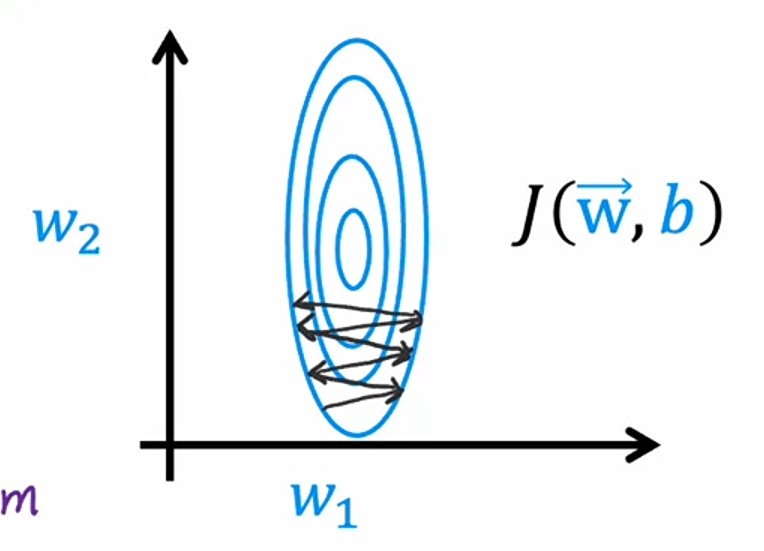

- To prevent it, we can decrease the *learning rate* when it reaches near **globale minima**.

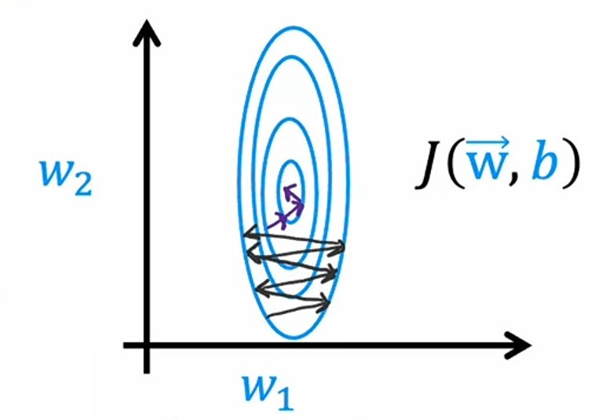

- This is what **Adam Optimizer** does.

#### Adam Optimizer
**Adam** optimization algorithm can adjust the **learning rate** automatically, so that it can reach the **global minima** faster.

> **ADAM** stands for **Adaptive Moment Estimation**.

- One thing about this algorithm is that it deosn't use a single *learning rate*, rather it uses different *learning rate* for each parameter ($w_j$ and $b$).
- So, if we have total $11$ parameters ($w_1, w_2, ..., w_10$ and $b$), then we have $11$ different *learning rate* for each parameter.

$$\text{repeat unitl convergence} \begin{cases} w_j = w_j - \alpha_1 \frac{\partial}{\partial w_j}J(\vec{w}, b) \\\qquad\qquad\vdots \\ w_j = w_j - \alpha_{10} \frac{\partial}{\partial w_j}J(\vec{w}, b)  \\ b = b - \alpha_{11} \frac{\partial}{\partial b}J(\vec{w}, b)\end{cases} $$

So, what we saw in above graph:
- If the parameter is moving in the same direction, then it will increase the *learning rate*.
- If the parameter is bouncing back and forth, then it will decrease the *learning rate*.

#### Code example
It's code will be same for making layers, except for `model.compile()` function.

1. Starter code
```python
from tensorflow.nn import softmax
from tensorflow.keras.layers import Dense
from tensorflow.keras.optimizers import Adam
from tensorflow.keras.models import Sequential
from tensorflow.keras.losses import SparseCategoricalCrossentropy
```
2. Here, we are importing `Adam` optimizer to use in our **neural network**.
3. **Neural network** is:
```python
model = Sequential([
    Dense(25, activation="relu"),
    Dense(15, activation="relu"),
    Dense(10, activation="linear")
])
```
4. Compiling the model
```python
model.compile(
    optimizer=Adam(learning_rate=1e-3),
    loss=SparseCategoricalCrossentropy(from_logits=True)
)
```

5. Here, we are setting an initial default *global learning rate* of $1e-3$ i.e. $0.001$, it will start with this *learning rate* for each parameter, and change it accordingly.

5. Training the model
```python
model.fit(X, Y, epochs=100)
```

6. Predicting new data
```python
logits = model(X_test)
preds = tf.nn.softmax(logits)
```

---

### Additional layer types
Until now, we've been using *Dense* layer to make layers in our **neural network**.

But there are other types of layers that we can use in our **neural network**.

### Convolutional layers
*Convolution layer* is a type of layer where each *neuron* only looks at a small region of the input image.

Unlike *Dense* layer, where it looks at the whole input image, *Convolutional layer* looks at a small region of the input image.


#### Benefits of convolutional layers
- It speeds up the computation and overall training process, because computing on a part of image is faster than computing on the whole image.
- **Neural networks** which uses *Convolutional layers* needs less amount of *training data*.
- Because it needs less amount of *training data*, it is less prone to **overfitting**.

Let's see some examples of *convolutional layers*.

---

#### Hand-written digit Recognition

Say, we have a *hand-written digit* $9$, and we want to make a **neural network** which recognizes it.

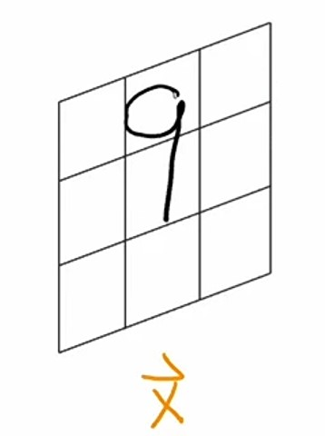

If we use a *Dense* layer, it will use the whole input image.

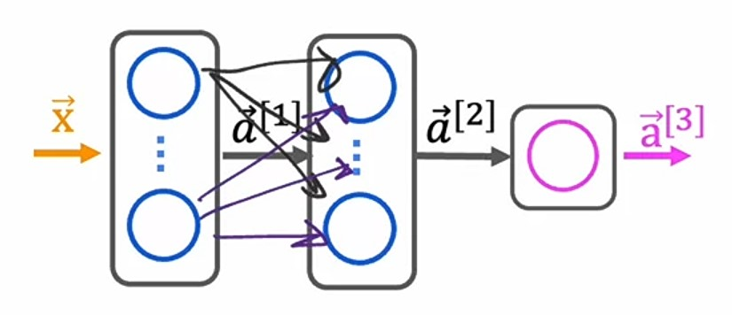

But, if we use *Convolutional layer*, it will use small regions of image like:

- $1^{st}$ *neuron* will look up at top left corner of the image.

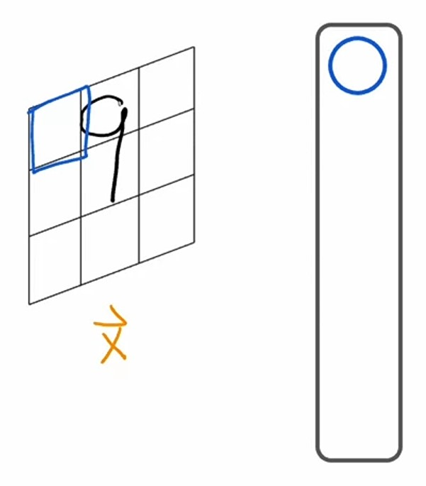

- $2^{nd}$ *neuron* will look up at right side of the image.

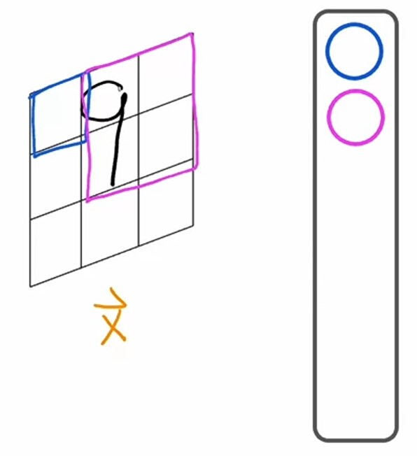

- $3^{rd}$ *neuron* will look up at top right corner of the image.

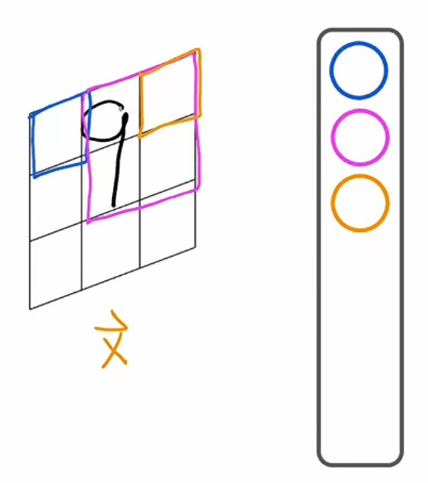

- $4^{th}$ *neuron* will look up at left side of the image.

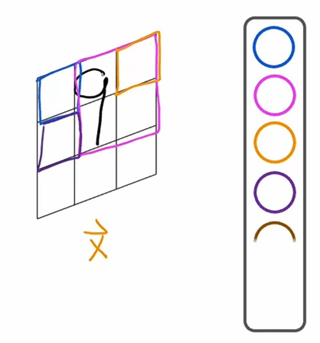

- Similarly, different *neurons* will look up at different portions of the image.

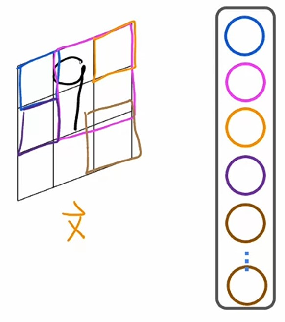

---

#### Heart Disease Predictor

Let's take an example of *Heart Disease predictor*, which looks up at the *EKG* or *ECG* signals and predict whether the patient has *heart disease* or not.

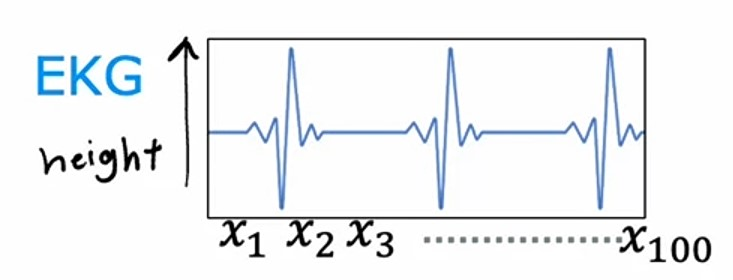

Let's say on $x-axis$, we have different time points $x_1 - x_{100}$ and on $y-axis$, we have diffrerent heights of *EKG* signals.

Let's create a **neural network** which can recognize the *heart disease* or not.

1. In the first *hidden* layer, for $1^{st}$ *neuron* instead of having all the numbers from $x_1$ to $x_{100}$, we will use first 20 numbers from $x_1$ to $x_{20}$.
2. In $2^{nd}$ *neuron*, we will take another 20 numbers, from $x_{11}$ to $x_{30}$.
3. In $3^{rd}$ *neuron*, we will take another 20 numbers, from $x_{21}$ to $x_{40}$ and so on..
4. In last *neuron*, we will have last 20 numbers i.e. $x_{81}$ to $x_{100}$.
5. So, our first *hidden* will look like this:


6. And this *hidden* layer have $9$ units or *neurons*.
7. In $2^{nd}$ *hidden* layer, we will have $3$ units.
8. where, $1^{st}$ *neuron* will look up at $a^{[1]}_1$ to $a^{[1]}_5$.
9. $2^{nd}$ *neuron* will look up at $a^{[1]}_3$ to $a^{[1]}_7$.
10. $3^{rd}$ *neuron* will look up at $a^{[1]}_5$ to $a^{[1]}_9$.
11. And $2^{nd}$ *hidden* layer will look like this:

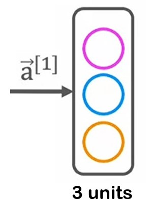

12. For $3^{rd}$ layer, which is *otuput* layer, we will have $1$ unit, which uses *sigmoid* as an *activation* function.
13. And, our final **neural network** will look like this:
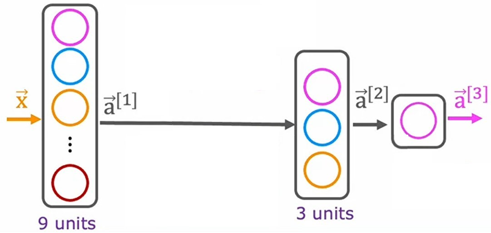

---

### Programming Assignment: Neural Network Training [🔗](../codes/W2%20-%20Neural%20Network%20training%20Assignment.ipynb)

---

### Quizzes

#### Practice Quiz: Tensorflow Implementation

#### Question 1


<details>
<summary>    
    <font size='3' color='#00FF00'>Answer to <b>question 1</b></font>
</summary>
<p>If you have selected option <em>c (When calling model.compile, set optimizer=tf.keras.optimizers.Adam(learning_rate=1e-3).)</em> then you are right!<br/><b>Explanation:</b><br/>Correct! Set optimizer to Adam.</p>
</details>

#### Question 2


<details>
<summary>    
    <font size='3' color='#00FF00'>Answer to <b>question 2</b></font>
</summary>
<p>If you selected options <em>d (convolutional layer)</em> then you are right!<br/><b>Explanation:</b><br/>Correct. For a convolutional layer, each neuron takes as input a subset of the vector that is fed into that layer.</p>
</details>