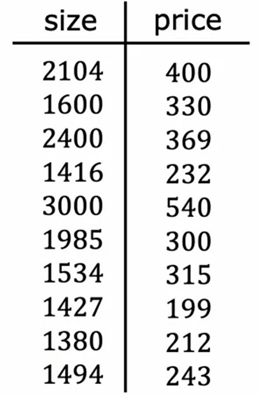
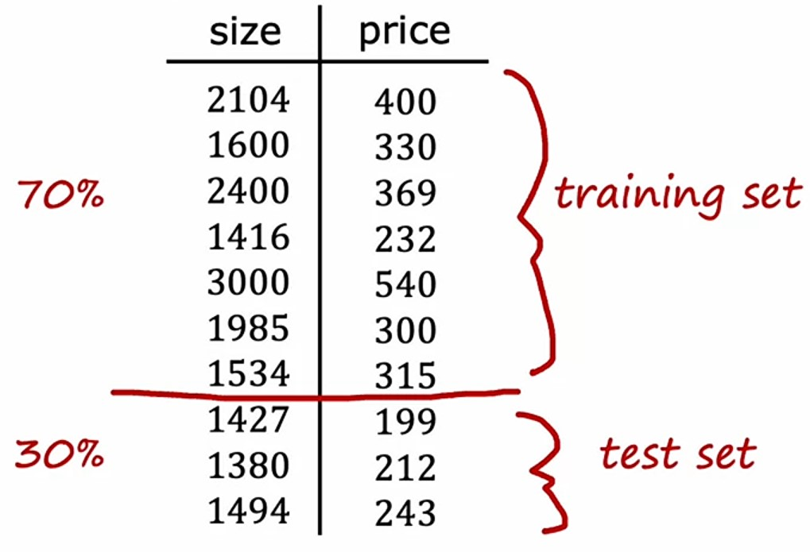
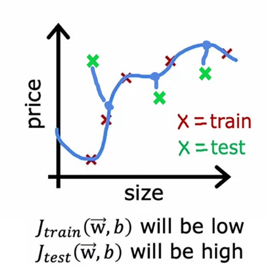
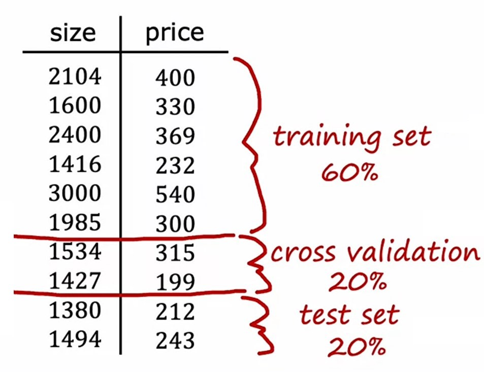
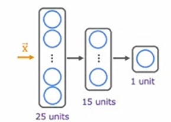
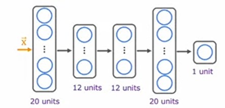
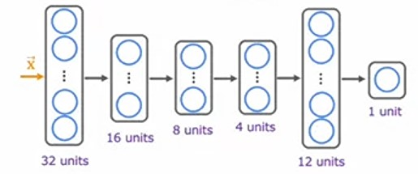

# Week 3: Advice for Applying Machine Learning

**Overview:**

-   Evaluate and then modify your learning algorithm or data to improve your model's performance
-   Evaluate your learning algorithm using cross validation and test datasets.
-   Diagnose bias and variance in your learning algorithm
-   Use regularization to adjust bias and variance in your learning algorithm
-   Identify a baseline level of performance for your learning algorithm
-   Understand how bias and variance apply to neural networks
-   Learn about the iterative loop of Machine Learning Development that's used to update and improve a machine learning model
-   Learn to use error analysis to identify the types of errors that a learning algorithm is making
-   Learn how to add more training data to improve your model, including data augmentation and data synthesis
-   Use transfer learning to improve your model's performance.
-   Learn to include fairness and ethics in your machine learning model development
-   Measure precision and recall to work with skewed (imbalanced) datasets

---

## Ch 1: Advice for Applying Machine Learning

### Debugging a learning algorithm

Let's say we have made a **Regularized** _Linear Regression_ model, and it's cost function is:
$$J(\vec{w}, b) = \frac{1}{2m}\sum_{i=1}^m\left(f_{\vec{w}, b}(\vec{x}^{(i)}) - y^{(i)}\right)^2 + \frac{\lambda}{2m}\sum^n_{j=1}w^2_j$$

But, while doing predictions with this model, it is giving unacceptably large errors.

So, what approaches we can try?

1. Get more training examples
2. Try smaller sets of features
3. Try getting additional features
4. Try adding polynomial features ($x^2_1, x^2_2, x_1, x_2$ etc...)
5. Try decreasing $\lambda$
6. Try increasing $\lambda$

---

### Evaluating a model

Model Evaluating is very important.

We can evaluate it's performance to check how well it's performing.

Let's take an example of _House price prediction_, where we are trying to predict the price of a house, and we have $4$ input features:

1. $x_1$: size in feet$^2$
2. $x_2$: number of bedrooms
3. $x_3$: number of floors
4. $x_4$: age of house in years

-   $y$: price of house in $\$1000$

We are using _linear regression_ algorithm to predict _house prices_, and we are using _polynomial features_ till degree of $n$, i.e. from $w_1x$ to $w_4x^4$.

$$f_{\vec{w}, b}(\vec{x}) = w_1x + w_2x^2 + \cdots + w_nx^n + b$$

And, after fitting the _training data_, it's graph looks like this:

Here, we can see that:

-   Model fits the _training data_ so well, that it's fail to _generalize_ to new data.

In order to see our model's performance, we need to evaluate it, by visualizing the new data points and comparing them with the actual prices.

We can do this by splitting our _house price_ data into _training_ and _testing_ data.

---

#### Splitting the data

#### Regression problem

Say, we have $10$ data points here:

-   We'll split our data into $2$ parts, say $70\%$ to _training_ dataset and $30\%$ to _testing_ dataset.

-   And, we'll train our model on $70\%$ _training_ dataset and evaluating it's performance on $30\%$ _testing_ dataset.

-   In notation, we'll use $m_{train}$ to signify _training_ examples like $x^{m_{train}}$ & $y^{m_{train}}$ and $m_{test}$ to signify _testing_ examples like $x^{m_{test}}$ & $y^{m_{test}}$.

-   To train our model, we'll fit the _training_ dataset with the _polynomial_ features as shown above and minimize it's cost with _cost function_ $J(\vec{w}, b)$.

$$J(\vec{w}, b) = \frac{1}{2m_{train}}\sum^{m_{train}}_{i=1}\left(f_{\vec{w}, b}(\vec{x}^{(i)}) - y^{(i)}\right)^2 + \frac{\lambda}{2m_{train}}\sum^n_{j=1}w^2_j$$

-   To find the _training_ error, we'll use same _cost function_ $J(\vec{w}, b)$ on $m_{train}$ training examples, except we won't use _regularization_ term.

$$J_{train}(\vec{w}, b) = \frac{1}{2m_{train}}\left[\sum^{m_{train}}_{i=1}\left(f_{\vec{w}, b}(\vec{x}^{(i)}_{train}) - y^{(i)}_{train}\right)^2\right]$$

-   And, To compute the _test_ error, we'll use same _cost function_ $J(\vec{w}, b)$ on $m_{test}$ testing examples as above.

$$J_{test}(\vec{w}, b) = \frac{1}{2m_{test}}\left[\sum^{m_{test}}_{i=1}\left(f_{\vec{w}, b}(\vec{x}^{(i)}_{test}) - y^{(i)}_{test}\right)^2\right]$$

-   So, as we saw that, on _training_ dataset, our model performs well.

-   But, when we plot _testing_ dataset, we can see that there are large errors.

-   On _training dataset_, we can see the _error_ is very low, almost $0$, but on _testing dataset_, we can see the _error_ is very-very high.

With this way, we can evaluating our model, by observing that our model is performing well on _training dataset_, but not _generalizing_ on new data, i.e. _testing dataset_.

---

#### Classification problem

On _classification_ problem, we will do same as above, minimzing the _cost function_ $J(\vec{w}, b)$ on $m_{train}$ training examples, and evaluating it's performance on $m_{test}$ testing examples.

-   As we know, our _cost function_ is:
    $$J(\vec{w}, b) = -\frac{1}{m}\sum^m_{i=1}\left[y^{(i)}\log\left(f_{\vec{w}, b}(\vec{x}^{(i)}\right) + \left(1 - y^{(i)}\right)\log\left(1 - f_{\vec{w}, b}(x^{(i)}\right)\right] + \frac{\lambda}{2m}\sum^n_{j=1}w^2_j$$

-   For computing error on _training dataset_, we'll use same _cost function_ $J(\vec{w}, b)$ on $m_{train}$ training examples, except we won't use _regularization_ term.

$$J_{train}(\vec{w}, b) = -\frac{1}{m_{train}}\sum^{m_{train}}_{i=1}\left[y^{(i)}_{train}\log\left(f_{\vec{w}, b}(\vec{x}^{(i)}_{train}\right) + \left(1 - y^{(i)}_{train}\right)\log\left(1 - f_{\vec{w}, b}(x^{(i)}_{train}\right)\right]$$

-   For computing error on _testing dataset_, we'll use same _cost function_ $J(\vec{w}, b)$ on $m_{test}$ testing examples as above.

$$J_{test}(\vec{w}, b) = -\frac{1}{m_{test}}\sum^{m_{test}}_{i=1}\left[y^{(i)}_{test}\log\left(f_{\vec{w}, b}(\vec{x}^{(i)}_{test}\right) + \left(1 - y^{(i)}_{test}\right)\log\left(1 - f_{\vec{w}, b}(x^{(i)}_{test}\right)\right]$$

-   But, there's another way to find error on _training_ and _testing_ dataset is to find out the **fraction** of the _test_ and _train_ set which is miss-classified.

$$hat{y} = \begin{cases}1 \quad\text{if }f_{\vec{w}, b}(x^{(i)}) \ge 0.5 \\ 0 \quad\text{if }f_{\vec{w}, b}(x^{(i)}) < 0.5\end{cases}$$

-   And, we'll count $\hat{y} \neq y$ as error.
-   where:
-   -   $J_{train}(\vec{w}, b)$ is the _fraction_ of the _training_ set that has been miss-classified.
-   -   $J_{test}(\vec{w}, b)$ is the _fraction_ of the _testing_ set that has been miss-classified.

---

### Model Selection

We've seen till now, is that once parameters $\vec{w}, b$ are fitted to the _training set_, the _training error_ $J_{train}(\vec{w}, b)$ is very likely lower then the actual _generalization_ error. But the _test error_ $J_{test}(\vec{w}, b)$ is better estimate of how well our model is _generalized_ to new data.

Let's take the example of _House price prediction_, which one _input_ feature _size of house_ $x$ and _target_ variable is _house price_ $y$.

What we can do is, we can use _Linear Regression_, with different levels of _polynomial_ features, and then we can compare the check the _test_ error and see which model suits the best.

Let's say we have our _Linear Regression_ function from $degree=1$ to $degree=10$, i.e. $x_1$ to $x_{10}$.

So, we'll have $10$ different models:
$$f_{\vec{w}, b}(\vec{x}) = w_1x + b$$
$$f_{\vec{w}, b}(\vec{x}) = w_1x + w_2x^2 + b$$
$$\vdots$$
$$f_{\vec{w}, b}(\vec{x}) = w_1x + w_2x^2 + \cdots + w_{10}x^{10} + b$$

And, for each model, we'll get $10$ different $\vec{w}$ and $b$ parameters, and we'll compute the _test error_ $J_{test}(\vec{w}, b)$.

Let's say, we get less error for $degree=5$, with parameters $\vec{w}$ and $b$.

So, we'll choose that model:
$$f_{\vec{w}, b}(\vec{x}) = w_1x + \cdots + w_5x^5 + b$$

But, there is a problem with this approach, that we are using _test_ set to choose the best model, it means, our model is getting _tuned_ or _over generalized_ to the _test_ set that it shouldn't be, because we are choosing an extra parameter i.e. $degree$ with the help of _test_ set.

So, to tackle out this problem, we'll use _cross validation_ set.

---

### Training / Cross-validation / Testing dataset

Let's say, we have this dataset:

Earlier, we are dividing it into $2$ parts, i.e. _training_ and _testing_ dataset.

But, now we'll divide it into $3$ parts, i.e. _training_, _cross-validation_ and _testing_ dataset.

In which we'll use $60\%$ of data to _train_ our model, $20\%$ of data to _cross-validate_ our model, means find best parameters by minimizing the _cost error_ and then check it performance on $20\%$ _test_ data.

And, we are denoting no. of training examples for:

-   Training dataset: $m_{train}$, so
-   -   $x^{(m_{train})}$, $y^{(m_{train})}$
-   Cross-validation dataset: $m_{cv}$, so
-   -   $x^{(m_{cv})}$, $y^{(m_{cv})}$
-   Testing dataset: $m_{test}$, so
-   -   $x^{(m_{test})}$, $y^{(m_{test})}$

_Cross-validation_ is also known as _validation_, _development_ or _dev_ set.

And, we can measure _cost_ error on all $3$ datasets:

1. _Training_ error $J_{train}(\vec{w}, b)$
   $$J_{train}(\vec{w}, b) = \frac{1}{2m_{train}}\left[\sum^{m_{train}}_{i=1}\left(f_{\vec{w}, b}(\vec{x}^{(i)}_{train}) - y^{(i)}_{train}\right)^2\right]$$

2. _Cross-validation_ error $J_{cv}(\vec{w}, b)$
   $$J_{cv}(\vec{w}, b) = \frac{1}{2m_{cv}}\left[\sum^{m_{cv}}_{i=1}\left(f_{\vec{w}, b}(\vec{x}^{(i)}_{cv}) - y^{(i)}_{cv}\right)^2\right]$$

3. _Testing_ error $J_{test}(\vec{w}, b)$
   $$J_{test}(\vec{w}, b) = \frac{1}{2m_{test}}\left[\sum^{m_{test}}_{i=1}\left(f_{\vec{w}, b}(\vec{x}^{(i)}_{test}) - y^{(i)}_{test}\right)^2\right]$$

So now, we'll use $10$ different models with $10 degree$ of _polynomial_ features:

$$f_{\vec{w}, b}(\vec{x}) = w_1x + b$$
$$f_{\vec{w}, b}(\vec{x}) = w_1x + w_2x^2 + b$$
$$\vdots$$
$$f_{\vec{w}, b}(\vec{x}) = w_1x + w_2x^2 + \cdots + w_{10}x^{10} + b$$

And, same as above, for each model, we'll compute best parameters $\vec{w}$ and $b$ by minimizing the _cost_ error on _training_ set, and then we'll check the performance of that model on _cross-validation_ set.

Let's say, we get less error for $degree=4$, with parameters $\vec{w}$ and $b$.

So, we'll choose that model:
$$f_{\vec{w}, b}(\vec{x}) = w_1x + \cdots + w_4x^4 + b$$

Finally, to see how well our model is _generalized_ to new data, we'll check the performance of that model on _testing_ set. And this is the fair _generalized_ performance of our model, because we are using _validation_ dataset to choose the best model, and _testing_ dataset only to check the performance of that model, that how much it _generalizes_ with new data.

So, we've seen _Model selection_ with general model.

Now, we will see how _Model selection_ can be done with **neural networks**.

---

#### Model Selection with Neural Networks

Let's take the example of _Hand-written digit recognition_.

So, we will create $3$ different models, with different no. of _hidden layers_ and _neurons_ in each layer.

1. Model $1$ ($1^{st}$ **neural network**):

2. Model $2$ ($2^{nd}$ **neural network**):

3. Model $3$ ($3^{rd}$ **neural network**):

-   We'll train each model on _training_ set, and then we'll check the performance of each model on _cross-validation_ set.

-   We can check the _cost_ error of _cross-validation_ set, by analyzing the _fraction_ of _cross-validation_ examples that are _miss-classified_.

-   And then we'll pick the model which has the lowest _cross-validation_.
-   Finally, we'll use _test_ set to see how much our model _generalized_ to new data.

---

> #### Why doing _Cross-validation_ is considered as best practice ?
>
> In **machine learning** practice is considered best practice to make all the decisions you want to make regarding your learning algorithm, such as how to choose parameters, what degree polynomial to use, but make decisions only looking at the _training_ set and _cross-validation_ set and to not use the _test_ set at all to make decisions about your model and only after you've made all those decisions, then finally, tick them all though you have designed and evaluated on your _test_ set.
>
> That procedure ensures that you haven't accidentally fit anything to the _test_ set so that your _test_ set becomes so unfair and not overly optimistic estimate of _generalization_ error of your algorithm. ~ _Andrew Ng_

---

### Quizzes

#### Practice Quiz: Advice for Applying Machine Learning

#### Question 1

    
    Answer to <b>question 1</b>

If you have selected option <em>a (
A test that you run to gain insight into what is/isn’t working with a learning algorithm.)</em> then you are right! <b>Explanation:</b> Yes! A diagnostic is a test that you run to gain insight into what is/isn’t working with a learning algorithm, to gain guidance into improving its performance.

#### Question 2

    
    Answer to <b>question 2</b>

If you think it's <em>False</em> then you are right! <b>Explanation:</b> Actually, if a model overfits the training set, it may not generalize well to new data.

#### Question 3

    
    Answer to <b>question 3</b>

If you selected options <em>a (The cross-validation set)</em> then you are right! <b>Explanation:</b> Correct. Use the cross validation set to calculate the cross validation error on all three models in order to compare which of the three models is best.

