# Week 3: Advice for Applying Machine Learning

## Ch 2: Bias and Variance


### Bias

> The inability for a machine learning model to capture the true relationship is called _bias_. ~ [_StatQuest with Josh Stammer_](https://youtu.be/EuBBz3bI-aA?t=136)

> The error due to bias is taken as the difference between the expected prediction of our model and the correct value which we are trying to predict.
> 
>  Bias measures how far off in general these models' predictions are from the correct value. ~ [*Scott Fortmann-Roe*](http://scott.fortmann-roe.com/docs/BiasVariance.html#:~:text=The%20error%20due,the%20correct%20value.)

The difference in the expected prediction of a model and the correct value is called _bias_.

If the model doesn't even fit the training data well, and on new data, it can't make good predictions.

We can also say that the model which _overfits_ the training data has _low bias_ and the model which _underfits_ the training data has _high bias_.

---

### Variance

> In Machine learning, the difference in fits between datasets in called _Variance_. ~ [_StatQuest with Josh Stammer_](https://youtu.be/EuBBz3bI-aA?t=245)


> The error due to variance is taken as the variability of a model prediction for a given point.
> 
> The variance is how much the predictions for a given point vary between different realizations of the model. ~ [*Scott Fortmann-Roe*](http://scott.fortmann-roe.com/docs/BiasVariance.html#:~:text=The%20error%20due%20to%20variance,the%20model.)

The variety in the predictions is called _Variance_.

If the model fits the training data well, but on new data it makes worse predictions, then, the difference is called _Variance_.

We can also say that the model which _overfits_ the traning data has **high variance**, and the model which _underfits_ the training data has **low variance.**

> In Machine learning, the ideal algorithm has _low bias_ and can accurately make the true relationship and it has _low variance_ by producing good predictions on new data. Means, _Generalized model_ is better than _Underfitted model_ and _Overfitted model_ is better than _Underfitted model_. ~ [_StatQuest with Josh Stammer_](https://youtu.be/EuBBz3bI-aA?t=322)


[](http://scott.fortmann-roe.com/docs/BiasVariance.html#:~:text=Graphical%20Definition)


---

### Diagonising Bias and Variance with Regression line

#### High Bias

Let's say we have a normal _Linear Regression_ model with single _degree_ of _polynomial_, i.e.:
$$f_{\vec{w}, b}(x) = w_1x + b$$

And, after plotting the _regression line_ on the _training data_, we get the following plot:

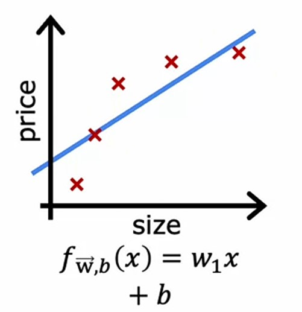

Here, we can see the _regression line_ doesn't fit properly to the _training data_, so it's _cost_ $J_{train}(\vec{w}, b)$ is high, and it **underfits** the data.

And, if we plot _validation data_ on the same plot, we get the following plot:

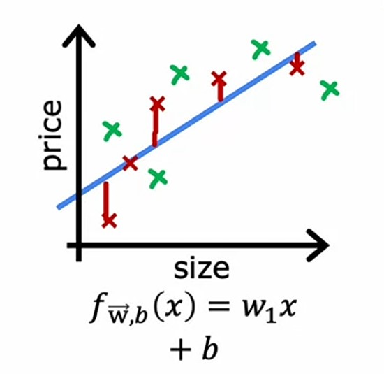

Here, we can see that the _regression line_ doesn't fit properly to the _validation data_ as well, so it's _cost_ $J_{cv}(\vec{w}, b)$ is high too.

So, this is a case of **High Bias**.

-   A characterstic of an algorithm with _high bias_ is, it underfits the _training data_ and it's _training cost_ is high as well as _validation cost_ is high.

---

#### High Variance

If we have a _Linear Regression_ model with _degree_ of _polynomial_ as $4$ i.e.:
$$f_{\vec{w}, b}(x) = w_1x + w_2x^2 + w_3x^3 + w_4x^4 + b$$

And, after plotting the _regression line_ on the _training data_, we get the following plot:

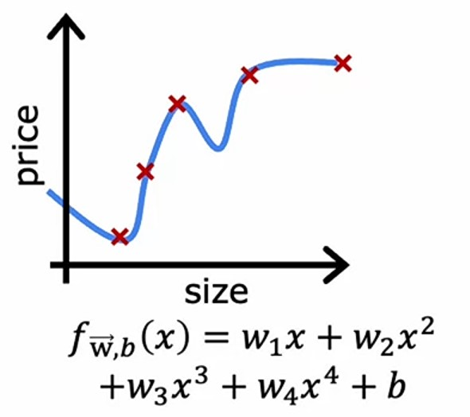

Here, we can see the _regression line_ fits really well to the _training data_, so it's _cost_ $J_{train}(\vec{w}, b)$ is low.

And, if we plot _validation data_ on the same plot, we get the following plot:

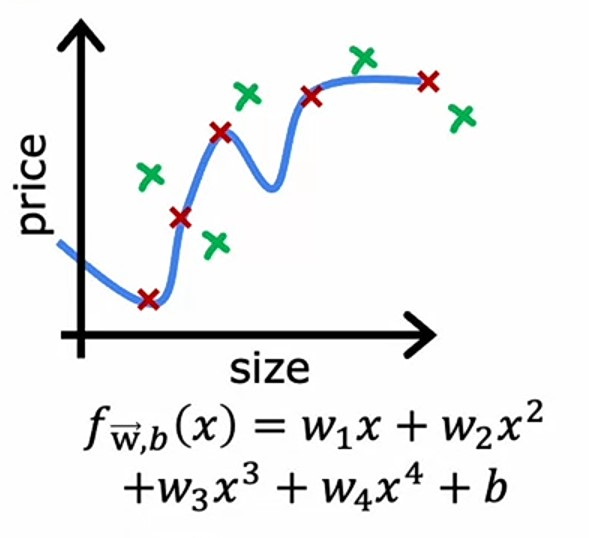

Here, we can see that the _regression line_ doesn't fit to the _validation data_, so it's _cost_ $J_{cv}(\vec{w}, b)$ is very high and hence it **overfits** the data.

So, this is a case of **High Variance**.

-   A characterstic of an algorithm with _high variance_ is, the _validation cost_ is much higher than the _training cost_.

---

#### Right fit (Low Bias and Low Variance)

If we have a _Linear Regression_ model with _degree_ of _polynomial_ as $2$, i.e.:
$$f_{\vec{w}, b}(x) = w_1x + w_2x^2 + b$$

And, after plotting the _regression line_ on the _training data_, we get the following plot:

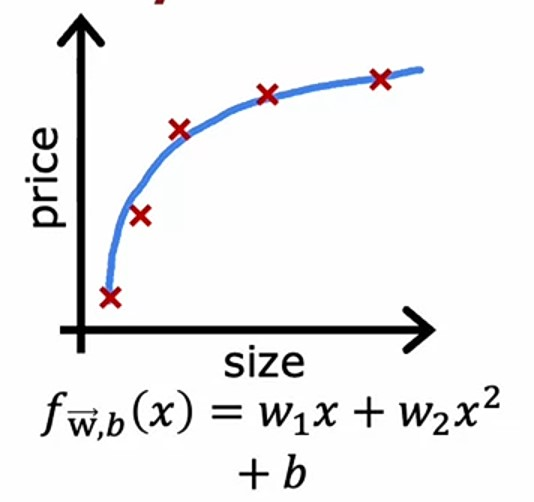

Here, we can see the _regression line_ fits well to the _training data_, so it's _cost_ $J_{train}(\vec{w}, b)$ is low.

And, if we plot _validation data_ on the same plot, we get the following plot:

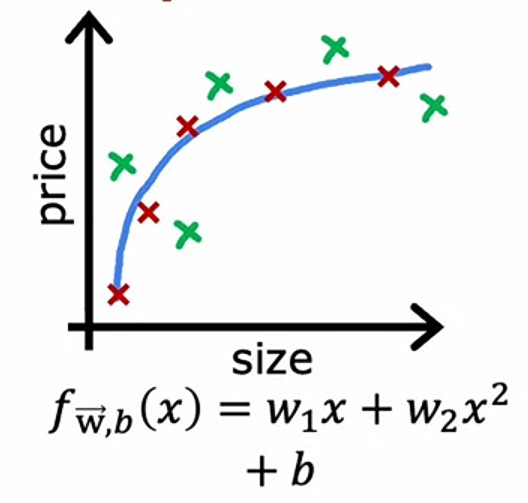

Here, we can see that the _regression line_ fits well to the _validation data_ as well and it's _cost_ $J_{cv}(\vec{w}, b)$ is less low but not much high.

So, this is a case of **Right fit**.

-   If the _training cost_ and _validation cost_ are both low, then the model fits well to the data and it's a **Right fit**, means it has _Low Bias_ and _Low Variance_.

---

### Diagonising Bias and Variance with Learning Curve

If we plot the _training cost_ and _validating cost_, having _degree_ of _polynomial_ on $x$-axis and _cost_ on $y$-axis, we get the following plot:

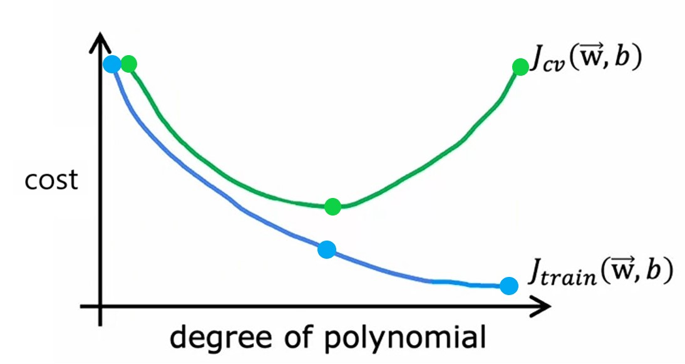

Here, we can see that:

1. If we have very low _degree_ of _polynomial_, let's say $1$, then the _training cost_ and _validation cost_ is high, so it's a case of **High Bias**.

2. If we have very high _degree_ of _polynomial_, let's say $4$, then the _training cost_ is low but _validation cost_ is high, so it's a case of **High Variance**.

3. If we have _degree_ of _polynomial_ as $2$, then the _training cost_ and _validation cost_ is low, so it's a case of **Right fit**.

---

### Indicators of Bias and Variance

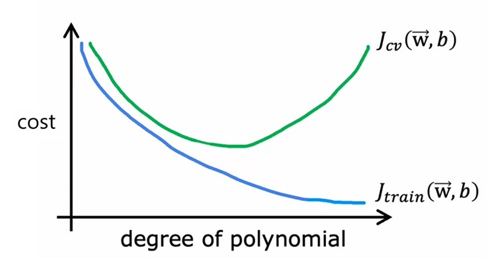

1. If the _training cost_ is high and _validating cost_ is hight too, then it's a case of **High Bias** and $J_{train}$ is almost same as $J_{cv}$.

$$J_{train} \approx J_{cv}$$

2. If the _training cost_ is low and _validating cost_ is high, then it's a case of **High Variance**. $\gg$ (double greater than) means $J_{cv}$ is very very much high than $J_{train}$.

$$J_{cv} \gg J_{train}$$

3. If the _training cost_ is high and _validation cost_ is also high, even higher than the _training cost_, then it's a case of **High Bias** and **High Variance** (or **Low Variance** and **High Variance**). It happens sometimes in **neural networks**, where some part of the network is **underfit** and some part is **overfit** to the data.

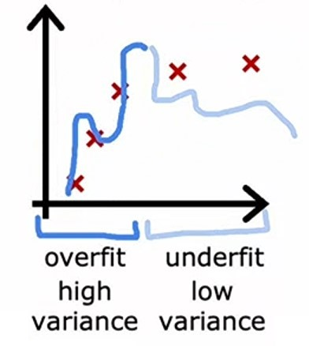

---

### Regularization and Bias / Variance

> **Regularization**:
>
> Regularization is a way to prevent overfitting by reducing the impact (weight $w$) of some features rather than eliminating them (feature selection).

So, we've seen how the value of _degree_ in _polynomial features_ effects the _bias_ and _variance_ of the model.

Now, we'll see how the value of _lambda_ $\lambda$ effects the _bias_ and _variance_ of the model.

For _Linear Regression_, we have it's _regularized cost_ function as:
$$J(\vec{w}, b) = \frac{1}{2m}\sum^m_{i=1}\left(\hat{y}^{(i)} - y^{(i)}\right)^2 + \frac{\lambda}{2m}\sum^n_{j=1}w^2_j$$

Here $\frac{\lambda}{2m}\sum^n_{j=1}w^2_j$ is the _regularization term_, and we need to provide a value of $\lambda$, which reduces the impact of weights $w$.

1. If we give $\lambda$ a very high value like $1000$, it reduces all the weights $w$ to almost $0$, and in the _linear regression_ equation, the $b$ parameter will take effect. This high value of $\lambda$ makes the model **underfit**, with _high bias_.

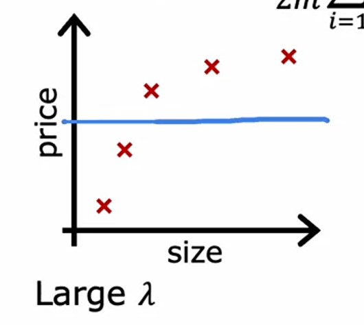

2. If we give $\lambda$ a very low value, like $0$, then it will not effect the weights $w$ at all, and the model will **overfit** the data, with _high variance_.

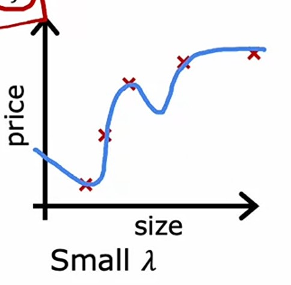

3. So, we need to give $\lambda$ an intermediate value like $10, 150$ or $270$ some number which either doesn't reduce the weights $w$ to $0$ or doesn't effects the weights $w$ at all.

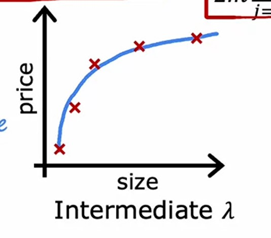

---

#### Choosing best value for $\lambda$

So, how do we choose the best value for $\lambda$?

We can use the same way as we did for choosing the best value for _degree_ in _polynomial features_. By trying out different values of $\lambda$ and see which results the minimum _cost_ error for the _training_ and _validation_ data.

1. Let's try $12$ different values for $\lambda \approx 0, 0.01, 0.02, 0.04, 0.08, \cdots, 10$
2. And we will find the _cost_ error for each value of $\lambda$ for the _training_ and _validation_ data.
3. Say, we got the minimum _validation_ cost error for $\lambda = 0.08$, then we will use that value of $\lambda$ for our model.
4. And, then we'll check the _cost_ error for the _test_ data, which is the estimated _generalization_ error.

Now, let's visualize the different values of $\lambda$ effects the _cost_ error for the _training_ and _validation_ data.

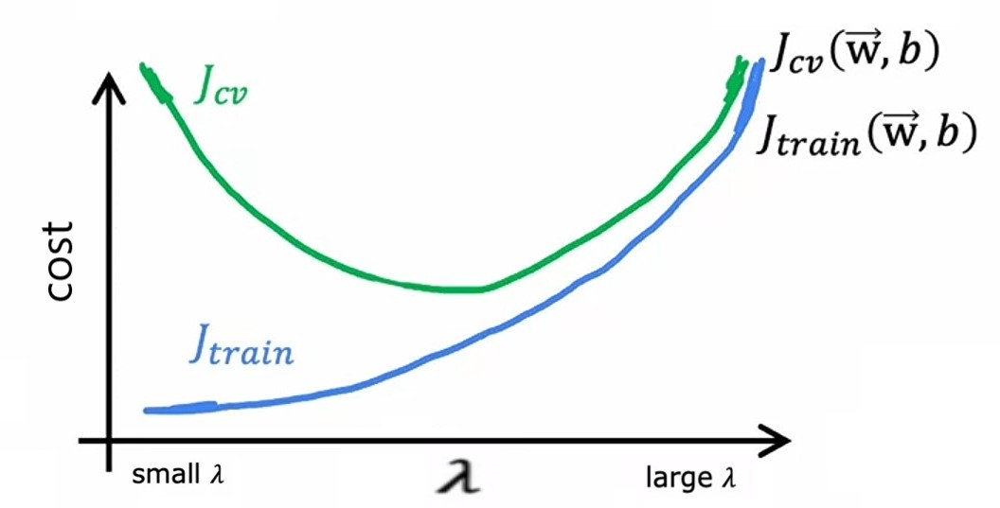

In the above graph, we can observe that:

1. If we give $\lambda$ a very small value, it makes the _training cost_ error $J_{train}$ very low and _validation cost_ error $J_{cv}$ very high, which is a case of **High Variance**, because it doesn't effects the weights $w$ at all.
2. If we give $\lambda$ a very high value, it makes the _training cost_ error $J_{train}$ very high and _validation cost_ error $J_{cv}$ very high, which is a case of **High Bias**, because it makes the weights $w$ almost $0$.
3. If we give $\lambda$ an intermediate value, it makes the _training cost_ error $J_{train}$ and _validation cost_ error $J_{cv}$ almost same, which is a case of **Right fit**.

-   And, if we see, this graph is mirror image to the *degree of polynomial features* graph, because in *degree* graph, when we have low *degree*, it is the case of **High Variance**, and similarly low value of $\lambda$.
-   And, when we have low _degree_, it will be the case of **High Bias**, and similarly high value of $\lambda$.

---

### Establishing a baseline level of performance

While making _ML_ models, we can encounter the _training error_ is high or _validation error_ is high or vice-versa.

So, how do we know which one is the _right_ error?

By establishing a _baseline_ level of performance, means by comparing the _training error_ and _validation error_ with the _baseline_ level of performance.

So, how do we establish a _baseline_ level of performance?

We can check the level of errors we can get in _baseline_ performance like:

1. Human level performance
2. Competing algorithms performance
3. Guess based on experience

Let's say we are building a _Speech recognition_ model, where our model takes the voice as _input_ and give it's transcript as _output_.

-   So, say if we get our _training error_ as $10.8\%$ and _validation error_ as $14.8\%$.

-   By looking at the _training error_ we can see that our model is **underfit**, because it's _training error_ is high almost $10\%$ i.e. $10\%$ of voice our model doesn't recognize well, so it's case of **High Bias**.

-   But, here we can establish a _baseline_ level of performance by checking the difference in _training error_ and _Human level error_.

-   It turns out, sometimes we humans even doesn't recognize the voice well, when there's some background noise, like in a _party_ or _traffic jam_, so there can be a _human level error_ too.

-   So, let's say we have a _human level error_ of $10.6\%$.

-   If we measure the difference in _human level_ performance and _training error_, then it's $0.2\%$, which is very less.

-   So, it's clear that our model is not **underfit**, and there is no _bias_ in our model.
-   And the difference in _training error_ and _validation error_ is $4\%$, which is very high compared to the difference in _human level error_ and _training error_ i.e. $0.2\%$, so it's clear that our model is **overfit**, and this is a case of **High Variance**.

Let's say:

#### Case 1

-   Baseline performance error = $10.6\%$
-   Training error $J_{train} = 10.8\%$
-   Validation error $J_{cv} = 14.8\%$

So, here the difference in _baseline performance error_ and _training error_ is $0.2\%$, and the difference in _training error_ and _validation error_ is $4\%$, so this is a case of **High Variance**.

#### Case 2

-   Baseline performance error = $10.6\%$
-   Training error $J_{train} = 15.0\%$
-   Validation error $J_{cv} = 15.5\%$

So, here the difference in _basline performance error_ and _training error_ $4.4\%$, and the difference in _training error_ and _validation error_ is $0.5\%$, so this is a case of **High Bias**.

#### Case 3

-   Baseline performance error = $10.6\%$
-   Training error $J_{train} = 15.0\%$
-   Validation error $J_{cv} = 19.7\%$

So, here the difference in _basline performance error_ and _training error_ $4.4\%$, and the difference in _training error_ and _validation error_ is $4.7\%$, so this is a case of both **High Bias** and **High Variance**.

#### Conclusion:

1. If the difference in _baseline performance_ and _training error_ is high, then it's a case of **High Bias**.
2. If the difference in _training error_ and _validation error_ is high, then it's a case of **High Variance**.
3. Sometimes, there maybe a case of both **High Bias and Variance** where the difference in _baseline performance_ and _training error_ is high as well as the difference in _training error_ and _validation error_ is high.

---

### Learning Curves

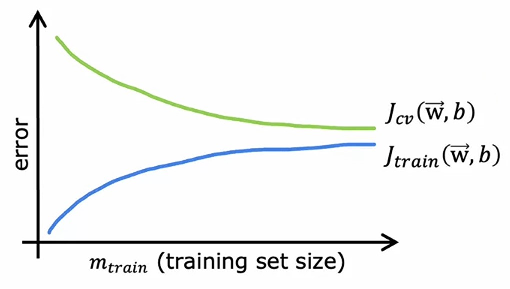

If we plot the _training error_ and _validation error_ by increasing the training examples, we can observe that:

-   As we increase the no. of _training_ examples, the _training error_ $J_{train}$ will increase and fget latten out after a limit, and will never increase or decrease.
-   As we increase the no. of _training_ examples, the _validation error_ $J_{cv}$ will decrease and get flatten out after a limit, and will never increase or decrease.

Because, let's say if we plot a _quadratic polynomial_ feature on _Linear regression_:
$$f_{\vec{w}, b}(x) = w_1x + w_2x^2 + b$$

With less training examples, it's easy to fit _regression_ line on _training_ examples.

| Training examples |                         Linear regression line                          |
| :---------------: | :---------------------------------------------------------------------: |
|         1         | 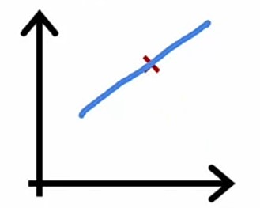 |
|         2         | 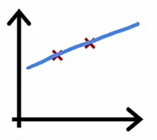 |
|         3         | 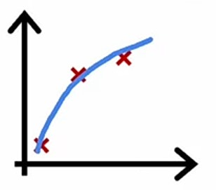 |
|         4         | 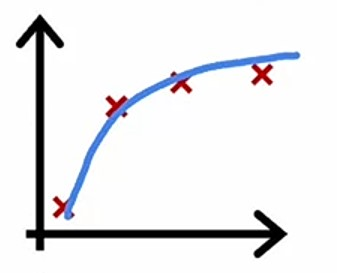 |
|         5         | 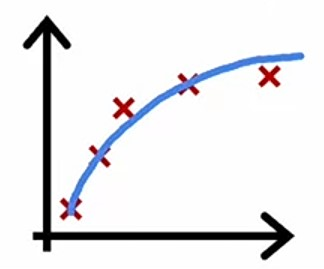 |
|         6         | 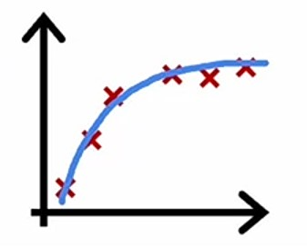 |

Here, we can see that:

-   As the number of _training_ examples increases, it's become hard to fit the _regression_ line perfectly, which eventually increases the _training error_.

-   If we have fewer _training_ examples, then our model doesn't not _generalize_ well, as the _training_ examples increases, the model will start _generalizing_ and hence the _validation error_ will decrease, and after a limit it will flatten out.

---

### Learning curves for High Bias

Let's say we plot a _Linear regression_ model with $1$ _degree_ polynomial feature, and we have $m=5$ _training_ examples.

$$f_{\vec{w}, b}(x) = wx + b$$

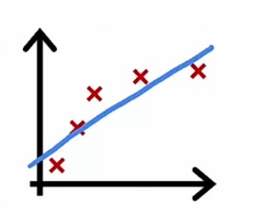

Here, we can see that:

-   The _regression_ line is straight, and doesn't fit the _training_ examples well.
-   So, it has high _training error_.
-   And, it's a case of **High Bias**.

Now, if we increase the _training_ examples and then plot it:

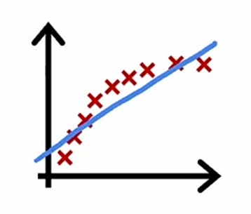

Here we can see that:

-   The _regression_ line is straight, and still doesn't fit the _training_ examples well.
-   So, it has high _training error_ and still have **High Bias**.

So, if we plot the _training error_ and _validation error_ by increasing the _training_ examples, we can observe that:

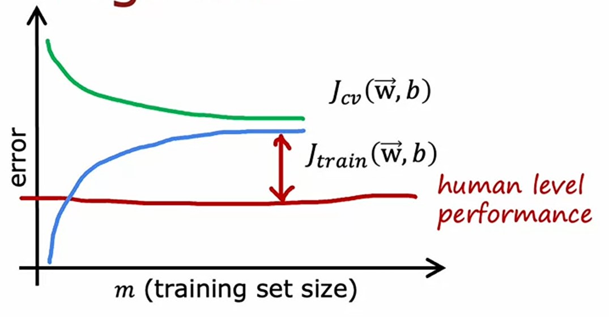

In the graph, we can see that:

-   The _training error_ $J_{train}$ starts increasing, as we add more _training_ examples, and then after a limit it flattens out.
-   The _validation error_ $J_{cv}$ starts with high error, but as we add more _training_ examples, it decreases and then after a limit it flattens out.
-   And, if we compare the _training error_ with **baseline performance**, i.e. _human level performance_, we can see that the difference is high, which shows it's case of **High Bias**, and by adding more _training_ examples, it will not help to reduce the **Bias**.

So, to conclude:

> If a learning algorithm suffers from **High Bias**, getting more _training_ data will not (by itself) help much.

---

### Learning curves for High Variance 

Now, let's the case of **High Variance**. 

If we plot a $4$-_degree polynomial_ feature on regularized _Linear regression_ model with $m=5$ _training_ examples, with small value for $\lambda$.

$$f_{\vec{w}, b}(x) = w_1x + w_2x^2 + w_3x^3 + w_4x^4 + b$$


We can see that:

-   The _regression_ line is wiggly and curvy, and fits the _training_ examples well.
-   And, it has almost $0$ _training error_.
-   So, it's a case of **High Variance**. 

If we see the _training error_ and _validation error_ plot:

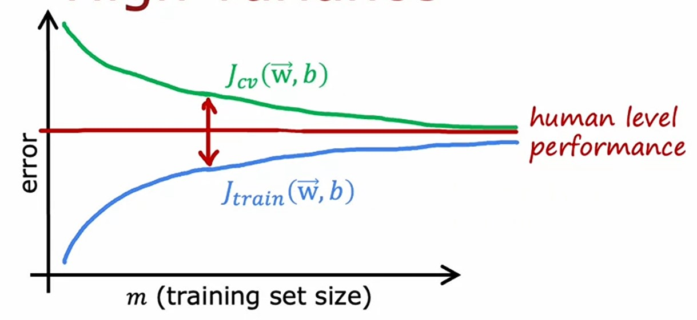

Here we can see that:

-   If we keep increasing the number of _training_ examples, the _training error_ will start increasing and at some point it will flatten out.
-   The _validation error_ $J_{cv}$ starts with high error, but as we add more _training_ examples, it decreases and then after a limit it flattens out, because the model will start _generalizing_, even though it's _overfitted_.
-   The _training error_ is lower than compared to **baseline performance** i.e. _human level performance_ because sometimes, _human level performance_ has some error, but the model doesn't have any error.
-   But as the _training error_ and _validation error_ are close to each other, we can say that adding more _training_ examples, prevents the model from _overfitting_, and hence reduces the _variance_

So, to conclude that:

> If a learning algorithm suffers from **High Variance**, getting more _training_ data is likely to help.

---

### Debugging a learning algorithm

In previous chapter/videos, we discussed that following ways can help to debug a learning algorithm:

1. Get more training examples
2. Try smaller sets of features
3. Try getting additional features
4. Try adding polynomial features ($x^2_1, x^2_2, x_1, x_2$ etc...)
5. Try decreasing $\lambda$
6. Try increasing $\lambda$

So, which one of them are used to fix **High Bias** and **High Variance**?

#### 1. Getting more training examples
As we have seen [above](#learning-curves-for-high-variance), if we have less training examples, the the model will not generalize wwell to new data and hence have **High Variance**. So, getting more training examples will help to reduce the **High Variance**.

#### 2. Try smaller sets of features
If we have more features, then the model will be more complex and have **High Variance**. So, if we reduce no. of features then our model will be much simpler and less prone to *overfitting* and hence have **Low Variance**.

#### 3. Try getting additional features
Opposite to above, if our model have less features, then the model will depend only on few features and may *underfit* the data and have **High Bias**. So, adding more features will help to reduce the **High Bias**.

#### 4. Try adding polynomial features
Similar to above, if we have few features, and have simple model, then the model may underfit like [this](#learning-curves-for-high-bias) and have **High Bias**. So, by adding polynomial features, our model can fit the data better and hence have **Low Bias**.

#### 5. Try decreasing $\lambda$
If we have high value of $\lambda$, then the value of *weights* will not be penalized, so *regularized term* in the *cost* function will not have much effect and hence the model will have **High Bias**, due to *underfitting*. So by decreasing the value of $\lambda$, we can reduce the **High Bias**.

#### 6. Try increasing $\lambda$
Opposite to above, if we have small value of $\lambda$, then the value of *weights* may reduce to $0$, and the *weights* in the model doesn't effect at all, and hence the model will have **High Variance**, due to *overfitting*. So by increasing the value of $\lambda$, we can reduce the **High Variance**.

---

### Bias-Variance Tradeoff

While fitting the model, we need to find a balanced model, which has both **Low Bias** and **Low Variance**, we also call that model has **Bias-Variance Tradeoff**.

Let's say, we have a linear model, which has **High Bias**:
$$f_{\vec{w}, b}(\vec{x}) = \vec{w}\cdot \vec{x} + b$$

And, a high order $4$-*degree polynomial* model, which has **High Variance**:
$$f_{\vec{w}, b}(x) = w_1x + w_2x^2 + w_3x^3 + w_4x^4 + b$$

So, we need to find a **Bias-Variance Tradeoff**, a right model, which has both **Low Bias** and **Low Variance**.

Let's say, the **Bias-Variance Tradeoff** is a $2$-*degree polynomial* model:
$$f_{\vec{w}, b}(x) = w_1x + w_2x^2 + b$$

So, if we have a very simple model, we have **High Bias** and if we have a too complex model, then we have **High Variance**. And if we are able to find a **tradeoff** between these two, then we'll get the best possible outcome.

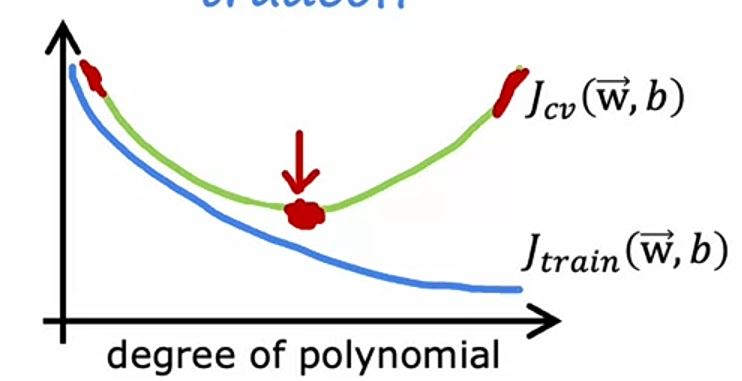

---

### Bias and Variance in Neural Networks

If we train large **neural networks** with moderate *training data* size, then we have a **Low Bias** model.

Let's see how we can get a **Low Bias** model with **neural networks**:

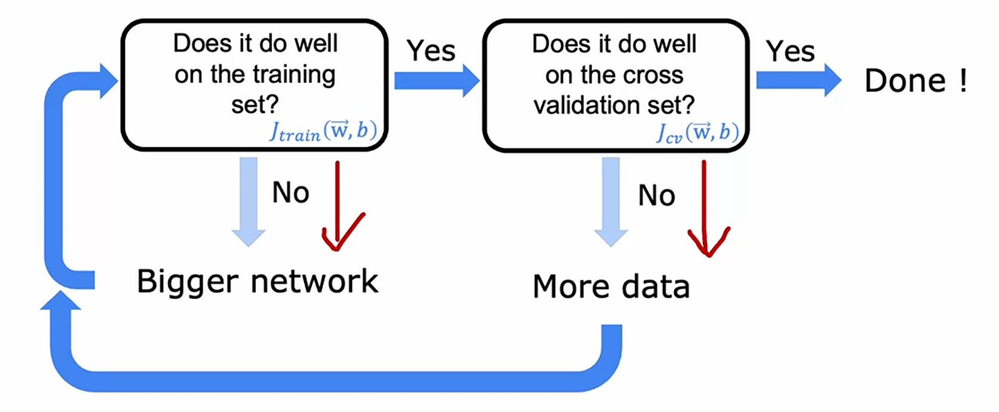

We need to check $2$ things:
#### 1. Does the **neural network** do well on the *training set* ?
- means, do we have less *training error* $J_{train}(\vec{w}, b)$, but not lower than the **baseline performance**?
- If no, then we have **High Bias**.
- To fix it, we need to make our **neural network** bigger, by adding more *hidden layers* or *hidden units*.
- And, we repeat this step, until we have **Low Bias**.

#### 2. Does the **neural network** do well on the *cross validation set* ?
- means, do we less *cross validation error* $J_{cv}(\vec{w}, b)$, and the difference in *cross validation error* and *training error* is not too high?
- If no, then we have **High Variance**.
- To fix it, we need to add more *training data*.
- And, after adding more data, we go back to step $1$ repeat this process, until we have **Low Variance**.

So, to conclude:
- If we have **HIgh Bias**, then we need to add more *hidden layers* or *hidden units*.
- If we have **High Variance**, then we need to add more *training data*.
- If we have **Low Bias** and **Low Variance**, then we have **Bias-Variance Tradeoff**, hence a good model.

But there are $2$ problems (caveats) we may face:
1. Bigger **neural networks** are computationaly expensive.
2. At some point, we don't have enough *training data* to add more.

But, with the rise of **neural networks**, **Graphical Processing Units** (GPUs) are also rising, and they are much faster than CPUs, so we can handle the first problem.

#### A Question: What if our neural network is too big, that it creates High Variance problem ?
If we create a **neural network** with well choosen *regularization*, then we can reduce the **High Variance** problem.

Means, if we have a small **neural network** like this:


then, we may face **High Bias** problem, i.e. it may *underfit* the data and results inaccurate.

So, to tackle it, we can create a large **neural network** like this:


With a large **neural network**, we can reduce the **High Bias** problem, but also to make sure not having **High Variance** problem, we need to use *regularization* properly.

---

### Neural networks code with Regularization

1. We need to import `L2` i.e. **Ridge Regression** *regularizer*:
```python
from tensorflow.keras.regularizers import L2
```
2. While creating the *layers*, we need to set the `kernel_regularizer` parameter to `L2` with provided value of $\lambda$:
```python
Dense(25, activation="relu", kernel_regularizer=L2(0.01))
```

---

### Quizzes

#### Practice Quiz: Advice for Applying Machine Learning

#### Question 1


<details>
<summary>    
    <font size='3' color='#00FF00'>Answer to <b>question 1</b></font>
</summary>
<p>If you have selected option <em>c (High Variance)</em> then you are right!<br/><b>Explanation:</b><br/>When J<sub>cv</sub> >> J<sub>train</sub> whether J<sub>train</sub> is also high or not, this is a sign that the model is overfitting to the training data and performing much worse on new examples.</p>
</details>

#### Question 2


<details>
<summary>    
    <font size='3' color='#00FF00'>Answer to <b>question 2</b></font>
</summary>
<p>If you have selected option <em>a (Compare the training error to the baseline level of performance)</em> then you are right!<br/><b>Explanation:</b><br/>Correct. If comparing your model's training error to a baseline level of performance (such as human level performance, or performance of other well-established models), if your model's training error is much higher, then this is a sign that the model has high bias (has underfit).</p>
</details>

#### Question 3


<details>
<summary>    
    <font size='3' color='#00FF00'>Answer to <b>question 3</b></font>
</summary>
<p>If you selected options <em>1<sup>st</sup> and 3<sup>rd</sup></em> then you are right!<br/><b>Explanation:</b><br/>Correct. Decreasing regularization can help the model better fit the training data.</br>Correct. More features could potentially help the model better fit the training examples.</p>
</details>

#### Question 4


<details>
<summary>    
    <font size='3' color='#00FF00'>Answer to <b>question 4</b></font>
</summary>
<p>If you selected options <em>1<sup>st</sup> and 3<sup>rd</sup></em> then you are right!<br/><b>Explanation:</b><br/>Yes, the model appears to have high variance (overfit), and collecting more training examples would help reduce high variance.</br>Yes, the model appears to have high variance (overfit), and increasing regularization would help reduce high variance.</p>
</details>