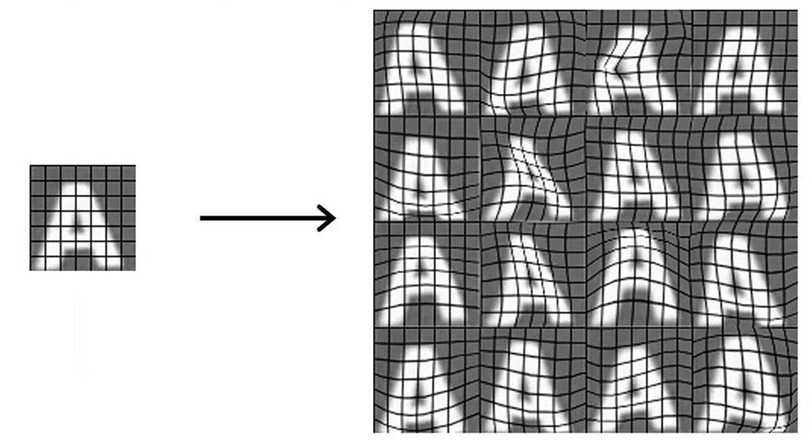
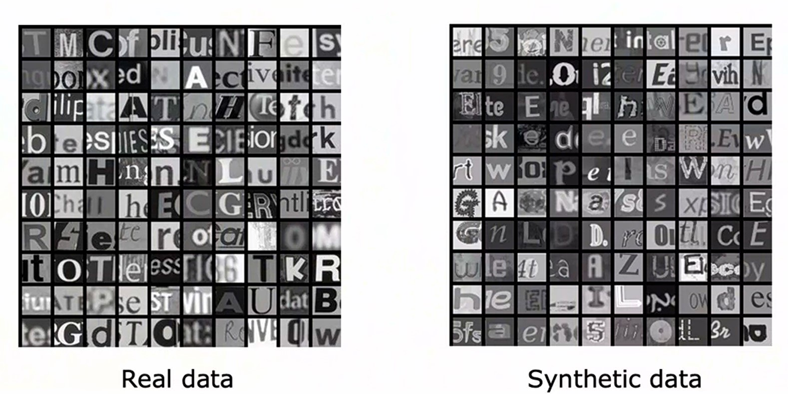
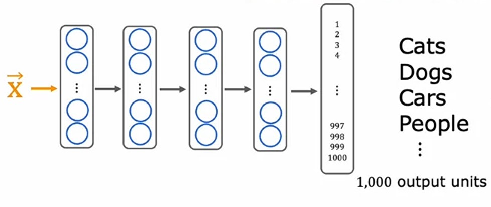
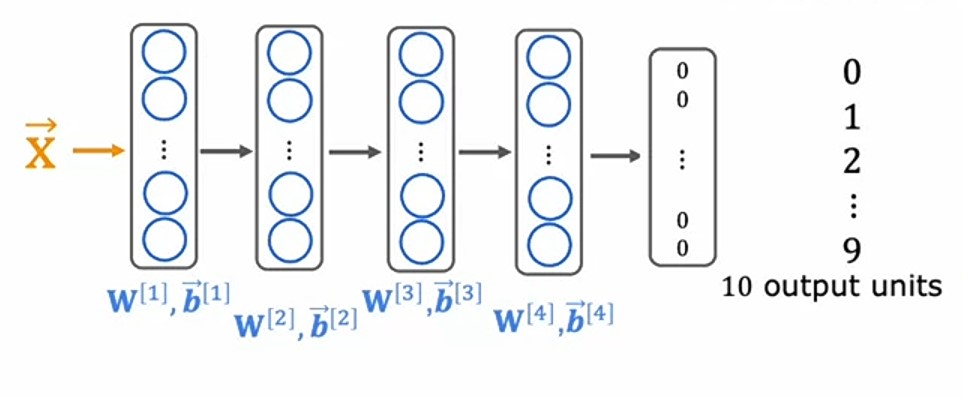
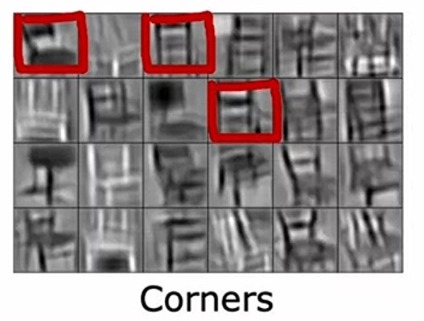
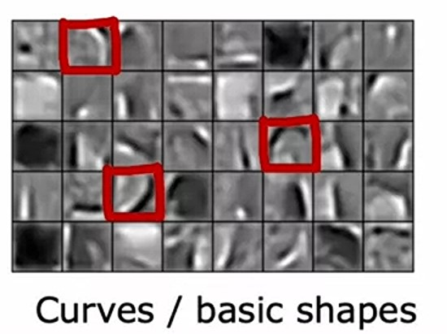
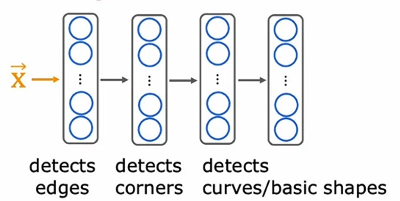
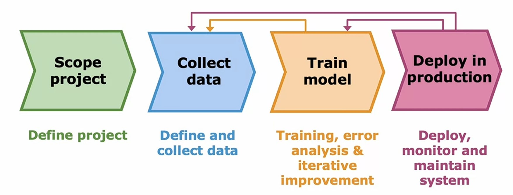
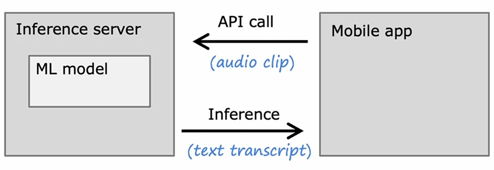

# Week 3: Advice for Applying Machine learning

## Machine Learning Development process

### Iterative loop of Machine Learning Development

Let's see what's the overall develpoment process of a **Machine Learning** model is often like:

#### Step 1: Choose Architecture

-   $1^{st}$ step is to choose the design of our model, the architecture, if it's a **neural network**, then how many _layers_, _neurons_ does it have.
-   And, we need to choose the portion of data which we are going to use, like how many features we are gonna use, should we do feature engineering or not or choose all of them.

#### Step 2: Train model

-   $2^{nd}$ step is to train our model.

#### Step 3: Diagnostics

-   $3^{rd}$ step is to diagnose our model, in which we see the learning curve, the loss, accuracy of our model and how it performs.
-   We check **Bias**, **Variance** and do _error analysis_.
-   Then, if we don't satisfy with the model's performance, then we need to repeat from [step $1$](#Step-1:-Choose-Architecture), i.e. should we add more data, or reduce the value of $\lambda$ or increase it, add more features, remove some features etc..., according to the situation we are in.

-   So, to conclude that, It is a loop where we do all these steps again and again until we get a satisfactory result from our model.

---

### Spam Email Classifier

Let's take an example of Spam email classification.

Let's say we have 2 different emails, where $1$ is spam and fake, $2^{nd}$ one is not spam.

| Spam email                                                                                                                                                               | Real email                                                                                                                                                                                                                                |
| :----------------------------------------------------------------------------------------------------------------------------------------------------------------------- | :---------------------------------------------------------------------------------------------------------------------------------------------------------------------------------------------------------------------------------------- |
| From: cheapsales@buystufffromme.com To: Andrew Ng Subject: Buy now!  Deal of the week! Buy now! Rolex w4tches - $100 Medicine - (any kind) - $50 | From: Parampreet Singh  To: Andrew Ng Subject: Thanks for your courses  Dear Andrew sir, Thanks for all the courses you have made. Your courses are really amazing and learning a lot from it. Thank you  |

In the above table, we can see that

-   $1^{st}$ email is clearly spam, just by looking at it's email address we can identify, also it's content, and spammers now-a-days, intentionally misspell some words, so that it cannot be marked as spam.
-   $2^{nd}$ email is a real email, sent by me, (will sent it for sure after this course 😅), and this is clearly not a spam.

So, how can we make a ML model, which can identify, which one is spam which one isn't.

1. We can make a list of features (words) like a $10,000$ words dictionary.
2. From that dictionary, for each email, we can create a vector $\vec{x}$ and map $0$ if the word isn't in the email or $1$ if the word is present in the email.
3. Or, we can also map the count of word.
4. Example, we have a list of words like: _a, andrew, buy, deal, discount_ etc...
5. So, we can create a vector $\vec{x}$ and map it's count or absence with $0$.
6. Like, for the spam email, the vector $\vec{x}$ will be like this:
   $$\vec{x} = \begin{bmatrix}0 \\ 1 \\ 2 \\ 1 \\ 1 \\ \vdots\end{bmatrix}$$

7. For, real email, it can be like this:
   $$\vec{x} = \begin{bmatrix}0 \\ 1 \\ 0 \\ 0 \\ 0 \\ \vdots\end{bmatrix}$$

8. With these set of features, we can make our model using _logistic regression_ or a complex model by making a **neural network** which predicts $y$ spam or not, for the given input features(occurences of words) $\vec{x}$.

-   Let's say, after training the model, it doesn't work well, so how do we diagnose it ?

#### Diagonizing Spam Email classifier

We can try different ways from the following:

1. Collect more data.
2. Develop sophisticated features based on email routing (like header of email)
3. Define sophisticated features from email body like _discounting_ and _discount_ and _discounted_ should be treated as same.
4. Design algorithms to detect misspelling like w4tches etc...

Let's say, after training our model for the $1^{st}$, we got **High Bias**, i.e. our _training error_ is high as well as our \*_validation error_ is high too!

So, to tackle it, we cannot follow the option $1$ i.e. collect more data, because we saw earlier, that adding more data doesn't fix the **High Bias** problem, instead it fixes **High Variance** problem.

So, just by doing trial and error and doing this develpoment process in a loop for multiple times, we can made a good model.

---

### Error analysis

Let's say we have trained our model and predict $\hat{y}$ on _cross-validation_ dataset where $m_{cv} = 500$, out of which $100$ are missclassified.

So, in error analysis, what we do is, we manually examine a sample of that missclassified data, or all of them if it's small number, and categorize them based on common properties.

Like for Spam Email classification, we can categorize, missclassified examples into these $5$ properties/traits:

1. Pharama (medicine related)
2. Deliberate misspelling (w4tches)
3. Unusual email routing (email address, header)
4. Steal passwords (phishing)
5. Spam message in embedded image

So, say we have categorize $60$ misclassified examples out of $100$ as follows:
| Categories | no. of examples |
|:-----------|:---------------:|
| Pharama (medicine related) | $21$ |
| Deliberate misspelling (w4tches) | $12$ |
| Unusual email routing (email address, header) | $6$ |
| Steal passwords (phishing) | $7$ |
| Spam message in embedded image | $4$ |

There can be some emails, where they can be counted in more than one categories like some emails may have deliberate misspellings as well as unusual email routing.

So, we need to look out which category has more number of examples, and give first priority to it. It doesn't we just ignore the low counts one like spam message in embedded image, we just first need to focus on the emails which has the highly impacted cateogory like Pharama and deliberate misspellings.

**Error analysis** would really be useful, rather than just focusing randomly on one kind of example.

> By the way, I'm telling the story because I once actually spent a lot of time building algorithms to find deliberate misspellings and spam emails only much later to realize that the net impact was actually quite small. This is one example where I wish I'd done more careful error analysis before spending a lot of time myself trying to find these deliberate misspellings. ~ _Andrew Ng_

With **error analysis**, we can also find what's the problem and what approach should we try out from [it](#diagonizing-spam-email-classifier).

Like, $4^{th}$ point should be useful i.e. _Design algorithms to detect misspelling like w4tches etc..._ .

---

### Adding data

Sometimes, adding more data can help our machine learning model to improve it's performance, like when we have high variance problem.

Let's see different ways to add data for machine learning model, so that it can learn better.

#### 1. Adding more data

> Look up for new unlabelled data, labelled them and add them into _training_ dataset, especially, the type of data which is causing error which can be done by _error analysis_.

One way to add data, is to look up to new data, and add that examples to our dataset.

We can add that examples which are causing high error, by doing _error analysis_ we can find which type of examples our model is not classifying properly.

From the above _Spam Email classifier_ example, we saw that:

-   Out of $m_{cv} = 500$, _cross-validation_ examples, $100$ are missclassified.
-   And, from $100$ missclassified examples, we did _error analysis_ on $50$ of them
-   Out of $50$ majority of them belongs to _Pharma_ category.

So, what we can do is we can look up to new unlabelled data and add that data which belongs to _Pharama_ category.

By adding more data of missclassified examples to our training data, we can make our model learn that data as well.

---

#### 2. Data Augmentation

> It is the technique used to generate new _training_ examples from existing _training_ examples by modifying them.

It is mainly used in image and audio related problems.

In this technique, we increase the diversity of our _training_ set by apply realastic transformations.

Let's take _Hand written Alphabet recognition_.

-   Say, we have few images of letter _A_ compared to other letters.

-   We want to add more examples of _A_ in our _training_ set.
-   We can take that picture of _A_, and modify it little bit, increase/decrease the scale of image, rotate it a little bit, stretch it and make new examples of it.

Similarly, in _Speech recognition_, we can add new sounds in the background of voices, like noise of crowd, traffic jam, noise of people talking etc... and make new voice examples from them.

One important thing to be aware while doing _data augmentation_ is:

-   The changes which we are doing to the _training_ data, should be realastic.
-   They should be real life transformations, like rotating images, stretching images, not like adding noise in the alphabets, which can never be found in the _test_ data.
-   Purely random data transformations may lead to poorely trained model.

---

#### 3. Data synthesis

> In _data synthesis_, we use artificial data inputs to create new _training_ examples.

In _data augmentation_, we use existing data to create new data.

But, in _data synthesis_, we make new data which looks similar to the _training_ data.

Like, in **Photo OCR** (Photo Optical Character Recognition).

Say, we have this image, we need to recognize characters in it.

Here, we can see a lot of characters in this photo.

Say, we have collected all the photos together, and this is how our _training_ set looks like:

Now, in _data synthesis_, what we do is:

-   We can see there are different kinds of fonts with different sizes used in these images.
-   So, we can make new data, just like it.
-   Like, we can write different characters in different font families, sizes and different colors.
-   And, take screenshots of them, or make images of them.
-   With this, we can create more _training_ data like this:

-   Here, on the left, we have _real data_ and on right _Synthetic data_, which we have created ourselves.
-   It is not looking different from it, instead it looks very similar to the _real data_.
-   It may take a lot of time to make _synthetic_ data, but it can give a huge boost to our model's performance.

---

### Engineering the data used by our system

-   Most machine learning researchers attention was on the **Conventional Model Centric** approach.

$$\text{AI} = \underbrace{\text{Code }}_{\text{main focus}} + \text{ Data}$$

-   Where, their main focus is on code, i.e. the machine learning model, how to improve it, what techniques we can use to improve it's performance.
-   This is a good approach, will lead us to great machine learning algorithms like **linear regression, logistic regression and neural networks**.
-   But, there's also another another which is **Data centric** approach
-   In this approach, researchers mainly focused on the data engineering and make data useful for our machine learning algorithms.

$$\text{AI} = \text{Code } + \underbrace{\text{ Data}}_{\text{main focus}}$$

-   Sometimes, focus on data would be very efficient for model making process.
-   So, we should also spend some time with data.

---

### Transfer learning

> **Transfer learning** is a machine learning method where a model developed for a task is reused as the starting point for a model on a second task. ~ [_Json Brownlee_ - ML Mastery](https://machinelearningmastery.com/transfer-learning-for-deep-learning/#:~:text=Transfer%20learning%20is%20a%20machine%20learning%20method%20where%20a%20model%20developed%20for%20a%20task%20is%20reused%20as%20the%20starting%20point%20for%20a%20model%20on%20a%20second%20task)
>
> Transfer learning is a machine learning technique where a model trained on one task is re-purposed on a second related task. [_Json Brownlee_ - ML Mastery](https://machinelearningmastery.com/transfer-learning-for-deep-learning/#:~:text=Transfer%20learning%20is%20a%20machine%20learning%20technique%20where%20a%20model%20trained%20on%20one%20task%20is%20re%2Dpurposed%20on%20a%20second%20related%20task.)

In **Transfer learning**, we trained our model on different task and use it's parameters (weights) in new model to solve actual task.

#### Hand-written Digit Recognition

Let's say we want to make a **neural network** which identifies the _Hand-written digit_ from $0$ to $9$.

And, we have small amount of data, i.e. very less _Hand-written digit_ labelled images.

So, in **Transfer learning**, what we do is:

1. We'll take another dataset of recognizing several different things.
2. This dataset we have is very large, like a million images.
3. And, we have to predict $1,000$ different classes from it.
4. It can be _Cats, dogs, cars, people, street, dustbin_ etc... $1,000$ different things.
5. So, we'll make a **neural network** on this dataset.
6. Say, we made a $4$ layer **neural network** like this:

6. So, we will train this **neural network**, and save it's parameters, $w^{[1]}, b^{[1]}$ to $w^{[4]}, b^{[4]}$.
7. And, for our _Hand-written digit recognition_ task, we use these parameters to train our **neural network**.
8. But, for the last layer, i.e. _output_ layer, we will train our model and use new parameters i.e. $w^{[5]}, b^{[5]}$.
9. Because, in _Class recognition_ **neural network**, we have $1,000$ different classes to predict on.
10. But, in _Hand-written digit recognition_ **neural network**, we have only $10$ different classes, i.e from digit $0$ to $9$.
11. So, our **neural network** will look like this:

Here, we have $2$ options, with which we can go:

1. Only train _output_ layer parameters i.e. $w^{[5]}, b^{[5]}$.
2. Train all the parameters from $w^{[1]}, b^{[1]}$ to $w^{[5]}, b^{[5]}$.

-   We can go with option $1$, if we have a small dataset.
-   If we choose option $2$, then we'll initialize our parameters with the saved weights of previous model.

> #### Supervised Pre-training
>
> Training a model on large dataset and tuning it's parameter further on new model for small dataset is called _Supervised pre-training_.

> #### Fine Tuning
>
> When we initialize the paramters of new model from the pre-trained model paramters and run new model and tune the parameters according to the application is called _Fine Tuning_.

---

#### Transfer Learning Intuition

If we are training a **neural network** on _Image recognition_ application, then it will learn like this:

1. $1^{st}$ layer will learn to detect edges in the image.

2. $2^{nd}$ layer will learn to detect corners in the image.

3. $3^{rd}$ layer will learn to detect curves and basic shapes in the image.

4. And, with lots of different images, it will learn to detect corners, edges and shapes in the images.

5. With this, our model will learn how to find corners, edges and shapes.

-   One important thing to remember while doing **Transfer learning** is that both the models should be doing same type of task.
-   If we want to do _Image recognition_ task, then the pre-trained model should also be doing _Image recognition_ task.
-   If we are doing _Speech recognition_ task, then the pre-trained whose weights we are using should also some kind of voice related task.

> Famous ML models like **GPT-3** and **BERT** also using **Transfer learning** i.e., they are using pre-trained models and feeding them new data to do predictions.

---

### Full Cycle of a Machine Learning Project

So, till now we have discussed about the Iterative loop of ML, how to get data and how to do error analysis.

Now, we will see and understand the full cycle of ML project.

This is the full cycle of ML project:

Let's understand each step with the example of _Speech Recognition_ project

#### $1^{st}$ step - Scope of project

-   $1^{st}$ step is **scope of project**, i.e. define the project, what is the project we are going to make.
-   Let's say we are working on _Speech Recognition_ project.

#### $2^{nd}$ step - Collect data

-   $2^{nd}$ step is to **collect the data**.
-   We will find what type of data we need ?
-   How do we collect the data ?
-   How much data we need ?
-   For _Speech Recognition_ project, we need audio data and it's transcript.

#### $3^{rd}$ step - Train model

-   $3^{rd}$ step is to **train the model**.
-   After we have collected the data, we will _train_ our model.
-   And, we will do _error analysis_, analyze _learning curve_, check for _Bias_ and _Variance_.
-   So, here we will do all the steps in _Iterative loop of ML model development_.

-   Here, if we found that our model is not working properly, then we try different approaches to improve, so we may have to go back to $2^{nd}$ step - Collect data, if it's **High Variance**, then it helps.

-   For _Speech Recognition_ project, we will train our model by passing _audio_ as input $\vec{X}$ and it's transcript as target variable $y$.

-   Say, we trained out model, but it is not recognizing our voice properly

#### $4^{th}$ step - Deploy in Production

-   $4^{th}$ step is to **deploy the model in production environment**.
-   It means, that the model which we have made, now available it for users to use.
-   When we deploy the model, we need to keep it maintain.
-   So, we need to check it's performance time to time, and when it's performance decreased, then we go back to step $3$ to train the model again.
-   Or, sometimes, if some new kind of data come on which our model performs really poor, then we have to go back to step $2$ to collect the data and then train it.
-   For _Speech Recognition_ project, we can make a mobile app, where we deploy it and let users to our _Speech Recognition_ project.
-   If some kind of new voice used in the model, and it performs poorely on that, then we need to add more data.

---

### Deployment

After we have trained our model, we need to deploy it so that other users can use it.

Let's see how this whole deployment process works:

-   To deploy it, we can make a server, we can call it as _Inference server_.
-   Say, we have a mobile app in which users are using this model.
-   So, to connect our model with mobile app we can make API.
-   And, do API calls by providing the input on which model do the predictions and return it.
-   For _Speech Recognition_ project, we can do API call by passing the voice as input.
-   And our _Speech Recognition_ model will predict it's transcript and outputs it to the mobile app.

So, for all this process, we need some **Software Engineering**, let's look into it.

How much **Software Engineering** is needed is depends upon the amount of users using our service.

Some common things to consider are:

#### 1. Ensure reliable and efficient predictions

-   We need to ensure that our model is reliable and efficient, means it doesn't take so much time to do predictions and it should be computationally efficient.
-   If it takes too long then the user may not use it.
-   If it takes less time, then the user will be happy and they will use it more and more.

#### 2. Scaling

-   **Software Engineering** maybe needed for scaling our model.
-   Like if so many users are using our model, then the server may go down because of high API requests.
-   So, we need to ensure that it handles large number of users efficiently.

#### 3. Logging

-   We also need to log the input data and predictions to maintain our model.
-   But, we also need to ensure the user's privacy while logging their information with their consent.

#### 4. System monitoring

-   The data which we have logged, is also be useful for monitoring our model.
-   How's our model is performing ?
-   Where it's accuracy decreased ?

#### 5. Model updates

-   By monitoring, we can see our model's performance.
-   And, we need to update it time to time.
-   Means, train the model on new data would be useful.
-   Imagine, we have made a _Shoe Classification_ and _Nike_ has launched a new shoe in the market, which our model is not recognizing.
-   So, we need to re-train our model with that shoe images also.

> The deployment process can require some amounts of software engineering. For some applications, if you're just running it on a laptop or on a one or two servers, maybe not that much software engineering is needed. Depending on the team you're working on, it is possible that you built the machine learning model but there could be a different team responsible for deploying it. ~ _Andrew Ng_

> #### MLOps
>
> It stands for **_Machine Learning Operations_**.
>
> It refers to the practice of how to systematically build and deploy and maintain machine learning systems.
>
> To do all of these things to make sure that your machine learning model is reliable, scales well, has good laws, is monitored, and then you have the opportunity to make updates to the model as appropriate to keep it running well.
>
> For example, if you are deploying your system to millions of people you may want to make sure you have a highly optimized implementations so that the compute cost of serving millions of people is not too expensive.

---

### Fairness, Bias and Ethics

While building a machine learning model, we need to make sure that our model is fair, free from bias.

There were some issues occured related to fairness, bias and ethics in ML industry.

Let's see some of them:

### Bias issues

#### 1. **Hiring tool** that descriminate against women.

-   In 2014, Amazon built a a hiring tool which uses AI (ML) to rate job candidates, but it started descrimination on women candidates. It automatically rejecting resumes consisting "women" words.

-   Full article [link](https://slate.com/business/2018/10/amazon-artificial-intelligence-hiring-discrimination-women.html)

#### 2. **Facial Recognition** systems matching dark skinned individuals to criminal mugshots.

-   In past years, there some **Face Recognition** systems were built who considered dark skinned individuals as criminals. [link](https://sitn.hms.harvard.edu/flash/2020/racial-discrimination-in-face-recognition-technology/#:~:text=Face%20recognition%20in%20racial%20discrimination%20by%20law%20enforcement)

#### 3. Biased bank loan approvals.

-   Approving loan to those who invest more in the back.

#### 4. Toxic effect of reinforcing negative streotypes

-   Imposing and recommending only a specific type of content.

---

### Adverse Use cases

There've also been some adverse use cases of Machine learning.

Let's see some of them:

#### 1. Deepfakes without of user's consent

-   Deepfakes are synthetic media in which a person in an existing image or video is replaced with someone else's likeness ~ [_Wikipedia_](https://en.wikipedia.org/wiki/Deepfake)
-   A very popular video of a person doing deep fake of Barack Obama.
-   Using this technology to generate fake videos without user's consent is unethical.

#### 2. Spreading toxic/incendiary speech through optimizing for engagement.

-   Like there's a lot of news about facebook promoting voilence using their AI. [link](https://timesofindia.indiatimes.com/business/india-business/how-facebooks-algorithm-led-a-new-india-user-to-fake-news-violence/articleshow/87250610.cms)

#### 3. Generating fake content for commerical or political purposes

-   Making fake ids on social media platforms and inpersonating others ans spreading fake content. [link](https://journals.sagepub.com/doi/10.1177/2056305120963824)

#### 4. Using ML to build harmful products, commit fraud etc...

-   Making ML models to do frauds, and do spam.

> #### So for goodness sakes please don't build a machine learning system that has a negative impact on society. And if you are asked to work on an application that you consider unethical, I urge you to walk away for what it's worth. ~ _Andrew Ng_

---

### Guidelines by Andrew Ng

Some suggestions by **Andrew Ng** to make ML model more fair, less baised and more ethical before deploying a system that could create harm.

#### 1. Get a diverse team to brainstorm things that might go wrong, with emphasis on possible harm to vulnerable groups.

-   Like for collecting images for face recognition, have a diverse team ranging from gender, culture and race so we can get a very diverse variety of data.
-   Also there's a variety of ideas can be found with diverse team.

#### 2. Carry out literature search on standards/guidelines for your industry.

-   Like, In Finanical industry, how the systems are approved on what basis/standards, finanical softwares are being used.

#### 3. Audit systems against possible harm prior to development.

-   After training the model, before deploying the model, if your team found any kind of bias in the system, we can audit the system to measure the system, that is it doing some kind of bias or not, then fixes the indentified problems.

#### 4. Develop mitigation plan and after deployment, monitor for possible harm.

-   We can make a mitigation plan, like a roll back to the system which was fair.
-   We can also monitor the harm, after deployment to detect any kind of bias or unethical thing.
-   Like in Self Driving cars, there is a mitigation plan, if a car involve in an accident, then they can roll back to that mitigation plan, rather than got scrambled afte car accident.

> I've worked on many machine learning systems and let me tell you the issues of ethics, fairness and bias issues we should take seriously. It's not something to brush off. It's not something to take likely.
>
> Now of course, there's some projects with more serious ethical implications than others. For example, if I'm building a neural network to decide how long to roast my coffee beans, clearly, the ethical implications of that seems significantly less than if, say you're building a system to decide what loans. Bank loans are approved, which if it's buyers can cause significant harm. ~ _Andrew Ng_

---

### Quizzes

#### Practice Quiz: Advice for Applying Machine Learning

#### Question 1

    
    Answer to <b>question 1</b>

If you have selected option <em>d (
Manually examine a sample of the training examples that the model misclassified in order to identify common traits and trends.)</em> then you are right! <b>Explanation:</b> Correct. By identifying similar types of errors, you can collect more data that are similar to these misclassified examples in order to train the model to improve on these types of examples.

#### Question 2

    
    Answer to <b>question 2</b>

If you have selected option <em>b (Data augmentation)</em> then you are right! <b>Explanation:</b> Yes! Modifying existing data (such as images, or audio) is called data augmentation.

#### Question 3

    
    Answer to <b>question 3</b>

If you selected options <em>3rd and 4th</em> then you are right! <b>Explanation:</b> Correct. It may help to train all the layers of the model on your own training set. This may take more time compared to if you just trained the parameters of the output layers. Correct. The earlier layers of the model may be reusable as is, because they are identifying low level features that are relevant to your task.

