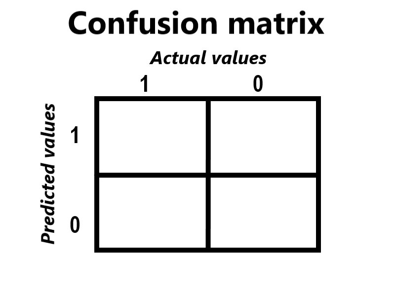
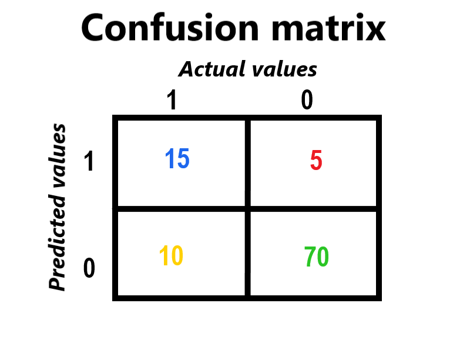
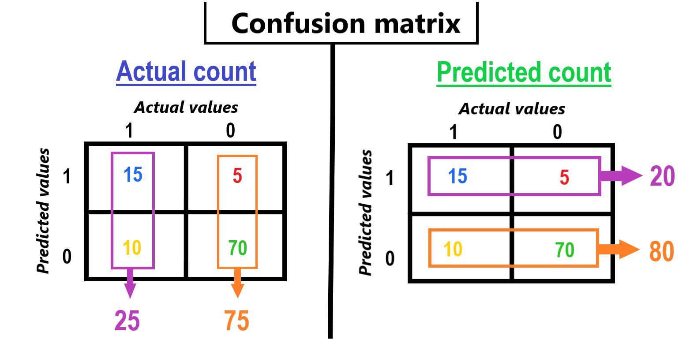
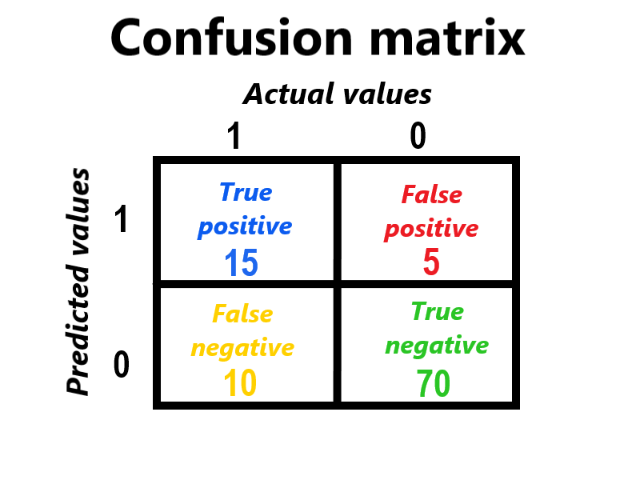
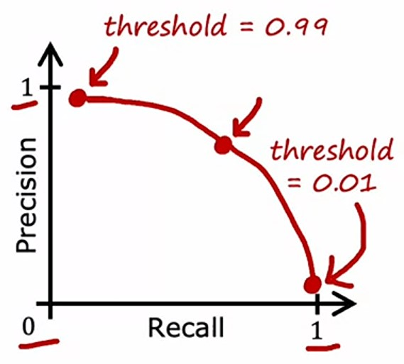
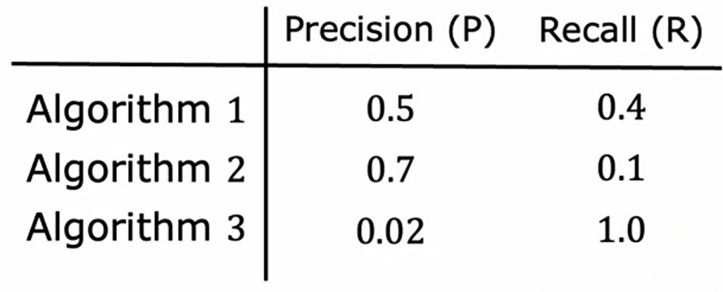
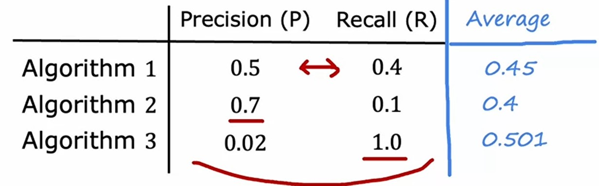
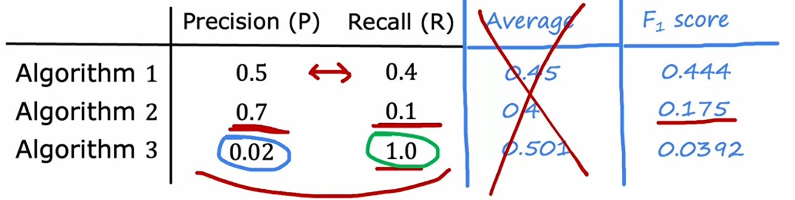

# Week 3: Advice for Applying Machine Learning

## Skewed datasets

-   Skewed datasets are those datasets, which have imbalanced classes as the target variable.

-   Example: Having a Spam Email classification dataset, where we have total $1000$ emails out of which $100$ are spam and rest $900$ are real emails. So this is a skewed dataset.
-   It mostly happens when we have a type of problem where the probability of occuring is very rare, like a rare disease.
-   So, for these type of datasets, _accuracy_ is not a useful metric.

### Why _Accuracy_ is not a useful metric for Skewed datasets ?

-   Let's say we are working on **Heart Disease Predictor**.
-   We have a target variable with $2$ classes, $1$ for having heart disease and $0$ for not having heart disease.
-   And we have $1000$ cross-validation examples, out of which only $0.5\%$ is $1$, i.e. only $50$ having heart disease.
-   So, let's say on cross-validation set, we got $99\%$ accuracy, which we got $1\%$ error also.
-   Then, maybe that $1\%$ error is on $0.5\%$ examples which are of class $1$.
-   And, $99\%$ accuracy may refers to $900$ examples having class $0$.
-   Because the ratio of classes is lower than the ratio of accuracy and error.
-   We cannot consider _Accuracy_ as a useful metric here.
-   Even if we have different algorithms with accuracy of $99.2\%$ and $99.5\%$ accuracy we cannot decide any of these models.

So, we have $2$ different metrics, which are more useful then _accuracy_.

But we need _confusion matrix_ for them.

---

### Confusion matrix

-   A confusion matrix is a table which is used to visualize the preformance of a _classification_ problem.

-   For a _Binary classification_ problem, we have a $2\times2$ confusion matrix, which looks like this:

-   On top axis, we write **_Actual values_** which could be $0$ or $1$.
-   On left axis, we write **_Predicted values_** which could be $0$ or $1$.
-   So, imagine we are working on _Heart Disease Predictor_.
-   In _cross-validation_ set, we have $100$ values in the form of $0$ or $1$.
-   Let's say after predicting those $100$ values we got these results:
-   -   $15$ values are actually $1$ and classified as $1$.
-   -   $10$ values are actually $1$, but classified as $0$.
-   -   $70$ values are actually $0$, and classified as $0$.
-   -   $5$ values are actually $0$, but classified as $1$.
-   So, we write all these values in the confusion matrix like this:

-   So, if we observe, we get:
-   -   $85$ values are classified correctly, i.e. $70$ of $0$ and $15$ of $1$.
-   -   $15$ values are miss-classified, i.e. $5$ of $0$ and $10$ of $1$.
-   But, actually,
-   -   $25$ values are of $1$ class, i.e. $15 + 10$.
-   -   $75$ values are of $0$ class, i.e. $5 + 70$.
-   And, our model predicted as:
-   -   $20$ values of $0$ class, i.e. $15 + 5$.
-   -   $80$ values of $1$ class, i.e. $10 + 70$.

-   Now, the values that are acutally $1$ and also predicted as $1$ class, we call them **_True positive_**.
-   The values that are actually $1$, but predicted as $0$ class, we call them **_False positive_**.
-   The values that are actually $0$ and also predicted as $0$ class, we call them **_True negative_**.
-   The values that are actually $0$, but predicted as $1$ class, we call them **_False negative_**.

-   Here, _True_ is referring to correct values, and _False_ is referring to wrong values.
-   _Positive_ is referring to $1$ class values, and _Negative_ is referring to $0$ class values.

With these $4$ values, we can compute $2$ matrices for our model: **Precision** and **recall**.

Let's see how.

---

### Precision

> **Precision** is a metric that quantifies the number of correct positive predictions made.
>
> It is calculated as the ratio of correctly predicted positive examples divided by the total number of positive examples that were predicted. ~ [_Json Brownlee - ML Mastery_](https://machinelearningmastery.com/precision-recall-and-f-measure-for-imbalanced-classification/#:~:text=Precision%20is%20a,that%20were%20predicted.)

Precision calculates how much the positive predictions are actually correct.

So, for _Heart Disease Predictor_ example, _precision_ would be:

-   Of all the patients who predicted $\hat{y} = 1$, what fraction actually have the rare disease ?
-   We can say it as:

$$\frac{\text{True positives}}{\text{\# predicted positives}}$$

-   We can calculate it as:

$$\text{precision} = \frac{TP}{TP + FP}$$

-   where:
-   -   $TP$ is **True positive**
-   -   $FP$ is **False positive**

-   From above _confusion matrix_, _precision_ will be $0.75$.
    $$precision = \frac{15}{15 + 5} = \frac{15}{20} = 0.75$$

-   So, we can say, that our model has a _precision_ of $0.75$, which means out of all positive predicted values i.e. class $\hat{y} = 1$, $75\%$ of them are actually correct, means

$$y = 75\% \text{ of } \hat{y}\qquad\text{where y = 1}$$
$$\text{actual positives} = 75\% \text{ of predicted positives}$$
$$\text{actual positives} = 20 \times \frac{75}{100}$$
$$\text{actual positives} = 15$$

---

### Recall

> Recall is a metric that quantifies the number of correct positive predictions made out of all positive predictions that could have been made. ~ [_Json Brownlee - ML Mastery_](https://machinelearningmastery.com/precision-recall-and-f-measure-for-imbalanced-classification/#:~:text=Recall%20is%20a%20metric%20that%20quantifies%20the%20number%20of%20correct%20positive%20predictions%20made%20out%20of%20all%20positive%20predictions%20that%20could%20have%20been%20made.)

Recall calculates how much positive predictions our model predicted correctly out of all actual positive values.

So, for _Heart Disease Predictor_ example, _recall_ would be:

-   Of all the patients that actually have heart disease, what fraction did the model correctly detect as having it ?
-   We can say it as:

$$\frac{\text{True positives}}{\text{\# Actual positives}}$$

-   We can calculate is as:

$$\text{precision} = \frac{\text{TP}}{\text{TP} + \text{FN}}$$

-   where:
-   -   $TP$ is **True positive**
-   -   $FN$ is **False negative**

-   From above _confusion matrix_, _recall_ will be $0.6$.

$$\text{recall} = \frac{15}{15 + 10} = \frac{15}{25} = 0.6$$

-   So, we can say, that our model has a _recall_ of $0.6$, which means from the total number of actual positive values i.e. class $y = 1$, our model predicted $60\%$ of them correctly, i.e. $\hat{y} = 1$.

$$\hat{y} = 60\% \text{ of } y\qquad \text{where y = 1}$$
$$\text{predicted positives} = 60\% \text{ of actual positives}$$
$$\text{predicted positives} = 25 \times \frac{60}{100}$$
$$\text{predicted positives} = 15$$

> The term recall was motivated by this observation that if you have a group of patients or population of patients, then recall measures, of all the patients that have the disease, how many would you have accurately diagnosed as having it. ~ _Andrew Ng_

So, we can say:

-   If a learning algorithm has high _precision_ and _recall_, then it's a good algorithm.
-   If a learning algorithm has low almost $0$ _precision_ and _recall_ and _high accuracy_, then it's not a good algorithm and the data is mostly _skewed_.

---

### How Threshold effects Precision and Recall

-   When we are using _Logistic Regression_, we generally set our _threshold_ to $0.5$, i.e.

$$\hat{y} = \begin{cases} 1 \qquad\text{ if } f_{\vec{w}, b}(\vec{x}) \geq 0.5 \\ 0 \qquad\text{ if } f_{\vec{w}, b}(\vec{x}) \lt 0.5 \end{cases}$$

#### Increasing the Threshold lead to higher Precision and lower Recall

-   Suppose, we are working on a very serious type of problem like _Heart Disease predictor_, where, the chances of having $y = 1$ is very rare and if the patient's predicted as $\hat{y} = 1$, then they will need to take immediate and big actions, then we need to be very confident about the predictions.
-   Like, it matters a lot, if the patient predicted as having heart disease.
-   So, at that kind of situation, where we need very confident results, then we can increase the _threshold_ from $0.5$ to a larger value.
-   So that, our model will only show $\hat{y} = 1$ i.e. patient has heart disease when there will be very high probability.
-   Like, we can change it to $0.7$.

$$\hat{y} = \begin{cases} 1 \qquad\text{ if } f_{\vec{w}, b}(\vec{x}) \geq 0.7 \\ 0 \qquad\text{ if } f_{\vec{w}, b}(\vec{x}) \lt 0.7 \end{cases}$$

-   So now, if the probability will be less than $0.7$, then we will considered as $\hat{y} = 0$ i.e. patient doesn't have heart disease.
-   And when the probability will be higher than $0.7$, then we will consider that patient has heart disease, so that they can take immediate actions.
-   It makes our model more sure and confident while deciding about having disease or not.
-   By increasing the _threshold_, the **True Positives** will be less than it was before, so our **Precision** will be increased.
-   And, by increasing the _threshold_, the difference in **Actual positives** and **True positives** will be increased too, So, this result in decreasing the **Recall**.

#### Decreasing the Threshold lead to lower Precision and higher Recall

-   Similarly, if the risk of not taking action is higher than the risk of taking action, like it can also lead to Heart Failure, which means the consequences will be much higher than not treating.
-   So, at that kind of situation, where the doubt costs higher, then we will decrease the _threshold_ from $0.5$ to a small value.
-   So that, the chances of showing $\hat{y} = 1$ will be increased as the probability will be higher than the _threshold_, because we don't need to be in the case of doubt.
-   Like, we can change it to $0.3$.

$$\hat{y} = \begin{cases} 1 \qquad\text{ if } f_{\vec{w}, b}(\vec{x}) \geq 0.3 \\ 0 \qquad\text{ if } f_{\vec{w}, b}(\vec{x}) \lt 0.3 \end{cases}$$

-   So now, if the probability will be less than $0.3$, then we will considered as $\hat{y} = 0$, i.e. patient doesn't ahve heart disease.
-   And when the probability will be higher than $0.3$, then we will consider that patient has heart disease, to prevent the doubt situation.
-   It makes our model predict $1$ even when there's a doubt situation like $50\%$ chance, because of less _threshold_ like $0.3$.
-   By decreasing the _threshold_, the **True Positives** will be increased and hence, the difference in **Predicted positives** and **True positives** will be increased as well, so **Precision** will decreased.
-   And, by increasing the _threshold_, the difference in **Actual positives** and **True positives** will be decreased. So, this result in increased in **Recall**.

---

### Tradeoff b/w Precision and Recall

-   So, from the above we can see, there's a tradeoff b/w **Precision** and **Recall**.
-   If, we increase the _threshold_, from $0.5$ to $0.9$, then the
-   -   **Precision** will increases.
-   -   **Recall** will decreases.
-   If we decrease the _threshold_, from $0.5$ to $0.3$, then the
-   -   **Precision** will decreases.
-   -   **Recall** will increases.
-   If we plot it, we can see the graph something like this:

-   Then, we need to find a _threshold_, which neither have **High Precision** or **High Recall**.

But, finding a _threshold_ wouldn't work with _cross-validation_ better, because we need to apply different _threshold_ values everytime.

So, there's another metric called **F1-score**, which combines **precision** and **recall** and help us pick the best value for our _threshold_.

---

### F1-score

A challenge we face after calculating **precision** and **recall** is, that how we choose which algorithm to choose.

-   Say, we have $3$ different algorithms, with different **precision** and **recall** values, it's hard to pick a specific model.

-   $1^{st}$ algorithm has almost same _precision_ and _recall_.
-   But, $2^{nd}$ algorithm has high _precision_ but low _recall_.
-   And, $3^{rd}$ algorithm has low _precision_ but high _recall_.

#### Taking Average
- One way is to take average of both *precision* and *recall*, but the average will be biased towards higher value, because it effects more.
- Like, average of all these $3$ algorithms will be:

- Here, we can see
- - $2^{nd}$ average is almost near than *precision*, because it has higher value.
- - $3^{rd}$ average is way higher than *precision*, because *recall* is $1$.

- So, computing average doesn't help us much.

#### Calculating F1-score
- We calculate **F1-score** by inversing the *precision* and *recall*, then inverse it's half.

$$\text{F1-score } = \frac{1}{\frac{1}{2}\left(\frac{1}{P} + \frac{1}{R}\right)}$$

- where:
- - $P$ is the *precision*
- - $R$ is the *recall*
- by simplifying it more, we will get:

$$\text{F1-score } = 2 \frac{PR}{P+R}$$

- So, if we compute **F1-score** of all these $3$ algorithms, we get:

- Here, we will use that algorithm which has highest **F1-score**.
- As, the **F1-score** of algorithm $2$ is low
- And, the **F1-score** of algorithm $3$ is very very low.
- So, algorithm $1$ would be best choice to use.

---

### Programming Assignment: Advice for applying machine learning [🔗](../codes/../W3%20-%20Advice%20for%20applying%20ml%20assignment.ipynb)

---