# Week 4: Decision Trees

**Learning Objectives:**

-   See what a decision tree looks like and how it can be used to make predictions
-   Learn how a decision tree learns from training data
-   Learn the "impurity" metric "entropy" and how it's used when building a decision tree
-   Learn how to use multiple trees, "tree ensembles" such as random forests and boosted trees
-   Learn when to use decision trees or neural networks

---

## Decision Trees

-   **Decision trees** are one of the most popular alogrithms in machine learning.
-   They are widely used in various machine learning applications, especially machine learning competitions.
-   So, let's see what actually is a **decision tree** and how it works.

### What is a decision tree?

Let's say we are working in a cat adoption center and we want to make a _Cat Classifier_, which takes a list of features of animals and decide whether that animal is a cat or not.

And we have data like this:

So, we have $3$ input features and a target variable _cat_

1. _Ear shape_ - $x_1$
2. _Face shape_ - $x_2$
3. _Whiskers_ - $x_3$
4. _Cat_ - Target variable $y$ - $0$ represents _Not cat_ and $1$ means _Cat_

And in each feature, we have categorical data, means the data is not numerical, rather it is in text.

So, for this dataset, a **Decision Tree** would look like this:

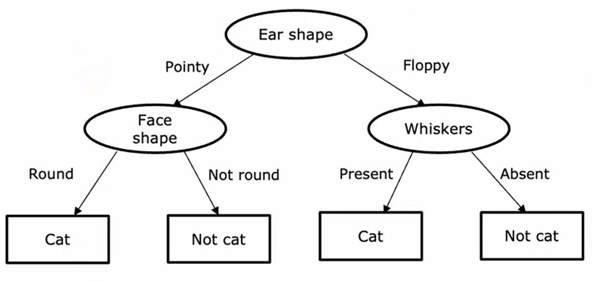

#### Decision Tree

-   A decision tree maps the possible values of target variable $y$ based on the different choices of each feature.
-   A great feature of **Decision Tree** is that it works on both _categorical_ and _numerical_ data.

#### Nodes

-   Here these oval and rectangle shapes are called _nodes_.

#### Root node

-   The top node of a **Decision tree** is called _root node_.

#### Decision nodes

-   The oval shaped nodes in the **Decision tree** are called _decision nodes_.
-   Based on their values, the **Decision tree** decides what the output should be.

#### Leaf nodes

-   The rectangle nodes at the bottom of the **Decision tree** are called _leaf nodes_.
-   They make the prediction.

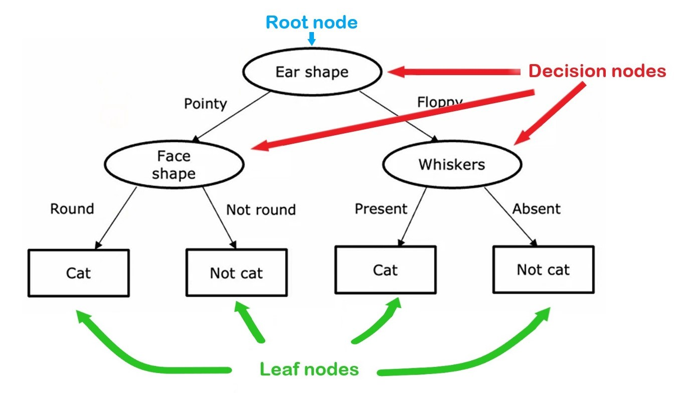

---

### How Decision Trees works ?

If we look at the **Decision tree** of _Cat Classification_ example, based on the diagram, we can say that it works like `if-else` statements in programming.

-   Say, we a _test_ example like this:
-   -   _Ear shape_: Pointy
-   -   _Face shape_: Round
-   -   _Whiskers_: Present
-   So, for this example, the **Decision Tree** first check it's _Ear shape_, which is also the _root node_.

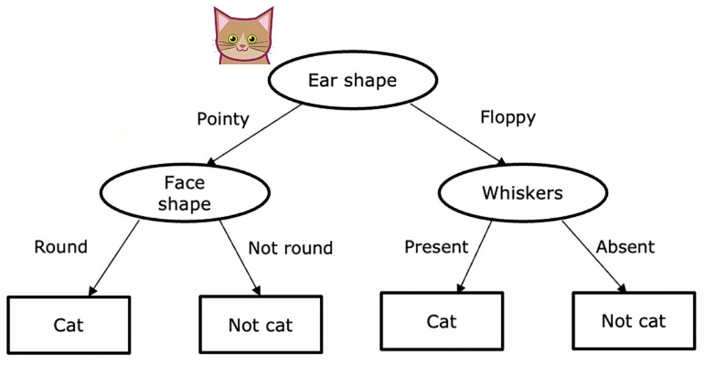

-   It has _Ear shape_ as _Pointy_, which is on left side of the _Ear shape_ node.
-   So, it goes leftwards of _Ear shape_ to _Face shape_ node.

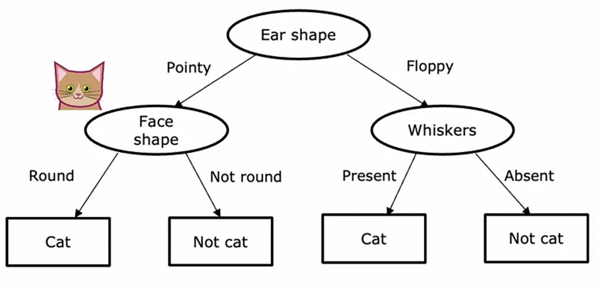

-   It has _Face shape_ of _Round_, which is on left side of _Face shape_ node.
-   So, it goes leftwards of _Ear shape_ to _Cat_ node.

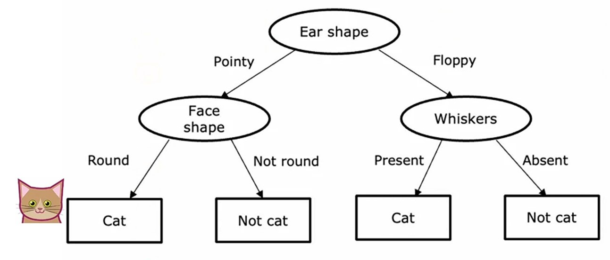

-   _Cat node_ is the last node of this tree, so, it's the _leaf node_.
-   Hence, this **Decision Tree** will make inference and outputs _Cat_ as the prediction.
-   Means, if the test example has this kind of features, then it is considered as _Cat_.
-   Also, if the test example has _Floppy_ _Ear shape_, and _Whiskers_ are present, then also it is considered as _Cat_.
-   If the _Face shape_ is not round, or the _whiskers_ are absent, then it is considered as _Not Cat_.

We can have different types of **Decision Trees** like these:

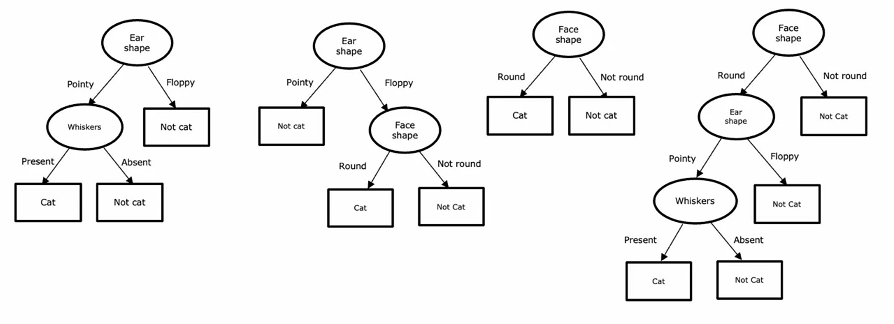

-   Some of these can do better on _cross-validation_ set and some on _test_ set.
-   Even some do worse on any or both of them.

> #### Job of Decision Tree algorithm
>
> So, the job of **Decision Tree** learning algorithm is, out of all possible decision trees, to try to pick one that hopefully does well on the training set, and then also ideally generalizes well to new data such as your cross-validation and test sets as well. ~ _Andrew Ng_

---

### Process of Building a Decision Tree

By continuing the above _Cat Classification_ example, let's see the process of building a **Decision Tree**.

1. First, from all the input features, we need to choose a feature from which we will start building our **Decision Tree**.
2. There is a algorithm to choose the best feature for _root node_. We will see about it later on.
3. Let's say we have choosed _Ear shape_ feature for _root node_.

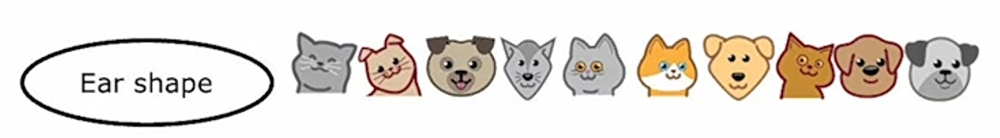

4. At starting we have all $10$ training examples, which rely on this _root node - Ear shape_.
5. Now, we will split our training examples, based on the _Ear shape_.

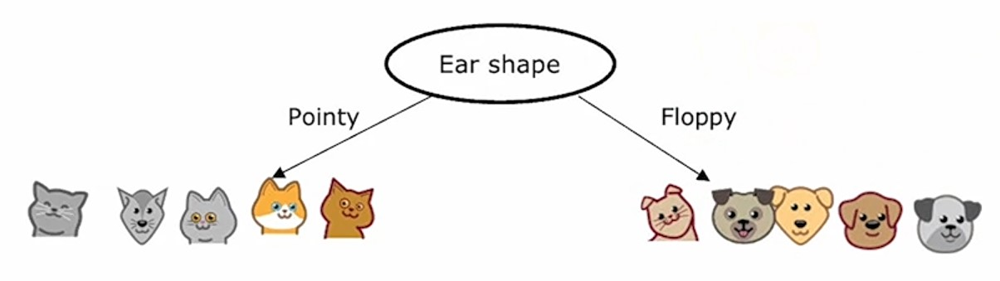

6. Next, on left side, say we choose _Face shape_ feature with the algorithm.
7. And split these $5$ training examples on left based on the _Face shape_ feature.

8. And, if we notice, on left side of _Face shape_, all the training examples are of _Cat_, so we end up there.
9. And, make them (both left and right) as _leaf nodes_.
10. Now, on right side of _Ear shape_, we will choose _Whiskers_ feature.
11. And again split these $5$ training examples on right based on the _Whiskers_ feature.

12. And, if we see, on left side of _Whiskers_ there only a single example left, which is a _Cat_, and on right side all $4$ are _Not Cat_.
13. So, we end up here, and make them as _leaf nodes_.

This is how we make a **Decision Tree**.

-   Through this process, we need to take some key decisions. Let's see what are those key decisions.

### Decisions while building the Decision Tree

#### $1^{st}$ How to choose the features to split at each node ?

-   Which feature to use for spilt in all the _decision nodes_ including _root node_.

We can choose this by **maximizing or minimizing the _purity_**.

> #### Purity
>
> Purity is the fraction of the data in the group that belongs to the subset.

-   We will learn about this later.
-   But, for now, think purity is the percentage or fraction of the training examples that belong to the splitted subset.
-   If we have a feature like _Cat DNA_ by which we can easily filter which are _Cat_ or which are _Not Cat_, then we can say they are completely pure.

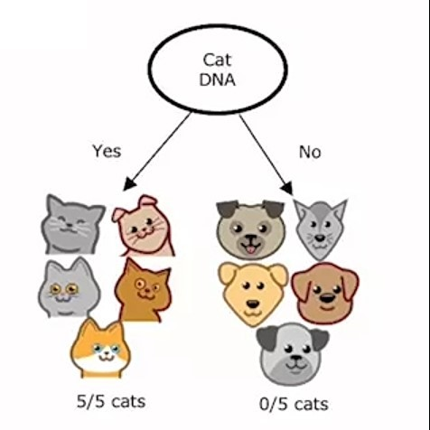

-   Means, that there's only $1$ class in each subset _Yes_ and _No_.
-   But, we don't have _DNA_ feature, instead the features we have, we can't make their different _root nodes_ like this:

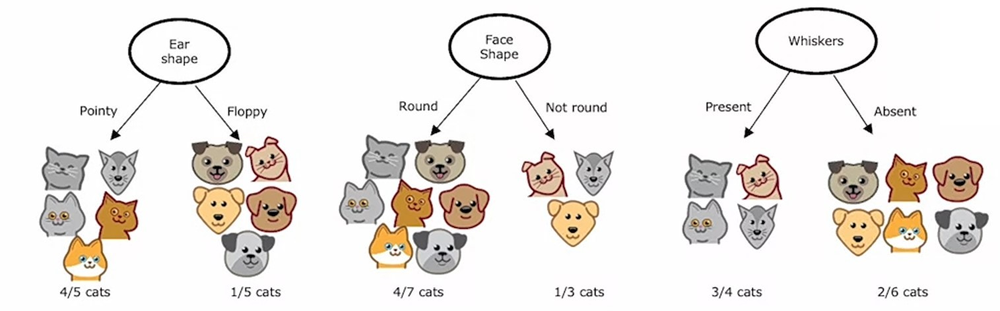

---

#### $2^{nd}$ When to stop spilliting ?

-   When do we stop splitting the dataset into different subsets ?

There are several ways to do it.

#### 1. When a node is $100\%$ one class

-   When the node subsets on left and right only includes a single class.
-   Because at that time, it seems natural to build a _leaf node_, rather than more splitting.

#### 2. When spilliting a node will result in the tree exceeding the maximum depth

-   Depth determines how long the tree is vertically.
-   So, if we set maximum depth to $2$, then when it reaches the maximum depth, it will stop splitting.
-   And make the last node as _leaf node_ of the **Decision Tree**.

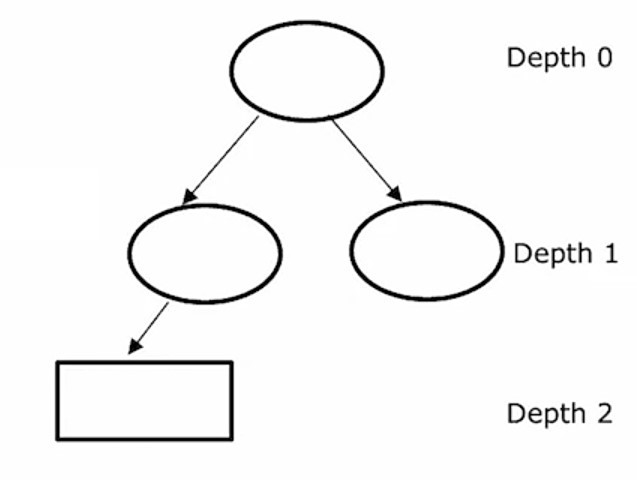

-   _root node_ will be of depth $0$, because it's the top part where the tree starts.
-   _middle decision nodes_ have depth of $1$.
-   Finally, the end node reaches depth of $2$ and hence it will stop there.

> A main reason to set a maximum depth is to stop the tree from _overfitting_, because if it has high _depth_, then it split more and more and hence it can easily prone to _overfitting_.

#### 3. When improvements in purity score are below the threshold

-   Let's say we set a threshold of $0.3$ and if the purity is less than $0.3$.
-   Means, the subset group fraction is less than $\lt 0.3$, then it stops splitting.

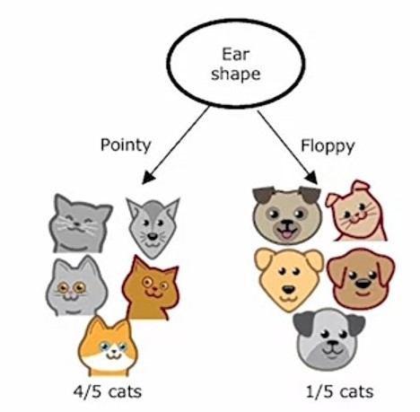

-   Here, in the above **Decision Tree**, the fraction of _Floppy Ear shape_ subset is less than $0.3$, so we will stop splitting it more.

> Again, more splitting leads to _overfitting_ and minimum improvements are not beneficial, because it becomes computationaly expensive.

#### 4. When number of examples in a subset is below the threshold

-   Let's say we have set minimum sample size to $4$.
-   So, if the samples in a subset is below $4$, then it will stop splitting.

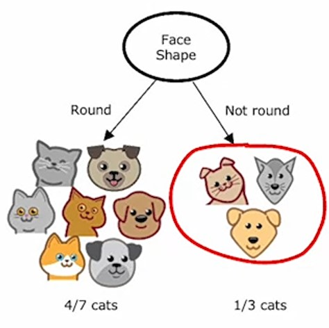

-   Here, on right subset of _Not round - Face shape_, samples are below $4$, so we won't do more splits, rather it stops here.

> Again, it can prone to _overfitting_ and a larger tree size, means more depth.

---

#### Practice Quiz: Decision Trees

#### Question 1

    
    Answer to <b>question 1</b>

If you have selected option <em>a (Cat)</em> then you are right! <b>Explanation:</b> Correct. If you follow the floppy ears to the right, and then from the whiskers decision node, go left because whiskers are present, you reach a leaf node for "cat", so the model would predict that this is a cat.

#### Question 2

    
    Answer to <b>question 2</b>

If you have selected option <em>b (Left split: 10 of 10 emails are spam. Right split: 0 of 10 emails are spam. )</em> then you are right!

