# Week 4: Decision Trees

## Ch 2: Decision Trees Learning

> ### Purity
>
> Purity is the fraction of the data in the group that belongs to the subset.

Example:

-   If we have all cats from a total of $5$, then we can say it fully pure.

### Entropy as a measure of _Impurity_

> #### Entropy
>
> The entropy function is a measure of the impurity of a set of data.
>
> It starts from $0$, goes upto $1$ and then comes back down to $0$ as a function of the fractions of positive examples in your sample. ~ _Andrew Ng_

Let's take the example of _Cat Classification_ problem.

-   First, let's define $p_1$ as _the fraction of examples that are positive (cat)_.
-   If we plot the **Entropy** graph, it will look like this:

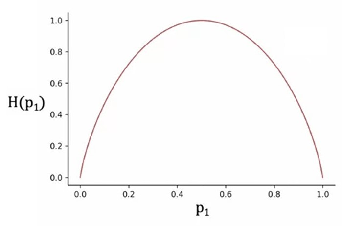

-   where:
-   -   On $x$-axis, we have the $p_1$.
-   -   On $y$-axis, we have $H(p_1)$, where $H()$ represents the **entropy** function.
-   So, the **Entropy** graph is a curve, which starts from $0$ and goes upto $1$ and then come back to $0$, based on different values of $p_1$.
-   If we plot different values of $p_1$ on $x$-axis, we get a value b/w $0.0$ and $1.0$ as a value of _Impurity_.
-   Let's say, we have $5$ features of _Cat_ and _Dog_ and has total $6$ examples, with the random no. of _cats_ and _dogs_. And we want to measure how _impure_ they are.

-   $1^{st}$ feature:
-   -   Fraction of _Cats_ $p_1 = \frac{3}{6} = 0.5$
-   -   _Impurity_ $H(p_1) = 1$, highly impure.

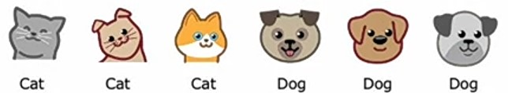

-   $2^{nd}$ feature:
-   -   Fraction of _Cats_ $p_1 = \frac{0}{6} = 0$
-   -   _Impurity_ $H(p_1) = 0$, not at all impure.

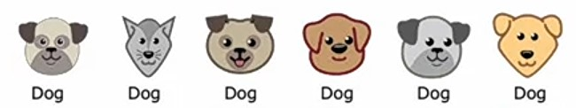

-   $3^{rd}$ feature:
-   -   Fraction of _Cats_ $p_1 = \frac{5}{6} = 0.83$
-   -   _Impurity_ $H(p_1) = 0.65$, little impure.

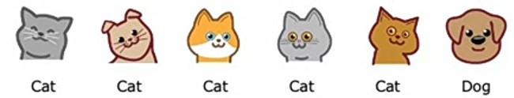

-   $4^{th}$ feature:
-   -   Fraction of _Cats_ $p_1 = \frac{2}{6} = 0.33$
-   -   _Impurity_ $H(p_1) = 0.92$, very impure.

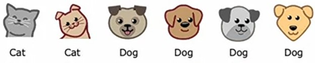

-   $5^{th}$ feature:
-   -   Fraction of _Cats_ $p_1 = \frac{6}{6} = 1$
-   -   _Impurity_ $H(p_1) = 0$, not impure, or fully pure.

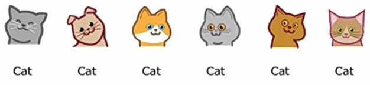

-   Now, if we plot all the $H(p_1)$ values, we will a plot like this:

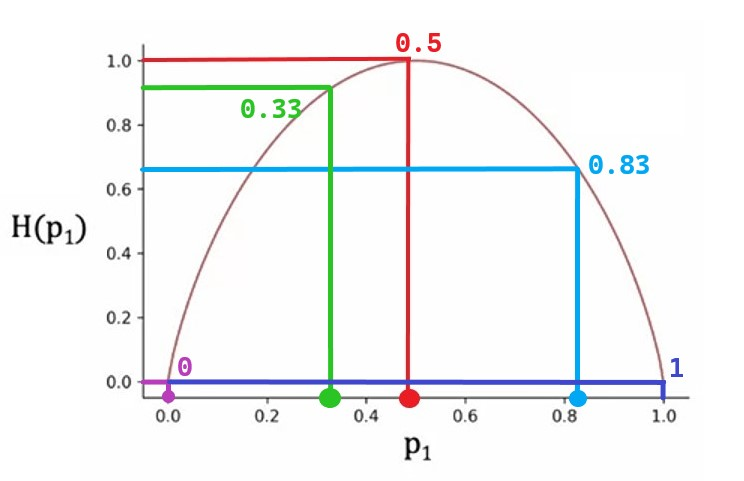

-   Here, $2$ values of $p_1$ i.e. $0$ and $1$ has _impurity_ of $0$, means, they are fully pure.
-   $p_1 = 0$ or $H(p_1) = 0$ represents that the subset have $0$ _Cats_.
-   $p_1 = 1$ or $H(p_1) = 0$ represents that the subset have all the _Cats_.
-   And, $p_1 = 0.5$ and $H(p_1) = 1$ represents the subset is $100\%$ _impure_, and hence have half _Cats_ and half _Dogs_.

And recall that we want to choose a feature which is highly _pure_, because based on that feature, our **Decision Tree** will start splitting the data.

---

#### Formula of Entropy function $H(S)$

We know that:

-   $p_1$ is the fraction of examples in a subset that belongs to a positive class (cats).
-   So, we can also say that, $p_0$ would be the fraction of examples in a subset that belongs to a negative class (Dogs).

$$p_0 = 1 - p_1$$

-   And, we calculate _Impurity_ of $p_1$ using **Entropy** function $H(p_1)$.
-   where $H(p_1)$ is:

$$H(p_1) = -p_1\log_2(p_1) -  p_0\log_2(p_0)$$

-   Here, we are calculating the log of each class ($p_1$ and $p_0$) with base $2$.
-   We can also write it as:

$$H(p_1) = -p_1\log_2(p_1) -  (1- p_1)\log_2(1 - p_1)$$

-   But, above is the simplified version of this.
-   **Note**: If $p_1$ or $p_0$ is $0$, then the expression $0\log(0) = 0$, would be zero.
-   It's actually undefined, $-\infty$, but we take it as $0$, for correclty computing the **Entropy**.
-   If we plot it with different values of $p$, we will have a plot like this, which we've seen above.

> So, When we build a **Decision Tree**, we need to choose a feature to split at a node, which has less _entropy_ (_impurity_) or **maximum purity**.

There are other functions that look like the same, like _Gini_ function, which starts from $0$, but goes upto $0.5$ and come back to $0$.

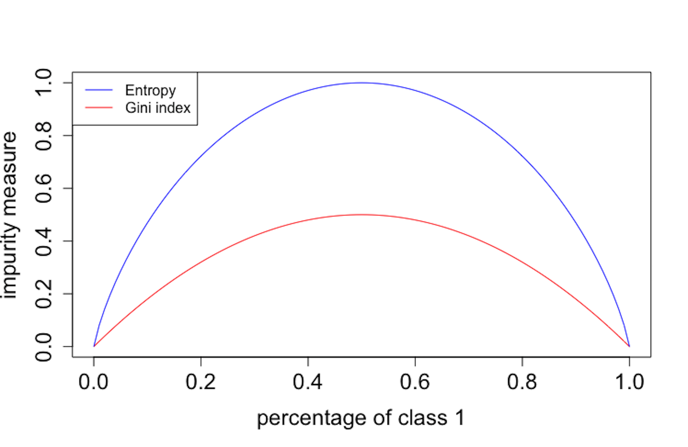

---

### Information Gain

Recall that, when building a **decision tree**, we need to choose a feature to split which _minimizes entropy_ or _maximizes the purity_.

> In **Decision Tree** learning, the reduction of _entropy_ is called _Information Gain_.

With the example of _Cat Classification_, let's see how to comptue _Information Gain_ and choose which feature to split on.

#### Ear Shape

-   Let's take the _Ear Shape_ feature first, and categorize examples based on their _Ear Shape_.

-   Here, if we calculate fraction of positive examples on both left and right branch, then we get $p_1 = \frac{4}{5} = 0.8$ on left branch and $p_1 = \frac{1}{5} = 0.2$ on right branch.
-   And entropy of left branch is $H(0.8) = 0.72$ and on right branch is $H(0.2) = 0.72$.

#### Face Shape

-   Now, let's take the _Face Shape_ feature and categorize examples based on their _Face shape_.

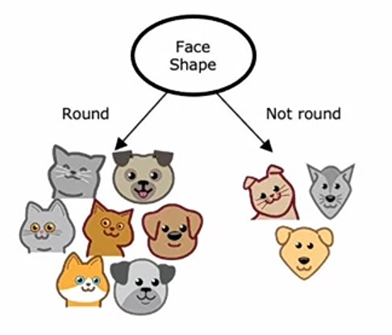

-   Here, if we calculate $p_1$ on both left and right branch, then we get $p_1 = \frac{4}{7} = 0.57$ and $p_1 = \frac{1}{3} = 0.33$ respectively.
-   And entropy of left branch is $H(0.57) = 0.99$ and on right branch is $H(0.33) = 0.92$.

#### Whiskers

-   Now, let's take the _Whiskers_ feature and categorize examples based on their _Whiskers_.

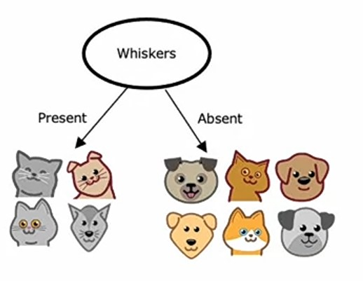

-   Here, if we calculate $p_1$ on both left and right branch, then we get $p_1 = \frac{3}{4} = 0.75$ and $p_1 = \frac{2}{6} = 0.33$ respectively.
-   And entropy of left branch is $H(0.75) = 0.81$ and on right branch is $H(0.33) = 0.92$.

#### Calculation of Information Gain

> Now, the question is which these different values of entropy of both branches of all features, how do we choose which feature to split on ?

-   Rather than just looking on numbers and comparing them with each other, we can take their weighted averages.
-   Because, if the $p_1$ is high then the entropy will be high too and even if the $p_1$ is low, then also entropy will be high, so taking weighted average would result better.
-   So, for each feature, we will multiply the total number of examples in each branch with it's entropy and then add them.
-   And, by the convention of making a **Decision Tree**, we will subtract the entropy of _root node_.
-   So, we have total $10$ examples, out of them $5$ are _Cats_ (positives). So, $p_1 = \frac{5}{10} = 0.5$ and entropy will be $H(0.5) = 1$
-   **Ear Shape**:

$$H(0.5)- \left(\frac{5}{10}0.72 + \frac{5}{10}0.72\right) = 0.28$$

-   **Face Shape**:

$$H(0.5)- \left(\frac{7}{10}0.99 + \frac{3}{10}0.92\right) = 0.03$$

-   **Whiskers**:

$$H(0.5)- \left(\frac{4}{10}0.81 + \frac{6}{10}0.92\right) = 0.12$$

-   And all these $3$ resulted valeus are the _Information Gain_ of each feature split.
-   It measures the reduction in entropy by making a split.
-   Because the entropy was originally one at the root node and by making the split, you end up with a lower value of entropy and the difference between those two values is a reduction in entropy.
-   And, we will use that feature to split, which has the highest _Information Gain_.

#### Question: Why do we compute reduction in Entropy rather than just Entropy ?

> It turns out that one of the stopping criteria for deciding when to not bother to split any further is if the reduction in _entropy_ is too small.
>
> In which case you could decide, you're just increasing the size of the tree unnecessarily and risking **overfitting** by splitting and just decide to not bother if the reduction in _entropy_ is too small or below a threshold. ~ _Andrew Ng_

#### Formula of Information Gain

-   Let's first call the $p_1$ for each branch as $p_1^{left}$ for left branch and $p_1^{right}$ for right branch.
-   And, $w^{left}$ for the fraction of examples in left branch and $w^{right}$ for the fraction of examples in right branch.
-   Finally, $p_1$ of _root node_ as $p_1^{root}$.
-   And, our formula will be:

$$\text{Information Gain } = H(p_1^{root})\left(w^{left}p_1^{left} + w^{right}p_1^{right}\right)$$

> So, _Information gain_ is then defined as the _entropy_ of $p_1^{root}$, so what's the _entropy_ at the root node, minus that _weighted entropy_ calculation that we had on the previous slide, minus $w^{left}$ those were 5/10 in the example, times the _entropy_ applied to $p_1^{left}$, that's _entropy_ on the left sub-branch, plus $w^{right}$ the fraction of examples that went to the right branch, times _entropy_ of $p_1^{right}$. ~ _Andrew Ng_

-   With this definition of entropy, and you can calculate the information gain associated with choosing any particular feature
    to split on in the node.
-   Then out of all the possible futures, you could choose to split on, you can then pick the one that gives you the highest information gain.
-   That will result in, hopefully, increasing the purity of your subsets of data that you get on the left and right sub-branches
    of your **Decision tree** and that will result in choosing a feature to split on that increases the purity of your subsets of data in both the left and right sub-branches of your **Decision tree**.

---

### Steps Building a Decision Tree

-   So, we have learnt how to choose a feature to split and when to stop splitting more.
-   Now, let's see the overall steps of building a **Decision tree**.

1. Start with all examples at the _root node_.
2. Calculate _Information Gain_ for all possible features, and pick the one with the highest _Information Gain_.
3. Split dataset according to selected features adn create left and right branches of the tree.
4. Keep repeating splitting process until stopping criteria is met:

-   -   When a node is $100\%$ one class.
-   -   When splitting a node will result in exceeding the maximum depth.
-   -   _Information Gain_ from additional splits is less than the _threshold_.
-   -   When number of examples in a node is less than the _threshold_.

Now, let's see these steps with the _Cat Classification_ example:

1. First we need to choose a feature to split on _root node_ with highest _Information Gain_.

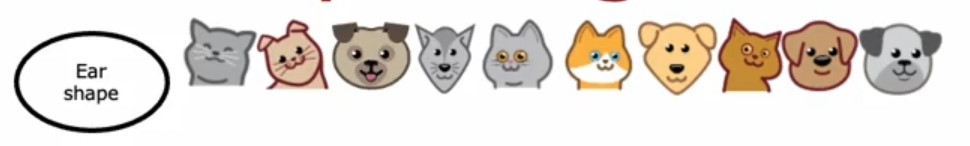

2. Let's say, we get the highest _Information Gain_ on _Ear Shape_ for _root node_.

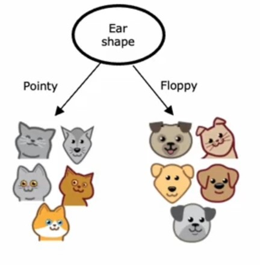

3. Now, let's focus on left branch.
4. Say, after calculating _Information Gain_ on left branch examples, we got hgihest _Information Gain_ on _Face Shape_, so we split them on it.

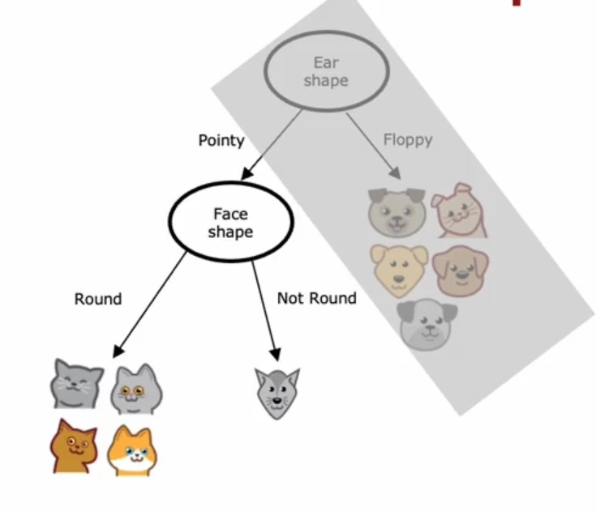

5. Now, we will check the stopping criteria, here left branch is $100\%$ one class, also right branch is also $100\%$ class.
6. So, we make them as _leaf nodes_.

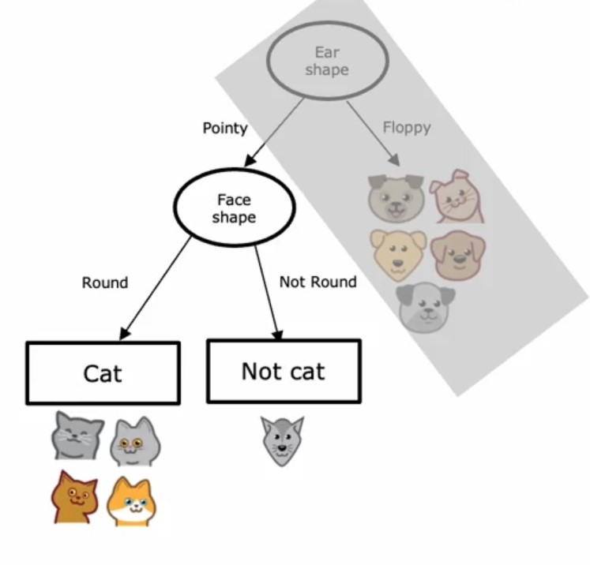

7. Now, let's focus on right branch of _root node_.
8. So, let's assume we got highest _Information Gain_ with _Whiskers_ feature, so we split right branch's examples on it.

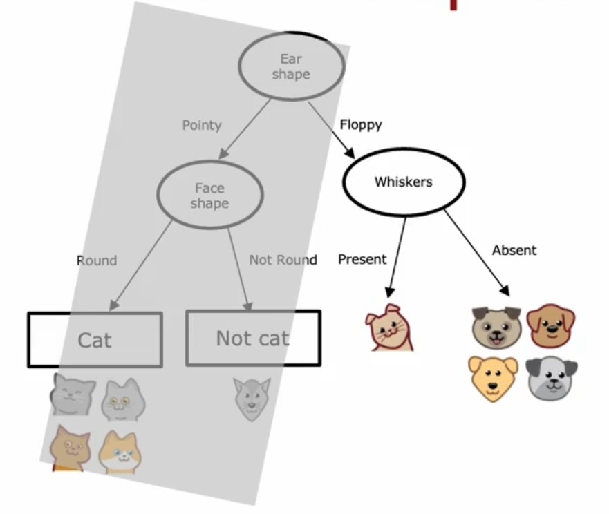

9. Now, also we met stopping criteria, i.e. both branches has $100\%$ once class, so we stop there and make them as _leaf nodes_.
10. Finally, our **Decision Tree** is built.

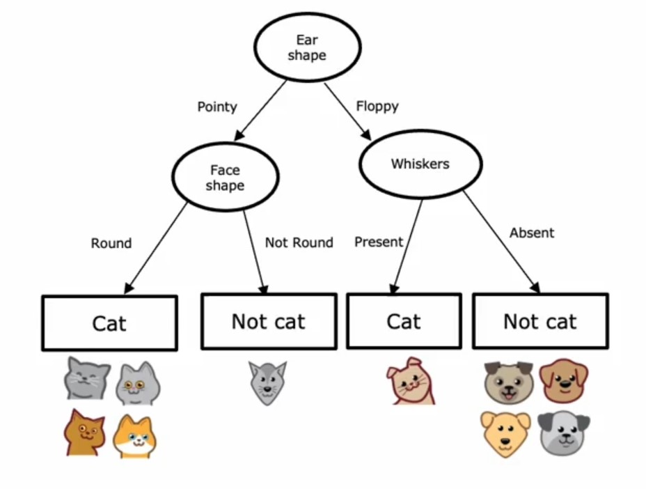

-   If we notice it, it's like a \*_Recursive Algorithm_.

---

### One Hot Encoding

In *Cat Classification* example, we have this data:

- But, let's say, now rather tha having $2$ values in *Ear Shape*, we will have $3$ values:
- - *Pointy*
- - *Floppy*
- - *Oval*

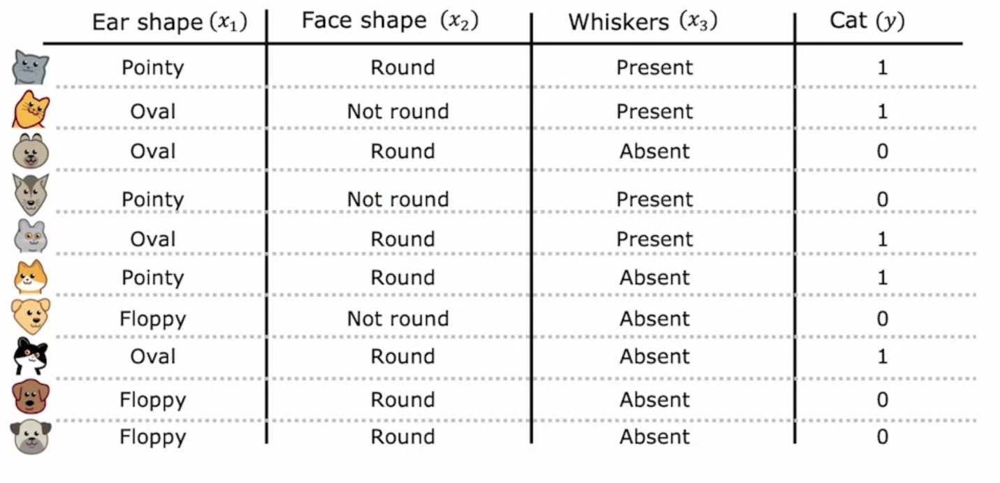

- So, now we'll have a node for *Ear Shape* with $3$ values.
- But we can transform this data, especially this feature so that in our tree we don't have any node with more than $2$ values.

- We are going to use **One Hot Encoding**.

> In **One Hot Encoding**, we encode the column(s) in $1$ and $0$ format, if it has $2$ values or we make separate columns for all unique values in a column with $1$ indicating presence of that value and $0$ indicating absence of that value.

- So, after doing **One Hot Encoding**, our dataset will be:

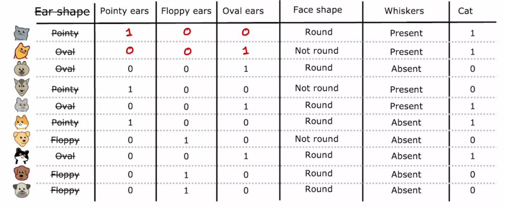

- Having $1$ in *Pointy ears* for those rows which has *Pointy* as value in *Ear Shape*, and similarly for *Floppy* and *Oval*.
- Now, we can make **Decision Tree** on this dataset more easily.

---

- But, still we can't use this dataset for **neural networks** or **logistic regression**.
- For that, we need to transform other $2$ features too!
- So, for *Face Shape* and *Whiskers* feature, we can also do **One Hot Encoding**, where:
- - replace *Round* with $1$ and *Not round* with $0$.
- - Similarly, *Present* with $1$ and *Absent* with $0$.

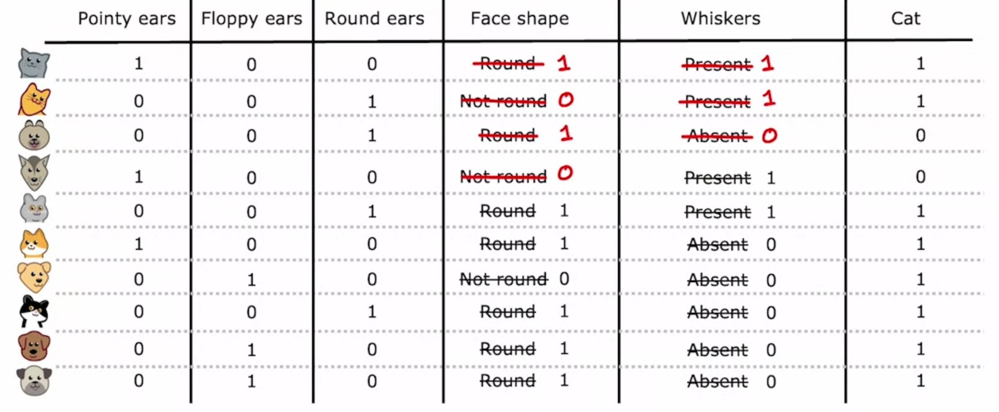

---

### Continuous Valued Features

Let's say now we have another column named *Weights* on *Cat Classification* example.

So, our dataset is like this:

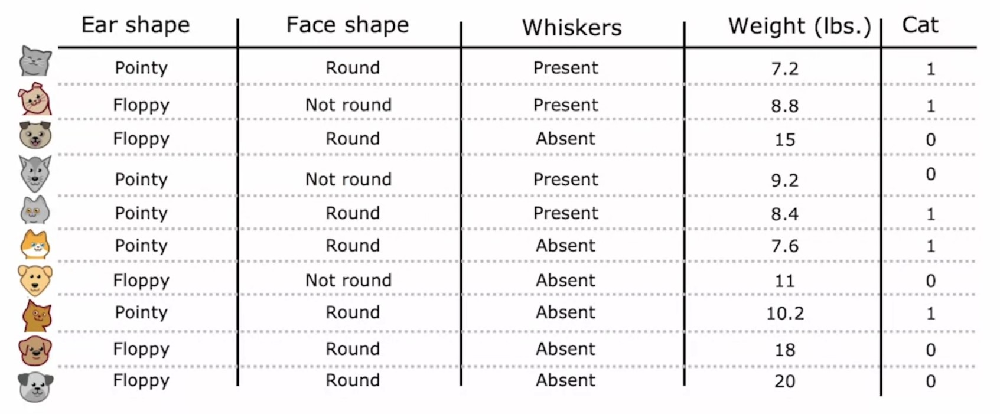

- Notice, the weight column is having continuous values.
- Conversely, other features has discrete set of values.

Now, the question is - How we can split the *Weight* feature ?

- Let's plot the data on a *scatter plot* where:
- - *weight* is on $x$-axis
- - *Cat* (target variable) is on $y$-axis

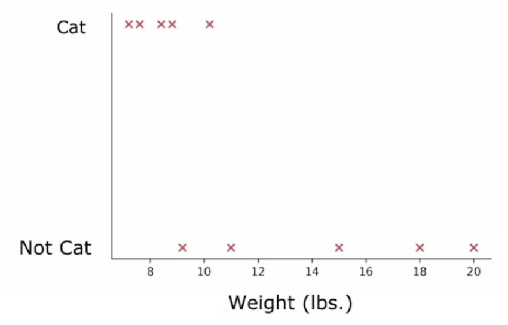

- What we can do is,
- We can make different *thresholds* here, and split data on them and find *Information Gain*, and which one has highest, we'll choose that *threshold* value.
- First, let's say we choose $8$, so on $8$ we split our *weight* feature based on whether the weight is greater or less than $8 lbs.$ on not and calculate *Information Gain*.

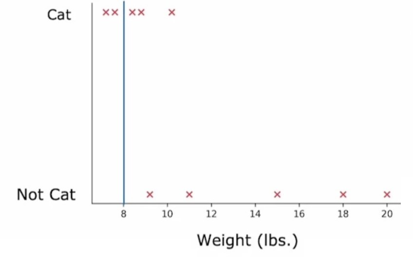

- So, let's say the *Information Gain* is $0.24$.

$$H(0.5) = \left(\frac{2}{10}H\left(\frac{2}{2}\right) + \frac{8}{10}H\left(\frac{3}{8}\right)\right) = 0.24$$
- where:
$$w^{left} = \frac{2}{10} \qquad w^{right} = \frac{8}{10}$$
$$p_1^{left} = \frac{2}{2} \qquad p_2^{right} = \frac{3}{8}$$

- Similarly, now let's take *threshold* as $13$ and plot it and find *Information Gain* with it.

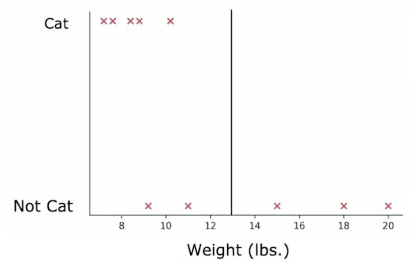

- Say, we got an *Information Gain* of $0.40$

$$H(0.5) = \left(\frac{7}{10}H\left(\frac{5}{7}\right) + \frac{3}{10}H\left(\frac{0}{3}\right)\right) = 0.40$$
- where:
$$w^{left} = \frac{7}{10} \qquad w^{right} = \frac{3}{10}$$
$$p_1^{left} = \frac{5}{7} \qquad p_2^{right} = \frac{0}{3}$$
- This time, *Information Gain* is higher than previous one.

- let's now try with one more value of *threshold* i.e. $9$ and plot it and find *Information Gain* with it.

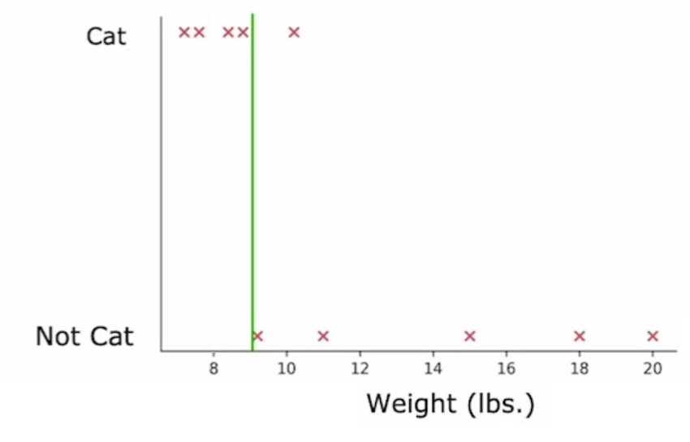

- Say, we got an *Information Gain* of $0.61$.

$$H(0.5) = \left(\frac{4}{10}H\left(\frac{4}{4}\right) + \frac{6}{10}H\left(\frac{1}{6}\right)\right) = 0.40$$
- where:
$$w^{left} = \frac{4}{10} \qquad w^{right} = \frac{6}{10}$$
$$p_1^{left} = \frac{4}{4} \qquad p_2^{right} = \frac{1}{6}$$
- This time, *Information Gain* is higher than both of the previous two.

So, we will split our *Weight* feature based on this *threshold* value i.e. $9 lbs$.

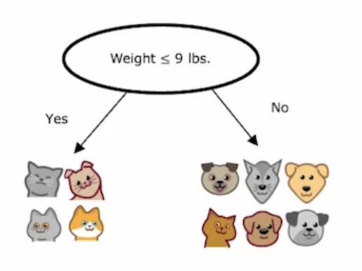

Now, here we randomly choose $3$ different values of *threshold* and find *Information Gain* in each and used the best one.

But, in general way, we can't choose only $3$ values.

- Rather, we sort the column values.
- Then, take all the values of all the midpoints b/w that sorted list.
- So, if we have $10$ training examples, then we use $9$ mid-points.
- And find which one value has the highest *Information Gain*.
- Finally, use that *threshold* value to split our continuous valued feature.

---

