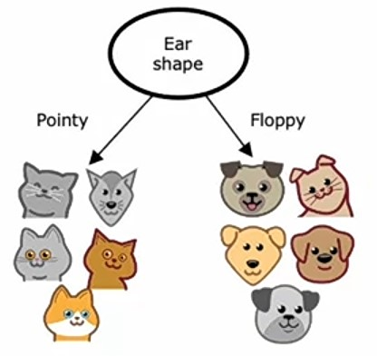
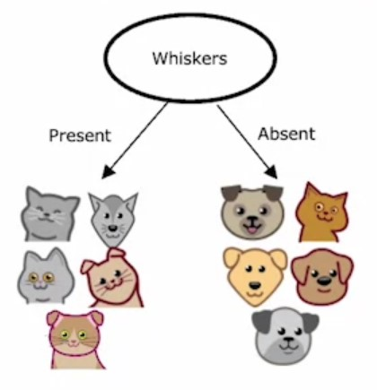
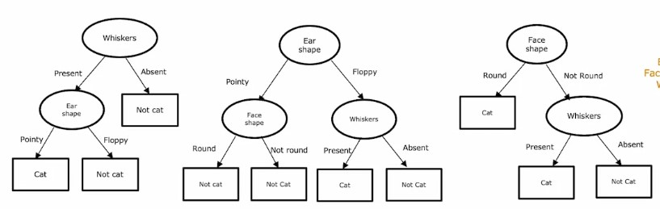
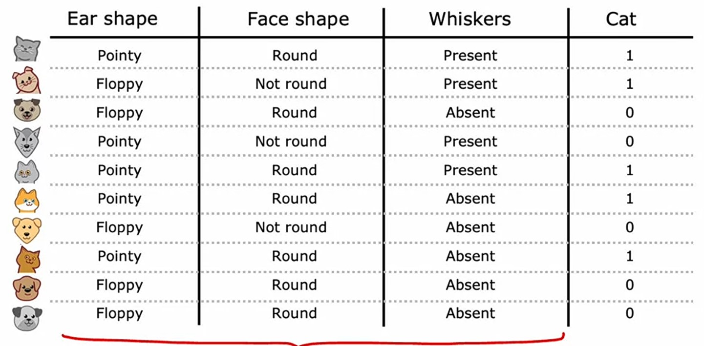
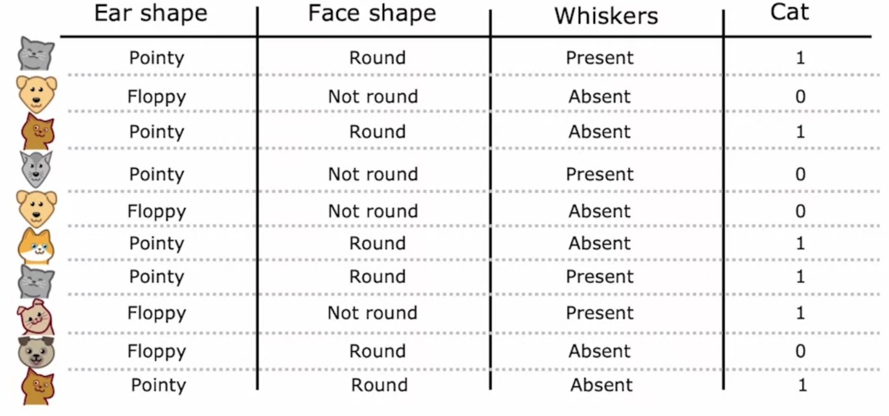
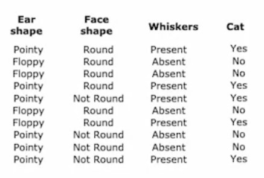
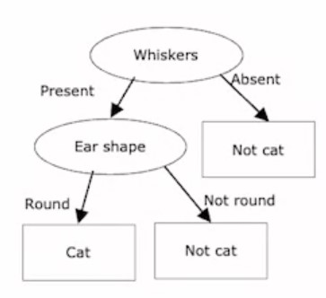
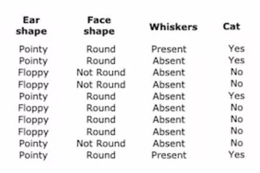
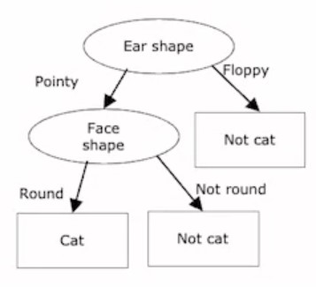
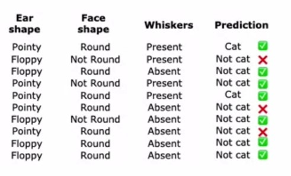

# Week 4: Decision Trees

## Ch 3: Tree Ensembles

### Using multiple decision trees

-   Suppose we are doing _Cat Classification_ problem,
-   We have these $10$ _training_ examples:


-   And $3$ input features:
-   -   _Face Shape_
-   -   _Ear Shape_
-   -   _Whiskers_
-   And target variable $y$ _Cat_
-   Say, the best feature with less entropy is _Ear Shape_.
-   After splitting the data, it looks like this:



-   Say, we changed one _training_ example whose _Ear Shape_ is _pointy_ to _Floppy_.


-   And, now if we find best feature to split by which has less entropy is _Whiskers_
-   So, now our data splitted on _whiskers_ feature at _root_ node, not on _Ear Shape_ feature.



-   So, we can observe that changing a single _training_ example, can effect the **Decision Tree**.
-   So, this make our algorithm less robust.
-   That's why while making **Decision Trees** we want better predictions, so we train a whole bunch of **Decision Trees**.

#### Ensemble Learning

-   Let's say, we build $3$ different **Decision Trees** on the same dataset.



-   And, we got this as a _test_ example:
-   -   Pointy - _Ear Shape_
-   -   Not Round - _Face Shape_
-   -   Present - _Whiskers_
-   In $1^{st}$ tree, if we match these features, we got _Cat_ as a prediction.
-   In $2^{nd}$ tree, if we match these features, we got _Not Cat_ as a prediction.
-   In $3^{rd}$ tree, if we match these features, we got _Cat_ as a prediction.
-   So, we will count which class of features are most predicted, or which class has highest vote out of $3$.
-   Here, $1^{st}$ and $3^{rd}$ trees predicted _Cat_ but only $2^{nd}$ tree predicted _Not Cat_, so majority is _Cat_.
-   Finally, our model will predict _Cat_ as the output.

---

### Sampling with Replacement

While building **Tree Ensembles**, we need to use _Sampling with replacement_ technique.

This is a technique used to generate new dataset similar to the one which we use to train our model.

-   Let's say we have these $10$ training examples:



-   What we do is, make a copy of this dataset and shuffle it.
-   Now, we randomly choose a training example, and add it to a new dataset. (sampling)
-   Then, we put back the chosen training example, so this is replacement.
-   And, we repeat both steps again and agin until we have same number of training examples in new dataset as in the old.
-   So, say after doing _Sampling with replacement_ $10$ times, we got this new dataset.



> This technique is a key building block for building an **ensembles of trees**.

Let' see how:

---

### Bagged Decision Tree

#### Intuition: Generating a Sample

Let's say we have a _training_ data of size $m$

With the help of _Sampling with replacement_ we will generate some new samples from the _training data_ $B$ times.

-   Let's say we have this dataset as our _training_ dataset:


-   We will do _Sampling with replacement_ total $B$ times, starting from $b=1$.
-   For, $b = 1$, we did sampling with $m$ examples, and generated this new dataset from it:



-   So, if we make a **Decision Tree** on this dataset, our tree will be this:



-   Now, again for $b = 2$ we will do _Sampling with replacement_ and generate new dataset from it:



-   And, if we make a **Decision Tree** with this dataset, we'll get this tree:



-   And we follow this procedure total $B$ times.
-   Finally, on test data, we will find prediction on each tree and inference the output which is highest voted.

#### Choosing a value for $B$

-   Now, while doing _Sampling with replacement_ we need to choose some value for $B$, like how many times it will generate new dataset and total of how many trees it should make.
-   Generally, the choice of $B = 100$, meand $100$ different **Decision Trees**.
-   A range of values which most people recommend is from $64 - 228$.
-   If we set a bigger value of $B$, say $1000$, the performance will be same.
-   But, we'll end up getting diminishing returns and it slows the learning process.

> #### Bagged Decision Trees
>
> -   This whole process of creating _ensemble trees_ is called **Bagged Decision Tree**.
> -   where, _Bagged_ means, we are using bags of new bootstrap samples of _training_ examples.
> -   And, this technique also reduces the _Variance_ of our model, because we train the model on different bootstrap samples of training examples, so eventually our algorithm tries to learn most out of the data.

---

### Random Forest

-   Now, that we have seen how **Bagged Decision Tree** algorithm works.
-   It turns out that **Random Forest** is works better than **Bagged Decision Tree** algorithm, with some minor changes to it.

Let's see what are those changes.

#### Intuition

-   It almost works same as how **Bagged Decision Tree** algorithm works.
-   Except, rather than choosing all the features for every sample.
-   We will randomly choose a subset of features to use to split in **Decision Tree**.

#### Why to choose a subset of features rather than all features ?

-   Because, while doing _Sampling with replacement_, we may end up with the same feature split at root node or intermediate nodes.
-   Which also increase the vote count for the prediction.

So, what we do is:

-   At each node, when choosing a feature to split,
-   If $n$ features are available, we use a subset of them $k$, where $k \lt n$.
-   And our algorithm will only choose those $k$ features instead of all.
-   Hence, from $k$ features, highest _Infromation Gain_ feature is used to split.
    > Generally, while $n$ is large, say $10's$ or dozens or hundreds, then we use value of $k$ as $\sqrt{n}$, so that our algorithm doesn't overfit.

**Random Forest** is more robust than the **Bagged Decision Tree** as well as a single **Decision Tree** because:

-   The **Bagged Decision Tree** will explore our data a lot already because of _Sampling with replacement_.
-   And Changing training data doesn't effect that much because at the end we are choosing the highest voted inference as the output.
-   So, by choosing a random number of features, makes **Random Forest** less prone to **Overfit** and hence more robust.

> #### Question: Where does a machine learning go for camping ?
>
> Answer is, in **Random Forest** 😅🤣🤣🤣

---

### XGBoost

-   **XGBoost** stands for _eXtreme Gradient Boosting_.

-   **XGBoost** is fastest, most popular, most used **Decision Tree** based algorithm.

-   If we do some more modification while doing _Sampling with replacement_ in **Bagged Decision Trees** algorithm, then we can achieve next level performance and boost in our model.

Let's see what these modifications are, and how **XGBoost** works.

#### Intuition

-   In **Bagged Decision Tree** algorithm, we generate bootstrap of datasets $B$ times using _Sampling with replacement_ technique of all $m$ training examples.
-   But in **XGBoost**, rather than doing _Sampling with replacement_ on all $m$ training examples.
-   We increase the probability of choosing **missclassified examples** for _Sampling_.
-   And, train a **Decision Tree** on those datasets.
-   So that, our model will learn better on **missclassified examples**.

#### Example

-   Let's say we did _Sampling with replacement_ on all $m$ _training_ examples and we generated this dataset:


-   If we make a **Decision Tree** on this dataset, it will be like this:


-   So, with this tree, let's say out of all $m$ _training_ examples, we got $3$ wrong / missclassified results.



-   Now, what we do is somehow, increase the probability of these missclassified examples in our dataset for _Sampling_, so that chances of getting these examples will increased.
-   And hence, our model will learn from them.
-   Finally, our model's performance will be improved.
-   And, **XGBoost** will use some efficient ways to do it.
-   So, this is how **Boosting** works.
-   And, **XGBoost** is can example of it.

#### Advantages

1. It is open source.
2. It's faster than other **Decision Trees** based models.
3. It has a good choice of default _splitting_ criteria and when to stop _splitting_.
4. It has built-in **regularization** so it is less prone to _overfitting_.
5. It is widely used in Competitions and commerical applications, same as deep learning algorithms.
6. Rather than doing _Sampling with replacement_, it actually assigns different ways to different _training_ examples. So it doesn't really need to generate a lot of randomly chosen _training_ sets, which makes it more efficient than _Sampling with replacement_ procedure.

#### How to use XGBoost

1. We need to import `XGBClassifier` for _classification_ problems or _XGBRegressor_ for _regression_ problems from `XGBoost` library.

```python
from xgboost import XGBClassifier, XGBRegressor
```

2. To make a model, we just need to instantiate it.

```python
model = XGBClassifier()
```

3. To train the model, we can use `fit()` method.

```python
model.fit(X_train, y_train)
```

4. To do inference, we use `predict()` method.

```python
preds = model.predict(X_test)
```

-   So, these are steps to use `XGBoost`.

---

### _Decision Trees_ vs _Neural Networks_

|          Basis          |                           **Decision Trees**                            | **Neural Networks**                                        |
| :---------------------: | :---------------------------------------------------------------------: | :--------------------------------------------------------- |
|   **Structured data**   |                   It works well on _Structured data_                    | It also works well on _Structured data_                    |
|  **Unstructured data**  |                 It doesn't work on _Unstructured data_                  | It works well on _Unstructured data_                       |
|        **Speed**        |                               **Faster**                                | **Slower**                                                 |
| **Human Interpretable** | **Yes**<br/>We can visualize how a single **Decision Tree** is working. | **No**<br/> We cannot visualize well how they are working. |
|  **Transfer learning**  |                It doesn't work with _Transfer learning_                 | It works with _Transfer learning_                          |
|   **Multiple models**   |             We cannot combine _multiple_ **Decision Trees**             | We can combine _multiple_ **Neural Networks**              |

---

#### Practice Quiz: Tree ensembles

#### Question 1


<details>
<summary>    
    <font size='3' color='#00FF00'>Answer to <b>question 1</b></font>
</summary>
<p>If you have selected option <em>b (Sample the training data with replacement) </em> then you are right!</p><p><b>Explanation:</b><br/>Correct. You can generate a training set that is unique for each individual tree by sampling the training data with replacement.</p>
</details>

#### Question 2


<details>
<summary>    
    <font size='3' color='#00FF00'>Answer to <b>question 2</b></font>
</summary>
<p>If you have selected option <em>a (A neural network, because the input is unstructured data and neural networks typically work better with unstructured data.)</em> then you are right!
</details>

#### Question 3


<details>
<summary>    
    <font size='3' color='#00FF00'>Answer to <b>question 3</b></font>
</summary>
<p>If you have selected option <em>c (Drawing a sequence of examples where, when picking the next example, first replacing all previously drawn examples into the set we are picking from. )</em> then you are right!</p>
</details>

---

### Programming Assignment: Decision Trees [🔗](../codes/W4-%20Decision%20Trees%20assignment.ipynb)

---