# Week 1 - Unsupervised Learning

**Learning Objectives**

- Implement the k-means clustering algorithm
- Implement the k-means optimization objective
- Initialize the k-means algorithm
- Choose the number of clusters for the k-means algorithm
- Implement an anomaly detection system
- Decide when to use supervised learning vs. anomaly detection
- Implement the centroid update function in k-means
- Implement the function that finds the closest centroids to each point in k-means

---

## Ch 1: Clustering

### What is Clustering?

> A clustering algorithm looks at a number of data points and automatically finds data points that are related or similar to each other. ~ _Andrew Ng_

**Clustering** is an **Unsupervised Learning** algortihm that groups similar data points together. It is used to find patterns in data and group similar data points together.

### Difference in Supervised and Unsupervised Learning
| Basis | Supervised Learning | Unsupervised Learning |
|:-----:|:-------------------:|:---------------------:|
| **Data**  | Labeled - $(x, y)$          | Unlabeled - $x$            |
| **Training set** | $(x^{(1)}, y^{(1)}), (x^{(2)}, y^{(2)}), \ldots, (x^{(m)}, y^{(m)})$ | $x^{(1)}, x^{(2)}, \ldots, x^{(m)}$ |
| **Goal**  | Predict the label $y$            | Understand the patterns in data and group similar data points together |
| **Example** | **Regression**: House Price Prediction <b> **Classification**: Spam Email Classification |  Grouping similar YT videos together |
| **Visual Difference** |   |  |

### Applications of Clustering

#### Market Segmentation
- Grouping customers based on certain criteria like income, interests etc...
- Helps in understanding the customer better and target them with specific marketing strategies accordingly.

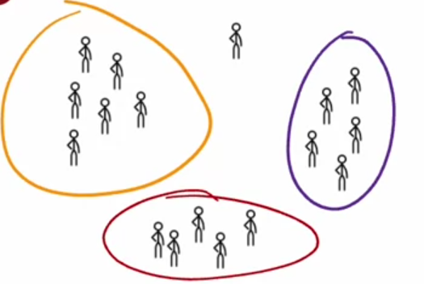

#### Grouping Similar News Articles
- Grouping similar documents together based on the content of the document.
- Helps in organizing and recommending similar articles to the user.


#### DNA Analysis
- Analyzing DNA sequences and grouping similar sequences together.
- Like grouping people who exhibit similar genetic traits.

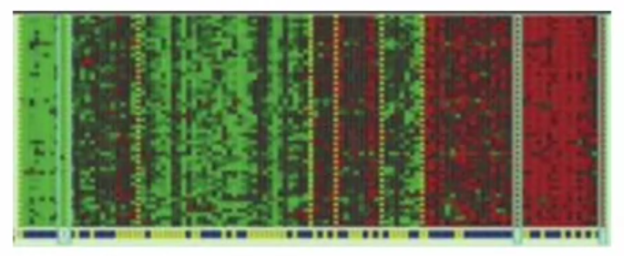


#### Astronomical Analysis
- Grouping similar bodies together for analyzing which ones forms galaxy or a coherent structures in space.

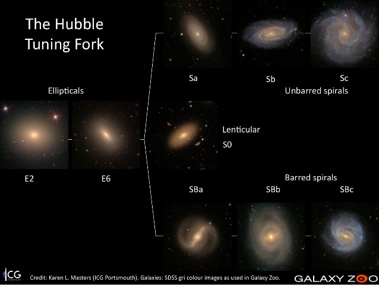

---

### K-means Intuition

**K-means** is a clustering algorithm that groups similar data points together. It is an iterative algorithm that divides a group of $m$ data points into $k$ clusters.

#### How K-means works?
Let's take an example of grouping similar data points into $2$ clusters.

Here, we have $m=30$ data points in a $2D$ space. We need to group these data points into $2$ clusters.

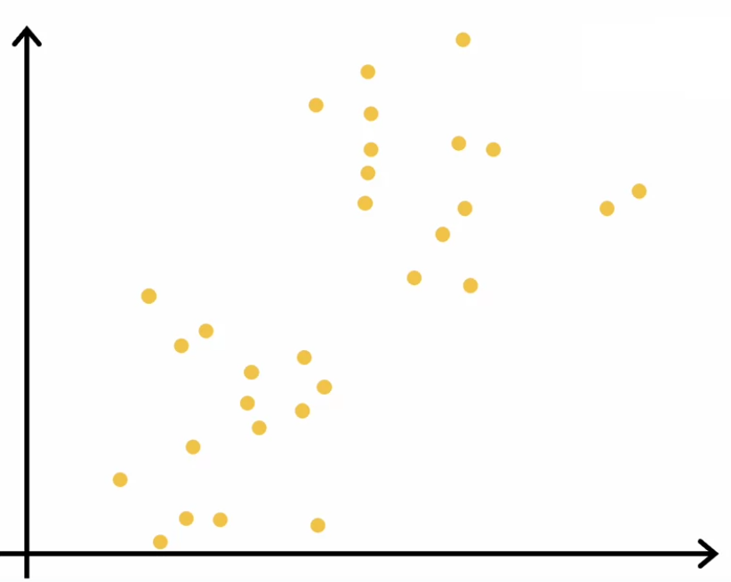

1. **Step 1**: Randomly initialize $2$ centroids. These centroids are the center of the clusters.

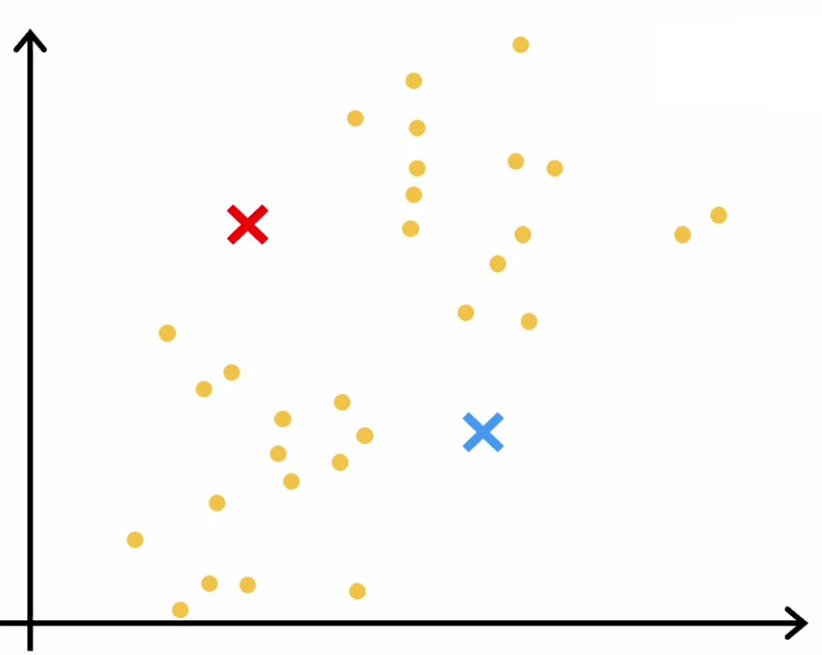

2. **Step 2**: Assign each data point to the nearest centroid.

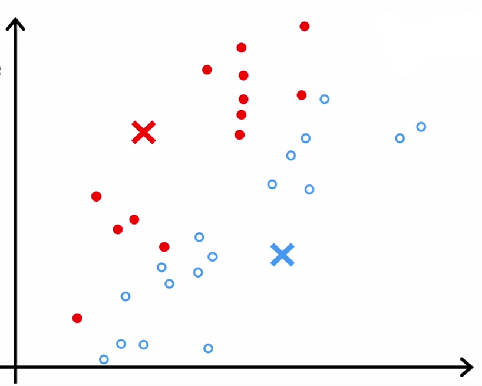

3. **Step 3**: Move the centroid to the average distance of data points assigned to it.

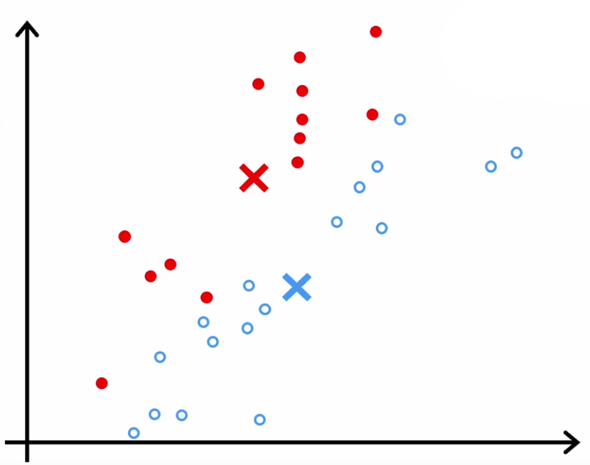

4. **Repeat** the above steps until the centroids converges. 
    Means moving the centroids further does not result in change of their location.

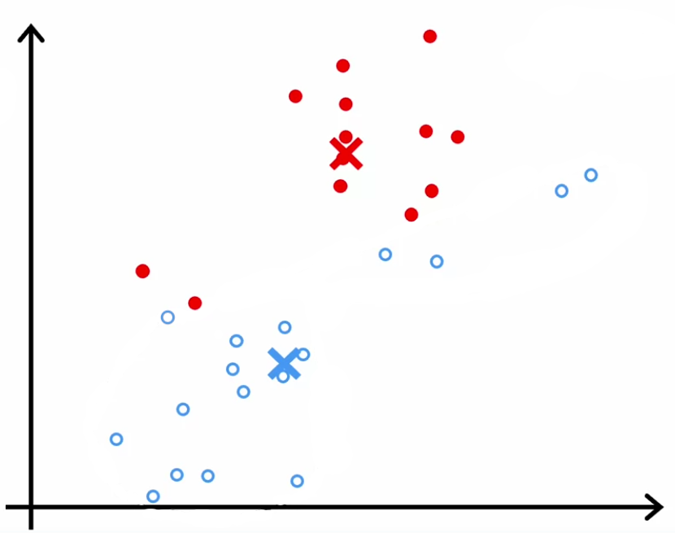

Now, the centroids have converged and the data points are grouped into $2$ clusters.

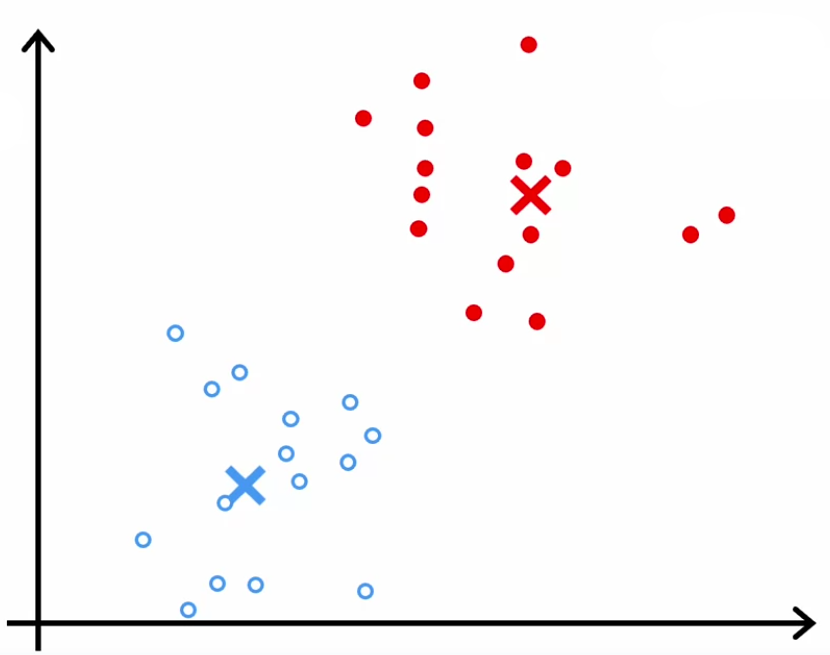

---

### K-means Algorithm

Let's see how the K-means algorithm works.

Here, we have some data points with $n=2$ features and we need to group them into $K=2$ clusters.

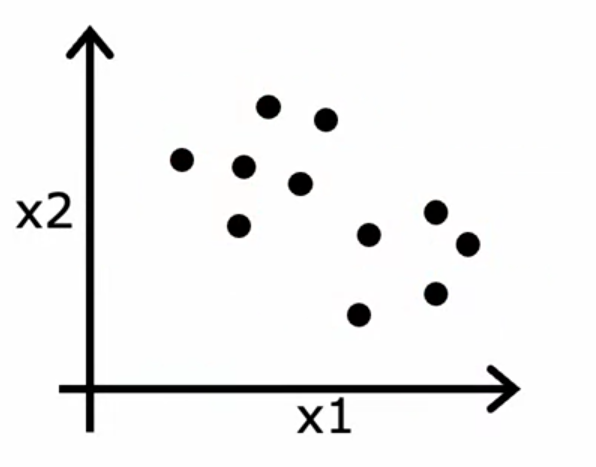

First, we have to initialize $K$ centroids, we can initialize them randomly.
$$K = \{ \mu_1, \mu_2, \dots, \mu_k \}$$

Let's intialize $K=2$ centroids.

#### Step 1: Assign Data Points to Centroids

We need to assign each data point to the nearest centroid.
- As here we have $2$ features, so each data point will be represented as $(x_1, x_2)$.

**Pseudo Code**:
```
for i = 1 to m
    c[i] = index (from 1 to K) of cluster centroid closest to x[i]
```

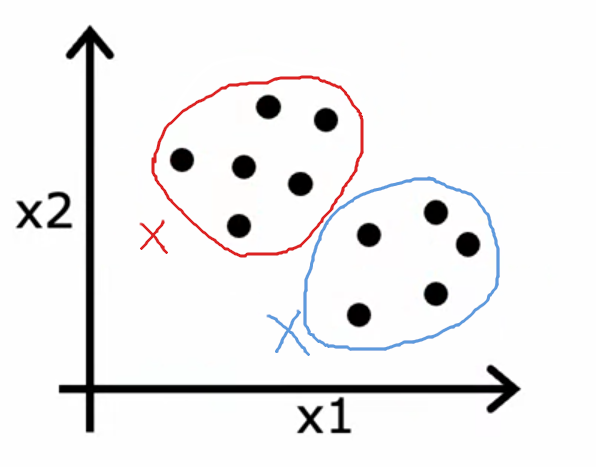

#### Step 2: Move Cluster Centroids
- We will take the **average** of _all the data points assigned to a centroid_ and move the centroid to that average distance.
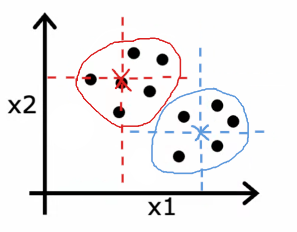

**Pseudo Code**:
```
for k = 1 to K
    centroid[k] = average (mean) of points assigned to cluster k
```

##### Example:
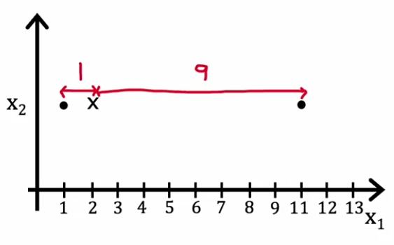

We have a centroid at $(2, y)$ and the data points assigned to it are $(1, y), (12, y)$ for some $y$.

- If we take average of distance between the centroid and the data points, we get: $41$.
    $$\frac{1}{2}\left(1^2 + 9^2\right) = \frac{1}{2}\left(1 + 81\right) = 41$$
- It will be too higher, compared to if we take the average of the data points.
    $$\frac{1}{2}\left(1 + 11\right) = \frac{1}{2}\left(12\right) = 6$$
- So, we will move the centroid to $(6, y)$.
- Also, the distance between the centroid and the data points will be less than $41$.
    $$\frac{1}{2}\left(5^2 + 5^2\right) = 25$$


#### Repeat the above steps until convergence
We will repeat both the above steps until the centroids converge. Means, when the average of the data points assigned to a centroid does not change, we can say that the centroids have converged.

**Pseudo Code**:
```
repeat {
    for i = 1 to m
        c[i] = index (from 1 to K) of cluster centroid closest to x[i]
    
    for k = 1 to K
        centroid[k] = average (mean) of points assigned to cluster k
}
```

#### Optimization Objective
- The optimization objective of the K-means algorithm is to minimize the squared distance between the data points and the centroids.

$$\text{min}_k ||x^{(i)} - \mu_{k}||^2$$

#### Calculating the distance
- We can use the **Euclidean Distance** to calculate the distance between two points, which is also known as the **L2 Norm**.
- The Euclidean distance between two points $(x_1, y_1)$ and $(x_2, y_2)$ is given by:

$$ \sqrt{\sum_{i=1}^{n} (x_i - y_i)^2} \\[1em]
\text{which can be re-written as:} \\[1em]
\sqrt{(x_1 - x_2)^2 + \dots + (n_1 - n_2)^2} $$

- Also, here, rather than using distance, we can use the **squared distance** because, the squared distance will _emphasize the outliers_ also squared function is differentiable and easier to work with.

So, the **squared Euclidean distance** between two points $(x_1, y_1)$ and $(x_2, y_2)$ is given by:

$$ \sum_{i=1}^{n} (x_i - y_i)^2 = (x_1 - x_2)^2 + \dots + (n_1 - n_2)^2$$

#### Edge case

We might encounter an edge case when there is no data point assigned to a centroid. In such case, we can either:
1. Remove the $k^{th}$ centroid from the $K$ centroids we have and end up having $K-1$ clusters, which is a general way. OR
2. If we need all $K$ centroids, then we can reinitialize the $k^{th}$ centroid randomly.

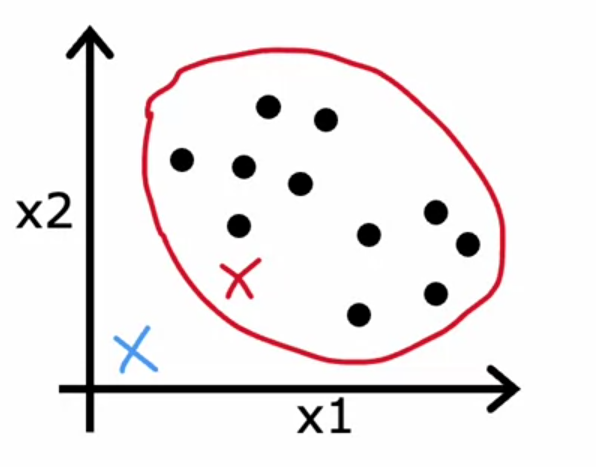

---

### Optimization Objective
We have to minimize the squared distance between the data points and the centroids, which is the optimization objective of the **K-means algorithm**.

#### Notations
- $c^{(i)}$ = index of cluster $(1, 2, ..., K)$ to which example $x^{(i)}$ is currently assigned.
- $\mu_k$ = cluster centroid $k$
- $\mu_{c^{(i)}}$ = cluster centroid of cluster to which example $x^{(i)}$ has been assigned.

#### Cost Function
The cost function of the K-means algorithm is given by:

$$ J(c^{(1)}, \dots, c^{(m)}, \mu_1, \dots, \mu_K) = \frac{1}{m} \sum_{i=1}^{m} ||x^{(i)} - \mu_{c^{(i)}}||^2 $$

And, our goal is to minimize this cost function.

$$ \text{min}_{c^{(1)}, \dots, c^{(m)}} J(c^{(1)}, \dots, c^{(m)}, \mu_1, \dots, \mu_K) $$

To minimize the cost function, we repeat those two steps, until the centroids converges and hence, the cost function minimizes.
```
repeat {
    for i = 1 to m
        c[i] = index (from 1 to K) of cluster centroid closest to x[i]
    
    for k = 1 to K
        centroid[k] = average (mean) of points assigned to cluster k
}
```


---

### Initialization K-means

#### Random Initialization

We can initialize the centroids randomly. But, the random initialization can lead to different results.

##### Case 1: Intialization at just right place
- If the centroids are initialized at the right place, then the K-means algorithm will converge quickly.

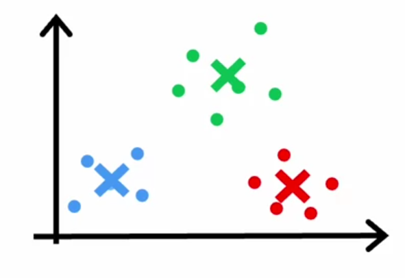

##### Case 2: Intialization out of place
- Sometimes, one of the centroids might be initialized out of the data points, where the distribution doesn't lie, which can lead to different results.

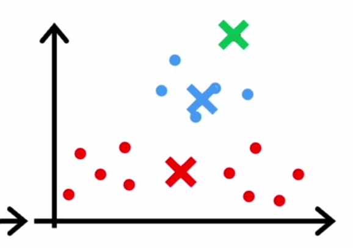

##### Case 3: Intialization at same place
- Sometimes, two centroids might be initialized at the same place, which can lead to wrong clustering.

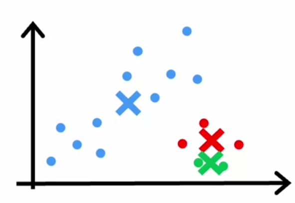

> Here, in both [**Case 2**](#case-2-intialization-out-of-place) and [**Case 3**](#case-3-intialization-at-same-place), the **K-means algorithm**, the cost function will result in higher value and take longer time to converge compared to [**Case 1**](#case-1-intialization-at-just-right-place).

There are other ways to initialize the centroids, such as:
1. **Forgy Initialization**
    In this method, we randomly select $K$ data points and set the centroids to these data points.
2. **K-means++**
    In this method, we initialize the first centroid randomly and then we choose the next point such that it is more probable to lie far from the first centroid and do the same for the rest of the centroids.

    Check more about it [here](https://en.wikipedia.org/wiki/K-means%2B%2B).

out of which, **K-means++** is the most widely used initialization method, but it is computationally expensive, so for faster computation people use **Random Initialization**, as **Forgy Initialization** may lead to [**Case 3**](#case-3-intialization-at-same-place).

While using **Random Initialization**, we can run the K-means algorithm multiple times and choose the one with the lowest cost function. Generally, we run the K-means algorithm $50$ to $100$ times and choose the one with the lowest cost function.

---

### Choosing the Number of Clusters

Choosing the number of clusters is a crucial step in the K-means algorithm. We can choose the number of clusters based on the data or the application.

#### Elbow Method
- One of the methods to choose the number of clusters is the **Elbow Method**.
- In this method, we plot the cost function $J$ vs the number of clusters $K$.
- The cost function will decrease as the number of clusters increases, but after a certain number of clusters, the cost function will decrease very slowly.
- The number of clusters at which the cost function decreases slowly is the number of clusters we should choose. This point is called the **Elbow Point**.
- The Elbow Point is the point where the cost function decreases slowly.


> Sometimes, we might not get a clear Elbow Point, where the cost function decreases slowly, the graph might be smooth. In such cases, we can choose the number of clusters based on the application.

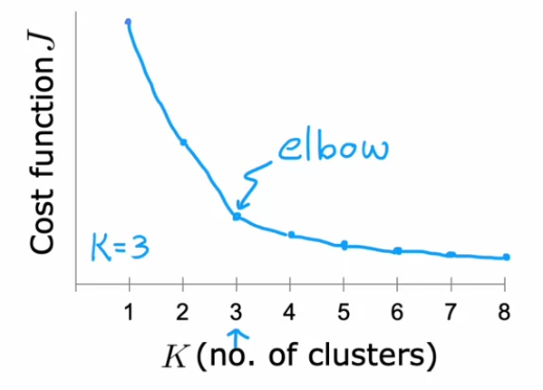

##### Example: T-shirt sizing
Suppose, we have some data points corresponding to different weights and heights of people and we need to group them into different sizes of T-shirts.

**$K=3$**

If we choose $k=3$, then we will get $3$ clusters, which are *Small*, *Medium* and *Large* T-shirts.

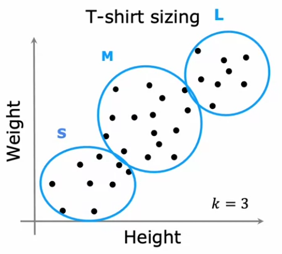


**$K=5$**

If we choose $k=5$, then we will get $4$ clusters, which are *Extra Small*, *Small*, *Medium*, *Large* and *Extra Large* T-shirts.
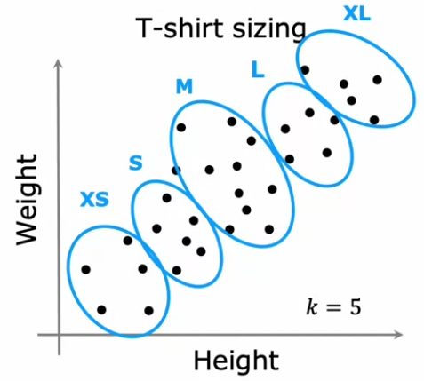

Hence, if the **Elbow Point** is not clear, we can choose the number of clusters based on the application. And after doing so, we can evaluate the performance of the **K-means algorithm** based on *test data*.

---


### Quizzes

#### Practice Quiz: Clustering

#### Question 1


<details>
<summary>    
    <font size='3' color='#00FF00'>Answer to <b>question 1</b></font>
</summary>
<p>If you have selected option <em>4<sup>th</sup> then you are right!<br/><b>Explanation:</b><br/>Unsupervised learning uses unlabeled data. The training examples do not have targets or labels "y". Recall the T-shirt example. The data was height and weight but no target size.</p>
</details>


#### Question 2


<details>
<summary>    
    <font size='3' color='#00FF00'>Answer to <b>question 2</b></font>
</summary>
<p>If you have selected option <em>1<sup>st</sup>, 2<sup>nd</sup> and 4<sup>th</sup></em> then you are right!<br/><b>Explanation:</b><br/>The dimension of μ<sub>k</sub>​ matches the dimension of the examples.<br/>c<sup>(i)</sup> describes which centroid example (i) is assigned to.<br/>c<sup>(i)</sup> describes which centroid example(i) is assigned to. If K=3, then c<sup>(i)</sup> would be one of 1,2 or 3 assuming counting starts at 1.</p>
</details>


#### Question 3


<details>
<summary>    
    <font size='3' color='#00FF00'>Answer to <b>question 3</b></font>
</summary>
<p>If you have selected option <em>1<sup>st</sup> then you are right!<br/><b>Explanation:</b><br/>K-means can arrive at different solutions depending on initialization. After running repeated trials, choose the solution with the lowest cost.</p>
</details>


#### Question 4


<details>
<summary>    
    <font size='3' color='#00FF00'>Answer to <b>question 4</b></font>
</summary>
<p>If you have selected option <em>1<sup>st</sup> and 3<sup>rd</sup></em> then you are right!<br/><b>Explanation:</b><br/>Yes, a neuron is a part of a neural network.<br/>Yes, an activation is the number calculated by a neuron (and an activation is a vector that is output by a layer that contains multiple neurons).</p>
</details>


#### Question 5


<details>
<summary>    
    <font size='3' color='#00FF00'>Answer to <b>question 5</b></font>
</summary>
<p>If you have selected option <em>4<sup>th</sup> then you are right!<br/><b>Explanation:</b><br/>The elbow method plots a graph between the number of clusters K and the cost function. The ‘bend’ in the cost curve can suggest a natural value for K. Note that this feature may not exist or be significant in some data sets.</p>
</details>

---

### Programming Assignment: K-Means [🔗](../codes/W1%20-%20PA1%20-%20K-Means%20Assignment.ipynb)

