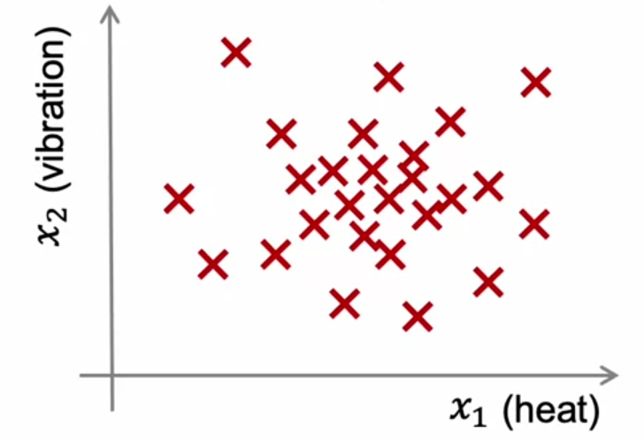
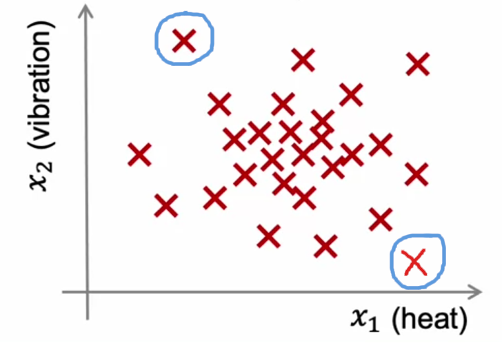
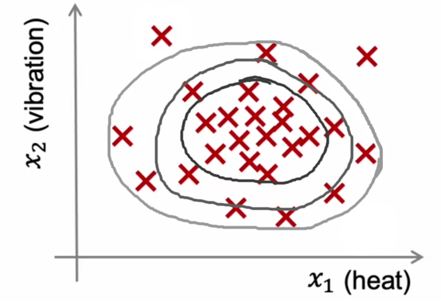
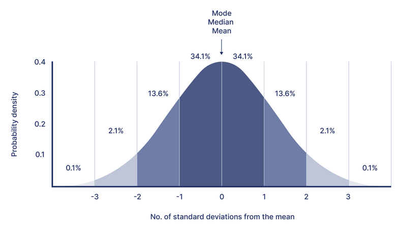
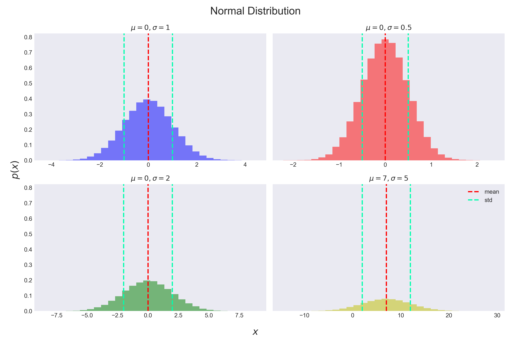
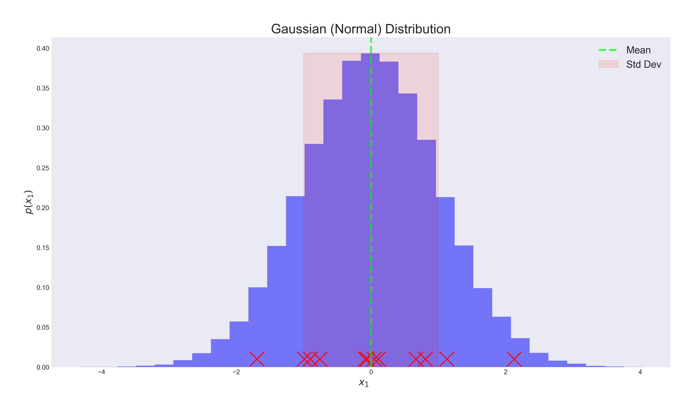
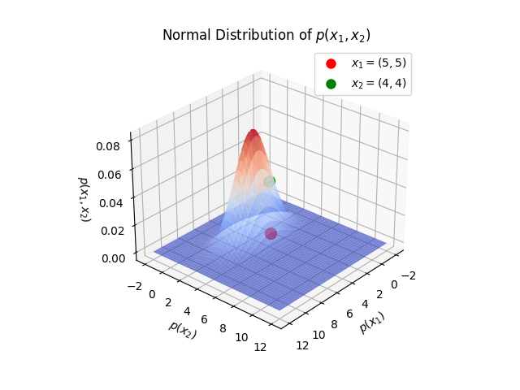
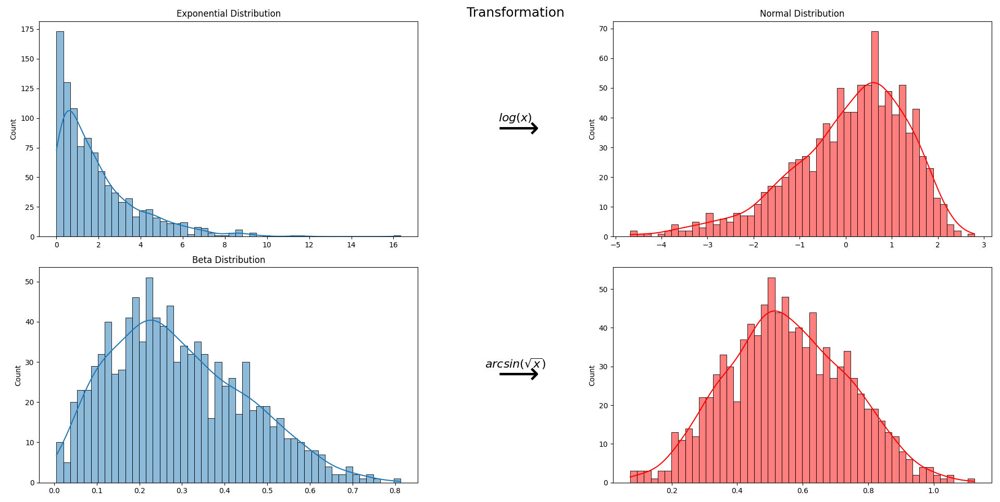
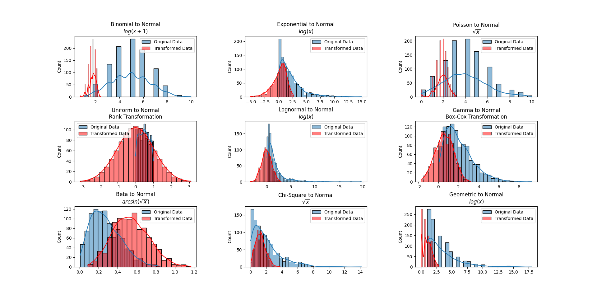

# Week 1: Unsupervised Learning

## Ch 2: Anomaly Detection

### What is Anomaly Detection?

> Play video for highlighted transcript with text, Anomaly detection algorithms look at an unlabeled dataset of normal events and thereby learns to detect or to raise a red flag for if there is an unusual or an anomalous event., marked from 0 hours 0 minutes 6 seconds until 0 hours 0 minutes 20 secondsAnomaly detection algorithms look at an unlabeled dataset of normal events and thereby learns to detect or to raise a red flag for if there is an unusual or an anomalous event. ~ _Andrew Ng_

Anomaly detection is the process of identifying unexpected items or events in data sets, which differ from the normal behavior.

#### What is an _Anomaly_?

An anomaly is something that deviates from what is normal or expected.

Anomalies are also referred to as _outliers_, _novelties_, _noise_, and _deviations_.

#### Applications of Anomaly Detection

##### Fraud Detection
$x^{(i)}$ = features of user $i$'s activities
- How often user logs in?
- How often user logs in from different IP addresses?
- How many web pages visited?
- What kind of content user is interacting with in Social Media?
  
Model $p(x)$, and if $p(x) < \epsilon$, then flag as an anomaly, like unusual login activity or unusual content interaction.

##### Manufacturing
$x^{(i)}$ = features of machine $i$'s operations
- Detecting defects in aircraft engines
- Detecting defects in automotive parts
- Detecting defects in pharmaceuticals

Model $p(x)$, and if $p(x) < \epsilon$, then flag as an anomaly, like unusual engine temperature or unusual vibration.

##### Monitoring Computers in a Data Center
$x^{(i)}$ = features of machine $i$
- Memory use
- CPU load
- Network traffic
- Disk I/O

Model $p(x)$, and if $p(x) < \epsilon$, then flag as an anomaly, like unusual memory use or unusual network traffic or high CPU load.

#### Example: Aircraft Engine Anomaly Detection

Let's say we have a dataset of aircraft engine data, and we want to detect anomalies in the data.
Some features of the data are:
- $x_1$ = heat generated
- $x_2$ = vibration intensity

We have a dataset like this:

$$ \text{Dataset} = \{x^{(1)}, x^{(2)}, \ldots, x^{(m)}\} $$

which is plotted as:

Here, if we see the data, we can see that most of the data points are clustered around a certain region, and there are a few data points that are far away from the cluster. The **blue** circled data points are anomalies.

### Density Estimation

**Density estimation** is the process of estimating the **probability density function (PDF)** of the data.

Here, we can create a **Model** $p(x)$, which estimates the probability of a data point $x$ being normal or an anomaly.

What we can do is, for a given data point $x$, we can compute $p(x)$, and if $p(x) < \epsilon$, then we can flag it as an anomaly.

Here, in the above image, you can see 3 different regions:
- The innermost region is the **normal region** where most of the data points are clustered, which has high probability density.
- The middle region is the **transition region** where the probability density is moderate.
- The outermost region is the **anomalous region** where the probability density is very low, that region we can set at a threshold $\epsilon$.

---

### Gaussian Distribution (Normal Distribution)

The **Gaussian Distribution** is also known as the **Normal Distribution**.

Gaussian Distribution is a continuous probability distribution that is symmetric about the mean, showing that data near the mean are more frequent in occurrence than data far from the mean. In graph form, normal distribution will appear as a bell curve, so it is also known as the **bell-shaped curve**.

#### Properties of Gaussian Distribution
- The Gaussian Distribution is defined by two parameters:
    - mean $\mu$ 
    - Variance $\sigma^2$
- The mean $\mu$ determines the location of the center of the peak of the bell curve.
- The variance $\sigma^2$ determines the width of the bell curve. The standard deviation $\sigma$ is the square root of the variance.
- The **Probability Density Function (PDF)** of the Gaussian Distribution is given by:

$$ p(x; \mu, \sigma^2) = \frac{1}{\sqrt{2\pi}\sigma} \exp\left(-\frac{(x-\mu)^2}{2\sigma^2}\right) $$

#### Normal Distribution Variants
In the below image, you can see different variants of the Gaussian Distribution based on the mean and variance.

Some observations:
- The **mean** $\mu$ determines the location of the peak of the bell curve.
- The **variance** $\sigma^2$ (square of **standard deviation**) determines the width of the bell curve.
- Less variance means the data points are closer to the mean, and more variance means the data points are spread out.

> #### Probability Density Function (PDF)
> The **Probability Density Function (PDF)** of a continuous random variable gives the relative likelihood of the random variable to take on a given value.
> - The PDF is a non-negative function, and the area under the PDF curve over an interval gives the probability of the random variable falling within that interval.
> - The PDF is a function of the random variable $x$ and is denoted as $p(x)$.
> 
> Sum of the probabilities of all possible outcomes of a random variable is equal to $1$.

#### Parameters Estimation

Given a dataset $\{x^{(1)}, x^{(2)}, \ldots, x^{(m)}\}$, we can estimate the parameters $\mu$ and $\sigma^2$ of the Gaussian Distribution.

The parameters $\mu$ and $\sigma^2$ can be estimated as:
- The mean $\mu$ is the average of the data points:

$$ \mu = \frac{1}{m} \sum_{i=1}^{m} x^{(i)} $$

- The variance $\sigma^2$ is the average squared difference from the mean:

$$ \sigma^2 = \frac{1}{m} \sum_{i=1}^{m} (x^{(i)} - \mu)^2 $$

- The standard deviation $\sigma$ is the square root of the variance:

$$ \sigma = \sqrt{\sigma^2} $$

---

### Anomaly Detection Algorithm

In Anomaly Detection, we will estimate the desnity of the data points using a **Probability Density Function (PDF)** and then flag the data points with low probability as anomalies.

#### Algorithm Steps

Say, we have our training set:

$$\{x^{(1)}, x^{(2)}, \ldots, x^{(m)}\} \text{ where } x^{(i)} \in \mathbb{R}^n$$

where, each example $x^{(i)}$ has $n$ features:

$$x^{(i)} = \begin{bmatrix} x_1^{(i)} \\ x_2^{(i)} \\ \vdots \\ x_n^{(i)} \end{bmatrix}$$

##### Step 1: Choose $n$ features $x_i$ that you think might be indicative of anomalous examples.

$$x^{(i)} = \begin{bmatrix} x_1^{(i)} \\ x_2^{(i)} \\ \vdots \\ x_n^{(i)} \end{bmatrix}$$

##### Step 2: Fit parameters $\mu_1, \mu_2, \ldots, \mu_n, \sigma_1^2, \sigma_2^2, \ldots, \sigma_n^2$.

- For each feature $x_i$, estimate the parameters $\mu_i$ and $\sigma_i^2$ of the Gaussian Distribution:

$$ \mu_i = \frac{1}{m} \sum_{j=1}^{m} x_i^{(j)} $$
$$ \sigma_i^2 = \frac{1}{m} \sum_{j=1}^{m} (x_i^{(j)} - \mu_i)^2 $$

- Vectorized form:

$$ \vec{\mu} = \begin{bmatrix} \mu_1 \\ \mu_2 \\ \vdots \\ \mu_n \end{bmatrix} = \frac{1}{m} \sum_{i=1}^{m} x^{(i)} $$
$$ \vec{\sigma}^2 = \begin{bmatrix} \sigma_1^2 \\ \sigma_2^2 \\ \vdots \\ \sigma_n^2 \end{bmatrix} = \frac{1}{m} \sum_{i=1}^{m} (x^{(i)} - \vec{\mu})^2 $$

##### Step 3: Compute the probability density for each example $x$.

- Compute the probability density $p(x)$ for each example $x$:

$$ p(x) = \prod_{i=1}^{n} p(x_i; \mu_i, \sigma_i^2) = p(x_1; u_1, \sigma_1^2) \cdot p(x_2; u_2, \sigma_2^2) \cdot \ldots \cdot p(x_n; u_n, \sigma_n^2) $$

$$ p(x) \approx Normal(\mu_i, \sigma_i)_{n} = \prod_{i=1}^{n} \frac{1}{\sqrt{2\pi}\sigma_i} \exp\left(-\frac{(x_i-\mu_i)^2}{2\sigma_i^2}\right) $$

##### Step 4: Flag an anomaly if $p(x) < \epsilon$.

- Choose a threshold $\epsilon$ that you think will best capture anomalies.
- If $p(x) < \epsilon$, then flag it as an anomaly.

Below you can see, we have plotted $2$ test data points $x_1$ and $x_2$ on the Gaussian Distribution PDF curve.

- We can mark $x_2$ as an anomaly as it has a low probability density $p(x_2)$.

---

### Developing and Evaluating an Anomaly Detection System

#### Real Number Evaluation

When developing an **Anomaly Detection System**, making decisions like choosing features, choosing threshold $\epsilon$, etc., will be much easier if we have a way to evaluate the system.

#### Anomaly Detection Algorithm Evaluation

Assume we have some labeled data, where we have some normal examples and some anomalous examples. Like: $y = 0$ for normal examples and $y = 1$ for anomalous examples.

We can split the dataset into three parts:
- **Training Set**: $60$% of the data
- **Cross Validation Set**: $20$% of the data
- **Test Set**: $20$% of the data

where, the **Cross Validation Set** and **Test Set** have some labeled anomalies.

After training the **Anomaly Detection Algorithm** on the **Training Set**, we can evaluate the algorithm on the **Cross Validation Set** and tune the parameters like threshold $\epsilon$ or number of features $x_j$ accordingly.

##### Alternate way

There's an alternate way to evaluate the **Anomaly Detection Algorithm**, where we can use the **Cross Validation Set** only and no **Test Set**, generally when we have very few anomalies in the dataset. And we can use the **Cross Validation Set** to tune the parameters $\epsilon$ or number of features $x_j$.

But, there are some **Donwsides** to this approach:
- We are tuning the parameters on the **Cross Validation Set**, so the algorithm might not generalize well to the **Test Set**.
-  We are not evaluating the algorithm on the **Test Set**, so we might not know how well the algorithm is performing on unseen data.
-  We might be overfitting the **Cross Validation Set**.

There are some **Evaluation Metrics** that we can use to evaluate the **Anomaly Detection Algorithm**.

#### Anomaly Detection Algorithm Evaluation Metrics

Generally, if we have **Cross Validation Set**, we can evaluate by checking whether a certain example $x^{(i)}$ is an anomaly or not.

$$
  y = \begin{cases}
    1 & \text{if } p(x) < \epsilon \space \text{ (Anomaly)} \\
    0 & \text{if } p(x) \geq \epsilon \space \text{ (Normal)}
  \end{cases}
$$

But, there are some other **Evaluation Metrics** that we can use to evaluate the **Anomaly Detection Algorithm**.
- **True Positive (TP)**: The number of true positives, the number of anomalies that were correctly detected.
- **False Positive (FP)**: The number of false positives, the number of normal examples that were incorrectly flagged as anomalies.
- **False Negative (FN)**: The number of false negatives, the number of anomalies that were not detected.
- **True Negative (TN)**: The number of true negatives, the number of normal examples that were correctly identified as normal.

Based on these **Evaluation Metrics**, we can compute some other metrics like:
- **Precision**: The fraction of anomalies that were correctly detected.

$$ \text{Precision} = \frac{TP}{TP + FP} $$

- **Recall (True Positive Rate)**: The fraction of the total amount of anomalies that were detected.

$$ \text{Recall} = \frac{TP}{TP + FN} $$

- **$F_1$ Score**: The harmonic mean of **Precision** and **Recall**.

$$ F_1 = \frac{2 \cdot \text{Precision} \cdot \text{Recall}}{\text{Precision} + \text{Recall}} $$

But, if we have some labelled data, why can't we use a **Supervised Learning Algorithm** like **Logistic Regression** to solve the **Anomaly Detection Problem**?

Let's see...

---

### Anomaly Detection Vs Supervised Learning

| Basis | Anomaly Detection | Supervised Learning |
|:---|:---:|:---:|
| **Data** | Mostly unlabeled data | Labeled data |
| **# samples** | Very few anomalies | Large number of normal examples |
**Skewness** | Skewed towards normal examples | Balanced dataset |
| **Goal** | Detect anomalies | Predict $y$ from $x$ |
| **Scenario** | When we have various types of anomalies and hard for algorithm to learn from positive examples what anomalies look like | When we have enough positive examples for algorithm to learn from |
| **Unseen Data** | Future anomalies might look very different from the ones we have seen | Future data will be similar to the data was trained on |
| **Use Case** | Fraud detection, Manufacturing defects, Monitoring computers in a data center | Email spam classification, Cancer classification |

---

### Choosing What Features To Use

When choosing features to use for the **Anomaly Detection Algorithm**, we should choose features that might take on unusually large or small values in the event of an anomaly.

For example, in the case of monitoring computers in a data center, we can choose features like:
- Memory use
- CPU load
- Network traffic
- Disk I/O
- ...

Also, the distribution of features matters while choosing features. If the features are not normally distributed, then we might need to transform the features to make them normally distributed.

#### Feature Transformation

If the features are not normally distributed, we can apply **Transformation** to the features to make them normally distributed.

For example, if we have a feature $x$ that is not normally distributed, we can apply **Log Transformation** to the feature:

$$ x \rightarrow \log(x) $$

There are various transformations that we can apply to the features to make them normally distributed.

For Example:
- **Log Transformation**: $x \rightarrow \log(x)$
- **Log with constant Transformation**: $x \rightarrow \log(x + c)$
- **Square Root Transformation**: $x \rightarrow \sqrt{x}$
- **Reciprocal Transformation**: $x \rightarrow \frac{1}{x}$
- **Square Transformation**: $x \rightarrow x^2$

Some transformations, we can visualize below:

#### Error Analysis for Anomaly Detection

While developing an **Anomaly Detection System**, we can do the **Error Analysis** on the **Cross Validation Set** to see how the algorithm is performing and tune the parameters accordingly.

#### Example: Monitoring Computers in a Data Center

We can choose those features which might take on unusually large or small values in the event of an anomaly.

For example, we can choose features like:
- Memory use
- CPU load
- Network traffic
- Disk I/O

Using these features, we can create new features like:
- **Feature 1**: $x_1$ = CPU load / Memory use
- **Feature 2**: $x_2$ = (CPU load)$^2$ / Network traffic

And we can monitor these features to detect anomalies.

---

### Quizzes

#### Practice Quiz: Anomaly Detection

#### Question 1

    
    Answer to <b>question 1</b>

If you have selected option <em>1st</em> then you are right! <b>Explanation:</b> Creating an anomaly detection model does not require labeled data.

#### Question 2

    
    Answer to <b>question 2</b>

If you have selected option <em>2nd</em> then you are right! <b>Explanation:</b> You have a sufficient number of anomalous examples to build a supervised learning model.

#### Question 3

    
    Answer to <b>question 3</b>

If you have selected option <em>1st</em> then you are right! <b>Explanation:</b> Anomalous examples are used to evaluate rather than train the model.

#### Question 4

    
    Answer to <b>question 4</b>

If you have selected option <em>2nd</em> then you are right! <b>Explanation:</b> When ϵϵ is reduced, the probability of an event being classified as an anomaly is reduced.

#### Question 5

    
    Answer to <b>question 5</b>

If you have selected option <em>1st</em> then you are right! <b>Explanation:</b> According to the model described in lecture, p(A, B) = p(A) * p(B). .

---

### Programming Assignment: Anomaly Detection [🔗](../codes/W1%20-%20PA2%20-%20Anomaly%20Detection.ipynb)
