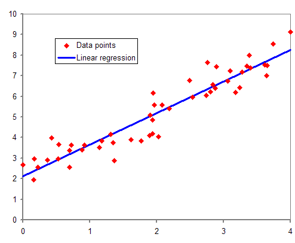
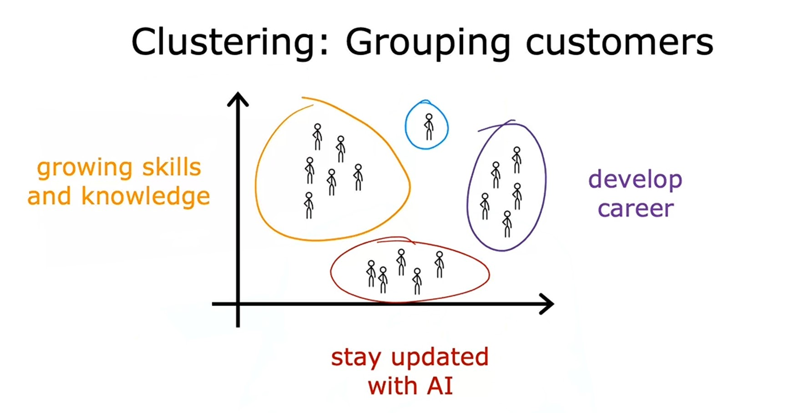
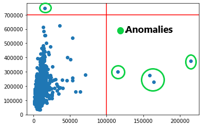

# Week 1 - Intro to Machine Learning

## Ch - 2 Supervised vs Unsupervised Machine learning

### What is Machine Learning ?
> Machine learning is the field of study that gives computers the ability to learn without being explicitly programmed. ~ *Arthur Samuel*

There are 3 main types of Machine learning
1. Supervised learning
2. Unsupervised learning
3. Reinforcement learning

[🔗](https://in.mathworks.com/discovery/reinforcement-learning/_jcr_content/mainParsys3/discoverysubsection/mainParsys/image.adapt.full.medium.png/1647932642644.png)

- **Some more are:**
1. Recommendation system learning
2. Hybrid learning problems
3. Statistical Inference
4. Learning Techniques

- **Machine learning mastery** - [Types of learning in ML](https://machinelearningmastery.com/types-of-learning-in-machine-learning/)

### Superivsed learning
> It refers to algorithms that learn `x` to `y` or **input** to **output** mappings.
> 
> The key characterstic of superivsed learning is that you give your learning algorithm examples to learn from, which includes the right answers (`y`) for a given input (`x`), and is by seeing correct pairs of input `x` and desired output label `y` that the learning algorithm eventually learns to take just the input alone without the output label adn gives a reasonably accurate prediction or guess the output. ~ *Andrew Ng*

In Supervised learning, the algorithm maps the input data with output labeled data and guess the output on new input based on the mapping.

Example:
|      Application       |   Input  `X`    | Output `Y`  |
| :--------------------: | :-------------: | :---------: |
|  Email spam detection  |     Emails      | spam or not |
|  Image Classification  | Images (mixed)  |  Cat / Dog  |
|    Self-driving car    | Images, sensors | move or not |
| House price prediction |  Area, floors   |    Price    |

#### Regression algorithm
> In Regression algorithm, we try to predict a number from infinitely many possible numbers such as house prices, which could be `123,000`, `280,000` etc... ~ *Andrew Ng*

We use **Regression** algorithm to predict quantitative (continuous) data, data in numbers.

Example:
1. Predicting house prices
2. Bitcoin value
3. Deaths in COVID etc...

#### Classification algorithm
> In Classification algorithm, the learnign algorithm has to make a prediction of a category, all of a small set of possible outputs. Example: Cat or Dog ~ *Andrew Ng*

We use **Classification** algorithm to predict qualitative (categories/classes) data, data having different categories.
- In classification, we define boundaries by drawing lines which divide the data into different classes.

Example:
1. Breast Cancer (Yes / No) (Malignant / bengin)
2. Image recognition (Cat or Dog)

|           Application           | Regression | Classification |
| :-----------------------------: | :--------: | :------------: |
|         Price of Stock          |     ✅     |       ❌      |
| Stock will Increase or Decrease |     ❌     |       ✅      |
|        Species of Plant         |     ❌     |       ✅      |
|        Fake news or not         |     ❌     |       ✅      |
|      Temperature on Sunday      |     ✅     |       ❌      |

---

### Unsupervised learning
> In unsupervised learning, dta only comes with inputs (`x`), but not output labels (`y`). Algorithm has to find some **structure** or some **pattern** in the data.
> 
> In Unsupervised learning, we input data (`x`) that isn't associated with any output labels (`y`), instead, our job is to find some structure or some pattern or just find something interesting in the data. ~ *Andrew Ng*

In **Unsupervised learning**, we use the algorithms to identify patterns in unlabelled data, i.e. we didn't label whether the provided images is of **cat** or **dog**, algorithm has to identify patterns itself.

Example:
- Mixed and unlabelled pictures of Cats and Dogs
- Google news
- Finding spam emails from mixed emails.
- Recommendation system (YT, Netflix)

#### Clustering algorithm
> Group similar data points together
> 
> An unsupervised algorithm, might decide that the data can be assigned into two different groups or two different `clusters`. This algorithm is known as **Clustering** algorithm. ~ *Andrew Ng*

Clustering means grouping the similar data together into clusters.

#### Types of Unsupervised learning
1. Anomaly detection

- It is used to detect **unusual events**.
- Example: 
Fraud detection in finanical system, where unusual events, unusual transactions could be signs of fraud.

2. Dimensionality reduction

[🔗](https://miro.medium.com/max/1400/1*kK4aMPHQ89ssFEus6RT4Yw.jpeg)

- It takes a big dataset and magically compress it to a much smaller dataset while losing as little information as possible.

| Application                      | Supervised | Unsupervised |
|:--------------------------------:|:----------:|:------------:|
| Weather Forecasting              |     ✅     |      ❌     |
| Spam Detection                   |     ❌     |      ✅     |
| Customer types                   |     ❌     |      ✅     |
| SEO (search engine optimization) |     ✅     |      ❌     |
| Medical Imaging                  |     ❌     |      ✅     |
| Classification problem           |     ✅     |      ❌     |
| YouTube Recommendation system    |     ❌     |      ✅     |
| Google news                      |     ❌     |      ✅     |
| No. of child born in next year   |     ✅     |      ❌     |
| Unkown objects in Space          |     ❌     |      ✅     |

---

#### Jupyter Lab [🔗](./../codes/lab-1%20Jupyter%20Notebooks%20[optional].ipynb)

---
#### Practice Quiz 1: Supervised vs Unsupervised learning
- Try to attempt these questions yourself.
- And you can also submit your answers to me by creating a pull request and adding your answer in [this](quizzes/w1.md) readme file and I will review it for sure.

**Quiz:**

> Well, this is very easy, if you've read till here or you know already, means you got all of them!

**My Score:**

