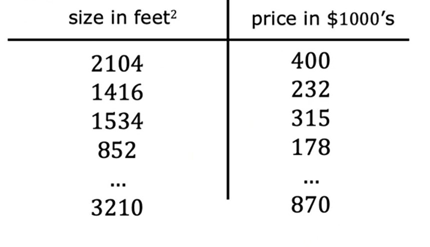

# Week 1 - Intro to Machine Learning

## Ch 3: Regression Model

### Linear Regression model

> Linear Regressor model means fitting a straight line to your data. ~ *Andrew Ng*

> Linear Regression is a **linear model**, e.g. a model that assumes a linear relationship between the input variables (`x`) and the single output variable (`y`). ~ *Jason Brownlee* ([Machine Learning Mastery](https://machinelearningmastery.com/linear-regression-for-machine-learning/#:~:text=Linear%20regression%20is%20a%20linear%20model%2C%20e.g.%20a%20model%20that%20assumes%20a%20linear%20relationship%20between%20the%20input%20variables%20(x)%20and%20the%20single%20output%20variable%20(y).))

> Linear Regression model is a particular type of supervised learning model. It's called **regression** model because it predicts numbers as the output like prices in dollars.
> 
> Any supervised learning model that predicts a number such as `238,000` or `3.68` or `-14.6` is addressing what's called a *regression problem*. ~ *Andrew Ng*

So, *Linear Regression* model is a **supervised learning** model which predicts the single output data (`y`) by fitting the input data (`x`) into a straight line in a graph.

Example:
- If we've measured the size of a house which *Param* wants to sell, and the size is `2500` square feet.
- So now, we will mark `2500` on **x-axis**, i.e. on house size in square feets.
- And draw a straight line from that mark till the *regression* line.
- Now, we will draw another straight line, this time from the point where vertical line intersects with *regression* line to the **y-axis** i.e. on house price in `$1000`.
- And mark the point where that line intersects with **y-aixs**. That point is the price of *Param*'s house i.e. 

---

#### Notations in Machine Learning

**Note**: These are just standard names for specific data in **ML**, it is not compulsory to follow these notations.

Example House price data:

1. `Training data` is the data we use to train our model by which our model learns.
2. We use lowercase `x` to denote the input data. Example: `x` is house size.
3. We use lowercase `y` to denote the output variable / target variable. Example `y` is house price.
4. We use lowercase `m` for total number of training data. Example: `m=47`.
5. We use lowercase `x` & `y` in parenthesis or in tuple like `(x, y)` to denote a single training data. Example `(x, y) = (2500, 410)`.
6. To refer a specific training data, we use `x` & `y` same as above in parenthesis or a tuple with **superscripted** `i` to both of them, where `i` is the index to a specific row like `(x``i``, y``i``)`. Example: `(x``i``, y``i``) = (1534``3``, 315``3``)`.

| Notation                                 | Meaning                          | Example                                       |
|:----------------------------------------:|:--------------------------------:|:---------------------------------------------:|
| `Training data`                          | data which our model learns      | house price data                              |
| `x`                                      | input data                       | house size                                    |
| `y`                                      | output / target variable         | house price                                   |
| `m`                                      | total number of training data    | `47`                                          |
| `(x, y)`                                 | single training data             | `(2500, 410)`                                 |
| `i`                                      | index / row of training data     | `3`                                           |
| `(x``i``, y``i``)` | `i`th training data   | `(1534``3``, 315``3``)` |

---