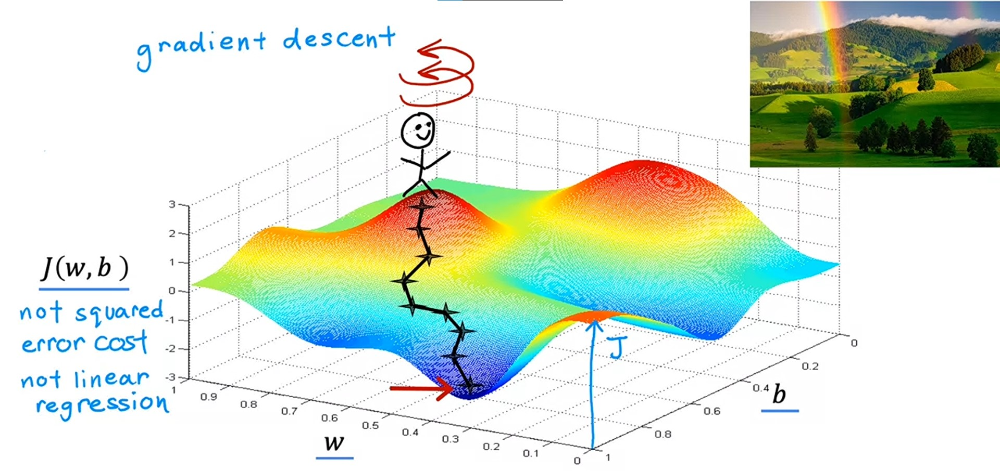

# Week 1 - Intro to Machine Learning

## Ch 4: Train the model with gradient descent

### Gradient Descent
#### Definition
> Gradient Descent is an algorithm that you can apply to try to minimize the cost function of the models ~ *Andrew Ng*

> Gradient Descent is an optimization algorithm used to find the values of paramter (*coefficients*) of a function (`f`) that minimizes a cost function (*cost*). ~ *Jason Brownlee* ([ML Mastery](https://machinelearningmastery.com/gradient-descent-for-machine-learning/#:~:text=Gradient%20descent%20is%20an%20optimization%20algorithm%20used%20to%20find%20the%20values%20of%20parameters%20(coefficients)%20of%20a%20function%20(f)%20that%20minimizes%20a%20cost%20function%20(cost).))

#### Explanation
> Gradient Descent can be applied to more general *cost* functions that work with models that have more than `2` parameters.
>
> For instance, if you have a cost function $J(w1, w2, w3,...b)$, your objective is to minimize `j` over the parameters `w1`, `w2` to `wn` and `b`. In other words, you want to pick vlaues for `w1` through `wn` and `b` that gives you the smalles possible value of `j`. ~ *Andrew Ng*

#### Working
> To try to minimize this cost function $j(w, b)$ i.e. $\min j(w,b)$, we will start with some initial guesses for `w` and `b`. In *linear regression*, it won't matter what the initial values are, so we can set `w=0` and `b=0`. With gradient descent algorithm, we'll keep on changing the parameters `w` and `b` a bit every time to try to reduce the *cost* $j(w, b)$, until `j` settles at or near minimum. ~ *Andrew Ng*

#### Example:
Let's look at this cost function graph.

**Note**: This is not a *linear regression* graph, rather it is graph of cost function of *neural networks*. We are just using it as an example for better learning.

1. Imagine, you're on a top of hill, and you want to go to the one of the bottom valley's as efficiently as possible.

2. What *gradient descent* does it, you spin around `360` degrees and look around and finds the tiny baby step in one direction that takes you down the hill as quickly as possible.
3. Then, you go steep downhill in that direction. Mathematically, the direction of *steepest descent*.
4. Now, again after going a little bit down, you again spin `360` degrees and find small step which takes you down. And you'll go there.
5. You'll do this again and again until you reach the bottom of the hill.

This is an interesting property of *gradient descent*, that it automatically finds the efficient way to go to opposite direction (in this case, bottom of hill) from the starting values for the parameters `w` and `b` which you've chosed.

Let's try once more:

1. This time you'll choose a different starting point by choosing different values for parameters `w` and `b`.
2. If you repeat the *gradient descent* process you'll end up here, totally different valley (downside).

- These both bottom minimum points are called **local minima**.

----
