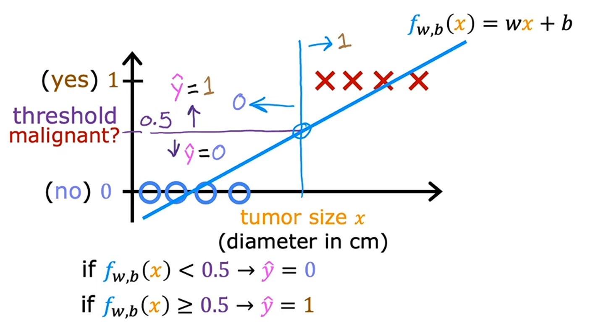
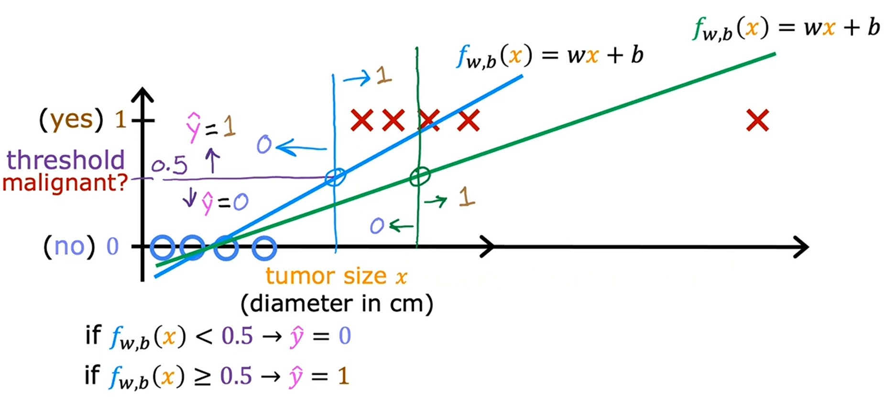
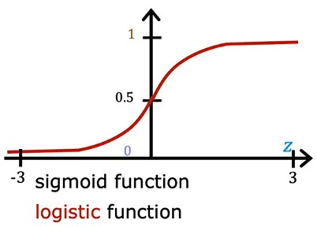
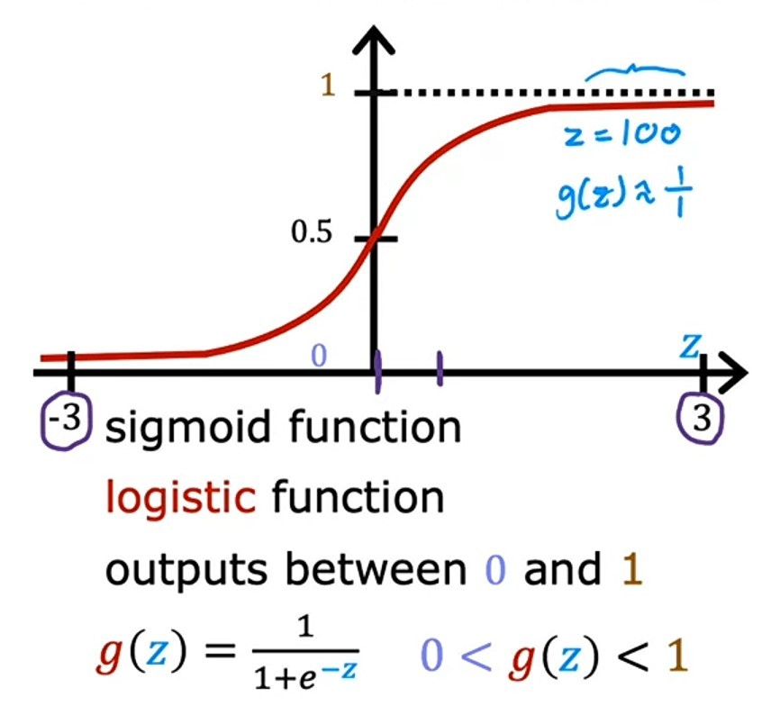
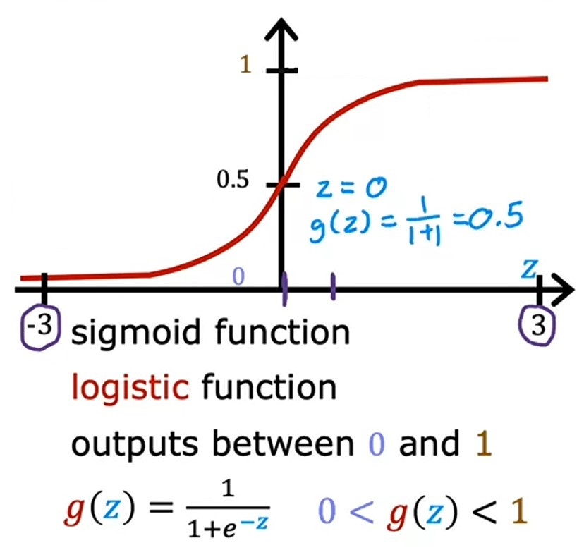

# Week 3 - Classification

**Learning Objectives:**

-   Use logistic regression for binary classification
-   Implement logistic regression for binary classification
-   Address overfitting using regularization, to improve model performance

---

## Ch 1: Classification with logistic regression

### What is Classification

> In Classification algorithm, the learning algorithm has to make a prediction of a category, all of a small set of possible outputs. Example: Cat or Dog ~ _Andrew Ng_

We use **Classification** algorithm to predict qualitative (categories/classes) data, data having different categories.

Let's look at some examples of _classification_ problem:
| Problem | Solution |
|:--------------------------------:|:--------------:|
| Is this email spam ? | _Yes_ or _No_ |
| Is the transaction fraudlent ? | _Yes_ or _No_ |
| Is the tumor malignant ? | _Yes_ or _No_ |
| Is this image is of Dog ? | _Yes_ or _No_ |

#### Binary Classification

> In each of these problems the variable that you want to predict can only be one of two possible values. _No_ or _Yes_. This type of classification problem where there are only two possible outputs is called **Binary classification**. Where the word _binary_ refers to there being only two possible _classes_ or _categories_. ~ _Andrew Ng_

Other conventions we refer to say _Yes_ or _No_:

-   _false_ or _true_
-   $0$ or $1$
-   _negative class_ or _positive class_
-   _absence_ or _presence_

Here _negative_ doesn't mean bad or _positive_ doesn't mean good, it's based on question, let's take _Email spam_ example, if email is spam, then it's _positive class_ and if email is not spam then it's _negative class_.

Similarly, _absence_ means $0$ and _presence_ means $1$ or _true_.

---

#### Example

Now, let's look at one example of _classification_ problem, i.e. A tumor is _malignant_ ?

Let's plot some data of tumor size on _x-axis_ and malignant status on _y-axis_:

Here, **O** represents not _malignant_ i.e. $0$ (no) and **X** represents _malignant_ i.e. $1$ (yes).

-   Now, if we use _linear regression_ model and plot a _regression line_ on it, it will look like this:

-   And let's make a threshold for _malignant_ i.e. $0.5$ and classify model's prediction as _malignant_ if it's greater than or equal to $ >=0.5$ and _not malignant_ if it's less than $ <0.5$.

-   Now draw a vertical line which intersects threshold and if tumor size is right on the line, it will be _malignant_ and if it's not, it will be _not malignant_.
-   This line is also known as _decision boundary_.

-   But, now let's add another training example to the data which is way ahead from the previous ones and draw _linear regression_ line again.

-   Notice, that the _linear regression_ line is also extended because of the new data.
-   And now after drawing _decision boundary_, we can clearly see that the _linear regression_ line is not accurate anymore, because some data points which are actually _malignant_ are classifying as _not malignant_, which ofcourse we don't want.
-   Hence, _linear regression_ model is not the best model for this problem.

---

### Jupyter lab: Classification [optional] [🔗](../codes/W3%20-%20L1%20-%20Classification.ipynb)

---

### Logistic Regression

> In logistic regression, the output value of the outcome will always be between $0$ and $1$. It draws a curve regression line in the graph. ~ _Andrew Ng_

Logistic regression is a linear model which predicts a binary outcome (i.e. 0 or 1).

Let's say if we input diameter of tumor on _x-axis_ and the _logistic regression_ model curve, will make threshold and output $0.7$, which suggests it is closer to $1$ means it is _manignant_.

---

### Algorithm

> To build a _logistic regression_ algorithm, we use a _mathematical_ function called _Sigmoid function_ or sometimes known as _logistic function_. ~ _Andrew Ng_

_Sigmoid function_ looks like this on graph:

Notice, that the _x-axis_ on _sigmoid function_ graph is different from _tumor size_ graph.

-   In _tumor size_ graph _x-axis_ is having all positive numbers.
-   In _sigmoid function_ graph _x-axis_ is having both positive and negative numbers.
-   But _sigmoid function_ always outputs value between $0$ and $1$.

---

### Sigmoid Function Formula

$$g(z) = \frac{1}{1 + e^{-z}}$$

Here, $e$ is a _mathmatical constant_ which has a value of $e \approx 2.7$ and $z$ is the input value.

Let's look at some different values of $z$ and how they will look like on _sigmoid function_ graph:

|      S.no.       |                                                        1                                                         |                                                         2                                                         |                                                       3                                                        |
| :--------------: | :--------------------------------------------------------------------------------------------------------------: | :---------------------------------------------------------------------------------------------------------------: | :------------------------------------------------------------------------------------------------------------: |
| **Value of $z$** |                                                    $z = 100$                                                     |                                                    $z = -100$                                                     |                                                    $z = 0$                                                     |
|    **Output**    |                                                       $1$                                                        |                                                    $3.72e-44$                                                     |                                                     $0.5$                                                      |
|    **Graph**     |  |  |  |

---

#### Making of Logistic Regression Algorithm

**Logistic Regression Algorithm** is mostly based on _linear regression function_.

Let's see how:

1. As we know that _linear regresion_ function is:
   $$f_{\vec{w},b}(\vec{x}) = \vec{w} \cdot \vec{x} + b\tag{1}$$
2. Let's store the value $\vec{w} \cdot \vec{x} + b$ in a variable named $z$.
   $$z = \vec{w} \cdot \vec{x} + b\tag{2}$$
3. Now, we will take this value of $z$ and pass in our _sigmoid function_
   $$g(z) = \frac{1}{1 + e^{-z}}\tag{3}$$
4. We know that $g(z)$ takes value of $z$ and returns a value between $0$ and $1$.
5. So, when we put all these equations $(1)$, $(2)$ and $(3)$ together, we get:
   $$f_{\vec{w},b}(\vec{x}) = g( \underbrace{\vec{w} \cdot \vec{x} + b}_z )$$
   $$g( \underbrace{\vec{w} \cdot \vec{x} + b}_z ) = \frac{1}{1 + e^{-(\vec{w} \cdot \vec{x} + b)}}$$
6. Hence, our final formula will be:
>    $$f_{\vec{w},b}(\vec{x}) = \frac{1}{1 + e^{-(\vec{w} \cdot \vec{x} + b)}}$$
7. It takes a set of input features $x$ and outputs a number between $0$ and $1$.

> **Notice**, the underlying formula of *logistic regression* is same as *linear regression* so, that's why it's called *logistic regression*, but it output's a number between $0$ and $1$ so it come under *classification* category.

---

### Interpretation of Logistic Regression output
> The way I encourage you to think of *logistic regression* output is to think of it as outputting the **probability** that the class or the label $y$ will be equalt o 1 given a certain input *x*. ~ *Andrew Ng*

Let's take an example:
- Let's say we have $x$ as a *tumor size* and $y$ is either $0$ or $1$.
- If we have a patient with *tumor size* of $x$ and based on this input $x$m the model will output a probability of $y$ being $0.7$.
- Which means the model is predicting that there's a $70%$ chance that the patient will have a tumor, i.e. there's $70%$ chance of the value of label $y$ will be equal to  $1$.

Sometimes, we will also see formula of *logision regression* like this:
$$f_{\vec{w},b}(\vec{x}) = P(y = 1 | \vec{x};\vec{w},b)$$

The semicolon in the above equation is denoting that the parameters $\vec{w}$ and $b$ effect the computation of what is the probability of $y$ being $1$ for the given input $\vec{x}$.

---

### Jupyter lab: Sigmoid function [optional] [🔗](../codes/W3%20-%20L2%20-%20Sigmoid%20function.ipynb)

---

### Quizzes

#### Video quiz 1

    
    Answer to <b>video quiz 1</b>

If you have selected option <em>a (Decide if an animal is a cat or not cat)</em> then you are right! <b>Explanation:</b> This is an example of binary classification where there are two possible classes (True/False or Yes/No or 1/0).

#### Video quiz 2

    
    Answer to <b>video quiz 2</b>

If you have selected option <em>a (g(z) is near zero)</em> then you are right! <b>Explanation:</b> Say z = -100. e -z is then e 100, a really big positive number. So, g(z) is about 0.

