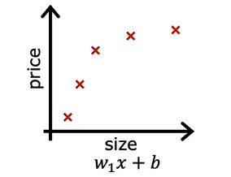
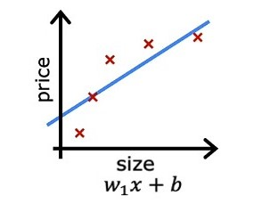
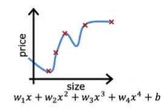
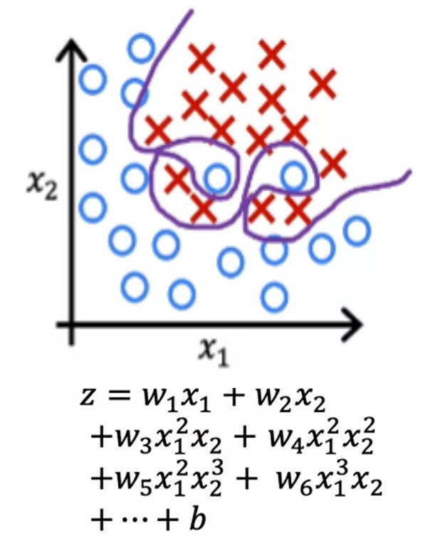
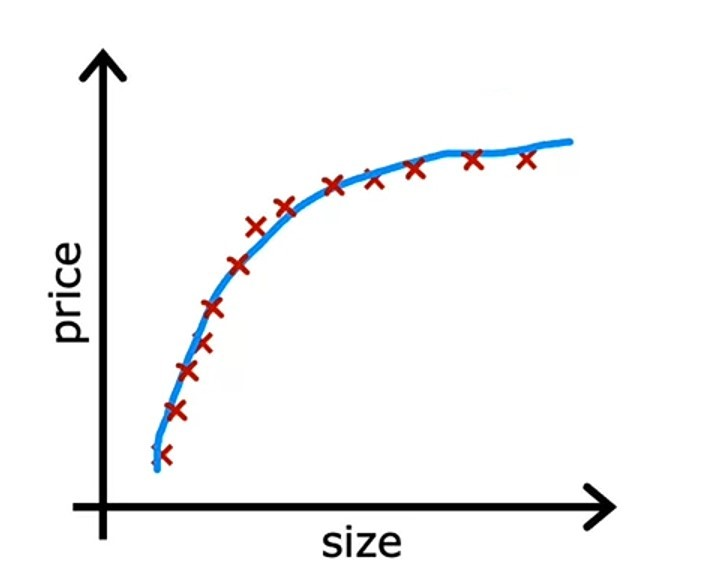

# Week 3 - Classification

## Ch 4 - The problem of overfitting

**Sometimes**,

-   ML algorithm can ran into a problem called _overfitting_, where the model fits the training data very well, but on new data it makes bad predictions.

-   ML model even doesn't fit the training data well, which means the cost function is high, this is called _underfitting_.

-   ML model fits the training data well, also do well predictions on new data, with minimal error, this is called _generalization_.

Let's look at definition of each.

### Generalization

> Generalization refers to how well the concepts learned by a machine learning model apply to specific examples not seen by model when it was learning. ~ _Jason Brownlee_ [ML mastery](https://machinelearningmastery.com/overfitting-and-underfitting-with-machine-learning-algorithms/#:~:text=Generalization%20refers%20to%20how%20well%20the%20concepts%20learned%20by%20a%20machine%20learning%20model%20apply%20to%20specific%20examples%20not%20seen%20by%20the%20model%20when%20it%20was%20learning.)

The goal of machine learning model is to generalize (fit) well from the training data so that on new data it can make good predictions with minimal error.

#### Example:

#### Regression problem (house price)

Let's say we have our _house price data_, after plotting which looks like this:

After, fitting the model, the _regression line_ will be like this:

Here, we can see the _regression line_ is curve and fits the data well, not best, but it performs on new data well. Because we have added _polynomial features_ in algorithm. So, we can say that our model is _generalized_ well.

#### Classification problem (Tumor classification)

Let's say we have our _tumor classification data_, after plotting which looks like this:

After fitting the model, the _decision boundary_ will be like this:

Here, we can see the _decision boundary_ is curve and fits the data well, not good, but it performs on new data well. Because we have added _polynomial features_ in algorithm. So, we can say that our model is _generalized_ well.

---

### Underfitting

> Underfitting refers to a model that can neither fits the training data nor generalize to new data. ~ _Jason Brownlee_ [ML mastery](https://machinelearningmastery.com/overfitting-and-underfitting-with-machine-learning-algorithms/#:~:text=Underfitting%20refers%20to%20a%20model%20that%20can%20neither%20model%20the%20training%20data%20nor%20generalize%20to%20new%20data.)

So, an underfit model is not good model, because it doesn't fit the training data and have high error which means on new data also it can't make good predictions.

#### Example:

#### Regression problem (house price)

Let's say we have our _house price data_, after plotting which looks like this:

After, fitting the model, the _regression line_ will be like this:

Here, we can see that _regression line_ is straight, and it doesn't fit the training data well, means it has high error. So, we can say that our model is _underfit_ to data.

#### Classification problem (Tumor classification)

Let's say we have our _tumor classification data_, after plotting which looks like this:

After fitting the model, the _decision boundary_ will be like this:

Here, we can see that _decision boundary_ is almost a straight line, little curve, and it doesn't classify the data well, means doesn't fit the training data well, which also means it has high error. And on new data it can merely classify whether the tumor is malignant, if it's near the _decision boundary_. So, we can say that our model is _underfit_ to data.

---

### Overfitting

> Overfitting refers to a model that fits the training data very well.
>
> Overfitting happens when a model learns the detail in the training data to the extent that it negatively impacts the performance of the model on new data. ~ _Jason Brownlee_ [ML mastery](https://machinelearningmastery.com/overfitting-and-underfitting-with-machine-learning-algorithms/#:~:text=Overfitting%20refers%20to%20a,model%20on%20new%20data)

So, when our model learns the training data too well and fits it very well, that it can make perfect predictions, but on new data, it makes worse predictions, it is called _overfitting_.

#### Example

#### Regression problem (house price)

Let's say we have our _house price data_, after plotting which looks like this:

After, fitting the model, the _regression line_ will be like this:

Here, we can see that _regression line_ is curved and wiggly and fits the training data really well, and it has almost no error. Because we have added so many _polynomial features_ in algorithm which can cause worse predictions on new data.

Let's say we have _house size_ (pink mark) on _x-axis_, and because of _overfitting_, our model predicts _house price_ lesser than other prices, this happened because of _overfitting_.

#### Classification problem (Tumor classification)

Let's say we have our _tumor classification data_, after plotting which looks like this:

After fitting the model, the _decision boundary_ will be like this:

Here, we can see that our model mades a very twisted decision boundary, which can classify tumor perfectly on training data and have $0$ error. This is due to very high order _polynomial features_. But, in new data it can't classify tumor correctly. So, we can say that our model is _overfits_ to data.

---

### Bias

> The inability for a machine learning model to capture the true relationship is called bias. ~ [_StatQuest with Josh Stammer_](https://youtu.be/EuBBz3bI-aA?t=136)

Means, if the model doesn't even fit the training data well, and on new data, it can't make good predictions.

We can also say that the model which _overfits_ the training data has _low bias_ and the model which _underfits_ the training data has _high bias_.

---

### Variance

> In Machine learning, the difference in fits between datasets in called _Variance_. ~ [_StatQuest with Josh Stammer_](https://youtu.be/EuBBz3bI-aA?t=245)

Means, if the model fits the training data well, but on new data it makes worse predictions, then, the difference is called _Variance_.

We can also say that the model which _overfits_ the traning data has **high variance**, and the model which _underfits_ the training data has **low variance.**

> In Machine learning, the ideal algorithm has _low bias_ and can accurately make the true relationship and it has _low variance_ by producing good predictions on new data. Means, _Generalized model_ is better than _Underfitted model_ and _Overfitted model_ is better than _Underfitted model_. ~ [_StatQuest with Josh Stammer_](https://youtu.be/EuBBz3bI-aA?t=322)

---

### Addressing Overfitting

Let's say we have made a model, which _overfits_ the data and doesn't performing well on new data, and we want to fix this.

There are several ways to reduce _overfitting_, let's see how to do it.

#### 1. Collect more data

If we have less amount of data, and after fitting _regression line_, our model looks like this:

We can add more data, and fit model again, then our model will not overfit anymore and will make better predictions on new data.

---

#### 2. Feature Selection

Let's say we have to predict _house prices_, and our data has $100$ features in it.

What we can do is, we can select only some useful features, which we can think that really impact our model to predict prices.

So, now our model can generalize and make better predictions on new data.

But it has a disadvantage, let's say all $100$ features are important and have useful information for our model, then _feature selection_ wouldn't work.

But there are some ways to select useful features, which can prevent loosing useful information from our data.

---

#### 3. Regularization

Regularization is a way to prevent _overfitting_ by reducing the impact (weight $w$) of some features rather than eliminating them (feature selection).

Let's say we have a model, which is _overfitting_ the data, and has _polynomial features_ with higher _weights_ ($w$) parameter.

We can reduce the impact of _polynomial features_ by using _regularization_, means, we can choose smaller values of _weight_ ($w$) parameter which can prevent _overfitting_ and fits data well.

---

### Jupyter lab: Overfitting [optional] [🔗](../codes/W3%20-%20L8%20-%20Overfitting.ipynb)

---

### Quizzes

##### Quiz 1

    
    Answer to <b>quiz 1</b>

If you have selected option <em>c (Overfitting (high variance))</em> then you are right! <b>Explanation:</b> This is when the model does not generalize well to new examples.

